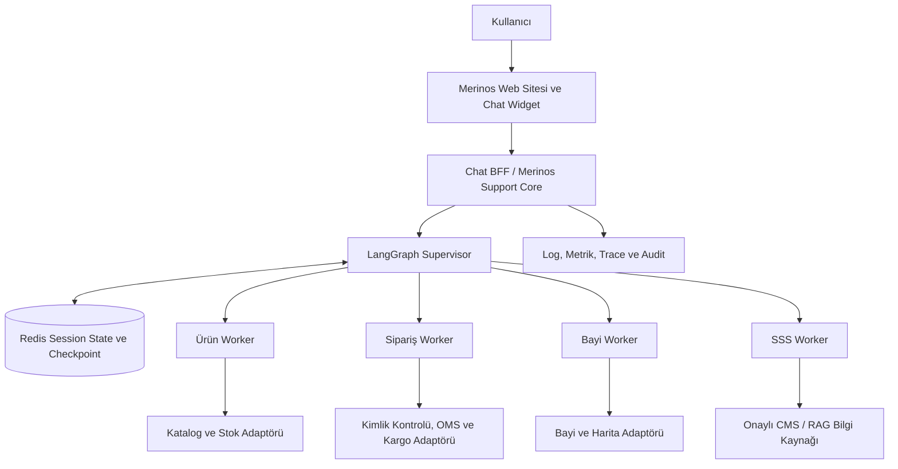
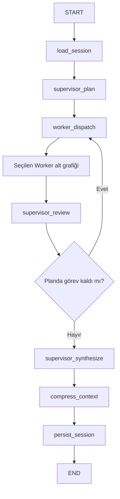

# 00 — Merinos Chatbot Proje Anayasası

> **Belge türü:** Bağlayıcı proje kuralları ve Cursor uygulama görevi  
> **Sıra:** 00/20  
> **Durum:** Uygulamaya başlamadan önce zorunlu  
> **Kapsam:** Merinos internet sitesi chatbot localhost demosu ve gelecekteki kurumsal entegrasyon mimarisi

---

## 1. Bu görevin amacı

Bu dosya, Merinos Dijital Asistan projesinde sonraki bütün geliştirme adımlarının
uyması gereken değişmez ürün, mimari, güvenlik ve kod kalitesi kurallarını
belirler.

Bu adımda yeni özellik geliştirilmez. Önce mevcut proje incelenir, çalışan yapı
korunur ve bundan sonraki görevlerde kullanılacak ortak kararlar kesinleştirilir.

Cursor bu belgeyi yalnızca okunacak bir açıklama olarak değil, proje boyunca
uygulanacak bir **anayasa** olarak kabul etmelidir. Sonraki bir görev bu belgeyle
çelişirse öncelik sırası şöyledir:

1. Güvenlik, KVKK ve kullanıcı verisi sınırları
2. Bu proje anayasası
3. İlgili numaralı Cursor görev dosyası
4. Mevcut uygulama içindeki yerel tercih ve örnekler

Çelişki çözülemiyorsa güvenli ve en az değişiklik yapan yaklaşım seçilmeli,
varsayım tamamlanma raporunda açıkça belirtilmelidir.

---

## 2. Mevcut proje tabanı

Cursor göreve başlamadan önce en az aşağıdaki dosya ve klasörleri incelemelidir:

```text
README.md
package.json
app/
components/
lib/chatbot/engine.ts
lib/demo-data.ts
lib/types.ts
docs/README.md
docs/01-SISTEM-MIMARISI.md
docs/02-KULLANICI-AKISLARI.md
docs/03-MVP-KAPSAMI.md
docs/04-API-SOZLESMELERI.md
docs/05-TEST-SENARYOLARI.md
docs/06-LANGGRAPH-REDIS-STATE-MIMARISI.md
docs/07-SUPERVISOR-WORKER-MIMARISI.md
backend/README.md
backend/pyproject.toml
backend/src/merinos_agent/
backend/tests/
tests/
```

Mevcut ZIP içindeki başlangıç sürümü şu çalışan bileşenlere sahiptir:

- React tabanlı Merinos demo e-ticaret sayfası
- Sağ alt köşede açılan sohbet arayüzü
- Temsili ürün, sipariş, bayi ve SSS verileri
- Kural tabanlı TypeScript demo konuşma motoru
- Python 3.11+ tabanlı LangGraph backend şablonu
- Redis session state ve context compression bileşenleri
- Stateful Supervisor–Worker dış graph ve dört uzman Worker alt grafiği
- Frontend, kapsam ve backend davranışlarını kontrol eden testler

Bu yapı, açık bir hata veya ilgili görevde belirtilen zorunlu değişiklik yoksa
sıfırdan yazılmamalıdır.

---

## 3. Ürün vizyonu

Merinos Dijital Asistanın amacı, ziyaretçinin Merinos internet sitesindeki en
sık ihtiyaçlarını sohbet üzerinden hızlı, anlaşılır ve güvenli biçimde
karşılamaktır.

Chatbotun temel rolü kullanıcı adına kontrolsüz işlem yapmak değil; doğru
bilgiyi bulmak, gerekli alanları toplamak, güvenli servis çağrıları yapmak ve
sonucu anlaşılır işlem kartlarıyla sunmaktır.

### 3.1. Zorunlu dört MVP yeteneği

Aşağıdaki dört yetenek P0 kapsamıdır ve proje boyunca korunmalıdır:

1. **Ürün arama**
   - Kategoriye göre arama
   - Renge göre arama
   - Ölçüye göre arama
   - Aynı cümlede birden fazla filtreyi birlikte kullanma
   - Sonuç yoksa uygun düzeltme veya alternatif sunma

2. **Sipariş durumu sorgulama**
   - Sipariş referansını alma ve biçimini doğrulama
   - Demo ortamında yalnızca temsili kayıt kullanma
   - Canlı ortamda kullanıcı kimliği ve sipariş sahipliği doğrulanmadan bilgi göstermeme
   - Sipariş ve kargo durumunu zaman çizgisi biçiminde sunabilme

3. **En yakın satış noktasını bulma**
   - Şehir veya açık izinle yaklaşık konum alma
   - Bayileri mesafeye göre sıralama
   - Sonuçları harita ve bayi kartlarıyla gösterme
   - Konum izni verilmezse şehir seçimiyle devam etme

4. **Sık sorulan sorular**
   - Ölçü seçimi
   - Bakım ve temizlik
   - İade süreci
   - Teslimat
   - Stok ve ürün bulunabilirliği
   - Yalnızca onaylı ve sürümlenebilir bilgi kaynaklarından yanıt üretme

### 3.2. MVP başarı tanımı

Bir akış ancak aşağıdaki koşulların tamamı sağlanıyorsa başarılı sayılır:

- Kullanıcının niyeti doğru veya güvenli bir geri dönüşle belirlenmiştir.
- Zorunlu alanlar eksikse yalnızca gereken bilgi sorulmuştur.
- Sonuç gerçek kaynağa veya açıkça işaretlenmiş demo verisine dayanmaktadır.
- Kullanıcıya uydurma ürün, fiyat, stok, sipariş veya bayi bilgisi verilmemiştir.
- Hata halinde kullanıcı çıkmazda bırakılmamış, güvenli alternatif sunulmuştur.
- Hassas veri loglara veya gereksiz state alanlarına taşınmamıştır.

---

## 4. Localhost demo ve veri politikası

İlk hedef, gerçek Merinos sistemlerine bağlanmayan ve localhost üzerinde
çalışan bir demodur.

### 4.1. Demo ortamında zorunlu kurallar

- Ürün, fiyat, stok, sipariş, telefon, adres ve bayi verileri temsili olmalıdır.
- Gerçek müşteri verisi kullanılmamalıdır.
- Gerçek API anahtarı, parola, token veya bağlantı bilgisi repoya yazılmamalıdır.
- Demo verisi, gerçek veriyle karıştırılmayacak biçimde arayüzde ve dokümanda
  açıkça belirtilmelidir.
- Demo sipariş numaraları yalnızca örnek akışları göstermek için kullanılmalıdır.
- Demo haritası gerçek zamanlı konum veya gerçek mağaza garantisi vermemelidir.
- `.env.example` yalnızca değişken adları ve güvenli örnek değerleri içermelidir.

### 4.2. Ortam ayrımı

```text
Localhost  -> sabit ve temsili veri
Test       -> sentetik veya anonim entegrasyon verisi
Staging    -> üretime benzer, maskelenmiş ve kontrollü veri
Production -> yalnızca yetkili kurumsal servisler ve gerçek kullanıcı oturumu
```

Ortam ayrımı kod içinde dağınık koşullarla değil, merkezi yapılandırma ve
bağımlılık enjeksiyonu yaklaşımıyla yönetilmelidir.

---

## 5. Değişmez sistem mimarisi

### 5.1. Üst seviye akış



### 5.2. Katman sorumlulukları

| Katman | Temel sorumluluk | Yapmaması gereken |
| --- | --- | --- |
| Web Chat UI | Mesaj, form, kart, yüklenme, hata ve erişilebilirlik | Kurumsal veritabanına doğrudan erişmek |
| Chat BFF / Support Core | Kimlik, oturum, doğrulama, oran sınırlama, audit ve servis sözleşmesi | LLM çıktısını kontrolsüz biçimde işleme çevirmek |
| Supervisor | Niyet, slot, görev planı, Worker seçimi, sonuç inceleme ve sentez | Kurumsal servislere rastgele araç adı veya URL ile erişmek |
| Worker | Tek bir alanın dar ve test edilebilir iş akışını yürütmek | Kullanıcıyla doğrudan ve denetimsiz konuşmak |
| Adaptör | Dış sistem sözleşmesini iç modele çevirmek | UI veya konuşma state'i yönetmek |
| Redis | Oturum, kısa ömürlü state, checkpoint ve kontrollü önbellek | Kalıcı ana müşteri veritabanı olmak |
| Gözlemlenebilirlik | Maskeli log, metrik, trace ve alarm | Ham kişisel konuşma içeriğini sınırsız saklamak |

### 5.3. Doğrudan erişim yasağı

Chatbot, LangGraph düğümleri veya Worker'lar aşağıdaki sistemlere doğrudan
bağlanmamalıdır:

- Ürün ana veritabanı
- OMS veya ERP veritabanı
- Kargo sağlayıcısının iç veri tabanı
- Bayi ana veritabanı
- CRM müşteri tabloları

Erişim yalnızca sürümlü API veya adaptör servisleri üzerinden yapılmalıdır.

---

## 6. LangGraph Supervisor–Worker anayasası

Sistem tek bir büyük ajan yerine bir Supervisor ve uzman Worker'lar şeklinde
kurulmalıdır.

### 6.1. Zorunlu Worker allowlist'i

```text
product_worker
order_worker
dealer_worker
faq_worker
```

Supervisor, model tarafından üretilmiş olsa bile allowlist dışındaki bir Worker,
araç, URL, SQL veya servis adını çalıştıramaz.

### 6.2. Zorunlu graph yaşam döngüsü



### 6.3. Supervisor sorumlulukları

Supervisor:

- Oturum state'ini yükler.
- Kullanıcı mesajından güvenli slotları çıkarır.
- Bir veya daha fazla Worker'dan oluşan sıralı plan üretir.
- Her Worker'a yalnızca gerekli bağlamı verir.
- Worker çıktısını durum ve veri sözleşmesine göre doğrular.
- Kısmi hata halinde başarılı sonucu korur, eksik bilgiyi uydurmaz.
- Kullanıcıya gidecek tek birleşik yanıtı üretir.
- Compression sonrasında session state'i tek noktadan kaydeder.

### 6.4. Worker izolasyonu

Worker'lar tam konuşma geçmişini ve Redis istemcisini doğrudan görmemelidir.
Her Worker için daraltılmış bir state kullanılmalıdır:

```text
worker
user_message
relevant_slots
context_summary
prepared
result
trace
```

Worker sonucu standart bir zarfla Supervisor'a dönmelidir:

```json
{
  "worker": "product_worker",
  "status": "ok",
  "message": "Supervisor tarafından birleştirilecek güvenli sonuç",
  "data": {}
}
```

İzinli durumlar:

```text
ok
needs_input
requires_verification
error
```

### 6.5. Sıralı çalışma kuralı

MVP'de Worker'lar deterministik ve sıralı çalıştırılmalıdır. Yalnızca salt
okunur, birbirinden bağımsız ve güvenlik riski taşımayan görevler gelecekte
kontrollü biçimde paralelleştirilebilir.

Sipariş, kimlik, onay veya yan etki içeren akışlar paralel çalıştırılmamalıdır.

---

## 7. Session state, Redis ve context yönetimi

### 7.1. Oturum kimliği

- Her konuşmanın benzersiz ve tahmin edilmesi zor bir `session_id` değeri olmalıdır.
- Checkpoint kullanılıyorsa `thread_id` ile `session_id` ilişkisi tutarlı olmalıdır.
- Kullanıcının tarayıcı oturumu ile backend oturumu arasında açık bir sözleşme bulunmalıdır.
- Session fixation ve başka kullanıcının oturumuna erişim engellenmelidir.

### 7.2. Redis kullanım sınırı

Redis şu amaçlarla kullanılabilir:

- Kısa ömürlü `SessionState`
- LangGraph checkpoint
- Oran sınırlama sayaçları
- Güvenli idempotency kayıtları
- Kısa süreli ve veri sınıfına uygun önbellek

Redis, kalıcı müşteri ana veri deposu olarak kullanılmamalıdır.

### 7.3. Tek yazma noktası

Worker'lar session state'i Redis'e doğrudan yazmamalıdır. Kalıcılaştırma yalnızca
`persist_session` düğümünde veya eşdeğer tek bir kontrollü servis katmanında
yapılmalıdır.

Yazma işleminde sürüm veya optimistic concurrency kontrolü korunmalı; eski bir
graph çalıştırmasının daha yeni state'i ezmesi engellenmelidir.

### 7.4. Token bütçesi

Her graph çalıştırmasında en az şu bütçe alanları bulunmalıdır:

```text
context_window_tokens
max_output_tokens
safety_margin_tokens
compression_trigger_ratio
recent_messages_to_keep
```

Context limiti aşılana kadar beklenmemeli; tanımlı eşik aşıldığında compression
uygulanmalıdır.

### 7.5. Context compression

Compression yaklaşımı:

1. Sistem ve güvenlik kurallarını korur.
2. Son kullanıcı mesajlarını belirli sayıda ham olarak tutar.
3. Eski mesajları kısa bir `rolling_summary` içinde birleştirir.
4. Ürün, sipariş, bayi ve SSS slotlarını ayrı yapısal alanlarda korur.
5. Hassas veya artık gereksiz veriyi özet içine taşımadan siler ya da maskeler.
6. Özetin kullanıcıya ait kesin olmayan varsayımlar üretmesini engeller.

Özet, kurumsal kaynaktan gelen gerçek iş verisinin yerine geçemez.

---

## 8. Dört temel yetenek için değişmez kurallar

### 8.1. Ürün arama

- Filtreler normalize edilmeli ancak kullanıcı girdisi kaybolmamalıdır.
- Kategori, renk ve ölçü ayrı slotlarda tutulmalıdır.
- Sonuç sırası açıklanabilir olmalıdır.
- Fiyat ve stok yalnızca kaynak veride mevcutsa gösterilmelidir.
- LLM ürün, fiyat, kampanya veya stok uydurmamalıdır.
- Boş sonuçta filtreleri gevşetmek için kullanıcıya açık öneri sunulmalıdır.

### 8.2. Sipariş durumu

- Sipariş numarasının biçim doğrulaması, sahiplik doğrulamasının yerine geçmez.
- Canlı ortamda kimlik doğrulama ve sipariş sahipliği kontrolü zorunludur.
- OTP gerekiyorsa üretim ve doğrulama Merinos Support Core içinde yapılmalıdır.
- Sipariş Worker'ı doğrulama yoksa `requires_verification` dönmelidir.
- Sipariş iptali, iade veya adres değişikliği MVP'de otomatik uygulanmamalıdır.
- Sipariş numarası loglarda maskelenmeli veya hash'lenmelidir.

### 8.3. Bayi ve harita

- Tarayıcı konumu yalnızca açık kullanıcı izniyle alınmalıdır.
- Kullanıcı konum vermek istemezse şehir seçimi sunulmalıdır.
- Hassas kesin konum yerine amaç için yeterli yaklaşık konum tercih edilmelidir.
- Harita sağlayıcısı anahtarı frontend kaynak koduna gömülmemelidir.
- Bayi bilgisi kaynaktan gelmeli; chatbot mağaza, çalışma saati veya stok uydurmamalıdır.

### 8.4. SSS ve RAG

- SSS yanıtları onaylı CMS, doküman veya bilgi tabanına dayanmalıdır.
- Kaynak sürümü, güncellenme tarihi ve mümkünse kaynak kimliği izlenmelidir.
- Retrieval sonucu yetersizse chatbot kesin yanıt vermek yerine bunu belirtmelidir.
- Prompt injection içeren doküman metni sistem talimatı olarak çalıştırılmamalıdır.
- RAGFlow kullanılacaksa rolü onaylı dokümanların indekslenmesi ve retrieval ile
  sınırlıdır; kimlik, yetki veya işlem yürütme sorumluluğu verilmemelidir.

---

## 9. Güvenlik ve KVKK anayasası

### 9.1. Veri minimizasyonu

Yalnızca ilgili işlemi tamamlamak için gereken veri istenmelidir. Chatbot şu
bilgileri sohbet alanında istememelidir:

- T.C. kimlik numarası
- Kart numarası, CVV veya banka parolası
- E-Devlet ya da kurumsal hesap parolası
- Gereksiz açık adres
- Gereksiz doğum tarihi veya özel nitelikli kişisel veri

### 9.2. Log maskeleme

Aşağıdaki alanlar log, trace ve hata raporlarında maskelenmelidir:

- Ad ve soyad
- Telefon
- E-posta
- Açık adres
- Kesin konum
- Sipariş numarası
- Kimlik ve doğrulama belirteçleri
- Serbest metindeki kişisel veri örüntüleri

### 9.3. Saklama ve silme

- Her Redis anahtar sınıfının TTL değeri tanımlı olmalıdır.
- Oturum kapatma ve kullanıcı talebi için silme akışı tasarlanmalıdır.
- Audit kaydı ile sohbet içeriği aynı veri sınıfı kabul edilmemelidir.
- Üretim öncesinde veri envanteri, işleme amacı ve saklama süresi onaylanmalıdır.

### 9.4. Kimlik ve yetki

- Yetkilendirme frontend görünürlüğüne bırakılamaz.
- Servisler en az yetki ilkesiyle çalışmalıdır.
- Token'lar kısa ömürlü olmalı ve repoya yazılmamalıdır.
- İç servis çağrıları için güvenli servis kimliği kullanılmalıdır.
- İşlem tekrarlarında idempotency key uygulanmalıdır.
- Oran sınırlama ve kötüye kullanım kontrolleri BFF seviyesinde bulunmalıdır.

### 9.5. LLM güvenliği

- Model çıktısı güvenilir kod veya yetki kararı kabul edilmemelidir.
- Structured output şeması ve allowlist doğrulaması kullanılmalıdır.
- Kullanıcı girdisi sistem promptuna komut olarak eklenmemelidir.
- Modelin URL, SQL, dosya yolu veya araç adı üretip doğrudan çalıştırması yasaktır.
- Araç sonuçları da güvenilmeyen veri olarak doğrulanmalıdır.
- Güvenlik kuralı, prompt yerine mümkün olduğunca kod ve policy katmanında uygulanmalıdır.

---

## 10. Arayüz ve kullanıcı deneyimi kuralları

- Chatbot Merinos sayfasının sağ alt köşesinde erişilebilir bir düğmeyle açılmalıdır.
- Masaüstü ve mobil ekranlarda kullanılabilir olmalıdır.
- Klavye ile açma, kapama, mesaj gönderme ve odak sırası çalışmalıdır.
- `Escape` ile kapatma davranışı korunmalıdır.
- Yüklenme, başarı, boş sonuç ve hata durumları ayrı gösterilmelidir.
- Kullanıcı mesajı gönderildikten sonra işlem devam ediyorsa görsel durum sunulmalıdır.
- Ürün, sipariş ve bayi sonuçları yalnızca uzun metin olarak değil, uygun kartlarla gösterilmelidir.
- Türkçe karakterler ve Türkçe yerel biçimler doğru kullanılmalıdır.
- Renk tek başına bilgi taşıyan unsur olmamalıdır.
- Animasyonlar kullanıcı tercihine ve erişilebilirliğe zarar vermemelidir.
- Widget ana sayfanın ilk yükünü gereksiz biçimde ağırlaştırmamalıdır.

---

## 11. Harici platformların rol sınırları

Aşağıdaki araçlar gelecekte kullanılabilir; ancak hiçbirinin rolü Merinos Support
Core güvenlik sınırını geçersiz kılamaz.

| Platform | İzinli rol | Verilmemesi gereken rol |
| --- | --- | --- |
| Chatwoot | Canlı temsilci devri, konuşma kuyruğu ve temsilci arayüzü | Doğrudan OMS/ERP erişimi veya kimlik doğrulamanın tek sahibi olmak |
| Frappe Helpdesk | Talep kaydı, destek bileti ve SLA takibi | Sipariş sahipliği kontrolünü atlayarak işlem yapmak |
| RAGFlow | Onaylı içerikleri indeksleme ve kaynaklı retrieval | İşlem yetkisi, OTP, müşteri doğrulama veya veri ana kaynağı olmak |
| Langflow | Deney, prototip ve kontrollü akış görselleştirme | Üretim güvenlik politikasının veya kaynak kodun tek doğruluk noktası olmak |

Bu platformlarla entegrasyon adaptör üzerinden yapılmalı; sağlayıcıya özgü veri
modeli Supervisor veya UI katmanına yayılmamalıdır.

---

## 12. API ve sözleşme kuralları

- Frontend ve backend arasında sürümlü, açık ve doğrulanabilir bir sözleşme olmalıdır.
- Request ve response modelleri tipli olmalıdır.
- Hata cevapları kullanıcı mesajı ile teknik hata ayrıntısını ayırmalıdır.
- Her istek için trace/correlation kimliği üretilebilmelidir.
- Timeout, retry ve circuit breaker politikaları servis türüne göre belirlenmelidir.
- Retry yalnızca güvenli ve idempotent işlemlerde otomatik yapılmalıdır.
- Tarih, para, ölçü ve konum formatları merkezi olarak normalize edilmelidir.
- Dış servis cevabı iç modele çevrilmeden kullanıcıya doğrudan aktarılmamalıdır.
- API anahtarları ve gizli bilgiler yalnızca environment/secret yönetiminde tutulmalıdır.

---

## 13. Gözlemlenebilirlik ve kalite hedefleri

En az aşağıdaki metrikler ölçülebilir olmalıdır:

- Görev tamamlama oranı
- Niyet belirleme başarısı
- Ürün arama boş sonuç oranı
- Sipariş doğrulama ve self-servis başarı oranı
- Bayi sonucu bulma oranı
- SSS isabet veya kullanıcı fayda oranı
- Worker bazında hata ve gecikme
- p50, p95 ve p99 yanıt süresi
- Redis hata ve concurrency çakışma oranı
- Canlı temsilciye aktarım oranı
- Güvenlik/policy engelleme sayısı

Teknik hedefler:

- Kritik akışlar için test edilebilir deterministik davranış
- Uygulama servislerinde sağlık kontrolü
- Bağımlı servis kesintisinde güvenli ve açık geri dönüş
- Üretim için hedef aylık erişilebilirlik: en az `%99,9`
- Önbellekli SSS için hedef p95: `1 saniyenin altında`
- Kurumsal servis çağrılı akışlar için hedef p95: `3 saniyenin altında`

Bu değerler ilk hedeflerdir; gerçek yük testi ve kurum SLA'larıyla doğrulanmadan
garanti olarak sunulmamalıdır.

---

## 14. Kod ve repo çalışma kuralları

Cursor bütün adımlarda aşağıdaki kurallara uymalıdır:

1. Önce mevcut kodu ve testleri incele, sonra değişiklik yap.
2. İlgili görev kapsamı dışında refactor yapma.
3. Çalışan dosyaları gerekçesiz silme veya sıfırdan yazma.
4. Yeni bağımlılık eklemeden önce standart kütüphane ve mevcut bağımlılıkları değerlendir.
5. Bağımlılık sürümünü sabitle veya proje politikasına uygun aralık kullan.
6. TypeScript'te mümkün olduğunca kesin tip kullan; gereksiz `any` kullanma.
7. Python'da tip ipuçları, Pydantic modelleri ve açık hata yönetimi kullan.
8. Gizli bilgi, token, gerçek müşteri verisi veya yerel makine yolu commit etme.
9. Kullanıcıya görünen metinleri Türkçe ve anlaşılır tut.
10. Yeni davranış için en az bir pozitif, bir hata/boş sonuç testi ekle.
11. Mevcut testleri geçmeden görevi tamamlandı sayma.
12. Doküman ile kod çelişirse aynı görev kapsamında ikisini uyumlu hale getir.
13. Platforma özel entegrasyonları adaptör arkasında tut.
14. Büyük değişiklikleri küçük, geri alınabilir ve test edilebilir parçalara ayır.
15. Tamamlanma raporunda değişen dosyaları ve doğrulama sonuçlarını açıkça yaz.

---

## 15. Bu adımda yasak olan değişiklikler

`00-PROJE-ANAYASASI` görevi uygulanırken:

- Uygulama arayüzü yeniden tasarlanmayacak.
- Chatbot davranışı değiştirilmeyecek.
- LangGraph düğümleri veya Worker mantığı değiştirilmeyecek.
- Yeni npm veya Python paketi eklenmeyecek.
- Demo veri kayıtları değiştirilmeyecek.
- Gerçek API entegrasyonu yapılmayacak.
- Dosya veya klasörler topluca yeniden adlandırılmayacak.
- Mevcut testler kaldırılmayacak ya da zayıflatılmayacak.

Yalnızca bu anayasa dosyasının proje içindeki yeri ve dokümantasyon
bağlantılarının doğruluğu için gereken küçük dokümantasyon değişiklikleri
yapılabilir.

---

## 16. Cursor uygulama görevi

Aşağıdaki adımları sırayla uygula:

1. Bölüm 2'deki mevcut proje dosyalarını incele.
2. Projenin dört temel MVP işlevinin kod ve dokümanda bulunduğunu doğrula.
3. Supervisor–Worker, Redis session state ve context compression yapısının
   mevcut dosyalarda bulunduğunu doğrula.
4. Bu dosyayı `cursor-tasks/00-PROJE-ANAYASASI.md` konumunda koru.
5. `cursor-tasks/` klasörü için ileride oluşturulacak görevlerin bu anayasaya
   bağlı olduğunu kabul et.
6. Gerekliyse yalnızca kök `README.md` veya `docs/README.md` içine bu görev
   paketine kısa bir bağlantı ekle; uygulama koduna dokunma.
7. Aşağıdaki kabul ölçütlerini ve doğrulamaları çalıştır.
8. Sonuç raporunu belirtilen formatta yaz ve dur.

---

## 17. Kabul ölçütleri

Görev ancak aşağıdaki maddelerin tamamı sağlanırsa tamamlanmış sayılır:

- [ ] `cursor-tasks/00-PROJE-ANAYASASI.md` dosyası vardır ve boş değildir.
- [ ] Dört temel MVP yeteneği açıkça tanımlanmıştır.
- [ ] Localhost demo ile gerçek üretim verisi arasındaki sınır tanımlanmıştır.
- [ ] LangGraph Supervisor–Worker mimarisi ve Worker allowlist'i tanımlanmıştır.
- [ ] Redis session state, tek yazma noktası ve context compression kuralları tanımlanmıştır.
- [ ] Sipariş doğrulama, konum izni, log maskeleme ve KVKK sınırları tanımlanmıştır.
- [ ] Chatwoot, Frappe Helpdesk, RAGFlow ve Langflow rol sınırları tanımlanmıştır.
- [ ] Arayüz, API, gözlemlenebilirlik ve kod kalitesi kuralları tanımlanmıştır.
- [ ] Bu adımın uygulama davranışını değiştirmediği doğrulanmıştır.
- [ ] Mevcut testler kaldırılmamış veya gevşetilmemiştir.
- [ ] Markdown başlıkları, tablolar, kod blokları ve Mermaid blokları yapısal olarak geçerlidir.

---

## 18. Doğrulama komutları

Proje kökünde çalıştır:

```bash
# Dosyanın varlığını ve temel bölümleri kontrol et
test -s cursor-tasks/00-PROJE-ANAYASASI.md
grep -q "Zorunlu dört MVP yeteneği" cursor-tasks/00-PROJE-ANAYASASI.md
grep -q "Supervisor–Worker" cursor-tasks/00-PROJE-ANAYASASI.md
grep -q "Güvenlik ve KVKK" cursor-tasks/00-PROJE-ANAYASASI.md

# Frontend ve proje kapsam kontrolleri
npm run lint
npm run test
npm run validate:artifact

# Python backend kontrolleri
cd backend
python -m unittest discover -s tests -p "test_*.py"
```

Notlar:

- Projenin kurulum bağımlılıkları eksikse önce README'deki kurulum adımlarını uygula.
- Bir komut ortam veya bağımlılık nedeniyle çalışmıyorsa testi atlanmış gibi başarılı
  gösterme; tam hata nedenini raporla.
- Bu görev sadece dokümantasyon eklediği için mevcut testlerde davranış değişikliği
  beklenmez.

---

## 19. Tamamlanma raporu formatı

Cursor görev sonunda yalnızca aşağıdaki başlıklarla kısa bir rapor vermelidir:

```markdown
## Tamamlananlar
- ...

## Değişen dosyalar
- `...`

## Doğrulamalar
- `komut`: geçti / başarısız / çalıştırılamadı

## Varsayımlar veya açık noktalar
- Yok / ...

## Sonraki adım
- `01-REPO-VE-GELISTIRME-TEMELI.md`
```

---

## 20. Durma kuralı

Bu görev tamamlandığında **01 numaralı göreve otomatik geçme**.

Kabul ölçütleri sağlanmadan “tamamlandı” yazma. Uygulama kodunda bu görevin
kapsamı dışında değişiklik yapma. Sonuç raporunu ver ve kullanıcıdan sıradaki
Markdown dosyası için devam talimatını bekle.
