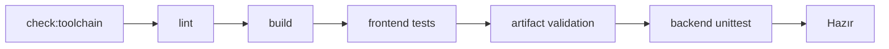
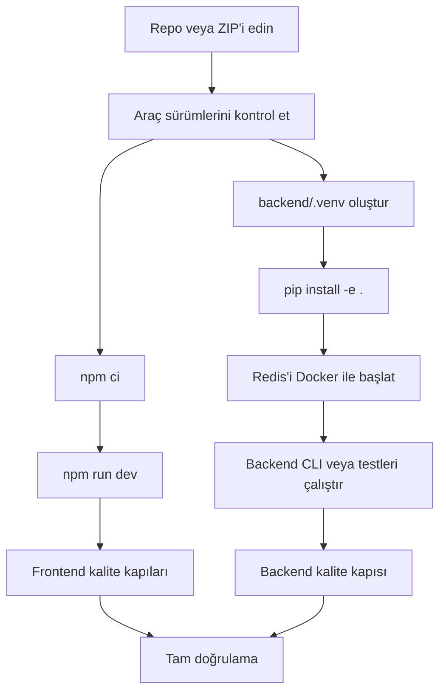

# 01 — Repo ve Geliştirme Temeli

> **Belge türü:** Cursor uygulama görevi  
> **Sıra:** 01/20  
> **Ön koşul:** `00-PROJE-ANAYASASI.md` okunmuş ve kabul edilmiş olmalıdır  
> **Ana çıktı:** Tekrarlanabilir, güvenli ve geliştirici dostu yerel çalışma temeli  
> **Kapsam dışı:** Yeni chatbot özelliği, görsel yeniden tasarım ve canlı kurumsal entegrasyon

---

## 1. Görevin amacı

Bu adımın amacı, mevcut Merinos Chatbot demosunu sıfırdan yeniden kurmak değil;
mevcut çalışan kod tabanının üzerinde güvenilir bir repo ve geliştirme standardı
oluşturmaktır.

Görev tamamlandığında yeni bir geliştirici aşağıdaki konularda tahmin yürütmek
zorunda kalmamalıdır:

- Hangi Node.js ve Python sürümünü kullanacağı
- Projeyi ilk kez nasıl kuracağı
- Frontend ve backend kontrollerini hangi komutlarla çalıştıracağı
- Windows, macOS ve Linux ortamlarında hangi çalışma yolunun desteklendiği
- Hangi dosyaların repoya girmemesi gerektiği
- Ortam değişkenlerinin nerede tanımlandığı
- Bir değişikliğin paylaşılmadan önce hangi kalite kapılarından geçeceği
- Git dalı, commit ve dosya adlandırma kurallarının ne olduğu

Bu görev yalnızca geliştirme temelini düzenler. Ürün arama, sipariş sorgulama,
bayi bulma, SSS, LangGraph akışı veya mevcut arayüz davranışı değiştirilmemelidir.

---

## 2. Bağlayıcı kaynaklar ve öncelik sırası

Cursor göreve başlamadan önce şu dosyaları okumalıdır:

```text
cursor-tasks/00-PROJE-ANAYASASI.md
README.md
package.json
package-lock.json
.gitignore
.npmrc
scripts/
backend/README.md
backend/pyproject.toml
backend/.env.example
backend/docker-compose.yml
tests/
backend/tests/
```

Bir karar çelişkisi oluşursa öncelik sırası şöyledir:

1. `00-PROJE-ANAYASASI.md` içindeki güvenlik ve mimari kurallar
2. Bu görev dosyasındaki kabul ölçütleri
3. Mevcut kilit dosyaları ve çalışan proje davranışı
4. Geliştirici kolaylığına yönelik tercihler

Mevcut kod çalışıyorsa yalnızca estetik gerekçeyle yapı değiştirilmemelidir.

---

## 3. Bu adımın kesin kapsamı

Bu görev aşağıdaki yedi alanı kapsar:

1. Repo yapısının belgelenmesi ve korunması
2. Araç sürümlerinin açıkça sabitlenmesi
3. Platformlar arası yerel geliştirme komutlarının düzenlenmesi
4. Ortam değişkeni ve secret yönetimi kurallarının netleştirilmesi
5. Kod biçimi, satır sonu ve dosya kodlaması standardı
6. Git dalı, commit ve değişiklik yönetimi standardı
7. Tek komutla çalıştırılabilir kalite kapılarının tanımlanması

Aşağıdakiler bu adımda yapılmaz:

- E-ticaret sayfasının yeniden tasarlanması
- Chatbot konuşma motorunun değiştirilmesi
- Yeni API endpoint'i geliştirilmesi
- Redis veri modelinin değiştirilmesi
- LangGraph düğümü veya Worker eklenmesi
- Gerçek Merinos verisi veya kimlik bilgisi kullanılması
- GitHub Actions, deployment veya üretim altyapısının tamamlanması
- Büyük bağımlılık güncellemesi veya framework göçü

---

## 4. Değişiklikten önce zorunlu başlangıç denetimi

Cursor herhangi bir dosyayı değiştirmeden önce mevcut durumu incelemelidir.

### 4.1. Çalışma ağacı denetimi

Git deposu mevcutsa:

```bash
git status --short
git branch --show-current
git log -5 --oneline
```

Kurallar:

- Kullanıcının mevcut değişiklikleri silinmez.
- `git reset --hard`, `git clean -fd`, force push veya toplu geri alma yapılmaz.
- Görevle ilgisiz değişikliklere dokunulmaz.
- Cursor kullanıcı açıkça istemedikçe commit veya push yapmaz.
- ZIP içinde `.git/` yoksa görev yalnızca dosya seviyesinde uygulanır; sahte Git
  geçmişi oluşturulmaz.

### 4.2. Araç sürümü denetimi

Mümkün olan ortamda aşağıdaki komutlar çalıştırılmalıdır:

```bash
node --version
npm --version
python --version
docker --version
docker compose version
```

Eksik araç, kod değişikliğiyle gizlenmemeli; geliştirici rehberinde açık ve
uygulanabilir kurulum notuyla belirtilmelidir.

### 4.3. Mevcut kalite tabanı

Bağımlılıklar kuruluysa değişiklik öncesi en az şu kontroller denenmelidir:

```bash
npm run lint
npm run test
npm run validate:artifact

cd backend
PYTHONPATH=src python -m unittest discover -s tests -v
```

Windows PowerShell'de geçici ortam değişkeni sözdizimi farklı olduğu için aynı
backend testi şu biçimde de belgelenmelidir:

```powershell
$env:PYTHONPATH = "src"
python -m unittest discover -s tests -v
```

Başlangıçta başarısız olan bir kontrol varsa sebep kaydedilmeli; bu görev o
hatayı doğrudan kapsamıyorsa sonuç daha kötü hale getirilmemelidir.

---

## 5. Korunacak repo yapısı

Bu aşamada proje monorepo aracına taşınmamalı ve klasörler yeniden
adlandırılmamalıdır. Aşağıdaki mevcut yerleşim korunmalıdır:

```text
merinos-chatbot-demo/
├── app/                       # Web uygulamasının route ve global stilleri
├── components/                # Arayüz bileşenleri
├── lib/                       # Demo veri, tip ve istemci tarafı iş mantığı
├── public/                    # Statik varlıklar
├── backend/                   # Python, LangGraph ve Redis şablonu
│   ├── src/merinos_agent/
│   └── tests/
├── docs/                      # Mimari ve ürün dokümanları
├── cursor-tasks/              # Sıralı Cursor uygulama görevleri
├── scripts/                   # Kurulum, doğrulama ve platform yardımcıları
└── tests/                     # Frontend/proje kapsam testleri
```

### 5.1. Klasör sahipliği kuralları

| Klasör | Sahip olduğu içerik | Buraya konulmaması gereken |
| --- | --- | --- |
| `app/` | Sayfa girişleri, layout ve global stil | Katalog/OMS servis uygulaması |
| `components/` | Tekrar kullanılabilir React UI | Secret, Redis bağlantısı, doğrudan DB erişimi |
| `lib/` | Ortak TypeScript tipleri ve demo mantığı | Python backend kodu |
| `backend/src/` | LangGraph, state ve servis katmanı | React bileşeni |
| `backend/tests/` | Python birim/davranış testleri | Gerçek müşteri verisi |
| `docs/` | İnsan tarafından okunabilir teknik belgeler | Çalıştırılabilir secret veya token |
| `cursor-tasks/` | Uygulama sırasını tarif eden görevler | Üretim kodunun kopyası |
| `scripts/` | Küçük, tekrar kullanılabilir otomasyonlar | İş kurallarının ana uygulaması |

Yeni bir üst düzey klasör yalnızca açık bir ihtiyaç varsa oluşturulmalı ve
`README.md` içindeki proje ağacı güncellenmelidir.

---

## 6. Desteklenen geliştirme araçları

### 6.1. Node.js ve npm

Mevcut `package.json` şu alt sınırı korumalıdır:

```json
{
  "engines": {
    "node": ">=22.13.0"
  }
}
```

Bu adımda:

- Repo köküne `.nvmrc` eklenmeli ve Node ana sürümü `22` olarak belirtilmelidir.
- İsteğe bağlı `.node-version` dosyası da aynı ana sürümle eklenebilir.
- Paket kurulumu için npm kullanılmalıdır.
- `package-lock.json` korunmalı ve paket değişirse onunla birlikte güncellenmelidir.
- `npm install` yerine temiz/CI kurulumunda `npm ci` önerilmelidir.
- Yarn, pnpm veya Bun için ikinci bir lockfile eklenmemelidir.

### 6.2. Python

Backend için:

- Minimum Python sürümü `3.11` olarak korunmalıdır.
- Geliştirici rehberinde önerilen yerel sürüm `3.11` veya `3.12` olmalıdır.
- Repo köküne `.python-version` eklenirse içeriği `3.11` olmalıdır.
- Sanal ortam `backend/.venv/` altında oluşturulmalıdır.
- Python bağımlılıklarının kaynağı `backend/pyproject.toml` olmalıdır.
- Bu adımda Poetry, Pipenv veya ikinci bir bağımlılık yöneticisi eklenmemelidir.
- Test çalıştırmak için gereksiz şekilde `pytest` zorunluluğu getirilmemeli;
  mevcut `unittest` tabanı korunmalıdır.

### 6.3. Redis ve Docker

- Yerel Redis için mevcut `backend/docker-compose.yml` korunmalıdır.
- Geliştiriciye `docker compose up -d redis` ve `docker compose down` komutları
  açıkça verilmelidir.
- Docker yoksa backend birim testlerinin `InMemorySessionStore` ile Redis'siz
  çalışabildiği belirtilmelidir.
- Docker Compose dosyasına üretim secret'ı veya gerçek ağ adresi eklenmemelidir.

### 6.4. Platform desteği

Birincil desteklenen ortamlar:

```text
Windows 11 + WSL2 veya güncel PowerShell
macOS + zsh
Linux + bash
```

Mevcut npm komutlarında yalnızca POSIX shell'e özgü davranış bulunuyorsa iki
seçenekten biri uygulanmalıdır:

1. Kritik komutları küçük `.mjs` Node yardımcılarına taşımak
2. Aynı davranışı platformlar arası sağlayan, sınırlı ve gerekçeli bir
   geliştirme bağımlılığı kullanmak

Tercih sırası küçük Node yardımcılarıdır. Yalnızca bu amaç için ağır görev
çalıştırıcı veya monorepo aracı eklenmemelidir.

---

## 7. Oluşturulacak veya güncellenecek dosyalar

Cursor önce mevcut dosyaları incelemeli, sonra yalnızca gerekli olanları
oluşturmalı veya güncellemelidir.

### 7.1. Zorunlu yeni dosyalar

```text
.editorconfig
.gitattributes
.nvmrc
.python-version
CONTRIBUTING.md
docs/GELISTIRME-REHBERI.md
scripts/check-toolchain.mjs
```

### 7.2. Gerektiğinde güncellenecek dosyalar

```text
.gitignore
README.md
package.json
package-lock.json
backend/README.md
backend/.env.example
scripts/
```

### 7.3. Dosya amaçları

#### `.editorconfig`

En az aşağıdaki kuralları sağlamalıdır:

```ini
root = true

[*]
charset = utf-8
end_of_line = lf
insert_final_newline = true
indent_style = space
indent_size = 2
trim_trailing_whitespace = true

[*.py]
indent_size = 4

[*.md]
trim_trailing_whitespace = false
```

Markdown için satır sonundaki iki boşlukla satır kırma kullanılabileceğinden
`trim_trailing_whitespace = false` kabul edilir.

#### `.gitattributes`

En az şu amacı sağlamalıdır:

```gitattributes
* text=auto eol=lf
*.bat text eol=crlf
*.cmd text eol=crlf
*.ps1 text eol=crlf
*.png binary
*.jpg binary
*.jpeg binary
*.gif binary
*.webp binary
*.ico binary
*.zip binary
```

#### `.nvmrc`

```text
22
```

#### `.python-version`

```text
3.11
```

#### `CONTRIBUTING.md`

Şunları kısa ve uygulanabilir biçimde içermelidir:

- Ön koşullar
- İlk kurulum
- Günlük geliştirme akışı
- Dal ve commit standardı
- Kod ve doküman kuralları
- Test/kalite kapıları
- Güvenlik ve demo veri uyarısı
- Pull request kontrol listesi

#### `docs/GELISTIRME-REHBERI.md`

Windows, macOS ve Linux için komutları içeren ayrıntılı rehber olmalıdır. En az
şu başlıklar bulunmalıdır:

```text
Ön koşullar
Repo kurulumu
Frontend kurulumu ve çalıştırma
Backend sanal ortamı
Redis'i başlatma ve durdurma
Backend CLI çalıştırma
Frontend testleri
Backend testleri
Sık karşılaşılan kurulum sorunları
Temizleme ve sıfırlama
```

"Temizleme ve sıfırlama" bölümü kullanıcı değişikliklerini silebilecek komutları
varsayılan öneri olarak vermemelidir. Silme işlemleri açık uyarıyla ve yalnızca
türetilmiş dosyalarla sınırlandırılmalıdır.

#### `scripts/check-toolchain.mjs`

Harici paket gerektirmeyen küçük bir Node betiği olmalıdır. Betik:

- Çalışan Node sürümünü kontrol etmeli
- Node sürümü `22.13.0` altındaysa anlaşılır hata vermeli
- npm, Python, Git ve Docker kullanılabilirliğini raporlamalı
- Docker veya Python yoksa frontend-only çalışmayı engellememeli
- Zorunlu ve isteğe bağlı araçları ayrı göstermeli
- Secret, tam kullanıcı yolu veya hassas ortam değişkeni yazdırmamalı
- Başarısızlıkta ne yapılacağını kısa komutlarla açıklamalıdır

Betiğin çıktısı Türkçe veya açık teknik İngilizce olabilir; tek dosya içinde dil
karıştırılmamalıdır.

---

## 8. Platformlar arası komut standardı

`package.json` komutları tek ve anlaşılır giriş noktası olmalıdır. Mevcut
komutlar kırılmadan aşağıdaki mantıksal komutlar sağlanmalıdır:

| Komut | Beklenen amaç |
| --- | --- |
| `npm run check:toolchain` | Yerel araç sürümlerini ve erişilebilirliğini kontrol etmek |
| `npm run dev` | Web demosunu yerelde başlatmak |
| `npm run lint` | TypeScript/React statik kontrolleri |
| `npm run build` | Üretim benzeri frontend derlemesi |
| `npm run test` | Mevcut frontend ve proje testlerini çalıştırmak |
| `npm run test:backend` | Backend `unittest` paketini doğru `PYTHONPATH` ile çalıştırmak |
| `npm run validate:artifact` | Üretilen web artifact'ını doğrulamak |
| `npm run verify:web` | Frontend için paylaşım öncesi kalite kapısı |
| `npm run verify` | Araç, frontend ve backend kontrollerini bir arada çalıştırmak |

### 8.1. Komutların davranış kuralları

- Komutlar mümkün olduğunca Windows, macOS ve Linux'ta aynı şekilde çalışmalıdır.
- `PYTHONPATH=src ...` gibi POSIX'e özgü atamalar npm script'ine doğrudan
  yazılmamalıdır; Node yardımcı betiği üzerinden ortam değişkeni verilmelidir.
- Python executable seçimi `python`, `python3` ve Windows `py -3.11`
  seçeneklerini güvenli biçimde değerlendirebilir.
- Aktif `backend/.venv` mevcutsa öncelikle onun Python executable'ı
  kullanılmalıdır.
- Python bağımlılıkları kurulu değilse hata mesajı `backend` kurulum komutunu
  göstermelidir; hata sessizce atlanmamalıdır.
- `verify:web`, Python veya Docker eksik diye başarısız olmamalıdır.
- Tam `verify`, backend kurulumu eksikse açık hata vermelidir.
- Script'ler kullanıcı dosyalarını silmemeli ve otomatik paket güncellememelidir.

### 8.2. Önerilen doğrulama zinciri



Aynı kontrol gereksiz yere iki kez derleme yapıyorsa komutlar yeniden
kullanılabilir küçük parçalara ayrılabilir. Ancak mevcut `npm run test`
davranışını farkında olmadan değiştirmemek gerekir.

---

## 9. Ortam değişkenleri ve secret yönetimi

### 9.1. Temel kurallar

- Gerçek API anahtarı, token, parola, müşteri bilgisi veya bağlantı dizesi
  repoya eklenmez.
- `.env`, `.env.local`, `.env.development.local` ve benzeri gerçek dosyalar
  `.gitignore` içinde kalmalıdır.
- Yalnızca `.env.example` dosyaları commit edilebilir.
- Örnek değerler güvenli ve açıkça temsili olmalıdır.
- Kullanılmayan ortam değişkeni sırf gelecekte gerekebilir diye eklenmemelidir.
- İstemciye açılacak değişkenler açık bir public prefix taşımadan browser bundle'a
  aktarılmamalıdır.
- Backend secret'ları frontend `process.env` veya `VITE_*` değişkenlerine
  kopyalanmamalıdır.

### 9.2. Mevcut backend değişkenleri

`backend/.env.example` içindeki aşağıdaki değişkenler korunmalı ve geliştirici
rehberinde açıklanmalıdır:

```text
MERINOS_REDIS_URL
MERINOS_SESSION_TTL_SECONDS
MERINOS_CONTEXT_WINDOW_TOKENS
MERINOS_MAX_OUTPUT_TOKENS
MERINOS_SAFETY_MARGIN_TOKENS
MERINOS_COMPRESSION_TRIGGER_RATIO
MERINOS_RECENT_MESSAGES_TO_KEEP
```

Bu adımda gerçek LLM sağlayıcısı seçilmediği için OpenAI, Azure, Anthropic veya
başka bir sağlayıcı anahtarı eklenmemelidir.

### 9.3. Log güvenliği

Araç kontrolü ve kurulum betikleri aşağıdakileri yazdırmamalıdır:

- Tüm ortam değişkenleri
- Kullanıcının home dizininin tam içeriği
- Token veya parola değerleri
- `.env` dosyasının içeriği
- Gerçek sipariş ya da müşteri verisi

---

## 10. `.gitignore` standardı

Mevcut ignore kuralları korunmalı ve eksikse aşağıdaki türetilmiş içerikler
eklenmelidir:

```text
# editors
.vscode/
.idea/
*.swp

# local env
.env
.env.*
!.env.example

# frontend caches
node_modules/
.next/
dist/
coverage/
.wrangler/
.sites-runtime/

# python
backend/.venv/
.venv/
__pycache__/
*.py[cod]
*.egg-info/
.pytest_cache/
.mypy_cache/
.ruff_cache/

# local runtime
*.log
outputs/
work/
```

İstisnalar:

- Takımın paylaşacağı VS Code ayarları bilinçli olarak eklenirse `.vscode/`
  tamamen ignore edilmemeli; yalnızca kişisel dosyalar ignore edilmelidir.
- `package-lock.json`, kaynak kodu, migration veya test fixture'ları ignore
  edilmemelidir.
- Genel `*.json` veya `*.md` ignore kuralı eklenmemelidir.

---

## 11. Kodlama ve dosya standardı

### 11.1. Ortak kurallar

- Kodlama UTF-8 olmalıdır.
- Kaynak ve doküman dosyalarında LF satır sonu kullanılmalıdır.
- Dosya sonunda tek newline bulunmalıdır.
- Gereksiz trailing whitespace kaldırılmalıdır.
- Türkçe kullanıcı metinlerinde doğru karakterler kullanılmalıdır.
- Kaynak kodu identifier'ları mevcut stile uygun İngilizce olmalıdır.
- Dosya adları mevcut klasör stilini izlemelidir.
- Aynı kavram için birden fazla ad kullanılmamalıdır.

### 11.2. TypeScript ve React

- Mevcut TypeScript strict yaklaşımı gevşetilmemelidir.
- Yeni `any`, kontrolsüz type assertion veya gereksiz `@ts-ignore`
  eklenmemelidir.
- Client/server sınırı korunmalıdır.
- Sırf biçim için çalışan bileşenler yeniden yazılmamalıdır.
- Yeni formatlayıcı eklenirse ESLint ile çakışmamalı; bu adımda Prettier eklemek
  zorunlu değildir.

### 11.3. Python

- Python 3.11+ type hint sözdizimi kullanılabilir.
- Modül adları `snake_case`, sınıflar `PascalCase` olmalıdır.
- Mevcut `unittest` yaklaşımı korunmalıdır.
- Yeni lint/format aracı yalnızca gerçek ihtiyaç varsa eklenmelidir; bu görev
  Ruff, Black veya mypy kurulmasını zorunlu kılmaz.

### 11.4. Markdown

- Başlık hiyerarşisi atlanmamalıdır.
- Kod bloklarının dili belirtilmelidir.
- Yerel dosya bağlantıları göreli olmalıdır.
- Gerçek kişi veya müşteri bilgileri örnek olarak kullanılmamalıdır.
- Komut örnekleri kopyalanabilir olmalıdır.

---

## 12. Git çalışma standardı

### 12.1. Dal adları

Yeni çalışma dalı gerekiyorsa örnek standart:

```text
chore/01-repo-foundation
feat/02-demo-site
fix/chat-widget-focus
Docs/development-guide   # geçersiz: büyük harf kullanılmamalı
```

Önerilen prefix'ler:

```text
feat/
fix/
chore/
docs/
test/
refactor/
```

Dal adı kısa, küçük harfli, tireyle ayrılmış ve görevi anlatır olmalıdır.

### 12.2. Commit mesajları

Conventional Commits benzeri sade standart kullanılmalıdır:

```text
chore(repo): add cross-platform development checks
docs(dev): document Windows and Linux setup
test(repo): cover toolchain validation
```

Kurallar:

- Bir commit tek mantıksal amaç taşımalıdır.
- `update`, `changes`, `final` gibi anlamsız mesajlardan kaçınılmalıdır.
- Secret veya gerçek kişisel veri commit geçmişine hiç girmemelidir.
- Kullanıcı açıkça istemedikçe Cursor commit oluşturmaz.

### 12.3. Pull request kontrolü

`CONTRIBUTING.md` içinde en az şu PR kontrol listesi yer almalıdır:

```markdown
- [ ] Değişiklik görev kapsamıyla sınırlı
- [ ] Gerçek müşteri verisi veya secret eklenmedi
- [ ] Dokümanlar güncellendi
- [ ] `npm run verify:web` geçti
- [ ] Backend değiştiyse `npm run test:backend` geçti
- [ ] Erişilebilirlik ve hata durumları korundu
- [ ] Bilinen sınırlamalar açıklandı
```

---

## 13. Bağımlılık yönetimi kuralları

- Bu adım framework sürümlerini topluca yükseltmemelidir.
- `next`, `react`, `vite`, `vinext`, `wrangler`, `langgraph` veya Redis paketleri
  yalnızca repo temeli için gerekmediğinden yükseltilmemelidir.
- Yeni npm paketi eklemek yerine Node standart kütüphanesi tercih edilmelidir.
- Yeni paket zorunluysa neden gerekli olduğu tamamlanma raporunda belirtilmelidir.
- `npm audit fix --force` çalıştırılmamalıdır.
- Lockfile elle düzenlenmemelidir.
- Python bağımlılık aralıkları bu görevde genişletilmemeli veya daraltılmamalıdır.
- Kullanılmayan paket kaldırma işi ayrı bir görev olmadan yapılmamalıdır.

---

## 14. Geliştirici rehberinin beklenen akışı

`docs/GELISTIRME-REHBERI.md`, yeni geliştiriciyi aşağıdaki sırayla yönlendirmelidir:



### 14.1. Windows örneği

Rehber en az PowerShell için şu mantığı göstermelidir:

```powershell
npm ci
npm run check:toolchain
npm run dev

cd backend
py -3.11 -m venv .venv
.\.venv\Scripts\Activate.ps1
python -m pip install --upgrade pip
python -m pip install -e .
docker compose up -d redis
python -m unittest discover -s tests -v
```

PowerShell execution policy sorunu oluşursa global güvenlik ayarını kalıcı
olarak gevşetmek yerine WSL2, geçici process scope veya doğrudan venv Python
executable kullanımı gibi güvenli seçenekler açıklanmalıdır.

### 14.2. macOS/Linux örneği

```bash
npm ci
npm run check:toolchain
npm run dev

cd backend
python3.11 -m venv .venv
source .venv/bin/activate
python -m pip install --upgrade pip
python -m pip install -e .
docker compose up -d redis
PYTHONPATH=src python -m unittest discover -s tests -v
```

### 14.3. Sık karşılaşılan sorunlar

Rehber en az şunları açıklamalıdır:

- Node sürümü düşük
- `npm ci` lockfile uyumsuzluğu
- Port kullanımda
- Docker daemon çalışmıyor
- Redis bağlantısı reddedildi
- Python paket import edilemiyor
- PowerShell script execution policy
- `.env` dosyası yüklenmedi
- `langgraph` veya `redis` paketi kurulu değil

Her sorun için güvenli teşhis ve çözüm komutu verilmeli; kullanıcı dosyalarını
silecek genel komut önerilmemelidir.

---

## 15. Cursor uygulama adımları

Cursor bu görevi aşağıdaki sırayla uygulamalıdır:

### Adım 1 — Mevcut yapıyı denetle

- Bölüm 4'teki başlangıç kontrollerini uygula.
- Mevcut npm script'lerinin platform bağımlılıklarını belirle.
- Mevcut README ve backend README içindeki tekrarları not et.
- Kullanıcıya ait değişiklikleri koru.

### Adım 2 — Dosya ve satır sonu standardını ekle

- `.editorconfig` oluştur.
- `.gitattributes` oluştur.
- `.gitignore` dosyasını yalnızca eksik türetilmiş dosyalar için genişlet.
- Mevcut kaynak dosyalarının tamamını topluca yeniden biçimlendirme.

### Adım 3 — Sürüm işaretleyicilerini ekle

- `.nvmrc` dosyasını `22` ile oluştur.
- `.python-version` dosyasını `3.11` ile oluştur.
- `package.json` engine alanını koru.

### Adım 4 — Araç denetimini geliştir

- `scripts/check-toolchain.mjs` oluştur.
- Node sürüm karşılaştırmasını sayısal ve test edilebilir yap.
- İsteğe bağlı araçların eksikliğini anlaşılır şekilde raporla.
- `package.json` içine `check:toolchain` komutunu ekle.

### Adım 5 — Komutları platformlar arası hale getir

- Mevcut bash script'lerini incele.
- Windows'ta çalışmayan kritik npm giriş noktaları için küçük Node wrapper'ları
  ekle veya mevcut wrapper'ları platformlar arası hale getir.
- Hosting için gereken mevcut script davranışını koru.
- `test:backend`, `verify:web` ve `verify` komutlarını ekle.
- Aynı derlemeyi gereksiz yere tekrar ettirmemeye çalış.

### Adım 6 — Geliştirici belgelerini yaz

- `CONTRIBUTING.md` oluştur.
- `docs/GELISTIRME-REHBERI.md` oluştur.
- Root `README.md` içine kısa bir "Geliştirme" bağlantısı ekle.
- Backend README ile çelişki varsa tek doğru komutta uzlaştır.

### Adım 7 — Test ve geri dönüş kontrolü

- Yeni script'lerin hatalı araç sürümünde anlaşılır mesaj verdiğini kontrol et.
- Frontend kalite kapılarını çalıştır.
- Backend ortamı kurulabiliyorsa birim testleri çalıştır.
- ZIP/artifact doğrulamasını çalıştır.
- İşlevsel frontend veya backend dosyalarında gereksiz diff olmadığını kontrol et.

### Adım 8 — Tamamlanma raporu ver ve dur

- Değişen dosyaları listele.
- Çalıştırılan komutların sonuçlarını bildir.
- Ortam nedeniyle çalışmayan kontrol varsa dürüstçe belirt.
- Sonraki görev dosyasını uygulama.

---

## 16. Zorunlu davranış testleri

Araç kontrol betiği için en az aşağıdaki senaryolar elle veya otomatik olarak
kontrol edilmelidir:

| Senaryo | Beklenen sonuç |
| --- | --- |
| Node 22.13.0 veya üstü | Zorunlu Node kontrolü başarılı |
| Node sürümü düşük | Non-zero exit ve yükseltme açıklaması |
| Python yok | Frontend-only kullanım için uyarı, Node kontrolü başarılı |
| Docker yok | Redis gerektiren akış için uyarı |
| Git yok | Repo komutları için uyarı, web geliştirmeyi gereksiz engellememe |
| `backend/.venv` var | Backend test komutu öncelikle bu Python'ı kullanır |
| Backend bağımlılığı eksik | Kurulum komutunu gösteren açık hata |
| Windows | POSIX ortam ataması gerektirmeden npm komutları çalışır |
| Secret tanımlı | Betik secret değerini ekrana yazmaz |

Node sürümü test edilebilir bir fonksiyona ayrılırsa bu fonksiyon için küçük bir
Node birim testi eklenebilir. Yalnızca test yazmak amacıyla ağır paket
getirilmemelidir.

---

## 17. Kabul ölçütleri

Bu görev ancak aşağıdaki maddelerin tamamı sağlandığında tamamlanmış sayılır.

### 17.1. Repo ve dosya standardı

- [ ] `.editorconfig` mevcut ve UTF-8/LF/indent kurallarını içeriyor.
- [ ] `.gitattributes` metin ve binary dosya ayrımını içeriyor.
- [ ] `.nvmrc` değeri `22`.
- [ ] `.python-version` değeri `3.11`.
- [ ] `.gitignore` secret, cache, build ve venv dosyalarını kapsıyor.
- [ ] Kaynak dosyaları topluca ve gereksiz yere yeniden biçimlendirilmedi.

### 17.2. Komutlar

- [ ] `npm run check:toolchain` çalışıyor.
- [ ] Node minimum sürümü açık şekilde doğrulanıyor.
- [ ] `npm run test:backend` platform bağımsız giriş noktası sunuyor.
- [ ] `npm run verify:web` yalnızca web kalite kapılarını çalıştırıyor.
- [ ] `npm run verify` frontend ve backend kontrollerini birleştiriyor.
- [ ] Mevcut `dev`, `build`, `lint`, `test` ve `validate:artifact` işlevleri korunuyor.
- [ ] Kritik npm komutları Windows'ta POSIX environment assignment'a bağımlı değil.

### 17.3. Dokümantasyon

- [ ] `CONTRIBUTING.md` oluşturuldu.
- [ ] `docs/GELISTIRME-REHBERI.md` oluşturuldu.
- [ ] Windows PowerShell komutları mevcut.
- [ ] macOS/Linux komutları mevcut.
- [ ] Redis'siz backend test sınırı açıklanıyor.
- [ ] Demo veri ve secret güvenliği açıkça belirtiliyor.
- [ ] Root README geliştirme rehberine göreli bağlantı içeriyor.

### 17.4. Geriye uyumluluk

- [ ] Ürün arama davranışı değişmedi.
- [ ] Sipariş sorgulama davranışı değişmedi.
- [ ] Bayi/harita davranışı değişmedi.
- [ ] SSS davranışı değişmedi.
- [ ] Supervisor–Worker graph davranışı değişmedi.
- [ ] Gerçek müşteri verisi veya secret eklenmedi.
- [ ] Gereksiz framework/bağımlılık yükseltmesi yapılmadı.

### 17.5. Kalite kapısı

- [ ] `npm run lint` geçti.
- [ ] `npm run test` geçti.
- [ ] `npm run validate:artifact` geçti.
- [ ] Backend ortamı kuruluysa `npm run test:backend` geçti.
- [ ] `npm run verify:web` geçti.
- [ ] Tam ortam kuruluysa `npm run verify` geçti.

Ortam veya paket kaynağı nedeniyle bir kontrol çalıştırılamadıysa görev otomatik
olarak başarılı ilan edilmemeli; "çalıştırılamadı" ve sebebi tamamlanma
raporunda açıkça yazılmalıdır.

---

## 18. Doğrulama komutları

### 18.1. Dosya varlığı

macOS/Linux/WSL:

```bash
test -f .editorconfig
test -f .gitattributes
test -f .nvmrc
test -f .python-version
test -f CONTRIBUTING.md
test -f docs/GELISTIRME-REHBERI.md
test -f scripts/check-toolchain.mjs
```

PowerShell:

```powershell
@(
  ".editorconfig",
  ".gitattributes",
  ".nvmrc",
  ".python-version",
  "CONTRIBUTING.md",
  "docs/GELISTIRME-REHBERI.md",
  "scripts/check-toolchain.mjs"
) | ForEach-Object {
  if (-not (Test-Path $_)) { throw "Eksik dosya: $_" }
}
```

### 18.2. Sürüm işaretleri

macOS/Linux/WSL:

```bash
test "$(tr -d '\r\n ' < .nvmrc)" = "22"
test "$(tr -d '\r\n ' < .python-version)" = "3.11"
```

PowerShell:

```powershell
if ((Get-Content .nvmrc -Raw).Trim() -ne "22") {
  throw ".nvmrc değeri 22 değil"
}
if ((Get-Content .python-version -Raw).Trim() -ne "3.11") {
  throw ".python-version değeri 3.11 değil"
}
```

### 18.3. Repo kalite kapıları

```bash
npm ci
npm run check:toolchain
npm run lint
npm run test
npm run validate:artifact
npm run verify:web
```

Backend kurulumu tamamlandıysa:

```bash
cd backend
python -m venv .venv
# Windows: .\.venv\Scripts\python.exe -m pip install -e .
# POSIX:   .venv/bin/python -m pip install -e .
cd ..
npm run test:backend
npm run verify
```

### 18.4. Secret taraması

Basit kontrol olarak yalnızca bilinen örnek dışı kalıplar incelenebilir:

```bash
git grep -n -I -E \
  '(api[_-]?key|secret|password|token)[[:space:]]*=[[:space:]]*[^<{$[:space:]]+' \
  -- ':!package-lock.json' ':!cursor-tasks/*' || true
```

Bu komut tek başına güvenlik garantisi değildir. Sonuçlar insan tarafından
incelenmeli ve örnek doküman metni ile gerçek secret ayrılmalıdır.

---

## 19. Bu adımda yasak olan değişiklikler

Cursor aşağıdakileri yapmamalıdır:

- Uygulamayı başka framework'e taşımak
- Next/Vite/Vinext yapısını yeniden kurmak
- React bileşenlerini topluca yeniden yazmak
- `backend/src/merinos_agent/` graph davranışını değiştirmek
- Demo verilerini gerçek verilerle değiştirmek
- Yeni LLM sağlayıcısı eklemek
- Redis session şemasını değiştirmek
- Docker Compose'u üretim deployment dosyasına çevirmek
- `package-lock.json` dosyasını silmek
- İkinci package manager lockfile'ı eklemek
- `npm audit fix --force` çalıştırmak
- Kullanıcının mevcut değişikliklerini silmek
- Otomatik commit, push veya PR açmak
- Sonraki görev dosyasını uygulamak

---

## 20. Tamamlanma raporu formatı

Cursor görev sonunda şu formatı kullanmalıdır:

```markdown
## Tamamlananlar

- Repo ve dosya standardı:
- Platformlar arası komutlar:
- Geliştirici belgeleri:

## Değişen dosyalar

- `dosya/yolu`: değişiklik özeti

## Doğrulamalar

- `npm run check:toolchain`: geçti / başarısız / çalıştırılamadı
- `npm run lint`: geçti / başarısız / çalıştırılamadı
- `npm run test`: geçti / başarısız / çalıştırılamadı
- `npm run validate:artifact`: geçti / başarısız / çalıştırılamadı
- `npm run test:backend`: geçti / başarısız / çalıştırılamadı
- `npm run verify:web`: geçti / başarısız / çalıştırılamadı
- `npm run verify`: geçti / başarısız / çalıştırılamadı

## Bağımlılık değişiklikleri

- Eklenen paket:
- Gerekçe:
- Lockfile durumu:

## Varsayımlar veya açık noktalar

- ...

## Sonraki adım

- `02-MERINOS-DEMO-SITESI-VE-TASARIM-SISTEMI.md` henüz uygulanmadı.
```

"Geçti" yalnızca komut gerçekten başarıyla çalıştırıldıysa yazılmalıdır.

---

## 21. Durma kuralı

Bu görevde yalnızca repo ve geliştirme temeli hazırlanır.

Kabul ölçütleri kontrol edilip tamamlanma raporu verildikten sonra Cursor
**durmalıdır**. Kullanıcı açıkça istemeden `02` numaralı göreve geçilmemeli,
frontend tasarımı veya chatbot işlevleri değiştirilmemelidir.
