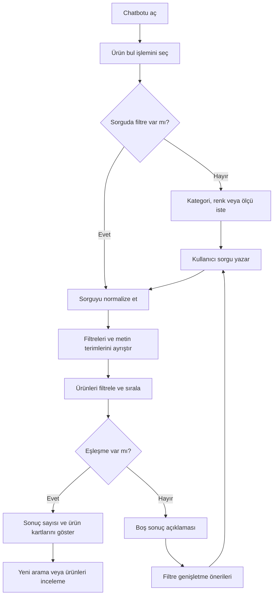
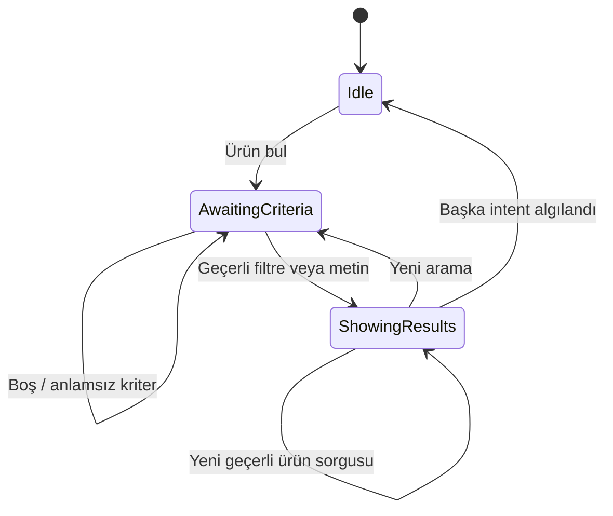

# 04 — Ürün Arama ve Filtreleme Akışı

> **Proje:** Merinos Chatbot Demo Localhost  
> **Görev türü:** Cursor uygulama görevi  
> **Ön koşullar:** `00`, `01`, `02` ve `03` numaralı görevler tamamlanmış olmalıdır.  
> **Kapsam:** Yalnızca ürün arama ve filtreleme akışı  
> **Sonraki görev:** `05-SIPARIS-DURUMU-SORGULAMA-AKISI.md`

---

## 1. Görevin amacı

Bu görevin amacı, Merinos localhost demosundaki ürün arama deneyimini;

- kategori,
- renk,
- ölçü/boyut,
- koleksiyon,
- ürün adı veya ürün kodu,
- serbest metin

üzerinden çalışan, anlaşılır, deterministik, test edilebilir ve ileride gerçek ürün kataloğu API'sine taşınabilir bir yapıya dönüştürmektir.

Bu görev tamamlandığında kullanıcı:

1. “Krem 160x230 salon halısı arıyorum” gibi birleşik bir sorgu yazabilmeli,
2. yalnızca “Gri halı”, “Koridor”, “Vega” veya “200 x 290” gibi tek filtreli sorgular kullanabilmeli,
3. hızlı işlem düğmeleriyle örnek ürün aramaları başlatabilmeli,
4. uygun sonuçları ürün kartlarında görebilmeli,
5. sonuç yoksa hangi filtrenin genişletilebileceğini anlayabilmeli,
6. aynı konuşma içinde yeni bir ürün aramasına güvenli biçimde başlayabilmelidir.

Bu adımda gerçek Merinos ürün kataloğu, fiyat servisi, stok servisi, kişiselleştirilmiş öneri motoru veya LLM tabanlı semantik arama bağlanmayacaktır.

---

## 2. Başlamadan önce okunacak dosyalar

Cursor, herhangi bir değişiklik yapmadan önce aşağıdaki dosyaları incelemelidir:

```text
cursor-tasks/00-PROJE-ANAYASASI.md
cursor-tasks/01-REPO-VE-GELISTIRME-TEMELI.md
cursor-tasks/02-MERINOS-DEMO-SITESI-VE-TASARIM-SISTEMI.md
cursor-tasks/03-CHATBOT-WIDGET-VE-KONUSMA-DENEYIMI.md
lib/demo-data.ts
lib/types.ts
lib/chatbot/engine.ts
components/Chatbot.tsx
components/ProductVisual.tsx
app/page.tsx
docs/02-KULLANICI-AKISLARI.md
docs/04-API-SOZLESMELERI.md
docs/05-TEST-SENARYOLARI.md
```

Ayrıca aşağıdaki komutların mevcut durumdaki çıktısı kaydedilmelidir:

```bash
npm test
npm run lint
npm run build
```

Backend bağımlılıkları kurulmuşsa mevcut Python testleri de çalıştırılmalıdır:

```bash
cd backend
python -m pytest
```

Bir komut ortam eksikliği nedeniyle çalışmıyorsa hata gizlenmemeli; tamamlanma raporunda komut, hata ve neden açıkça yazılmalıdır.

---

## 3. Mevcut davranış ve korunacak sözleşmeler

### 3.1. Mevcut demo veri kaynağı

Ürünler şu aşamada yalnızca aşağıdaki yerel veri kaynağından gelmektedir:

```text
lib/demo-data.ts
```

Bu görevde:

- gerçek API çağrısı yapılmayacak,
- haricî ürün verisi çekilmeyecek,
- rastgele ürün oluşturulmayacak,
- demo ürünlerin fiyat veya stok değerleri tahmin edilmeyecek,
- gerçek Merinos ürün bilgisi olduğu izlenimi verilmeyecektir.

### 3.2. Korunacak public sözleşmeler

Aşağıdaki temel sözleşmeler korunmalıdır:

```ts
resolveChatInput(query: string, activeIntent: ChatIntent): ChatReply
```

```ts
export type ChatIntent = "product" | "order" | "dealer" | "faq" | null;
```

```ts
export type Product = {
  id: number;
  name: string;
  collection: string;
  category: string;
  color: string;
  size: string;
  price: number;
  stock: StockStatus;
  pattern: string;
};
```

Mevcut `Product` tipi ihtiyaç olmadan kırılmamalıdır. Yeni arama metadatası gerekiyorsa bu metadata ayrı iç tiplerde tutulmalıdır.

### 3.3. Korunacak kullanıcı davranışları

Aşağıdaki davranışlar çalışmaya devam etmelidir:

- “Ürün bul” hızlı işlemi ürün akışını açar.
- “Krem 160x230 halı arıyorum” sorgusu uygun sonuç döndürür.
- “Gri salon halısı göster” sorgusu uygun sonuç döndürür.
- “Mavi 200x290 halı göster” sorgusu uygun sonuç döndürür.
- Sonuç kartlarında en az ürün adı, renk, ölçü ve fiyat görünür.
- Sonuç yoksa kullanıcıya yeni arama imkânı sunulur.
- Site üzerindeki kategori, renk ve ölçü filtreleri çalışmaya devam eder.
- Sipariş, bayi ve SSS akışları bozulmaz.

### 3.4. Bu görevde refactor serbestisi

Aşağıdaki iç yapı refactor edilebilir:

```text
lib/chatbot/engine.ts
```

Ürün arama sorumlulukları ayrı modüllere taşınabilir. Ancak `resolveChatInput` dış sözleşmesi korunmalı ve diğer intent davranışları değiştirilmemelidir.

---

## 4. Kapsam sınırı

### 4.1. Bu görevde yapılacaklar

- Ürün sorgusu normalizasyonu
- Türkçe karakter ve boşluk normalizasyonu
- Ölçü yazım biçimlerinin eşlenmesi
- Kategori, renk, ölçü, koleksiyon ve ürün adı ayrıştırması
- İzin verilen filtre değerlerinin tek kaynaktan üretilmesi
- Deterministik filtreleme
- Deterministik sonuç sıralaması
- Birleşik filtre sorguları
- Geniş ürün araması için yönlendirici soru
- Sonuç sayısı ve ürün kartları
- Boş sonuç davranışı
- Filtre genişletme önerileri
- Yeni arama davranışı
- Ürün kartlarının erişilebilirliği
- Site filtresi ile chatbot arama mantığının ortaklaştırılabildiği ölçüde tekrar azaltılması
- Unit ve davranış testleri
- Ürün arama dokümantasyonu

### 4.2. Bu görevde yapılmayacaklar

- Gerçek ürün kataloğu API entegrasyonu
- Gerçek stok API entegrasyonu
- Gerçek fiyat API entegrasyonu
- Kullanıcı hesabı veya kişisel öneri
- Vektör veritabanı
- Embedding üretimi
- LLM tabanlı ürün önerisi
- RAGFlow veya Langflow entegrasyonu
- Redis session state
- LangGraph worker implementasyonu
- Sepete ekleme
- Satın alma
- Ödeme
- Favorilere ekleme
- Ürün karşılaştırma motoru
- Canlı mağaza stok taahhüdü
- Ürün detay sayfası geliştirme
- Sipariş akışında değişiklik
- Bayi akışında değişiklik
- SSS akışında değişiklik

Bu sınırların dışına çıkılmamalıdır.

---

## 5. Ürün arama kullanıcı hikâyeleri

### US-04-01 — Birleşik filtre araması

**Kullanıcı olarak**, renk, ölçü ve kategoriyi tek cümlede yazarak uygun ürünleri görmek istiyorum.

Örnek:

```text
Krem 160x230 salon halısı arıyorum
```

Beklenen:

- renk = Krem,
- ölçü = 160x230,
- kategori = Salon Halısı

olarak ayrıştırılır ve yalnızca tüm filtreleri karşılayan ürünler gösterilir.

### US-04-02 — Tek filtre araması

**Kullanıcı olarak**, yalnızca bir renk, ölçü, kategori veya koleksiyon yazarak ürünleri görmek istiyorum.

Örnekler:

```text
Gri halı
200 x 290
Koridor halısı
Vega koleksiyonu
```

### US-04-03 — Ürün adı araması

**Kullanıcı olarak**, ürün adını veya ürün kodunu yazarak doğrudan eşleşmeye ulaşmak istiyorum.

Örnekler:

```text
Elegance 90823
90823
Rodin 60894
```

### US-04-04 — Sonuç bulunamadığında düzeltme

**Kullanıcı olarak**, tüm filtreleri karşılayan ürün bulunmazsa hangi filtreyi değiştirebileceğimi görmek istiyorum.

### US-04-05 — Yeni arama

**Kullanıcı olarak**, sonuçları gördükten sonra önceki aramadan bağımsız yeni arama başlatmak istiyorum.

### US-04-06 — Klavye ve ekran okuyucu

**Klavye veya ekran okuyucu kullanan kullanıcı olarak**, ürün sonuçlarını ve ürün kartı işlemlerini anlaşılır biçimde kullanmak istiyorum.

---

## 6. Temel kullanıcı akışı



---

## 7. Sorgu iyileştirme akışı

Bu adımda tam bir kalıcı konuşma hafızası kurulmayacaktır. Bununla birlikte kullanıcı ürün intent'i içindeyken yazdığı yeni sorgu ürün araması olarak değerlendirilmelidir.



Bağlayıcı davranış:

- “Ürün bul” yalnızca yönlendirme mesajı üretir.
- Kullanıcının sonraki mesajı `activeIntent === "product"` ise ürün sorgusu olarak işlenir.
- Kullanıcı açıkça sipariş, bayi veya SSS intent'i yazarsa intent değişimine izin verilir.
- “Yeni arama” işlemi eski sonuçları filtre girdisi olarak taşımamalıdır.
- Bu adımda önceki kriterlerle otomatik birleştirme yapılması zorunlu değildir.
- Önceki kriterlerin birleştirilmesi uygulanacaksa bu davranış açık state ile yapılmalı, gizli global değişken kullanılmamalıdır.

---

## 8. Hedef kod organizasyonu

Ürün arama mantığı `engine.ts` içinde tek parça bırakılmamalıdır. Önerilen yapı:

```text
lib/
├── catalog/
│   ├── product-facets.ts
│   ├── product-query.ts
│   ├── product-search.ts
│   ├── product-search.types.ts
│   └── product-search.test.ts
└── chatbot/
    ├── engine.ts
    └── replies/
        └── product-reply.ts
```

Mevcut proje yapısına daha uygun farklı bir isimlendirme kullanılabilir; ancak sorumluluklar ayrılmalıdır:

| Sorumluluk | Hedef modül |
|---|---|
| İzin verilen facet değerleri | `product-facets.ts` |
| Metin normalizasyonu ve sorgu ayrıştırma | `product-query.ts` |
| Filtreleme ve sıralama | `product-search.ts` |
| Chatbot yanıt metni ve aksiyonları | `product-reply.ts` |
| Intent yönlendirme | `engine.ts` |

### 8.1. Bağımlılık yönü

```text
Chatbot UI
   ↓
resolveChatInput
   ↓
product reply builder
   ↓
product query parser + product search
   ↓
local demo product repository
```

UI bileşenleri filtreleme algoritması içermemelidir.

### 8.2. Saf fonksiyon ilkesi

Aşağıdaki işlemler saf fonksiyon olmalıdır:

- metin normalizasyonu,
- ölçü normalizasyonu,
- facet çıkarımı,
- sorgu ayrıştırma,
- filtreleme,
- puanlama,
- sonuç sıralama,
- filtre genişletme önerisi.

Bu fonksiyonlar:

- DOM'a erişmemeli,
- `window` kullanmamalı,
- zamanlayıcı kullanmamalı,
- ağ çağrısı yapmamalı,
- global mutable state değiştirmemelidir.

---

## 9. Arama tipleri

Aşağıdakine eşdeğer iç tipler tanımlanmalıdır:

```ts
export type ProductSearchCriteria = {
  colors: string[];
  sizes: string[];
  categories: string[];
  collections: string[];
  productTerms: string[];
};

export type ParsedProductQuery = {
  originalQuery: string;
  normalizedQuery: string;
  criteria: ProductSearchCriteria;
  recognizedTokens: string[];
  remainingTerms: string[];
  hasUsableCriteria: boolean;
};

export type ProductMatchReason =
  | "exact-name"
  | "product-code"
  | "collection"
  | "category"
  | "color"
  | "size"
  | "free-text";

export type RankedProduct = {
  product: Product;
  score: number;
  reasons: ProductMatchReason[];
};

export type ProductSearchResult = {
  query: ParsedProductQuery;
  items: RankedProduct[];
  total: number;
  appliedFilters: ProductSearchCriteria;
  relaxations: ProductFilterRelaxation[];
};

export type ProductFilterRelaxation = {
  label: string;
  query: string;
  removedFacet: "color" | "size" | "category" | "collection";
};
```

Bu tipler örnektir. İsimler değişebilir ancak aynı sorumluluk ayrımı korunmalıdır.

### 9.1. UI'ya skor sızdırma yasağı

`score` yalnızca deterministik sıralama ve test amacıyla kullanılmalıdır.

Kullanıcıya:

- “%92 eşleşme”,
- “AI güven skoru”,
- “öneri puanı”

gibi doğrulanmamış ifadeler gösterilmemelidir.

---

## 10. Facet değerlerinin tek kaynağı

Kategori, renk, ölçü ve koleksiyon değerleri farklı dosyalarda elle tekrar edilmemelidir.

Facet listeleri ürün verisinden deterministik biçimde türetilmelidir:

```ts
const colors = unique(products.map((product) => product.color));
const sizes = unique(products.map((product) => product.size));
const categories = unique(products.map((product) => product.category));
const collections = unique(products.map((product) => product.collection));
```

Sıralama kullanıcı arayüzünde kararlı olmalıdır. İki kabul edilebilir yöntem vardır:

1. demo veri sırasını korumak,
2. `tr-TR` locale ile alfabetik sıralamak.

Seçilen yöntem test ile sabitlenmelidir.

### 10.1. Site filtreleri

`app/page.tsx` içindeki kategori, renk ve ölçü seçenekleri mümkünse aynı facet kaynağını kullanmalıdır.

Aşağıdaki türde tekrarlar kaldırılmalıdır:

```tsx
<option>Krem</option>
<option>Bej</option>
<option>Gri</option>
```

Yerine tek kaynaktan üretilen seçenekler kullanılmalıdır.

### 10.2. “Tümü” değeri

`Tümü` bir ürün facet değeri değildir. Yalnızca arayüz kontrol değeridir.

İç arama modelinde:

```ts
colors: []
```

“renk filtresi yok” anlamına gelmelidir. `"Tümü"` iş mantığına taşınmamalıdır.

---

## 11. Türkçe metin normalizasyonu

Mevcut `normalizeText` davranışı korunmalı ve ortak yardımcıya taşınabiliyorsa tekrar azaltılmalıdır.

Minimum normalizasyon:

- `toLocaleLowerCase("tr-TR")`
- Türkçe karakterleri arama eşdeğerine çevirme
- baştaki ve sondaki boşlukları kaldırma
- birden fazla boşluğu tek boşluğa indirme
- gereksiz noktalama işaretlerini token sınırı olarak ele alma
- ölçü ayraçlarını standartlaştırma

Örnek eşdeğerlikler:

| Kullanıcı girdisi | Normalize edilen anlam |
|---|---|
| `KREM` | `krem` |
| `Şık gri halı` | `sik gri hali` |
| `160 X 230` | `160x230` |
| `160×230` | `160x230` |
| `160 * 230` | `160x230` |
| `160 cm x 230 cm` | `160x230` |
| `  Mavi   Halı  ` | `mavi hali` |

### 11.1. Normalizasyon sınırı

Normalizasyon kullanıcıya gösterilen ürün adını, rengini veya kategori etiketini değiştirmemelidir. Normalize edilmiş metin yalnızca karşılaştırmada kullanılmalıdır.

### 11.2. Regex güvenliği

Kullanıcı girdisi doğrudan kontrolsüz regex olarak derlenmemelidir.

Yanlış:

```ts
new RegExp(userInput)
```

Doğru yaklaşım:

- sabit regex kalıpları,
- normalize edilmiş string karşılaştırması,
- gerekirse regex karakterlerini kaçırma.

---

## 12. Ölçü normalizasyonu

Aşağıdaki biçimler aynı ölçüye karşılık gelmelidir:

```text
160x230
160 x 230
160X230
160 × 230
160*230
160 cm x 230 cm
160'a 230
```

Minimum desteklenmesi gereken demo ölçüleri:

```text
80x300
120x180
160x230
200x290
```

### 12.1. Boyut sırası

Bu projede ürün verisindeki yön korunmalıdır. `230x160` otomatik olarak `160x230` kabul edilmek zorunda değildir.

Ters ölçü desteği eklenirse:

- açıkça dokümante edilmeli,
- test edilmelidir,
- yanlış pozitif üretmemelidir.

### 12.2. Sayısal gürültü

Sipariş numarası, fiyat veya başka sayılar ölçü olarak algılanmamalıdır.

Örnek:

```text
MRN-2026-1042
```

ürün ölçüsü değildir ve sipariş intent'ini korumalıdır.

---

## 13. Eş anlam ve kullanıcı dili haritası

Arama, kontrollü eş anlam haritaları kullanabilir. Eş anlamlar kod içinde merkezi bir sözlükte tutulmalıdır.

### 13.1. Kategori eş anlamları

Minimum örnekler:

```ts
const categoryAliases = {
  "Salon Halısı": ["salon", "salon halisi"],
  "Oturma Odası": ["oturma odasi", "oturma grubu"],
  "Yatak Odası": ["yatak odasi", "yatak"],
  Koridor: ["koridor", "yolluk"],
};
```

`yolluk` eş anlamı kullanılırsa demo verisindeki `Koridor` kategorisine bağlandığı dokümante edilmelidir.

### 13.2. Renk eş anlamları

Sadece güvenli ve açık eş anlamlar eklenmelidir. Örneğin:

```ts
const colorAliases = {
  Antrasit: ["antrasit", "koyu gri"],
};
```

Aşağıdaki türde belirsiz eşlemeler yapılmamalıdır:

```text
kum → bej
fildişi → krem
lacivert → mavi
```

Demo veride ayrı bir değer yoksa kullanıcıya kesin eşleşme gibi sunulmamalıdır.

### 13.3. Koleksiyon

Koleksiyon adları doğrudan ürün verisinden alınmalıdır:

```text
Elegance
Therapy
Rodin
Vega
Valeria
Diyez
```

Koleksiyon adı ürün sorgusundaki diğer kelimelerle birlikte kullanılabilmelidir:

```text
Mavi Vega 200x290
```

---

## 14. Ürün adı ve ürün kodu araması

### 14.1. Tam ürün adı

Kullanıcı ürünün tam adını yazarsa doğrudan eşleşme en üstte olmalıdır:

```text
Elegance 90823
```

### 14.2. Ürün kodu

Ürün adındaki ayırt edici sayısal kod tek başına aranabilmelidir:

```text
90823
```

Ancak her rastgele sayı ürün kodu sayılmamalıdır. Kod, mevcut demo ürün adlarından türetilen izinli kod listesinde bulunmalıdır.

### 14.3. Kısmi ürün adı

```text
Elegance
```

bir koleksiyon filtresi olarak çalışabilir ve ilgili koleksiyondaki ürünleri döndürmelidir.

### 14.4. Çakışma önceliği

Bir terim hem koleksiyon hem ürün adı içinde geçiyorsa sıralama önceliği:

1. tam ürün adı,
2. ürün kodu,
3. koleksiyon + diğer filtreler,
4. serbest metin

olmalıdır.

---

## 15. Filtre semantiği

### 15.1. Farklı filtre grupları

Farklı gruplar birbirleriyle **AND** çalışmalıdır.

Örnek:

```text
Krem 160x230 salon halısı
```

şu anlama gelir:

```text
color = Krem
AND size = 160x230
AND category = Salon Halısı
```

### 15.2. Aynı filtre grubundaki değerler

Aynı grup içinde birden fazla açık değer algılanırsa değerler **OR** çalışabilir.

Örnek:

```text
Krem veya bej 160x230
```

şu anlama gelebilir:

```text
(color = Krem OR color = Bej)
AND size = 160x230
```

Bu destek uygulanıyorsa test edilmelidir.

### 15.3. Negatif filtre

Bu görevde aşağıdaki türde negatif filtre zorunlu değildir:

```text
Mavi olmasın
Krem hariç
```

Negatif filtre uygulanmayacaksa bu sorgular yanlış şekilde pozitif mavi/krem filtresine dönüşmemelidir. Güvenli davranış:

- kullanıcıdan filtreyi olumlu biçimde tekrar istemek,
- veya desteklenmediğini kısa biçimde söylemek.

### 15.4. Filtre yoksa

Sadece aşağıdaki gibi geniş bir niyet varsa tüm ürünleri hemen dökmek yerine kriter istenmelidir:

```text
Ürün bul
Halı arıyorum
Ürün aramak istiyorum
```

Yanıt örneği:

```text
Aradığınız halının kategori, renk veya ölçüsünü yazın. Birden fazla özelliği aynı cümlede kullanabilirsiniz.
```

---

## 16. Serbest metin eşleşmesi

Facet dışındaki kalan anlamlı terimler aşağıdaki alanlarda aranabilir:

- `product.name`
- `product.collection`
- `product.category`
- `product.color`
- `product.size`

Serbest metin araması:

- tüm ürünleri gereksiz yere eşleştirmemeli,
- Türkçe stop-word gürültüsünden etkilenmemeli,
- “arıyorum”, “göster”, “istiyorum”, “halı”, “ürün” gibi niyet kelimelerini ürün terimi saymamalıdır.

Önerilen kontrollü niyet kelimeleri:

```ts
const productIntentStopWords = [
  "hali",
  "urun",
  "ariyorum",
  "goster",
  "gosterir misin",
  "istiyorum",
  "bakiyorum",
  "bul",
  "koleksiyonu",
];
```

Bu liste metin normalizasyonundan sonra uygulanmalıdır.

---

## 17. Deterministik eşleşme sıralaması

Sonuç sırası her çalıştırmada aynı olmalıdır.

Önerilen puanlama:

| Eşleşme | Örnek puan |
|---|---:|
| Tam normalize ürün adı | +100 |
| Geçerli ürün kodu | +90 |
| Koleksiyon eşleşmesi | +30 |
| Kategori eşleşmesi | +25 |
| Renk eşleşmesi | +20 |
| Ölçü eşleşmesi | +20 |
| Kalan serbest metin terimi | +10 / terim |
| Tüm açık filtreleri karşılama | +15 |

Puanlar birebir aynı olmak zorunda değildir. Ancak aşağıdaki kurallar zorunludur:

1. tam ürün adı en üstte olmalıdır,
2. ürün kodu güçlü öncelik almalıdır,
3. tüm açık filtreleri karşılayan ürün, daha az filtre karşılayandan önce gelmelidir,
4. eşit puanda kararlı tie-break kullanılmalıdır,
5. tie-break için ürün veri sırası veya `id` kullanılmalıdır,
6. rastgele sıralama kullanılmamalıdır.

### 17.1. Sıkı filtreleme ve puanlama ayrımı

Kullanıcının açıkça belirttiği facet değerleri önce zorunlu filtre olarak uygulanmalıdır. Puanlama, filtreyi karşılamayan ürünü sonuçlara geri sokmamalıdır.

Yanlış:

```text
Kullanıcı Krem istedi, mavi ürün yüksek puanla gösterildi.
```

Doğru:

```text
Krem filtresini karşılamayan ürün sonuç kümesine alınmadı.
```

---

## 18. Sonuç limiti ve sayfalama sınırı

Chatbot aynı yanıtta en fazla **4 ürün kartı** göstermelidir.

Mesajdaki toplam sayı gerçek eşleşme sayısını gösterebilir:

```text
6 uygun demo ürün buldum. İlk 4 eşleşmeyi gösteriyorum.
```

Mevcut demo veri setinde sonuç sayısı küçük olsa da limit test edilmelidir.

Bu görevde sayfalama veya “daha fazla yükle” zorunlu değildir. Eklenirse:

- erişilebilir olmalı,
- arama kriterini kaybetmemeli,
- rastgele sıra oluşturmamalıdır.

---

## 19. Sonuç yanıtı

### 19.1. Başarılı sonuç

Yanıt:

- bulunan toplam ürün sayısını,
- bunların demo veri olduğunu,
- kartların aşağıda olduğunu

kısa biçimde belirtmelidir.

Örnek:

```text
2 uygun demo ürün buldum. En yakın eşleşmeleri aşağıda görebilirsiniz.
```

### 19.2. Uygulanan filtre özeti

İsteğe bağlı olarak kullanıcıya uygulanan filtreler kısa chip veya metin olarak gösterilebilir:

```text
Krem · 160x230 · Salon Halısı
```

Bu özet:

- yalnızca gerçekten algılanan filtreleri göstermeli,
- kullanıcı söylemediği filtreyi eklememeli,
- erişilebilir metin karşılığı içermelidir.

### 19.3. “Demo” niteliği

Stok ve fiyat verisinin temsili olduğu mevcut sayfa bildirimiyle tutarlı olmalıdır. Ürün kartında gerçek zamanlılık iddiası yapılmamalıdır.

---

## 20. Ürün kartı gereksinimleri

Chatbot ürün kartı en az şunları göstermelidir:

- ürün görsel temsili,
- ürün adı,
- koleksiyon,
- renk,
- ölçü,
- kategori,
- fiyat,
- stok etiketi.

Mevcut kartta görünmeyen alanlar tasarım bozulmadan eklenmelidir.

### 20.1. Fiyat biçimi

Fiyat `tr-TR` ve `TRY` biçimiyle gösterilmelidir:

```ts
new Intl.NumberFormat("tr-TR", {
  style: "currency",
  currency: "TRY",
  maximumFractionDigits: 0,
});
```

Sabit `₺` string birleştirme yerine locale formatlama tercih edilmelidir.

### 20.2. Stok dili

Demo veri içindeki durumlar:

```text
Stokta
Sınırlı stok
```

olduğu gibi gösterilebilir. Ancak kart veya açıklama gerçek zamanlı mağaza stok garantisi vermemelidir.

Gerekli demo açıklaması:

```text
Stok bilgisi temsilidir.
```

Bu açıklama her kartta tekrar edilmek zorunda değildir; sonuç grubu veya chatbot demo bildirimi içinde erişilebilir biçimde bulunabilir.

### 20.3. Semantik yapı

Kart listesi:

```html
<ul aria-label="Ürün sonuçları">
  <li>...</li>
</ul>
```

veya eşdeğer doğru semantik yapı kullanmalıdır.

Kart başlığı gerçek heading hiyerarşisini bozmamalıdır.

### 20.4. Kart işlemi

Bu görevde gerçek ürün detay sayfası yoksa sahte “Satın al” veya “Sepete ekle” düğmesi eklenmemelidir.

Kabul edilebilir işlemler:

- “Yeni arama”
- site ürün bölümüne gitme
- erişilebilir, gerçek hedefi olan “Ürünleri sayfada gör” bağlantısı

Boş `href="#"` kullanılmamalıdır.

---

## 21. Boş sonuç davranışı

Hiç eşleşme yoksa yalnızca “Bulunamadı” demek yeterli değildir.

Yanıt üç bölüm içermelidir:

1. Sonuç bulunamadığını belirtme
2. Algılanan filtreleri tekrar etme
3. Somut genişletme seçenekleri sunma

Örnek:

```text
Antrasit, 200x290 ve Yatak Odası filtrelerinin tamamını karşılayan demo ürün bulunamadı. Ölçüyü veya rengi kaldırarak yeniden deneyebilirsiniz.
```

### 21.1. Gevşetme önerisi üretimi

Öneriler gerçek veri üzerinde yeniden arama yapılarak üretilmelidir.

Örnek algoritma:

1. Tüm filtrelerle ara.
2. Sonuç yoksa her seferinde tek bir facet grubunu kaldır.
3. Sonuç üreten gevşetmeleri belirle.
4. En fazla 3 öneri göster.

Örnek işlemler:

```text
Rengi kaldır
Ölçüyü kaldır
Sadece salon halılarını göster
```

Her işlemin `value` değeri kullanıcıya görünür, anlaşılır bir yeni sorgu olmalıdır.

Yanlış:

```ts
{ label: "Rengi kaldır", value: "__RELAX_COLOR__" }
```

Tercih edilen:

```ts
{ label: "Rengi kaldır", value: "200x290 yatak odası halısı göster" }
```

Bu sayede mevcut mesaj gönderme sözleşmesi korunur.

### 21.2. Yanlış alternatif yasağı

Alternatif öneri, kullanıcı istemediği bir ürünü “uygun” diye gösteremez.

Öneri ile asıl sonuç açıkça ayrılmalıdır:

```text
Tam eşleşme yok. Rengi kaldırırsanız şu ürünler bulunabilir.
```

### 21.3. Hiçbir gevşetme sonuç üretmezse

Kullanıcıya izinli facetlerden örnekler sunulmalıdır:

- mevcut renkler,
- mevcut ölçüler,
- mevcut kategoriler.

Liste çok uzun olmamalıdır; en fazla 3–4 örnek işlem gösterilmelidir.

---

## 22. Anlaşılmayan ürün sorgusu

Ürün intent'i aktifken sorguda kullanılabilir kriter bulunamazsa tüm ürünleri döndürmek yerine yönlendirme yapılmalıdır.

Örnek kullanıcı girdisi:

```text
Güzel bir şey olsun
```

Bu görevde öznel stil önerisi motoru olmadığı için yanıt:

```text
Renk, ölçü, kategori veya koleksiyon bilgisi yazarsanız demo ürünleri filtreleyebilirim.
```

şeklinde olmalıdır.

Hızlı işlemler:

```text
Krem · 160x230
Gri salon halısı
Mavi · 200x290
```

sunulabilir.

### 22.1. Uydurma öneri yasağı

“Güzel”, “modern”, “şık”, “en kaliteli”, “en popüler” gibi ölçülemeyen isteklerde ürünlere doğrulanmamış nitelik atanmamalıdır.

---

## 23. Intent çakışmaları

Intent algılama sırası diğer akışları korumalıdır.

### 23.1. Sipariş numarası

```text
MRN-2026-1042
```

ürün kodu olarak yorumlanmamalıdır.

### 23.2. Stok sorusu

```text
Mağaza stoku nasıl doğrulanır?
```

onaylı SSS sorusudur ve FAQ intent'ine gitmelidir.

```text
Krem 160x230 stokta ürün var mı?
```

ürün araması olabilir. Bu durumda demo kartlardaki temsili stok gösterilebilir; canlı stok sözü verilmez.

### 23.3. Bayi ile ürün

```text
Gaziantep bayisinde krem halı var mı?
```

bu görevde mağaza bazlı stok sorgusu desteklenmez. Güvenli yanıt:

- ürün filtresini göstermek,
- mağaza stok bilgisinin temsili/bağlı olmadığını belirtmek,
- gerekirse bayi akışına ayrı geçiş önermek.

Tek yanıtta gerçek mağaza stok eşleşmesi uydurulmamalıdır.

### 23.4. İade veya bakım kelimesi

FAQ anahtar sözcükleri ürün adı/renk gibi yanlış yorumlanmamalıdır.

---

## 24. Site ürün filtresiyle tutarlılık

Ana sayfadaki ürün filtreleri ile chatbot aramasının facet değerleri aynı kaynaktan gelmelidir.

### 24.1. Filtre semantiği

Site filtrelerinde:

```text
kategori AND renk AND ölçü
```

mantığı korunmalıdır.

### 24.2. Sonuç sayısı

Ana sayfadaki:

```text
N demo ürün
```

ifadesi filtre sonucuyla eşleşmelidir.

### 24.3. Boş sonuç

Site boş sonuç görünümü:

- filtrelerin sonuç üretmediğini söylemeli,
- filtreleri temizleme işlemi sunmalı,
- chatbot açmayı zorunlu kılmamalıdır.

### 24.4. Filtre sıfırlama

Tek bir “Filtreleri temizle” işlemi eklenmelidir veya mevcutsa korunmalıdır.

Bu işlem:

```text
category = Tümü
color = Tümü
size = Tümü
```

ayarlarını tek seferde uygulamalıdır.

### 24.5. URL state

Bu görevde filtrelerin URL query parametrelerine yazılması zorunlu değildir. Eklenirse sayfa yenilendiğinde güvenli parse edilmeli ve geçersiz değerler `Tümü` olarak ele alınmalıdır.

---

## 25. Ürün arama yanıt dili

Yanıtlar:

- kısa,
- doğrudan,
- nazik,
- satış baskısı oluşturmayan,
- demo niteliğini gizlemeyen

bir dil kullanmalıdır.

### 25.1. Başarılı yanıt örnekleri

```text
1 uygun demo ürün buldum.
```

```text
3 uygun demo ürün buldum. İlk eşleşmeleri aşağıda görebilirsiniz.
```

### 25.2. Boş sonuç örneği

```text
Bu filtrelerin tamamını karşılayan demo ürün bulunamadı. Ölçüyü veya rengi değiştirerek yeniden deneyebilirsiniz.
```

### 25.3. Kriter isteme örneği

```text
Kategori, renk, ölçü veya koleksiyon yazın. Örneğin “Krem 160x230 salon halısı”.
```

### 25.4. Kaçınılacak dil

```text
Size kesinlikle en iyi ürünü buldum.
```

```text
Bu ürün mağazada kesin stokta.
```

```text
Bu ürün size çok yakışır.
```

```text
Fiyat bugün kesin geçerlidir.
```

---

## 26. Erişilebilirlik gereksinimleri

### 26.1. Sonuç duyurusu

Yeni ürün sonuçları geldiğinde canlı bölge yalnızca kısa özeti duyurmalıdır:

```text
2 ürün sonucu bulundu.
```

Tüm kart içeriği tek seferde canlı bölgeye okunmamalıdır.

### 26.2. Kart listesi

- liste semantiği bulunmalı,
- ürün adı kartın erişilebilir adı olmalı,
- renk tek bilgi taşıyıcısı olmamalı,
- stok yalnızca renk rozetiyle anlatılmamalı,
- fiyat ekran okuyucu tarafından anlaşılır okunmalıdır.

### 26.3. Hızlı işlemler

Filtre önerisi düğmeleri:

- gerçek `button` olmalı,
- klavyeyle erişilebilir olmalı,
- anlamlı metin içermeli,
- yalnızca ikon kullanmamalıdır.

### 26.4. Focus

Sonuç geldiğinde focus otomatik olarak ilk karta taşınmamalıdır. Kullanıcının composer veya gönder düğmesindeki focus'u korunmalıdır.

“Ürünleri sayfada gör” bağlantısı kullanılırsa hedef bölümde focus yönetimi veya görünür odak hedefi düşünülmelidir.

---

## 27. Responsive gereksinimler

### 27.1. Chatbot ürün kartı

Dar ekranda:

- kart yatay taşma oluşturmamalı,
- fiyat kırpılmamalı,
- ürün adı iki satırdan sonra anlamsız biçimde kesilmemeli,
- işlem düğmesi minimum 44x44 px dokunma alanına sahip olmalı,
- kart görseli metni aşırı küçültmemelidir.

### 27.2. Sonuç listesi

- desktop'ta mevcut widget genişliğine uymalı,
- mobilde tek sütun olmalı,
- yatay carousel zorunlu değildir,
- yatay carousel kullanılırsa klavye ve ekran okuyucu desteği sağlanmalıdır.

### 27.3. Ana sayfa filtreleri

- küçük ekranda kontroller alt alta gelebilir,
- label'lar görünür kalmalı,
- select genişlikleri taşmamalı,
- sonuç sayısı filtrelerle çakışmamalıdır.

---

## 28. Güvenlik ve veri doğruluğu

### 28.1. Kullanıcı girdisi

Ürün sorgusu plain text olarak işlenmelidir.

- `dangerouslySetInnerHTML` kullanılmamalı,
- HTML çalıştırılmamalı,
- markdown HTML uzantıları açılmamalı,
- sorgu loglanacaksa ham kişisel veri varsayımıyla dikkatli olunmalıdır.

### 28.2. Demo veri sınırı

Yanıt yalnızca `products` listesinde bulunan alanlardan oluşturulmalıdır.

Uydurulmaması gereken alanlar:

- malzeme,
- hav yüksekliği,
- üretim tekniği,
- garanti süresi,
- gerçek stok adedi,
- mağaza stok konumu,
- indirim oranı,
- teslimat süresi,
- müşteri puanı,
- popülerlik,
- satış adedi.

### 28.3. Fiyat ve stok

Fiyat ve stok bilgisi demo verisinden okunmalıdır. Sistem saati, rastgele sayı veya tahmin kullanılmamalıdır.

### 28.4. Dış bağlantılar

Ürün kartına dış URL eklenirse yalnızca doğrulanmış ve açıkça yapılandırılmış hedef kullanılmalıdır. Bu görevde dış ürün URL'si eklenmesi önerilmez.

---

## 29. Performans gereksinimleri

Demo veri seti küçük olsa da çözüm ölçeklenebilir temel ilkelere uymalıdır:

- facet listeleri her render'da gereksiz tekrar hesaplanmamalı,
- normalizasyon aynı ürün için her sorguda gereksiz tekrar edilmemeli,
- UI render içinde karmaşık arama algoritması çalıştırılmamalı,
- sonuç anahtarı olarak array index kullanılmamalı,
- sıralama orijinal `products` dizisini mutate etmemelidir.

Yanlış:

```ts
products.sort(...)
```

Doğru:

```ts
[...products].sort(...)
```

veya filtre sonucu üzerinde sıralama.

### 29.1. Erken optimizasyon yasağı

Bu aşamada:

- arama index sunucusu,
- worker thread,
- WebAssembly,
- büyük arama kütüphanesi

eklenmemelidir.

Saf ve okunabilir TypeScript yeterlidir.

---

## 30. Gözlemlenebilirlik hazırlığı

Bu görevde analitik servisi bağlanmayacaktır. Ancak ileride ölçülebilecek olaylar dokümante edilmelidir:

```text
product_search_started
product_search_completed
product_search_empty
product_filter_relaxed
product_result_clicked
```

Önerilen olay alanları:

```ts
{
  source: "chatbot" | "site",
  filterCount: number,
  resultCount: number,
  durationMs: number,
  locale: "tr-TR"
}
```

Ham kullanıcı sorgusu varsayılan olarak analitik olaya eklenmemelidir. Gerekli olursa KVKK ve log maskeleme kararı sonraki güvenlik görevinde verilmelidir.

Bu görevde gerçek event gönderimi yapılmamalıdır.

---

## 31. Dokümantasyon çıktısı

Uygulama sonunda aşağıdaki doküman oluşturulmalı veya mevcut dokümana eşdeğer bölüm eklenmelidir:

```text
docs/08-URUN-ARAMA-VE-FILTRELEME.md
```

Doküman en az şu başlıkları içermelidir:

1. Yerel demo veri kaynağı
2. Desteklenen filtreler
3. Türkçe normalizasyon
4. Ölçü formatları
5. Facet eş anlamları
6. AND/OR filtre semantiği
7. Sonuç sıralaması
8. Boş sonuç stratejisi
9. Chatbot yanıt örnekleri
10. Site filtreleriyle ortak davranış
11. Bilinen sınırlar
12. Gerçek katalog API'sine geçiş notları

### 31.1. API geçiş notu

Dokümana hedef sözleşme eklenmelidir:

```http
GET /api/v1/products?category=salon-halisi&color=krem&size=160x230
```

Yerel arama modülünün ileride bir repository/transport arayüzü arkasına alınacağı belirtilmelidir.

---

## 32. Uygulama adımları

### Adım 1 — Başlangıç durumunu kaydet

- Git durumunu kontrol et.
- Mevcut test, lint ve build çıktısını kaydet.
- Kullanıcının mevcut değişikliklerini silme.
- Bu görev dışındaki dosyaları gereksiz değiştirme.

### Adım 2 — Mevcut ürün davranışını testle sabitle

En az aşağıdaki mevcut senaryolar için test ekle:

```text
Krem 160x230 halı arıyorum
Gri salon halısı göster
Mavi 200x290 halı göster
Ürün bul
```

### Adım 3 — Facet kaynağını oluştur

- Renkleri ürün verisinden türet.
- Ölçüleri ürün verisinden türet.
- Kategorileri ürün verisinden türet.
- Koleksiyonları ürün verisinden türet.
- Tekrarlı sabit listeleri azalt.

### Adım 4 — Normalizasyonu ayrıştır

- Türkçe metin normalizasyonu
- Ölçü normalizasyonu
- ürün kodu çıkarımı
- niyet stop-word temizliği

saf fonksiyonlara ayrılmalıdır.

### Adım 5 — Sorgu parser'ını oluştur

Parser:

- renkleri,
- ölçüleri,
- kategorileri,
- koleksiyonları,
- ürün kodlarını,
- kalan anlamlı terimleri

çıkarmalıdır.

### Adım 6 — Arama ve sıralama modülünü oluştur

- açık facetleri sıkı filtrele,
- serbest metni değerlendir,
- puanla,
- deterministik sırala,
- toplam sonucu döndür.

### Adım 7 — Boş sonuç gevşetmelerini oluştur

- tek facet kaldırma senaryolarını dene,
- sonuç üreten en fazla 3 seçenek üret,
- makine tokenı yerine anlaşılır sorgu değeri kullan.

### Adım 8 — Chatbot ürün yanıtını güncelle

- broad request,
- başarılı sonuç,
- boş sonuç,
- anlaşılmayan kriter,
- yeni arama

durumlarını ayrı ve okunabilir biçimde yönet.

### Adım 9 — Ürün kartını tamamla

- koleksiyon,
- kategori,
- stok,
- fiyat,
- demo açıklaması,
- semantik liste

gereksinimlerini uygula.

### Adım 10 — Site filtrelerini ortak facet kaynağına bağla

- mevcut davranışı koru,
- filtre seçeneklerini dinamik üret,
- filtre temizleme davranışını ekle veya doğrula,
- sonuç sayısını doğrula.

### Adım 11 — Testleri tamamla

- parser unit testleri,
- search unit testleri,
- reply testleri,
- UI davranış testi,
- site filtre testi,
- regresyon testleri

eklenmelidir.

### Adım 12 — Dokümantasyon ve kalite kapısı

- `docs/08-URUN-ARAMA-VE-FILTRELEME.md` oluştur.
- Test, lint ve build çalıştır.
- Değişen dosyaları raporla.
- Durma kuralına uy.

---

## 33. Zorunlu sorgu senaryoları

Aşağıdaki senaryolar otomatik test veya açık manuel doğrulama ile kanıtlanmalıdır.

### 33.1. Geniş istek

| Girdi | Beklenen |
|---|---|
| `Ürün bul` | Kriter ister, tüm ürünleri dökmez |
| `Halı arıyorum` | Kriter ister |
| `Ürün aramak istiyorum` | Kriter ister |

### 33.2. Renk

| Girdi | Beklenen |
|---|---|
| `Krem halı` | Yalnızca Krem ürünler |
| `gri ürün göster` | Yalnızca Gri ürünler |
| `ANTRASİT` | Yalnızca Antrasit ürünler |

### 33.3. Ölçü

| Girdi | Beklenen |
|---|---|
| `160x230` | Yalnızca 160x230 ürünler |
| `160 x 230 halı` | 160x230 ile aynı sonuç |
| `200×290` | Yalnızca 200x290 ürünler |
| `80 cm x 300 cm` | 80x300 eşleşmesi |

### 33.4. Kategori

| Girdi | Beklenen |
|---|---|
| `Salon halısı` | Salon Halısı kategorisi |
| `Yatak odası için` | Yatak Odası kategorisi |
| `Koridor yolluk` | Koridor kategorisi |
| `Oturma odası halısı` | Oturma Odası kategorisi |

### 33.5. Koleksiyon

| Girdi | Beklenen |
|---|---|
| `Vega` | Vega koleksiyonu |
| `Elegance koleksiyonu` | Elegance ürünleri |
| `Mavi Vega` | Mavi AND Vega |

### 33.6. Ürün adı/kodu

| Girdi | Beklenen |
|---|---|
| `Elegance 90823` | Tam ürün en üstte |
| `90823` | Elegance 90823 |
| `60894` | Rodin 60894 |

### 33.7. Birleşik filtre

| Girdi | Beklenen |
|---|---|
| `Krem 160x230 salon halısı` | Üç filtreyi de karşılayan ürün |
| `Mavi 200x290 salon` | Mavi AND 200x290 AND Salon Halısı |
| `Antrasit 80x300 koridor` | İlgili tek ürün |

### 33.8. Boş sonuç

| Girdi | Beklenen |
|---|---|
| `Antrasit 200x290 yatak odası` | Tam eşleşme yok mesajı + gevşetme |
| `Krem 80x300 salon` | Tam eşleşme yok mesajı + somut öneri |
| `Mor 300x400` | Desteklenen kriter örnekleri; ürün uydurma yok |

### 33.9. Intent regresyonu

| Girdi | Beklenen intent |
|---|---|
| `MRN-2026-1042` | order |
| `En yakın bayi` | dealer |
| `İade süreci nasıl?` | faq |
| `Krem 160x230 stokta var mı?` | product |

---

## 34. Unit test gereksinimleri

### 34.1. Normalizasyon testleri

Minimum:

```text
KREM → krem
ŞİK → sik
160 X 230 → 160x230
160×230 → 160x230
160 cm x 230 cm → 160x230
fazla boşluklar → tek boşluk
```

### 34.2. Parser testleri

Parser'ın döndürdüğü kriterler doğrudan test edilmelidir.

Örnek:

```ts
expect(parseProductQuery("Krem 160 x 230 salon halısı").criteria).toEqual({
  colors: ["Krem"],
  sizes: ["160x230"],
  categories: ["Salon Halısı"],
  collections: [],
  productTerms: [],
});
```

Test şekli proje test altyapısına uyarlanabilir.

### 34.3. Filtre testleri

- AND semantiği
- varsa aynı grup OR semantiği
- exact product name
- product code
- collection
- stable ordering
- input dizisini mutate etmeme
- sonuç limiti

### 34.4. Boş sonuç testleri

- tam eşleşme yok
- tek facet kaldırınca sonuç var
- gevşetme sorgusu anlaşılır
- en fazla 3 öneri
- öneriler tekrar etmiyor

### 34.5. Yanıt builder testleri

- broad request kriter istiyor
- başarı mesajı gerçek toplamı kullanıyor
- kart limiti 4
- no-result mesajı ürün uydurmuyor
- yeni arama action'ı doğru value taşıyor

---

## 35. UI ve entegrasyon testleri

Kullanılan test altyapısına göre React Testing Library, mevcut Node testleri veya eşdeğer araç tercih edilebilir.

Minimum doğrulamalar:

1. “Ürün bul” seçildiğinde kriter mesajı görünür.
2. “Krem 160x230 halı arıyorum” gönderildiğinde doğru kart görünür.
3. Yanlış renkli ürün görünmez.
4. Sonuç sayısı kart sayısından büyükse metin gerçek toplamı gösterir.
5. Ürün kartında ürün adı, renk, ölçü, kategori, fiyat ve stok görünür.
6. Boş sonuçta öneri düğmeleri görünür.
7. Öneri düğmesine basınca yeni sorgu gönderilir.
8. “Yeni arama” önceki sonuçları otomatik kriter olarak taşımaz.
9. Sipariş hızlı işlemi hâlâ sipariş akışına gider.
10. Site filtreleri doğru ürün sayısını gösterir.
11. “Filtreleri temizle” tüm site filtrelerini sıfırlar.

### 35.1. Kırılgan test yasağı

Testler:

- CSS class sırasına,
- rastgele üretilmiş message ID'lerine,
- tüm HTML snapshot'ına,
- piksel değerlerine

gereksiz bağımlı olmamalıdır.

Kullanıcı davranışı ve erişilebilir rol/sorgular tercih edilmelidir.

---

## 36. Kabul ölçütleri

### 36.1. Mimari

- [ ] Ürün arama mantığı UI bileşeninden ayrılmıştır.
- [ ] `resolveChatInput` dış sözleşmesi korunmuştur.
- [ ] Ürün reply sorumluluğu okunabilir bir modüldedir.
- [ ] Parser ve search saf fonksiyonlardır.
- [ ] Global mutable arama state'i yoktur.
- [ ] Sipariş, bayi ve SSS iş mantığı değiştirilmemiştir.

### 36.2. Facet yönetimi

- [ ] Renkler ürün verisinden türetilir.
- [ ] Ölçüler ürün verisinden türetilir.
- [ ] Kategoriler ürün verisinden türetilir.
- [ ] Koleksiyonlar ürün verisinden türetilir.
- [ ] `Tümü` domain facet değeri değildir.
- [ ] Site ve chatbot facet değerleri birbiriyle tutarlıdır.

### 36.3. Normalizasyon

- [ ] Türkçe büyük/küçük harf davranışı testlidir.
- [ ] Türkçe karakter eşdeğerliği testlidir.
- [ ] Fazla boşluklar normalize edilir.
- [ ] `160x230`, `160 x 230` ve `160×230` eşleşir.
- [ ] Kullanıcı girdisi kontrolsüz regex olarak kullanılmaz.

### 36.4. Sorgu ayrıştırma

- [ ] Renk algılanır.
- [ ] Ölçü algılanır.
- [ ] Kategori algılanır.
- [ ] Koleksiyon algılanır.
- [ ] Tam ürün adı algılanır.
- [ ] Ürün kodu algılanır.
- [ ] Niyet kelimeleri ürün terimi olarak yanlış eşleşmez.
- [ ] Kullanılabilir kriter bulunup bulunmadığı açıkça belirlenir.

### 36.5. Filtreleme ve sıralama

- [ ] Farklı facet grupları AND çalışır.
- [ ] Açık filtreden geçmeyen ürün sonuçlara girmez.
- [ ] Tam ürün adı en üstte sıralanır.
- [ ] Ürün kodu güçlü öncelik alır.
- [ ] Eşit sonuçlarda sıra kararlıdır.
- [ ] Orijinal ürün dizisi mutate edilmez.
- [ ] Kullanıcıya iç skor gösterilmez.

### 36.6. Chatbot deneyimi

- [ ] Geniş “Ürün bul” sorgusu kriter ister.
- [ ] Birleşik filtre sorgusu çalışır.
- [ ] Tek filtre sorgusu çalışır.
- [ ] Ürün adı/kodu sorgusu çalışır.
- [ ] Başarı mesajı doğru sonuç sayısını gösterir.
- [ ] En fazla 4 ürün kartı gösterilir.
- [ ] “Yeni arama” işlemi vardır.
- [ ] Başka intent algılanınca intent değişimi çalışır.

### 36.7. Boş sonuç

- [ ] Boş sonuç açıklaması vardır.
- [ ] Algılanan filtreler anlaşılır biçimde belirtilir.
- [ ] Gerçek veriyle üretilmiş filtre genişletme önerileri vardır.
- [ ] En fazla 3 gevşetme önerisi gösterilir.
- [ ] Alternatifler asıl eşleşme gibi sunulmaz.
- [ ] Hiç uygun gevşetme yoksa desteklenen facet örnekleri verilir.
- [ ] Ürün uydurulmaz.

### 36.8. Ürün kartı

- [ ] Ürün adı görünür.
- [ ] Koleksiyon görünür.
- [ ] Kategori görünür.
- [ ] Renk görünür.
- [ ] Ölçü görünür.
- [ ] Fiyat `tr-TR/TRY` biçimindedir.
- [ ] Stok metni görünür.
- [ ] Stok bilgisinin temsili olduğu anlaşılırdır.
- [ ] Sahte satın alma işlemi yoktur.

### 36.9. Ana sayfa filtreleri

- [ ] Mevcut kategori filtresi çalışır.
- [ ] Mevcut renk filtresi çalışır.
- [ ] Mevcut ölçü filtresi çalışır.
- [ ] Birleşik filtre AND çalışır.
- [ ] Filtre seçenekleri ortak facet kaynağından gelir.
- [ ] Sonuç sayısı doğrudur.
- [ ] Boş sonuç görünümü vardır.
- [ ] Filtreleri temizleme davranışı vardır.

### 36.10. Erişilebilirlik ve responsive

- [ ] Ürün sonuçları semantik liste olarak sunulur.
- [ ] Sonuç sayısı kısa canlı bölge mesajıyla duyurulur.
- [ ] Her kartın erişilebilir adı vardır.
- [ ] Stok yalnızca renkle anlatılmaz.
- [ ] Hızlı işlemler gerçek button'dır.
- [ ] Sonuç geldiğinde focus zorla ilk karta taşınmaz.
- [ ] Kartlar mobilde yatay taşma oluşturmaz.
- [ ] Dokunma hedefleri uygundur.

### 36.11. Güvenlik ve doğruluk

- [ ] `dangerouslySetInnerHTML` eklenmemiştir.
- [ ] Kullanıcı sorgusu HTML olarak çalıştırılmaz.
- [ ] Demo veride olmayan ürün özelliği uydurulmaz.
- [ ] Gerçek zamanlı stok taahhüdü verilmez.
- [ ] Gerçek fiyat güncelliği taahhüdü verilmez.
- [ ] Haricî ürün URL'si uydurulmaz.

### 36.12. Test ve dokümantasyon

- [ ] Normalizasyon unit testleri geçer.
- [ ] Parser unit testleri geçer.
- [ ] Search unit testleri geçer.
- [ ] Reply testleri geçer.
- [ ] Chatbot ürün akışı testi geçer.
- [ ] Site filtre testi geçer.
- [ ] Mevcut kapsam testleri geçer.
- [ ] Lint geçer.
- [ ] Build geçer.
- [ ] `docs/08-URUN-ARAMA-VE-FILTRELEME.md` oluşturulmuştur.
- [ ] Tamamlanma raporu yazılmıştır.

---

## 37. Doğrulama komutları

Önce `package.json` script'lerini incele. Mevcut script adlarını kullan.

Minimum:

```bash
npm test
npm run lint
npm run build
```

Proje format script'i içeriyorsa:

```bash
npm run format:check
```

Belirli test dosyaları için proje altyapısına uygun komutlar kullanılmalıdır. Örnek:

```bash
node --test tests/product-search.test.mjs
```

veya:

```bash
npm test -- product-search
```

### 37.1. Dosya kontrolü

```bash
find lib -maxdepth 4 -type f | sort
find tests -maxdepth 3 -type f | sort
```

### 37.2. Yasak kullanım kontrolleri

```bash
rg "dangerouslySetInnerHTML|Math\.random|new RegExp\(.*query|new RegExp\(.*user" \
  app components lib tests
```

Sonuçlar tek başına hata anlamına gelmeyebilir; her eşleşme manuel incelenmelidir.

### 37.3. Sabit facet tekrarları

```bash
rg '"Krem"|"160x230"|"Salon Halısı"' app components lib
```

Amaç tüm eşleşmeleri silmek değildir. Ürün demo verisi ve kontrollü alias sözlüğü geçerlidir; dağınık UI option tekrarları kaldırılmalıdır.

### 37.4. Mutasyon kontrolü

```bash
rg "products\.sort|products\.reverse|products\.splice" app components lib
```

### 37.5. Manuel ekran ölçüleri

Aşağıdaki viewport'lar kontrol edilmelidir:

```text
360x800
390x844
768x1024
1280x800
1440x900
```

---

## 38. Manuel doğrulama listesi

### 38.1. Chatbot

1. Sayfayı aç.
2. Chatbotu aç.
3. “Ürün bul” seç.
4. Kriter isteyen mesajı doğrula.
5. “Krem 160 x 230 salon halısı” yaz.
6. Yalnızca uygun ürün kartının geldiğini doğrula.
7. Kartta tüm zorunlu alanları kontrol et.
8. “Yeni arama” seç.
9. “Vega” yaz.
10. Vega ürünlerinin geldiğini doğrula.
11. Boş sonuç üreten sorgu yaz.
12. Gevşetme önerilerini kontrol et.
13. Önerilerden birine tıkla.
14. Yeni sorgunun gönderildiğini ve sonuç verdiğini doğrula.
15. Sipariş hızlı işlemini seçerek intent regresyonunu kontrol et.

### 38.2. Site filtreleri

1. Kategori seç.
2. Sonuç sayısını kontrol et.
3. Renk ekle.
4. Sonuçların AND mantığıyla daraldığını kontrol et.
5. Ölçü ekle.
6. Boş sonuç oluştur.
7. Boş durum metnini kontrol et.
8. Filtreleri temizle.
9. Tüm ürünlerin geri geldiğini kontrol et.

### 38.3. Klavye

1. Tab ile ürün hızlı işlemlerine ulaş.
2. Enter/Space ile çalıştır.
3. Sonuç geldiğinde focus'un kaybolmadığını kontrol et.
4. Ürün kartındaki gerçek bağlantı veya düğmelere ulaş.
5. Görünür focus stilini kontrol et.

### 38.4. Ekran okuyucu temel kontrolü

- Sonuç sayısı bir kez duyuruluyor mu?
- Kart adı ürün adıyla anlaşılır mı?
- Fiyat okunabilir mi?
- Stok durumu metin olarak var mı?
- Filtre önerisi düğmeleri ne yapacağını açıklıyor mu?

---

## 39. Bu adımda yasak olan değişiklikler

Cursor aşağıdakileri yapmamalıdır:

- gerçek Merinos API'si bağlamak,
- environment secret eklemek,
- Redis eklemek,
- LangGraph graph değiştirmek,
- Supervisor–Worker akışını uygulamak,
- sipariş doğrulama geliştirmek,
- bayi konum izni istemek,
- SSS RAG sistemi kurmak,
- ürün verisini internetten çekmek,
- demo ürünleri gerçek katalog gibi göstermek,
- ürünlere uydurma açıklama eklemek,
- gerçek zamanlı stok sözü vermek,
- ödeme veya sepete ekleme eklemek,
- yeni büyük bağımlılık eklemek,
- arama için Fuse.js, Elasticsearch veya benzeri bağımlılık eklemek,
- kullanıcı sorgusunu çalıştırılabilir HTML yapmak,
- mevcut `Chatbot` public prop sözleşmesini kırmak,
- `resolveChatInput` public imzasını kırmak,
- çalışan sipariş, bayi ve SSS akışlarını değiştirmek,
- önceki görev dosyalarını yeniden yazmak,
- kullanıcıya sormadan büyük tasarım değişikliği yapmak.

Yeni bir npm bağımlılığı kesinlikle gerekiyorsa önce mevcut standart araçlarla çözülememe nedeni tamamlanma raporunda açıklanmalıdır. Bu görev için yeni bağımlılık beklenmemektedir.

---

## 40. Tamamlanma raporu formatı

Cursor görev sonunda aşağıdaki formatta rapor üretmelidir:

```markdown
## Tamamlananlar

- ...

## Değişen dosyalar

- `path/to/file`: değişiklik özeti

## Ürün arama sözleşmesi

- Desteklenen filtreler:
- AND/OR semantiği:
- Sonuç limiti:
- Boş sonuç yaklaşımı:

## Korunan sözleşmeler

- `resolveChatInput(query, activeIntent)`
- `Chatbot` public props
- Sipariş akışı
- Bayi akışı
- SSS akışı

## Zorunlu senaryo sonuçları

- Krem 160x230 salon halısı:
- Mavi 200x290 salon:
- Vega:
- 90823:
- Boş sonuç:
- Intent regresyonu:

## Erişilebilirlik kontrolleri

- Klavye:
- Focus:
- Canlı bölge:
- Kart semantiği:

## Responsive kontroller

- 360x800:
- 390x844:
- 768x1024:
- 1280x800:
- 1440x900:

## Komut sonuçları

- `npm test`:
- `npm run lint`:
- `npm run build`:
- diğer:

## Bağımlılık değişiklikleri

- Yok / açıklama

## Güvenlik ve veri doğruluğu

- Demo dışı veri üretilmedi:
- Stok/fiyat taahhüdü verilmedi:
- HTML injection kontrolü:

## Varsayımlar veya açık noktalar

- ...

## Sonraki adım

`05-SIPARIS-DURUMU-SORGULAMA-AKISI.md` uygulanmadan duruldu.
```

---

## 41. Durma kuralı

Bu görev tamamlandıktan sonra Cursor:

1. kabul ölçütlerini tek tek kontrol etmeli,
2. test/lint/build sonuçlarını raporlamalı,
3. çalıştırılamayan komutları nedenleriyle belirtmeli,
4. yalnızca bu görevin değişikliklerini özetlemeli,
5. `05-SIPARIS-DURUMU-SORGULAMA-AKISI.md` dosyasını oluşturmamalı,
6. sipariş akışını geliştirmeye başlamamalı,
7. kullanıcıdan sonraki adım talimatını beklemelidir.

**Bu dosyanın kapsamı tamamlandığında dur. Sonraki göreve kendiliğinden geçme.**
