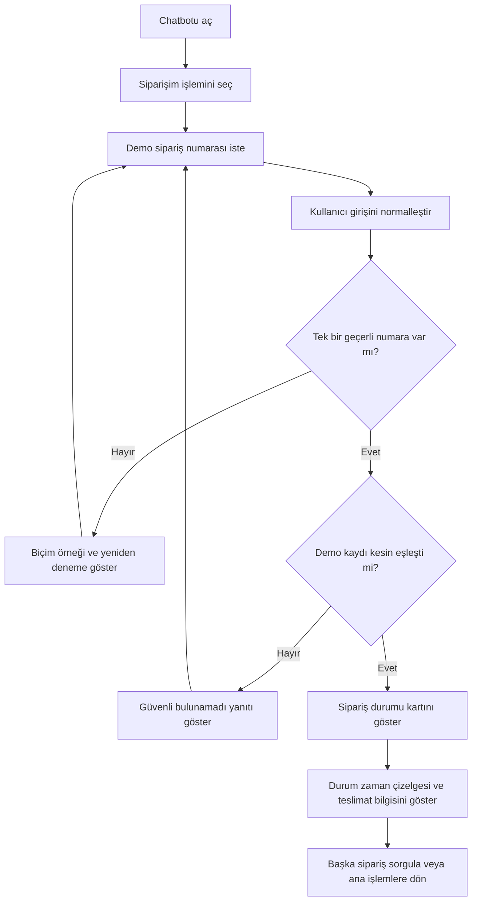

# 05 — Sipariş Durumu Sorgulama Akışı

> **Proje:** Merinos Chatbot Demo Localhost  
> **Görev türü:** Cursor uygulama görevi  
> **Ön koşullar:** `00`, `01`, `02`, `03` ve `04` numaralı görevler tamamlanmış olmalıdır.  
> **Kapsam:** Yalnızca sipariş durumu sorgulama deneyimi  
> **Sonraki görev:** `06-BAYI-BULMA-VE-HARITA-AKISI.md`

---

## 1. Görevin amacı

Bu görevin amacı, Merinos localhost demosundaki sipariş sorgulama akışını;

- açık bir sipariş numarası isteme adımı,
- güvenli ve deterministik numara normalizasyonu,
- kesin kayıt eşleştirmesi,
- anlaşılır sipariş durumu özeti,
- erişilebilir durum zaman çizelgesi,
- tahmini teslimat ve maskelenmiş takip bilgisi,
- hatalı giriş ve bulunamayan kayıt davranışı,
- kişisel veri ve yetkilendirme sınırları,
- ileride gerçek sipariş servisine taşınabilecek bir servis arayüzü

ile test edilebilir ve sürdürülebilir hâle getirmektir.

Bu görev tamamlandığında kullanıcı:

1. “Siparişim” hızlı işlemini seçebilmeli,
2. örnek sipariş numarasını yazabilmeli veya demo seçeneklerinden seçebilmeli,
3. küçük/büyük harf ve güvenli ayraç farklılıklarıyla yazılan numarayı kullanabilmeli,
4. geçerli demo kaydının durumunu zaman çizelgesi üzerinde görebilmeli,
5. hatalı biçimde yazdığı numarayı nasıl düzelteceğini anlayabilmeli,
6. kayıt bulunamadığında başka bir müşteriye veya siparişe ait veri görmemeli,
7. sonuçtan sonra başka bir sipariş sorgulayabilmelidir.

Bu adımda gerçek müşteri hesabı, SMS/e-posta doğrulaması, ERP/OMS, kargo firması API'si, ödeme bilgisi, fatura, adres, iade başlatma veya gerçek sipariş verisi bağlanmayacaktır.

---

## 2. Başlamadan önce okunacak dosyalar

Cursor, herhangi bir değişiklik yapmadan önce aşağıdaki dosyaları incelemelidir:

```text
cursor-tasks/00-PROJE-ANAYASASI.md
cursor-tasks/01-REPO-VE-GELISTIRME-TEMELI.md
cursor-tasks/02-MERINOS-DEMO-SITESI-VE-TASARIM-SISTEMI.md
cursor-tasks/03-CHATBOT-WIDGET-VE-KONUSMA-DENEYIMI.md
cursor-tasks/04-URUN-ARAMA-VE-FILTRELEME-AKISI.md
lib/demo-data.ts
lib/types.ts
lib/chatbot/engine.ts
components/Chatbot.tsx
app/globals.css
docs/02-KULLANICI-AKISLARI.md
docs/04-API-SOZLESMELERI.md
docs/05-TEST-SENARYOLARI.md
```

Ayrıca değişiklikten önce mevcut komut sonuçları kaydedilmelidir:

```bash
npm test
npm run lint
npm run build
```

Backend bağımlılıkları kurulmuşsa:

```bash
cd backend
python -m pytest
```

Bir komut ortam veya bağımlılık eksikliği nedeniyle çalışmıyorsa hata gizlenmemeli; tamamlanma raporunda komut, hata ve neden açıkça yazılmalıdır.

---

## 3. Mevcut demo verisi ve korunacak sözleşmeler

### 3.1. Demo sipariş kaynağı

Sipariş kayıtları şu aşamada yalnızca aşağıdaki yerel dosyadan gelmektedir:

```text
lib/demo-data.ts
```

Mevcut demo numaraları:

```text
MRN-2026-1042
MRN-2026-2048
```

Bu kayıtlar gerçek müşteri veya gerçek sipariş verisi değildir. Uygulamanın görünen metinlerinde bu nitelik korunmalıdır.

### 3.2. Korunacak public sözleşmeler

Aşağıdaki dış sözleşmeler korunmalıdır:

```ts
resolveChatInput(query: string, activeIntent: ChatIntent): ChatReply
```

```ts
export type ChatIntent = "product" | "order" | "dealer" | "faq" | null;
```

```ts
export type DemoOrder = {
  number: string;
  status: string;
  summary: string;
  estimatedDate: string;
  cargoCode?: string;
  steps: OrderStep[];
};
```

```ts
export type OrderStepState = "done" | "current" | "next";
```

`DemoOrder` tipi yalnızca gerçek ihtiyaç varsa geriye uyumlu biçimde genişletilebilir. Mevcut alanlar kaldırılmamalı veya anlamları değiştirilmemelidir.

### 3.3. Korunacak davranışlar

Aşağıdaki davranışlar devam etmelidir:

- “Siparişim” hızlı işlemi sipariş akışını açar.
- `MRN-2026-1042` sorgusu “Kargoya verildi” sonucunu gösterir.
- `MRN-2026-2048` sorgusu “Hazırlanıyor” sonucunu gösterir.
- `MRN-2026-9999` için güvenli bulunamadı mesajı gösterilir.
- Başarılı sonuçta durum zaman çizelgesi görünür.
- Kullanıcı “Başka sipariş” işlemiyle yeniden sorguya dönebilir.
- Ürün, bayi ve SSS akışları bozulmaz.

### 3.4. Refactor serbestisi

Siparişe ait kod aşağıdaki gibi ayrı modüllere taşınabilir:

```text
lib/chatbot/order/
├── constants.ts
├── normalize-order-number.ts
├── order-service.ts
├── order-reply.ts
└── order.types.ts
```

Bu dizilim zorunlu değildir. Ancak:

- sipariş numarası ayrıştırma,
- kayıt bulma,
- yanıt üretme,
- UI render etme

sorumlulukları mümkün olduğunca birbirinden ayrılmalıdır.

---

## 4. Kapsam sınırı

### 4.1. Bu görevde yapılacaklar

- Sipariş akışına giriş
- Sipariş numarası isteme
- Kanonik sipariş numarası biçimi
- Güvenli numara normalizasyonu
- Biçim doğrulama
- Tek sipariş numarası kuralı
- Kesin kayıt eşleştirmesi
- Demo sipariş veri erişim katmanı
- Yükleniyor, başarı, biçim hatası ve bulunamadı durumları
- Sipariş durum kartı
- Erişilebilir zaman çizelgesi
- Tahmini teslimat gösterimi
- Takip kodunun maskelenmesi
- Başka sipariş sorgulama davranışı
- Hatalı deneme ve kötüye kullanım hazırlığı
- Gizlilik ve log maskeleme kuralları
- Unit, UI ve regresyon testleri
- Sipariş akışı dokümantasyonu

### 4.2. Bu görevde yapılmayacaklar

- Gerçek sipariş API entegrasyonu
- Gerçek müşteri hesabı veya giriş sistemi
- SMS, e-posta veya tek kullanımlık kod doğrulaması
- Telefon, e-posta, T.C. kimlik numarası veya adres isteme
- Gerçek kargo takip bağlantısı
- Kargo firması API'si
- Sipariş iptali
- İade veya değişim başlatma
- Teslimat adresi değiştirme
- Fatura görüntüleme
- Ödeme veya kart bilgisi
- Sipariş kalemleri ve fiyat toplamı
- Canlı temsilciye gerçek aktarım
- Redis session state
- LangGraph worker implementasyonu
- Chatwoot veya Frappe Helpdesk entegrasyonu
- ERP, OMS, CRM veya e-ticaret altyapısı bağlantısı
- Ürün arama davranışında değişiklik
- Bayi arama davranışında değişiklik
- SSS davranışında değişiklik

Bu sınırların dışına çıkılmamalıdır.

---

## 5. Sipariş sorgulama kullanıcı hikâyeleri

### US-05-01 — Sipariş akışını başlatma

**Kullanıcı olarak**, “Siparişim” işlemini seçerek sipariş numaramı gireceğim açık bir adıma geçmek istiyorum.

Beklenen yanıt:

```text
Demo sipariş numaranızı yazın. Bu prototip gerçek müşteri hesabına veya sipariş sistemine bağlı değildir.
```

Demo seçenekleri:

```text
MRN-2026-1042
MRN-2026-2048
```

### US-05-02 — Geçerli sipariş sorgusu

**Kullanıcı olarak**, geçerli demo sipariş numarasını yazarak güncel demo durumunu görmek istiyorum.

Örnek:

```text
MRN-2026-1042
```

Beklenen:

- sipariş numarası,
- “Kargoya verildi” durumu,
- kısa açıklama,
- zaman çizelgesi,
- tahmini teslimat,
- varsa maskelenmiş demo takip kodu

gösterilir.

### US-05-03 — Güvenli biçim normalizasyonu

**Kullanıcı olarak**, sipariş numarasını küçük harfle veya boşluklarla yazdığımda sistemin güvenli biçimde kanonik formata çevirmesini istiyorum.

Kabul edilebilir örnekler:

```text
mrn-2026-1042
MRN 2026 1042
mrn 2026 1042
```

Kanonik sonuç:

```text
MRN-2026-1042
```

### US-05-04 — Hatalı biçim

**Kullanıcı olarak**, sipariş numarasını eksik veya yanlış biçimde yazdığımda doğru örneği görmek istiyorum.

Örnekler:

```text
1042
MRN-1042
MRN-2026
sipariş 1042
```

Beklenen:

- sistem numara tahmini yapmaz,
- başka kaydı eşleştirmez,
- kanonik biçimi gösterir,
- yeniden giriş imkânı sunar.

### US-05-05 — Bulunamayan kayıt

**Kullanıcı olarak**, biçimi geçerli fakat demo veri setinde olmayan bir numara yazdığımda güvenli bir yanıt almak istiyorum.

Örnek:

```text
MRN-2026-9999
```

Beklenen:

- hiçbir başka sipariş gösterilmez,
- benzer numara önerilmez,
- canlı sistemde kayıt var/yok ayrımının yetkilendirme olmadan açıklanmayacağı belirtilir,
- demo kullanım için örnek numaralar yeniden sunulabilir.

### US-05-06 — Başka sipariş sorgulama

**Kullanıcı olarak**, sonucu gördükten sonra yeni bir sipariş numarasıyla tekrar sorgu yapabilmek istiyorum.

Beklenen işlem:

```text
Başka sipariş sorgula
```

Bu işlem sipariş numarası isteme adımına döner.

---

## 6. Temel kullanıcı akışı



Akış hiçbir noktada:

- kısmi numarayla kayıt seçmemeli,
- en yakın numarayı tahmin etmemeli,
- yetkisiz gerçek sipariş verisi göstermemeli,
- kullanıcıdan gerçek kişisel veri istememelidir.

---

## 7. Sipariş konuşma durum modeli

Mevcut public `ChatIntent` tipi korunmalıdır. Gerekirse sipariş akışına özel iç durum kullanılabilir:

```ts
type OrderFlowStage =
  | "awaiting_order_number"
  | "validating_order_number"
  | "showing_order"
  | "format_error"
  | "not_found";
```

Bu tip örnektir; adlandırma değişebilir.

Kurallar:

- `ChatIntent = "order"`, kullanıcının sipariş bağlamında olduğunu gösterir.
- Sipariş alt durumu public intent union'ına gereksiz yeni değerler eklememelidir.
- Başarılı sonuçtan sonra `nextIntent` mevcut davranışla uyumlu biçimde `null` olabilir.
- “Başka sipariş sorgula” eylemi yeniden `order` intent'ini başlatmalıdır.
- Kullanıcı açıkça başka bir ana işlev isterse intent değişimine izin verilmelidir.

---

## 8. Hedef kod organizasyonu

Önerilen sorumluluk ayrımı:

```text
lib/chatbot/order/normalize-order-number.ts
```

- kullanıcı girişini kanonik biçime dönüştürür,
- geçerli/geçersiz sonucu döndürür,
- veri kaynağına erişmez.

```text
lib/chatbot/order/order-service.ts
```

- demo siparişleri kesin numarayla arar,
- UI metni üretmez,
- ileride gerçek API adaptörüne dönüşebilir.

```text
lib/chatbot/order/order-reply.ts
```

- akışa uygun chatbot yanıtını üretir,
- demo açıklamasını ve eylemleri ekler.

```text
components/chatbot/OrderStatusCard.tsx
```

- sipariş kartını erişilebilir biçimde render eder,
- kayıt arama veya iş kuralı içermez.

Klasör adları mevcut proje refactor'ına göre uyarlanabilir. Tek zorunluluk sorumlulukların ayrılmasıdır.

---

## 9. Sipariş numarası sözleşmesi

### 9.1. Kanonik biçim

Demo sipariş numarası biçimi:

```text
MRN-YYYY-NNNN
```

Bu veri seti için örnek:

```text
MRN-2026-1042
```

Önerilen kanonik doğrulama ifadesi:

```ts
/^MRN-\d{4}-\d{4}$/
```

Bu regex yalnızca biçimi kontrol eder. Kayıt varlığını doğrulamaz.

### 9.2. Kesin uzunluk ve bölüm kuralları

- `MRN` sabit önektir.
- Yıl bölümü tam dört rakamdır.
- Sıra bölümü tam dört rakamdır.
- Kanonik ayraç tire işaretidir.
- Başında veya sonunda başka alfanümerik karakter bulunmamalıdır.

### 9.3. Yıl doğrulaması

Bu görevde yılın güncel yıl olup olmadığını ayrıca doğrulamak zorunlu değildir. Biçimi geçerli bir numara kayıt katmanına gönderilebilir.

Aşağıdaki numara biçimsel olarak geçerli olabilir fakat demo kaydı bulunmayabilir:

```text
MRN-2025-1042
```

Sistem bunu var olan 2026 kaydına düzeltmemelidir.

---

## 10. Güvenli normalizasyon

### 10.1. İzin verilen dönüşümler

Aşağıdaki dönüşümler güvenli kabul edilir:

- baştaki ve sondaki boşlukları kaldırma,
- harfleri büyük forma dönüştürme,
- bölüm aralarındaki bir veya daha fazla boşluğu tireye dönüştürme,
- ASCII dışı benzer tire karakterlerini standart tireye dönüştürme,
- yalnızca tam yapıya uyuyorsa bitişik formu kanonik biçime ayırma.

Örnek:

```text
 mrn 2026 1042  -> MRN-2026-1042
```

Bitişik form desteklenecekse yalnızca tam yapı kabul edilmelidir:

```text
MRN20261042 -> MRN-2026-1042
```

### 10.2. Yasak dönüşümler

Aşağıdaki işlemler yapılmamalıdır:

- eksik rakam eklemek,
- fazla rakam silmek,
- yıl tahmin etmek,
- sadece son dört rakamdan sipariş bulmak,
- Levenshtein/fuzzy eşleşme yapmak,
- `O` harfini otomatik olarak `0` rakamına çevirmek,
- başka siparişe en yakın numarayı önermek,
- metindeki ilk rastgele sayı grubunu sipariş kabul etmek.

### 10.3. Önerilen dönüş tipi

```ts
type OrderNumberParseResult =
  | {
      ok: true;
      canonical: string;
      raw: string;
    }
  | {
      ok: false;
      reason: "missing" | "invalid_format" | "multiple_numbers";
      raw: string;
    };
```

Adlar değişebilir; ayırt edilebilir sonuç zorunludur.

---

## 11. Tek sipariş numarası kuralı

Bir mesajda birden fazla geçerli sipariş numarası bulunursa sistem rastgele birini seçmemelidir.

Örnek:

```text
MRN-2026-1042 ve MRN-2026-2048
```

Beklenen yanıt:

```text
Aynı anda yalnızca bir demo siparişini gösterebilirim. Lütfen numaralardan birini seçin.
```

Eylem olarak iki numaranın ayrı düğmeleri gösterilebilir; ancak kayıt bilgisi kullanıcı seçiminden önce açılmamalıdır.

---

## 12. Sipariş numarası çıkarma önceliği

Sipariş intent'i aktifken giriş şu sırayla ele alınmalıdır:

1. Mesajda kaç geçerli veya normalize edilebilir sipariş numarası olduğunu belirle.
2. Birden fazlaysa seçim iste.
3. Bir taneyse kanonik biçime dönüştür.
4. Hiç yoksa biçim hatası veya numara isteme yanıtı üret.
5. Kanonik numarayı kesin kayıt aramasına gönder.

Sipariş intent'i aktif değilken mesajda kanonik sipariş numarası varsa mevcut `detectIntent` davranışı sipariş intent'ini seçmeye devam etmelidir.

---

## 13. Kesin kayıt eşleştirmesi

Sipariş araması aşağıdaki mantıkla çalışmalıdır:

```ts
orders.find((order) => order.number === canonicalOrderNumber)
```

Eşleştirme öncesinde hem veri kaynağındaki numaraların hem kullanıcının girişinin kanonik olduğu varsayılabilir veya geliştirme zamanında assert edilebilir.

Aşağıdakiler yasaktır:

```ts
order.number.includes(input)
order.number.endsWith(lastFourDigits)
closestOrderNumber(input)
fuzzyMatch(input, order.number)
```

Amaç yanlış sipariş gösterme riskini sıfıra yaklaştırmaktır.

---

## 14. Sipariş veri erişim katmanı

Demo veri erişimi UI'dan ayrılmalıdır.

Önerilen arayüz:

```ts
export interface OrderStatusService {
  getByNumber(orderNumber: string): Promise<DemoOrder | null>;
}
```

Mevcut `resolveChatInput` senkron sözleşmesini bu adımda korumak gerekiyorsa senkron bir demo adaptörü kullanılabilir:

```ts
export interface DemoOrderStatusService {
  getByNumber(orderNumber: string): DemoOrder | null;
}
```

Bu görevde zorunlu olan:

- UI bileşeninin doğrudan `orders.find(...)` yapmaması,
- kayıt aramasının tek bir fonksiyonda bulunması,
- gerçek API entegrasyonunun bu fonksiyonun/adaptörün arkasına eklenebilir olmasıdır.

Bu görevde gerçek ağ isteği eklenmemelidir.

---

## 15. Sipariş akışına giriş yanıtı

Kullanıcı aşağıdakilerden birini yaptığında sipariş numarası istenmelidir:

```text
Siparişim
Siparişimi sorgula
Kargom nerede?
Sipariş durumuna bak
```

Önerilen yanıt:

```text
Demo sipariş numaranızı yazın. Örnek biçim: MRN-2026-1042. Bu prototip gerçek müşteri hesabına veya sipariş sistemine bağlı değildir.
```

Eylemler:

```text
MRN-2026-1042
MRN-2026-2048
```

Metin:

- gerçek doğrulama yapıldığını söylememeli,
- gerçek sipariş gösterdiği izlenimi vermemeli,
- telefon veya e-posta istememelidir.

---

## 16. Biçim hatası davranışı

Numara eksik veya biçimsel olarak geçersizse yanıt kısa ve düzeltici olmalıdır.

Önerilen yanıt:

```text
Sipariş numarası biçimini doğrulayamadım. Lütfen MRN-2026-1042 biçiminde tam demo numarasını yazın.
```

Kurallar:

- Kullanıcının yazdığı tüm metni gereksiz yere tekrar etme.
- Giriş içinde kişisel bilgi varsa yanıta yansıtma.
- En yakın numarayı tahmin etme.
- Hata metninde teknik regex gösterme.
- Demo numaralarını yeniden seçilebilir sun.
- `nextIntent` sipariş bağlamında kalmalıdır.

---

## 17. Bulunamayan kayıt davranışı

Biçim geçerli fakat demo kayıt yoksa:

```text
Bu numara için görüntülenebilir bir demo sipariş kaydı bulunamadı. Deneme için aşağıdaki örnek numaralardan birini seçebilirsiniz.
```

Bu yerel demo metni kullanılabilir. Ancak kod ve dokümantasyon canlı sürümde şu güvenlik ilkesini açıkça korumalıdır:

> Yetkilendirme yapılmadan “sipariş yok” ve “sipariş var ama bu kullanıcıya ait değil” durumları dışarıdan ayırt edilemez olmalıdır.

Canlı API için güvenli genel yanıt örneği:

```text
Bu bilgilerle görüntülenebilir bir sipariş bulunamadı.
```

Yasak davranışlar:

- başka bir sipariş göstermek,
- aynı son dört haneye sahip kaydı önermek,
- “Bu sipariş başka kullanıcıya ait” demek,
- kayıt sahibine dair ipucu vermek,
- sipariş tutarı, ürün veya adres açıklamak.

---

## 18. Başarılı sonuç yanıtı

Başarılı sorguda bot mesajı kısa olmalıdır:

```text
MRN-2026-1042 numaralı demo siparişin son durumu: Kargoya verildi.
```

Ardından `OrderStatusCard` gösterilmelidir.

Mesaj ve kart:

- aynı bilgiyi aşırı tekrar etmemeli,
- “güncel” veya “canlı” gibi gerçek zamanlılık iddiası taşımamalı,
- bunun demo kayıt olduğunu görünür biçimde belirtmelidir.

Başarılı sonuçtan sonra en az şu işlem bulunmalıdır:

```text
Başka sipariş sorgula
```

İsteğe bağlı ikinci işlem:

```text
Ana işlemlere dön
```

---

## 19. Sipariş durum kartı gereksinimleri

Kart en az aşağıdaki alanları göstermelidir:

- “Demo sipariş” etiketi,
- kanonik sipariş numarası,
- mevcut durum,
- kısa durum açıklaması,
- durum zaman çizelgesi,
- tahmini teslimat,
- varsa maskelenmiş takip kodu.

Kart aşağıdakileri göstermemelidir:

- müşteri adı,
- telefon,
- e-posta,
- açık adres,
- ödeme bilgisi,
- sipariş toplamı,
- gerçek kargo firması bağlantısı,
- gerçek müşteri verisi izlenimi.

---

## 20. Durum zaman çizelgesi

### 20.1. Semantik yapı

Zaman çizelgesi dekoratif `div` yığını yerine tercihen sıralı liste olarak render edilmelidir:

```html
<ol aria-label="Sipariş durum adımları">
  <li>...</li>
</ol>
```

Her adımda:

- durum başlığı,
- açıklama veya zaman,
- tamamlandı/mevcut/sırada bilgisi

metin olarak bulunmalıdır.

### 20.2. Renk dışı durum göstergesi

Durum yalnızca renk veya nokta ile anlatılmamalıdır.

Erişilebilir metin karşılıkları:

```text
Tamamlandı
Mevcut adım
Sıradaki adım
```

Mevcut adımda semantik olarak şu kullanılabilir:

```html
<li aria-current="step">
```

### 20.3. Adım sırası

`steps` dizisindeki veri sırası korunmalıdır. UI adımları durumlarına göre yeniden sıralamamalıdır.

### 20.4. Veri tutarlılığı

Her siparişte:

- en fazla bir `current` adımı olmalı,
- `done` adımları `current` adımdan önce gelmeli,
- `next` adımları `current` adımdan sonra gelmelidir.

Bu kurallar test veya geliştirme zamanı doğrulamasıyla korunmalıdır.

---

## 21. Tahmini teslimat bilgisi

Tahmini teslimat:

- demo verisinden okunmalı,
- kullanıcıya garanti olarak sunulmamalı,
- “Tahmini teslimat” etiketiyle gösterilmelidir.

Yanlış:

```text
Siparişiniz 25 Temmuz'da kesin teslim edilecek.
```

Doğru:

```text
Tahmini teslimat: 25 Temmuz 2026
```

Bu görevde tarih hesaplama veya kargo gecikmesi tahmini yapılmayacaktır.

---

## 22. Takip kodu maskeleme

Mevcut demo `cargoCode` değeri UI'da tam gösterilmemelidir. Bu davranış gerçek sisteme hazırlık amacıyla maskelenmelidir.

Örnek giriş:

```text
DEMO-784512
```

Örnek görünüm:

```text
DEMO-78***
```

Maskeleme:

- render katmanında veya ayrı bir güvenli formatter'da yapılabilir,
- orijinal değeri DOM içinde gizli metin, `title`, `data-*`, `aria-label` veya log olarak bırakmamalıdır,
- “kopyala” düğmesi eklememelidir,
- gerçek takip bağlantısı oluşturmamalıdır.

İsteğe bağlı olarak veri modeline yalnızca maskelenmiş demo değer konabilir; ancak mevcut tip sözleşmesi gereksiz yere kırılmamalıdır.

---

## 23. Durum metni ve veri kaynağı

Durum metinleri yalnızca `DemoOrder` verisinden gelmelidir.

Sistem:

- sipariş numarasından durum tahmin etmemeli,
- tarihe bakarak otomatik durum değiştirmemeli,
- kargo kodu varsa “kargoda” varsaymamalı,
- eksik alanı uydurmamalıdır.

Eksik veri varsa alan gösterilmeyebilir. Yerine sahte değer yazılmamalıdır.

---

## 24. Intent çakışmaları

### 24.1. Sipariş numarası güçlü sinyalidir

Mesajda geçerli `MRN-YYYY-NNNN` yapısı varsa sipariş intent'i öncelikli olabilir.

Örnek:

```text
MRN-2026-1042 kargom nerede?
```

### 24.2. SSS çakışması

Aşağıdaki genel soru sipariş sorgusundan ziyade SSS olabilir:

```text
Kargo süreci nasıl işler?
Teslimat kaç gün sürer?
```

Ancak aktif intent `order` ise ve kullanıcı sipariş numarası girme aşamasındaysa, numara içermeyen genel soru için:

- kısa bir yönlendirme yapılabilir,
- veya kullanıcıdan sipariş numarası yeniden istenebilir.

Mevcut intent öncelik düzeni test edilerek ürün/bayi/SSS regresyonu engellenmelidir.

### 24.3. Açık intent değiştirme

Kullanıcı sipariş akışındayken açıkça:

```text
Bayi bul
Ürün arıyorum
İade süreci nasıl?
```

derse ilgili ana intent'e geçebilmelidir.

---

## 25. Hatalı deneme ve kötüye kullanım hazırlığı

Localhost demo gerçek bir güvenlik sınırı değildir. Yine de akış canlı sisteme taşınabilir biçimde tasarlanmalıdır.

### 25.1. İstemci tarafı sayaç güvenlik değildir

İstemci üzerinde hata sayacı eklenirse yalnızca UX amaçlıdır. Yetkisiz erişimi engellediği iddia edilmemelidir.

### 25.2. Canlı sürüm gereksinimleri

Dokümantasyonda aşağıdakiler belirtilmelidir:

- API gateway oran sınırı,
- oturum veya müşteri kimliği doğrulaması,
- sipariş sahipliği kontrolü,
- başarısız deneme ölçümü,
- güvenli genel hata,
- anomali ve kötüye kullanım alarmı.

### 25.3. Demo davranışı

Bu görevde kullanıcı art arda hatalı numara girerse akış kilitlenmek zorunda değildir. Ancak mesajlar veri enumerasyonunu kolaylaştırmamalıdır.

---

## 26. Kimlik doğrulama ve yetkilendirme sınırı

### 26.1. Localhost demo

Localhost sürümünde:

- yalnızca sabit demo kayıtlar vardır,
- gerçek oturum sahipliği kontrolü yoktur,
- hiçbir gerçek kullanıcı verisi yoktur,
- ekran açıkça demo olduğunu belirtir.

### 26.2. Canlı sürüm

Gerçek sipariş bilgisi gösterilmeden önce en az biri zorunlu olacaktır:

- doğrulanmış müşteri oturumu,
- sipariş sahipliğiyle ilişkili güvenli doğrulama,
- yetkili destek temsilcisi bağlamı.

Bu görev canlı doğrulamayı uygulamayacaktır; yalnızca adaptör ve dokümantasyon sınırını koruyacaktır.

### 26.3. Sipariş numarası tek başına yetki değildir

Aşağıdaki ilke kod yorumunda veya dokümantasyonda açık olmalıdır:

> Gerçek sistemde sipariş numarasını bilmek, sipariş ayrıntılarına erişim yetkisi sağlamaz.

---

## 27. KVKK ve kişisel veri kuralları

### 27.1. Bu görevde istenmeyecek veriler

Chatbot sipariş sorgulamak için kullanıcıdan şunları istememelidir:

- ad-soyad,
- T.C. kimlik numarası,
- telefon numarası,
- e-posta adresi,
- ev veya teslimat adresi,
- kart numarası,
- ödeme bilgisi.

### 27.2. Kullanıcı gönüllü olarak yazarsa

Kullanıcı mesajına kişisel veri yazarsa:

- bot bunu sipariş sorgusunun parçası olarak kullanmamalı,
- yanıtta tekrar etmemeli,
- gerçek loglarda maskeleme gerektirdiği dokümante edilmelidir.

### 27.3. Veri minimizasyonu

Sipariş kartı yalnızca akış için gereken demo alanlarını göstermelidir. Gereksiz alan eklenmemelidir.

---

## 28. Loglama ve gözlemlenebilirlik hazırlığı

Bu adımda gerçek analitik servisi eklenmeyebilir. Ancak event sözleşmesi hazırlanabilir.

İzin verilen örnek event'ler:

```text
order_flow_started
order_number_format_invalid
order_lookup_demo_success
order_lookup_demo_not_found
order_lookup_multiple_numbers
order_flow_restarted
```

Event özellikleri:

```ts
type OrderAnalyticsEvent = {
  name: string;
  sessionId?: string;
  outcome?: "success" | "invalid" | "not_found";
  durationMs?: number;
};
```

Sipariş numarası event payload'ına düz metin olarak yazılmamalıdır.

Gerekirse yalnızca geri döndürülemez, anahtarlı sunucu tarafı korelasyon değeri kullanılabilir. Bu görevde böyle bir hashing altyapısı eklemek zorunlu değildir.

Yasak log örneği:

```ts
console.log("Order lookup", canonicalOrderNumber, userMessage);
```

---

## 29. Hata durumları

Sipariş akışı şu hata sınıflarını ayırt edebilmelidir:

| Durum | Kullanıcı mesajı yaklaşımı | Intent |
|---|---|---|
| Numara yok | Tam numara iste | `order` |
| Biçim geçersiz | Kanonik örnek göster | `order` |
| Birden fazla numara | Tek numara seçtir | `order` |
| Demo kayıt bulunamadı | Güvenli genel yanıt ve demo seçenekleri | `order` |
| Beklenmeyen yerel hata | Bilgiye ulaşılamadığını söyle | `order` veya güvenli dönüş |
| Başarı | Kartı göster | `null` veya mevcut sözleşmeyle uyumlu |

Beklenmeyen hatada teknik stack trace kullanıcıya gösterilmemelidir.

Örnek:

```text
Demo sipariş bilgisine şu anda ulaşılamıyor. Biraz sonra yeniden deneyebilir veya ana işlemlere dönebilirsiniz.
```

Bu metin gerçek zamanlı yeniden deneme sözü vermemeli; yalnızca kullanıcı seçeneği sunmalıdır.

---

## 30. Yükleniyor ve tekrar gönderme davranışı

`03-CHATBOT-WIDGET-VE-KONUSMA-DENEYIMI.md` içinde tanımlanan genel gönderim kuralları korunmalıdır.

Sipariş sorgusunda:

- yanıt hazırlanırken composer tekrar gönderimi engelleyebilir,
- aynı numaranın çift tıklamayla iki kez işlenmesi önlenmelidir,
- loading mesajı sipariş numarasını tekrar etmemelidir,
- sonuç geldiğinde loading durumu temizlenmelidir,
- hata oluşursa yeniden deneme eylemi aynı gizlilik kurallarına uymalıdır.

Bu görevde gerçek ağ isteği yoksa yapay uzun bekleme eklenmemelidir. Var olan demo gecikmesi korunabilir veya test edilebilir hâle getirilebilir.

---

## 31. Erişilebilirlik gereksinimleri

### 31.1. Kart etiketi

Kartın erişilebilir adı siparişin demo olduğunu belirtmelidir:

```html
<section aria-label="MRN-2026-1042 numaralı demo sipariş durumu">
```

### 31.2. Durum duyurusu

Yeni sipariş sonucu geldiğinde genel mesaj canlı bölgede duyurulabilir. Tüm zaman çizelgesi tekrar tekrar `aria-live` içinde okunmamalıdır.

### 31.3. Zaman çizelgesi

- Sıralı liste semantiği kullanılmalıdır.
- Mevcut adım `aria-current="step"` ile işaretlenmelidir.
- Görsel durum ikonları `aria-hidden="true"` olabilir.
- “Tamamlandı”, “Mevcut adım”, “Sırada” metinleri ekran okuyucuya erişmelidir.

### 31.4. Renk ve kontrast

- Durum yalnızca renk ile anlatılmamalıdır.
- Metin ve arka plan kontrastı `02` tasarım sistemi kurallarına uymalıdır.
- Focus göstergeleri görünür olmalıdır.

### 31.5. Eylemler

“Başka sipariş sorgula” gerçek bir `<button type="button">` olmalıdır. Boş link veya tıklanabilir `div` kullanılmamalıdır.

---

## 32. Responsive gereksinimler

Sipariş kartı:

- 320 px genişlikte yatay taşmamalı,
- sipariş numarasını okunamaz biçimde bölmemeli,
- uzun durum metinlerini sarmalı,
- zaman çizelgesini tek sütunda korumalı,
- tahmini teslimat ve takip kodu alanlarını dar ekranda alt alta getirmeli,
- mobil klavye açıkken composer ile çakışmamalıdır.

`word-break: break-all` ile sipariş numarasını anlamsız parçalara ayırmak yerine uygun `overflow-wrap` ve düzen kullanılmalıdır.

---

## 33. Görsel ve metinsel durum dili

Önerilen durum etiketleri mevcut demo verisiyle sınırlıdır:

```text
Sipariş alındı
Hazırlandı
Hazırlanıyor
Kargoya verildi
Kargo
Teslimat
```

Bu görevde yeni sipariş durum sözlüğü uydurulmamalıdır.

Kartta:

- `done` = “Tamamlandı”,
- `current` = “Mevcut adım”,
- `next` = “Sıradaki adım”

metinsel karşılığı bulunmalıdır.

---

## 34. Demo veri bütünlüğü

`orders` verisi için en az şu kontroller eklenmelidir:

- tüm sipariş numaraları benzersizdir,
- tüm numaralar kanonik biçime uyar,
- `status` boş değildir,
- `summary` boş değildir,
- `estimatedDate` boş değildir,
- `steps` en az bir adım içerir,
- adım etiketleri boş değildir,
- en fazla bir `current` adım vardır,
- varsa `cargoCode` UI'da maskelenir.

Bu kontroller unit test veya veri doğrulama yardımcı fonksiyonuyla yapılabilir.

---

## 35. Dokümantasyon çıktısı

Görev kapsamında aşağıdaki dosya oluşturulmalı veya mevcut uygun doküman güncellenmelidir:

```text
docs/09-SIPARIS-SORGULAMA-AKISI.md
```

Doküman en az şunları içermelidir:

1. Localhost demo sınırı
2. Kanonik sipariş numarası biçimi
3. Normalizasyon ve kesin eşleşme kuralları
4. Kullanıcı akış diyagramı
5. Başarı ve hata durumları
6. Sipariş kartı alanları
7. Yetkilendirme ve sahiplik ilkesi
8. KVKK/veri minimizasyonu
9. Canlı API adaptörüne geçiş notu
10. Test senaryoları

Mevcut `docs/02-KULLANICI-AKISLARI.md`, `docs/04-API-SOZLESMELERI.md` veya `docs/05-TEST-SENARYOLARI.md` ile çelişki oluşursa bunlar küçük ve hedefli değişikliklerle uyumlu hâle getirilmelidir.

---

## 36. Önerilen canlı API sözleşmesi

Bu görev API'yi uygulamayacaktır. Ancak adaptör sınırı aşağıdaki kurallarla uyumlu olmalıdır:

```http
GET /api/v1/orders/{orderNumber}/status
```

Gerçek sistemde istek:

- doğrulanmış oturumla yapılmalı,
- sipariş sahipliği sunucu tarafında kontrol edilmeli,
- istemciden gelen kullanıcı kimliğine körü körüne güvenmemeli,
- gateway oran sınırına tabi olmalıdır.

Örnek güvenli yanıt:

```json
{
  "orderNumber": "MRN-2026-1042",
  "status": "SHIPPED",
  "estimatedDelivery": "2026-07-25",
  "shipment": {
    "carrier": "Demo Kargo",
    "trackingCodeMasked": "DEMO-78***"
  },
  "timeline": [
    { "code": "RECEIVED", "completedAt": "2026-07-22T10:14:00Z" },
    { "code": "PREPARED", "completedAt": "2026-07-22T18:40:00Z" },
    { "code": "SHIPPED", "completedAt": "2026-07-23T09:20:00Z" }
  ]
}
```

Gerçek API yanıtı doğrudan UI tipine bağlanmamalı; adapter ile `DemoOrder` veya gelecekteki view model'e dönüştürülmelidir.

---

## 37. Uygulama adımları

Cursor aşağıdaki sırayı izlemelidir.

### Adım 1 — Mevcut davranışı kaydet

- `replyForOrder` akışını incele.
- `OrderStatusCard` render'ını incele.
- Mevcut demo sipariş verisini doğrula.
- Ön testleri çalıştır ve sonuçları kaydet.

### Adım 2 — Sipariş numarası normalizasyonunu ayır

- Kanonik formatı tanımla.
- Güvenli dönüşümleri uygula.
- Geçersiz ve çoklu numara sonuçlarını ayırt et.
- Fuzzy eşleşme ekleme.

### Adım 3 — Veri erişimini ayır

- Sipariş aramasını tek bir servis/fonksiyona taşı.
- Kesin eşleşme kullan.
- UI'ın doğrudan demo veri dizisini aramasını engelle.

### Adım 4 — Yanıt üretimini iyileştir

- Numara isteme yanıtını güncelle.
- Biçim hatası yanıtını ekle.
- Çoklu numara yanıtını ekle.
- Güvenli bulunamadı yanıtını ekle.
- Başarılı yanıtı demo etiketiyle koru.

### Adım 5 — Sipariş kartını iyileştir

- Gerekirse ayrı bileşene taşı.
- Sıralı zaman çizelgesi oluştur.
- `aria-current="step"` ekle.
- Metinsel durum karşılıklarını ekle.
- Takip kodunu maskele.
- Mobil taşmayı düzelt.

### Adım 6 — Testleri ekle

- Normalizasyon unit testleri
- Format doğrulama testleri
- Kesin eşleşme testleri
- Çoklu numara testi
- Başarı/bulunamadı testleri
- Kart erişilebilirlik testi
- Ürün, bayi ve SSS regresyon testleri

### Adım 7 — Dokümantasyonu güncelle

- `docs/09-SIPARIS-SORGULAMA-AKISI.md` oluştur.
- API ve güvenlik sınırını yaz.
- Canlı sisteme geçiş notlarını ekle.

### Adım 8 — Kalite kapılarını çalıştır

```bash
npm test
npm run lint
npm run build
```

Backend etkilenmişse:

```bash
cd backend
python -m pytest
```

### Adım 9 — Değişiklik kapsamını kontrol et

- Bu görev dışındaki iş akışlarında değişiklik olmadığını doğrula.
- Yeni bağımlılık eklenip eklenmediğini raporla.
- Demo dışı veri veya gerçek API çağrısı eklenmediğini doğrula.

---

## 38. Zorunlu sorgu senaryoları

Aşağıdaki senaryolar otomatik veya güvenilir entegrasyon testiyle doğrulanmalıdır.

| No | Girdi | Beklenen |
|---:|---|---|
| 1 | `Siparişimi sorgula` | Numara ve demo açıklaması istenir |
| 2 | `MRN-2026-1042` | Kargoya verildi kartı gösterilir |
| 3 | `MRN-2026-2048` | Hazırlanıyor kartı gösterilir |
| 4 | `mrn-2026-1042` | Kanonik numarayla doğru kayıt gösterilir |
| 5 | `MRN 2026 1042` | Güvenli normalizasyon sonrası doğru kayıt gösterilir |
| 6 | ` MRN-2026-1042 ` | Baştaki/sondaki boşluklara rağmen doğru kayıt gösterilir |
| 7 | `MRN-2026-9999` | Başka sipariş göstermeden güvenli bulunamadı yanıtı |
| 8 | `1042` | Numara tahmini yapılmaz; biçim örneği gösterilir |
| 9 | `MRN-1042` | Biçim hatası gösterilir |
| 10 | `MRN-2026-104` | Eksik numara düzeltilmez; biçim hatası gösterilir |
| 11 | `MRN-2026-1042 ve MRN-2026-2048` | Tek numara seçmesi istenir |
| 12 | `MRN-2026-1043` | `1042` kaydına fuzzy eşleşme yapılmaz |
| 13 | `Başka sipariş sorgula` | Numara isteme adımına döner |
| 14 | Sipariş akışında `Bayi bul` | Bayi intent'ine geçer |
| 15 | Başarı kartı | Takip kodu maskeli görünür |
| 16 | Başarı kartı | Zaman çizelgesinde tek `aria-current="step"` vardır |
| 17 | Başarı kartı | Durum yalnızca renkle anlatılmaz |
| 18 | 320 px görünüm | Kart yatay taşmaz |

---

## 39. Unit test gereksinimleri

### 39.1. Normalizasyon testleri

En az:

```text
mrn-2026-1042 -> MRN-2026-1042
MRN 2026 1042 -> MRN-2026-1042
 MRN-2026-1042  -> MRN-2026-1042
```

Destekleniyorsa:

```text
MRN20261042 -> MRN-2026-1042
```

### 39.2. Geçersiz giriş testleri

En az:

```text
boş string
1042
MRN-1042
MRN-2026-104
MRN-2026-10422
ABC-2026-1042
```

### 39.3. Kesin eşleşme testleri

- `MRN-2026-1042` yalnızca ilgili kaydı döndürür.
- `MRN-2026-1043` hiçbir kayıt döndürmez.
- Son dört rakam eşleşmesi kullanılmaz.
- Büyük/küçük harf yalnızca normalizasyon aşamasında ele alınır.

### 39.4. Veri bütünlüğü testleri

- Sipariş numaraları benzersizdir.
- Tüm numaralar kanonik formattadır.
- Her siparişte en fazla bir mevcut adım vardır.
- En az bir zaman çizelgesi adımı vardır.

### 39.5. Yanıt üretimi testleri

- Genel sipariş isteği numara ister.
- Geçerli kayıt `message.order` döndürür.
- Geçersiz biçim `message.order` döndürmez.
- Bulunamayan kayıt `message.order` döndürmez.
- Başarı sonrası “Başka sipariş sorgula” eylemi bulunur.

---

## 40. UI ve entegrasyon testleri

En az aşağıdakiler doğrulanmalıdır:

- Hızlı işlem sipariş akışını açar.
- Demo numarası action düğmesi sorguyu gönderir.
- Sipariş kartında demo etiketi görünür.
- Kartta sipariş numarası ve durum görünür.
- Zaman çizelgesi sıralı ve okunabilirdir.
- Mevcut adım programatik olarak işaretlenir.
- Tahmini teslimat etiketi vardır.
- Takip kodunun tam değeri DOM metninde bulunmaz.
- “Başka sipariş sorgula” yeniden giriş akışını açar.
- Hatalı girişte hiçbir sipariş kartı görünmez.
- Ürün, bayi ve SSS hızlı işlemleri çalışmaya devam eder.
- Escape/focus/reset kuralları `03` belgesiyle uyumludur.

---

## 41. Güvenlik testleri

Bu demo gerçek yetkilendirme uygulamasa da aşağıdaki regresyonlar doğrulanmalıdır:

- Kısmi numara başka sipariş döndürmez.
- Fuzzy eşleşme yapılmaz.
- Birden fazla numarada otomatik seçim yapılmaz.
- Bulunamayan numara için başka kayda ait bilgi görünmez.
- Kullanıcı metni HTML olarak render edilmez.
- Tam takip kodu DOM içinde veya erişilebilir etikette görünmez.
- Sipariş numarası console log'a yazılmaz.
- Telefon/e-posta gibi ek veri istenmez.
- Kullanıcının yazdığı kişisel veri bot mesajında tekrar edilmez.

---

## 42. Kabul ölçütleri

Görev ancak aşağıdaki maddelerin tamamı sağlandığında tamamlanmış sayılır.

### 42.1. Akış

- [ ] “Siparişim” işlemi numara isteme adımını açıyor.
- [ ] Demo açıklaması görünür ve anlaşılır.
- [ ] İki demo numarası seçilebilir olarak sunuluyor.
- [ ] Başarıdan sonra başka sipariş sorgulanabiliyor.
- [ ] Kullanıcı açıkça başka intent'e geçebiliyor.

### 42.2. Numara işleme

- [ ] Kanonik biçim `MRN-YYYY-NNNN` olarak tanımlı.
- [ ] Büyük/küçük harf güvenli biçimde normalleştiriliyor.
- [ ] Boşluklu biçim güvenli biçimde normalleştiriliyor.
- [ ] Eksik numara tahmin edilmiyor.
- [ ] Fazla veya yanlış rakam otomatik düzeltilmiyor.
- [ ] Birden fazla numara otomatik seçilmiyor.
- [ ] Fuzzy veya kısmi eşleşme kullanılmıyor.

### 42.3. Kayıt ve yanıt

- [ ] `MRN-2026-1042` doğru demo kaydını gösteriyor.
- [ ] `MRN-2026-2048` doğru demo kaydını gösteriyor.
- [ ] Bulunamayan numara başka kayıt göstermiyor.
- [ ] Biçim hatası düzeltici ve güvenli yanıt veriyor.
- [ ] Başarılı mesaj demo niteliğini koruyor.
- [ ] Sipariş veri erişimi UI'dan ayrılmış.

### 42.4. Kart

- [ ] Demo sipariş etiketi var.
- [ ] Sipariş numarası ve durum görünür.
- [ ] Özet ve tahmini teslimat görünür.
- [ ] Zaman çizelgesi sıralı liste veya eşdeğer semantik yapıda.
- [ ] Mevcut adım `aria-current="step"` veya eşdeğeriyle işaretli.
- [ ] Durum yalnızca renkle anlatılmıyor.
- [ ] Takip kodu maskeli.
- [ ] Tam takip kodu DOM'da bulunmuyor.
- [ ] Kart 320 px genişlikte taşmıyor.

### 42.5. Gizlilik ve güvenlik

- [ ] Gerçek kişisel veri istenmiyor.
- [ ] Sipariş numarası tek başına canlı erişim yetkisi sayılmıyor.
- [ ] Canlı sürüm sahiplik doğrulaması dokümante edilmiş.
- [ ] Bulunamayan/yetkisiz ayrımı için güvenli hata ilkesi yazılmış.
- [ ] Sipariş numarası veya kullanıcı metni düz loglanmıyor.
- [ ] Veri minimizasyonu korunuyor.

### 42.6. Test ve dokümantasyon

- [ ] Zorunlu sorgu senaryoları test edilmiş.
- [ ] Normalizasyon unit testleri eklenmiş.
- [ ] Kesin eşleşme testleri eklenmiş.
- [ ] Veri bütünlüğü testleri eklenmiş.
- [ ] UI erişilebilirlik kontrolleri eklenmiş.
- [ ] Ürün, bayi ve SSS regresyonları geçiyor.
- [ ] `docs/09-SIPARIS-SORGULAMA-AKISI.md` oluşturulmuş veya eşdeğer doküman güncellenmiş.
- [ ] Lint, test ve build sonuçları raporlanmış.

---

## 43. Doğrulama komutları

Öncelikle proje kökünde:

```bash
npm test
npm run lint
npm run build
```

Test dosyaları ayrı çalıştırılabiliyorsa sipariş odaklı testler de çalıştırılmalıdır:

```bash
node --test tests/*order*.test.mjs
```

Proje test altyapısı TypeScript/React test runner ile genişletilmişse ilgili komut `package.json` üzerinden kullanılmalıdır. Yeni test komutu eklenirse Windows ve Unix ortamlarında çalışabilir olmalıdır.

Backend koduna dokunulmuşsa:

```bash
cd backend
python -m pytest
```

Kaynakta hızlı gizlilik kontrolü için uygun platform komutları kullanılabilir:

```bash
rg "console\.(log|debug).*order|cargoCode" .
```

Bu arama sonucu manuel incelenmeli; her `cargoCode` kullanımı hata sayılmamalı, yalnızca tam kodun kullanıcıya veya loga sızıp sızmadığı kontrol edilmelidir.

---

## 44. Manuel doğrulama listesi

### Masaüstü

- [ ] Chatbot açılıyor.
- [ ] “Siparişim” hızlı işlemi çalışıyor.
- [ ] İki demo numarası action olarak görünüyor.
- [ ] `MRN-2026-1042` doğru kartı gösteriyor.
- [ ] `MRN-2026-2048` doğru kartı gösteriyor.
- [ ] Takip kodu maskeli görünüyor.
- [ ] Zaman çizelgesi okunabilir.
- [ ] “Başka sipariş sorgula” çalışıyor.

### Klavye

- [ ] Hızlı işlem düğmesine Tab ile ulaşılabiliyor.
- [ ] Enter/Space ile seçim yapılabiliyor.
- [ ] Sonuç kartı focus sırasını bozmuyor.
- [ ] “Başka sipariş sorgula” düğmesine erişilebiliyor.
- [ ] Escape davranışı `03` görevindeki kurala uyuyor.

### Ekran okuyucu

- [ ] Kart demo sipariş olarak adlandırılıyor.
- [ ] Sipariş numarası ve durum anlaşılır okunuyor.
- [ ] Mevcut zaman çizelgesi adımı programatik olarak belirgin.
- [ ] Tamamlandı/mevcut/sıradaki bilgisi metin olarak okunuyor.
- [ ] Dekoratif ikonlar gereksiz duyurulmuyor.

### Mobil

- [ ] 320 px genişlikte yatay kayma yok.
- [ ] 390 px genişlikte kart rahat okunuyor.
- [ ] Uzun metinler taşmadan sarılıyor.
- [ ] Mobil klavye composer'ı kullanılamaz hâle getirmiyor.
- [ ] Durum alanları dar ekranda düzgün alt alta geliyor.

### Güvenli hata

- [ ] `1042` başka kayıt göstermiyor.
- [ ] `MRN-2026-1043` en yakın kaydı göstermiyor.
- [ ] İki numaralı mesaj otomatik seçim yapmıyor.
- [ ] Kullanıcıya teknik hata veya stack trace görünmüyor.

---

## 45. Bu adımda yasak olan değişiklikler

Cursor aşağıdaki değişiklikleri yapmamalıdır:

- Gerçek Merinos veya başka bir şirketin sipariş API'sine bağlanmak
- Gerçek müşteri verisi eklemek
- Telefon/e-posta/T.C. kimlik numarası istemek
- Sipariş numarasını yetkilendirme yerine kullanmak
- Kısmi veya fuzzy sipariş eşleştirmesi yapmak
- Başka siparişe ait veriyi öneri olarak göstermek
- Tam takip kodunu DOM'a veya loga yazmak
- Sahte kargo takip bağlantısı eklemek
- Sipariş iptal/iade/ödeme özelliği eklemek
- `resolveChatInput` public sözleşmesini kırmak
- `ChatIntent` union'ını gereksiz yere değiştirmek
- Ürün arama sıralamasını veya filtre semantiğini değiştirmek
- Bayi ve SSS iş kurallarını değiştirmek
- LangGraph, Redis, RAGFlow, Langflow, Chatwoot veya Frappe entegrasyonu yapmak
- Ağır veya gereksiz frontend bağımlılığı eklemek
- Testleri silmek veya zayıflatmak
- Kabul ölçütlerini karşılamadan görevi tamamlandı saymak

---

## 46. Tamamlanma raporu formatı

Cursor görev sonunda aşağıdaki yapıda rapor vermelidir:

```markdown
## Tamamlananlar

- ...

## Değişen dosyalar

- `...`

## Sipariş numarası sözleşmesi

- Kanonik biçim:
- İzin verilen normalizasyonlar:
- Reddedilen girişler:
- Kesin eşleşme yöntemi:

## Sipariş kartı

- Gösterilen alanlar:
- Takip kodu maskeleme yöntemi:
- Zaman çizelgesi semantiği:

## Korunan sözleşmeler

- `resolveChatInput`:
- `ChatIntent`:
- `DemoOrder`:
- Diğer intent'ler:

## Zorunlu senaryo sonuçları

- `MRN-2026-1042`:
- `MRN-2026-2048`:
- `MRN-2026-9999`:
- `1042`:
- Çoklu numara:

## Erişilebilirlik kontrolleri

- ...

## Gizlilik ve güvenlik

- ...

## Responsive kontroller

- ...

## Komut sonuçları

- `npm test`:
- `npm run lint`:
- `npm run build`:
- `python -m pytest` (uygunsa):

## Bağımlılık değişiklikleri

- Yeni bağımlılık var/yok:
- Gerekçe:

## Varsayımlar veya açık noktalar

- ...

## Sonraki adım

- `06-BAYI-BULMA-VE-HARITA-AKISI.md` uygulanmadı.
```

---

## 47. Durma kuralı

Bu görev tamamlandığında Cursor **durmalıdır**.

Cursor:

- `06-BAYI-BULMA-VE-HARITA-AKISI.md` görevine başlamamalı,
- gerçek sipariş servisi bağlamamalı,
- yetkilendirme sistemini bu adımda uygulamamalı,
- bayi veya SSS akışını geliştirmemeli,
- kullanıcıdan yeni görev beklemelidir.

Görev; kod, test, dokümantasyon ve kabul ölçütleri birlikte tamamlanmadan bitmiş sayılmaz.
