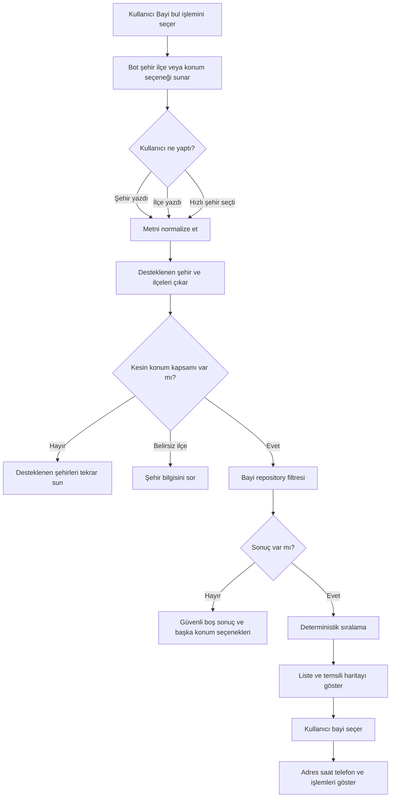
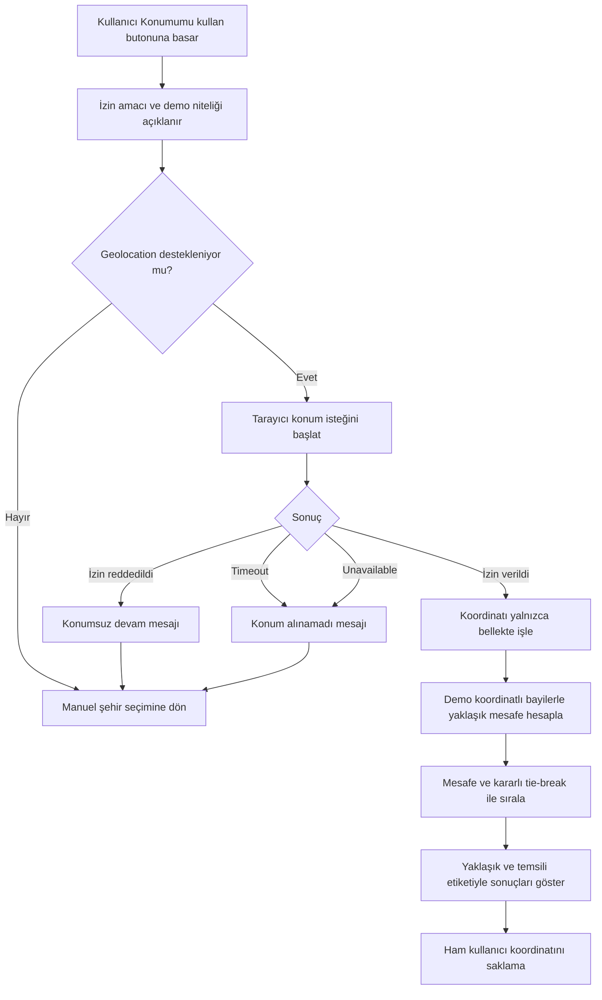
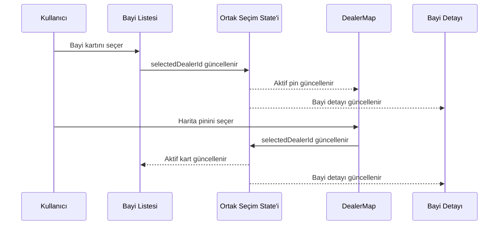
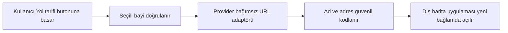

# 06 — Bayi Bulma ve Harita Akışı

> **Proje:** Merinos Chatbot Demo Localhost  
> **Görev türü:** Cursor uygulama görevi  
> **Ön koşullar:** `00`, `01`, `02`, `03`, `04` ve `05` numaralı görevler tamamlanmış olmalıdır.  
> **Kapsam:** Yalnızca bayi/satış noktası bulma, liste–harita deneyimi ve izinli konum kullanımı  
> **Sonraki görev:** `07-SSS-VE-BILGI-BANKASI-AKISI.md`

---

## 1. Görevin amacı

Bu görevin amacı, Merinos localhost demosundaki bayi bulma deneyimini;

- şehir ve isteğe bağlı ilçe seçimi,
- kullanıcı metninden güvenli konum kapsamı çıkarma,
- açık izinle tarayıcı konumu kullanma,
- konum izni verilmediğinde eksiksiz çalışan manuel arama,
- deterministik mesafe ve uygunluk sıralaması,
- liste ile harita arasında çift yönlü seçim senkronizasyonu,
- erişilebilir bayi kartları,
- telefon ve yol tarifi işlemleri,
- yükleniyor, izin reddi, konum hatası ve boş sonuç durumları,
- demo verisinin gerçek satış noktası gibi sunulmaması,
- ileride gerçek bayi servisi ve harita sağlayıcısına taşınabilecek adaptör sınırları

ile test edilebilir, erişilebilir ve sürdürülebilir hâle getirmektir.

Bu görev tamamlandığında kullanıcı:

1. “Bayi bul” hızlı işlemini seçebilmeli,
2. şehir adını yazarak veya önerilen şehirlerden seçerek arama yapabilmeli,
3. desteklenen bir ilçe yazdığında sonuçları ilçe bazında daraltabilmeli,
4. isterse “Konumumu kullan” işlemiyle tarayıcı izni verebilmeli,
5. konum iznini reddetse bile şehir/ilçe seçerek devam edebilmeli,
6. sonuçları yakınlık sırasıyla liste ve temsili harita üzerinde görebilmeli,
7. listeden bayi seçtiğinde ilgili harita pini; pinden seçtiğinde ilgili liste kartı etkinleşmeli,
8. seçilen bayi için adres, çalışma saatleri ve telefon bilgisini görebilmeli,
9. telefon arama ve haritada yol tarifi işlemlerini açık kullanıcı eylemiyle başlatabilmeli,
10. başka şehir veya ilçe için yeni arama yapabilmelidir.

Bu adımda gerçek bayi ağı API’si, gerçek zamanlı çalışma saati, gerçek mağaza stoku, rota hesaplama, reverse geocoding, kullanıcı hesabı, konum geçmişi, arka planda konum takibi veya ücretli harita SDK’sı bağlanmayacaktır.

---

## 2. Başlamadan önce okunacak dosyalar

Cursor herhangi bir değişiklik yapmadan önce aşağıdaki dosyaları incelemelidir:

```text
cursor-tasks/00-PROJE-ANAYASASI.md
cursor-tasks/01-REPO-VE-GELISTIRME-TEMELI.md
cursor-tasks/02-MERINOS-DEMO-SITESI-VE-TASARIM-SISTEMI.md
cursor-tasks/03-CHATBOT-WIDGET-VE-KONUSMA-DENEYIMI.md
cursor-tasks/04-URUN-ARAMA-VE-FILTRELEME-AKISI.md
cursor-tasks/05-SIPARIS-DURUMU-SORGULAMA-AKISI.md
lib/demo-data.ts
lib/types.ts
lib/chatbot/engine.ts
components/DealerMap.tsx
components/Chatbot.tsx
app/page.tsx
app/globals.css
docs/01-SISTEM-MIMARISI.md
docs/02-KULLANICI-AKISLARI.md
docs/04-API-SOZLESMELERI.md
docs/05-TEST-SENARYOLARI.md
```

Değişiklik öncesinde mevcut kalite kapılarının sonucu kaydedilmelidir:

```bash
npm test
npm run lint
npm run build
```

Backend bağımlılıkları kurulmuşsa:

```bash
cd backend
python -m pytest
```

Bir komut ortam veya bağımlılık eksikliği nedeniyle çalışmıyorsa hata gizlenmemeli; tamamlanma raporunda çalıştırılan komut, hata mesajı ve neden açıkça belirtilmelidir.

---

## 3. Mevcut yapı ve korunacak sözleşmeler

### 3.1. Mevcut demo bayi kaynağı

Bayi kayıtları şu aşamada yalnızca yerel demo verisinden gelmektedir:

```text
lib/demo-data.ts
```

Mevcut demo şehirleri ve kayıtları en az şu kapsamı içerir:

```text
Gaziantep
İstanbul
Ankara
Bursa
```

Mevcut bayi verileri gerçek Merinos bayi listesi veya doğrulanmış mağaza konumu değildir. Görünen her sonuç alanında bu durum kullanıcıyı yanıltmayacak biçimde korunmalıdır.

### 3.2. Mevcut `Dealer` sözleşmesi

```ts
export type Dealer = {
  id: string;
  name: string;
  city: string;
  district: string;
  address: string;
  phone: string;
  distance: string;
  hours: string;
  mapX: number;
  mapY: number;
};
```

Bu tip geriye uyumlu biçimde genişletilebilir. Mevcut alanlar kaldırılmamalı, yeniden adlandırılmamalı veya anlamları sessizce değiştirilmemelidir.

Konum tabanlı temsili hesap için gerekirse aşağıdaki gibi isteğe bağlı alanlar eklenebilir:

```ts
export type GeoPoint = {
  latitude: number;
  longitude: number;
};

export type Dealer = {
  // Mevcut alanlar korunur.
  demoCoordinates?: GeoPoint;
  services?: string[];
};
```

Kurallar:

- Alan adı `coordinates` yerine tercihen `demoCoordinates` olmalıdır; verinin temsili olduğu kod seviyesinde de anlaşılmalıdır.
- Bu koordinatlar gerçek veya kesin mağaza koordinatı olarak sunulmamalıdır.
- Üretim entegrasyonuna taşınırken demo koordinatları gerçek bayi verisiyle karıştırılmamalıdır.
- `mapX` ve `mapY`, mevcut temsili harita yerleşimi için korunmalıdır.
- `distance` alanı geriye uyumluluk için korunabilir; ancak konum izniyle hesaplanan mesafenin kaynağı ayrıca belirtilmelidir.

### 3.3. Korunacak public sözleşmeler

Aşağıdaki sözleşmeler korunmalıdır:

```ts
resolveChatInput(query: string, activeIntent: ChatIntent): ChatReply
```

```ts
export type ChatIntent = "product" | "order" | "dealer" | "faq" | null;
```

```ts
export type ChatMessage = {
  id: number;
  sender: "bot" | "user";
  text: string;
  products?: Product[];
  order?: DemoOrder;
  dealers?: Dealer[];
  faq?: Faq;
  actions?: MessageAction[];
};
```

`ChatMessage` yalnızca gerçek ihtiyaç varsa geriye uyumlu biçimde genişletilebilir. Örneğin bayi arama bağlamı için isteğe bağlı metadata kullanılabilir:

```ts
export type DealerResultMeta = {
  searchMode: "city" | "district" | "geolocation";
  locationLabel?: string;
  distanceIsApproximate: boolean;
};
```

Ancak mevcut `dealers?: Dealer[]` alanı korunmalı ve diğer iş akışları etkilenmemelidir.

### 3.4. Korunacak `DealerMap` kullanımı

Mevcut dış kullanım sözleşmesi korunmalıdır:

```ts
type DealerMapProps = {
  dealers: Dealer[];
  selectedId?: string;
  onSelect?: (dealer: Dealer) => void;
  compact?: boolean;
};
```

Bu prop tipi geriye uyumlu biçimde genişletilebilir; mevcut proplar kaldırılmamalı veya zorunlu yeni prop eklenerek mevcut çağrılar bozulmamalıdır.

### 3.5. Korunacak mevcut davranışlar

Aşağıdaki davranışlar çalışmaya devam etmelidir:

- “Bayi bul” hızlı işlemi bayi akışını açar.
- Şehir belirtilmemişse demo şehir seçenekleri gösterilir.
- “Gaziantep bayilerini göster” sorgusu Gaziantep kayıtlarını döndürür.
- “İstanbul bayilerini göster” sorgusu İstanbul kayıtlarını döndürür.
- Sonuçlarda en az ad, ilçe, mesafe, çalışma saati, adres ve telefon görünür.
- Liste öğesi seçilince temsili haritadaki aktif pin değişir.
- Harita pini seçilince ilgili bayi aktif olur.
- Ana sayfadaki satış noktaları bölümü çalışmaya devam eder.
- Ürün, sipariş ve SSS akışları bozulmaz.

---

## 4. Kapsam sınırı

### 4.1. Bu görevde yapılacaklar

- Bayi akışına giriş
- Şehir adı çıkarımı ve normalizasyonu
- İsteğe bağlı ilçe adı çıkarımı
- Desteklenen şehir/ilçe önerileri
- Şehir/ilçe bazlı kesin filtreleme
- Açık kullanıcı eylemiyle tarayıcı konum izni isteme
- Konum izni durum modeli
- Temsili koordinatlarla yaklaşık mesafe hesaplama
- Mesafeye göre deterministik sıralama
- Mesafe hesaplanamıyorsa kararlı yedek sıralama
- Bayi veri erişim katmanı
- Liste–harita çift yönlü seçim senkronizasyonu
- Seçilen bayi kartı
- Telefon arama bağlantısı
- Harita/yol tarifi dış bağlantısı için güvenli adaptör
- Konum izni reddi ve konum hatası durumları
- Boş sonuç ve başka konum arama davranışı
- Mobil ve masaüstü responsive düzen
- Klavye ve ekran okuyucu erişilebilirliği
- Konum verisi minimizasyonu ve gizlilik kuralları
- Unit, bileşen, entegrasyon ve regresyon testleri
- Bayi akışı dokümantasyonu

### 4.2. Bu görevde yapılmayacaklar

- Gerçek Merinos bayi API’si
- Gerçek ve doğrulanmış mağaza koordinatları
- Google Maps, Mapbox, HERE veya başka ücretli SDK kurulumu
- Harita API anahtarı
- Reverse geocoding servisi
- Otomatik şehir tespiti için üçüncü taraf servis
- Canlı trafik veya rota süresi
- Uygulama içinde turn-by-turn navigasyon
- Arka planda konum takibi
- Sayfa açılır açılmaz konum izni isteme
- Konumu Redis, localStorage, cookie, veritabanı veya analitik servisine yazma
- Kullanıcının kesin konumunu loglama
- Mağaza stoku veya ürün rezervasyonu
- Randevu oluşturma
- Gerçek çalışma saati veya tatil günü güncellemesi
- Canlı temsilciye gerçek aktarım
- Ürün arama kurallarında değişiklik
- Sipariş sorgulama kurallarında değişiklik
- SSS yanıt sisteminde değişiklik
- LangGraph worker implementasyonu
- Redis session state implementasyonu
- Chatwoot, Frappe Helpdesk veya RAGFlow entegrasyonu

Bu sınırların dışına çıkılmamalıdır.

---

## 5. Bayi bulma kullanıcı hikâyeleri

### US-06-01 — Bayi akışını başlatma

**Kullanıcı olarak**, “Bayi bul” işlemini seçtiğimde şehir seçebileceğim veya konumumu kullanabileceğim açık bir başlangıç adımı görmek istiyorum.

Beklenenler:

- Bot şehir adını yazabileceğimi açıklar.
- Desteklenen demo şehirleri hızlı işlem olarak gösterilir.
- “Konumumu kullan” işlemi ayrı ve açık bir seçenek olarak sunulur.
- Konum izni bu başlangıç mesajı gösterilir gösterilmez otomatik istenmez.
- Kullanıcı konum paylaşmadan akışı tamamlayabilir.

Örnek yanıt:

```text
Yakındaki demo satış noktalarını gösterebilmem için şehir veya ilçe yazabilirsiniz. Dilerseniz “Konumumu kullan” seçeneğiyle bu oturum için yaklaşık konum izni verebilirsiniz.
```

### US-06-02 — Şehir yazarak arama

**Kullanıcı olarak**, “Gaziantep bayileri” veya “İstanbul mağazaları” yazarak ilgili şehirdeki demo satış noktalarını görmek istiyorum.

Beklenenler:

- Türkçe karakterler güvenli biçimde normalize edilir.
- Büyük/küçük harf farkı sonucu değiştirmez.
- Şehir adı kesin desteklenen şehir listesiyle eşleştirilir.
- Sonuçlar deterministik sırada döner.
- Sonuç başlığında aranan şehir görünür.
- Kullanıcıya bunun demo verisi olduğu belirtilir.

### US-06-03 — İlçe yazarak daraltma

**Kullanıcı olarak**, “Kadıköy bayisi” veya “Şehitkamil satış noktası” yazarak sonuçları ilgili ilçeye daraltmak istiyorum.

Beklenenler:

- İlçe doğrudan mevcut bayi veri setindeki `district` alanlarından türetilir.
- İlçe tek bir şehirde bulunuyorsa o şehir otomatik belirlenebilir.
- Aynı ilçe adı birden fazla şehirde bulunursa şehir sorulur; tahmin yapılmaz.
- İlçe için sonuç bulunamazsa en yakın yazım tahmin edilerek kayıt gösterilmez.
- Desteklenen şehir/ilçe seçenekleri kullanıcıya sunulur.

### US-06-04 — Açık izinle konum kullanma

**Kullanıcı olarak**, “Konumumu kullan” seçeneğine bastığımda tarayıcının konum izni istemesini ve izin verirsem temsili en yakın satış noktalarını görmeyi istiyorum.

Beklenenler:

- `navigator.geolocation` yalnızca kullanıcı açıkça ilgili butona bastığında çağrılır.
- İzin öncesinde neden konum istendiği kısa bir metinle açıklanır.
- İzin tek seferlik mevcut arama amacıyla kullanılır.
- Kullanıcının ham koordinatı React state dışında kalıcı tutulmaz.
- Ham koordinat mesaj metnine, URL’ye, loga veya analitiğe yazılmaz.
- Yaklaşık mesafeler yalnızca `demoCoordinates` bulunan kayıtlar için hesaplanır.
- Görünen metinde mesafelerin temsili/yaklaşık olduğu belirtilir.
- İzin verilse bile gerçek mağaza yakınlığı iddiası kurulmaz.

### US-06-05 — Konum iznini reddetme

**Kullanıcı olarak**, konum paylaşmayı reddettiğimde akışın bozulmamasını ve şehir seçerek devam edebilmeyi istiyorum.

Beklenenler:

- Reddetme bir hata veya suçlayıcı metin gibi sunulmaz.
- Tekrar tekrar izin penceresi açılmaz.
- Manuel şehir ve ilçe seçenekleri gösterilir.
- Konum paylaşmanın zorunlu olmadığı açıkça belirtilir.

Örnek yanıt:

```text
Konum paylaşılmadı. Sorun değil; şehir veya ilçe seçerek demo satış noktalarını görüntüleyebilirsiniz.
```

### US-06-06 — Konum servisinin kullanılamaması

**Kullanıcı olarak**, tarayıcım konumu desteklemiyorsa veya konum alınamazsa anlaşılır bir alternatif görmek istiyorum.

Beklenenler:

- `navigator.geolocation` yoksa kontrollü fallback gösterilir.
- Timeout, position unavailable ve permission denied durumları ayrıştırılır.
- Teknik hata kodları kullanıcıya gösterilmez.
- Manuel şehir araması eksiksiz çalışır.

### US-06-07 — Liste ile harita arasında seçim

**Kullanıcı olarak**, listeden seçtiğim bayinin haritada; haritadan seçtiğim bayinin listede vurgulanmasını istiyorum.

Beklenenler:

- Tek bir `selectedDealerId` kaynak gerçekliği kullanılır.
- Liste ve harita kendi bağımsız seçim state’lerini tutmaz.
- Sonuç listesi değişince seçili id artık yoksa ilk uygun sonuç seçilir.
- Aktif liste kartında görsel seçili durum ve erişilebilir durum bilgisi bulunur.
- Aktif harita pini `aria-pressed` veya eşdeğer semantik taşır.
- Pin seçimi sonrası seçili bayi özeti `aria-live="polite"` bölgesinde güncellenir.

### US-06-08 — Bayi bilgilerini inceleme

**Kullanıcı olarak**, seçtiğim demo satış noktasının adresini, saatlerini ve telefonunu açık biçimde görmek istiyorum.

Beklenenler:

- Bayi adı başlık olarak görünür.
- Şehir ve ilçe birlikte görünür.
- Adres, çalışma saatleri ve telefon ayrı alanlarda sunulur.
- Mesafe varsa birimiyle birlikte görünür.
- Mesafe kaynağı “yaklaşık/temsili” olarak açıklanır.
- “Demo satış noktası” etiketi kaybolmaz.

### US-06-09 — Telefon araması başlatma

**Kullanıcı olarak**, telefon numarasına dokunduğumda cihazımın arama uygulamasını açabilmek istiyorum.

Beklenenler:

- Görünen telefon metni okunabilir biçimde kalır.
- `tel:` hedefi yalnızca izin verilen telefon karakterlerinden üretilir.
- Arama otomatik başlatılmaz; açık kullanıcı tıklaması gerekir.
- Masaüstünde bağlantı yine erişilebilir bir link olarak kalır.
- Demo telefon numaralarının gerçek numara olmadığı belirtilir.

### US-06-10 — Yol tarifi açma

**Kullanıcı olarak**, seçilen bayi için dış harita uygulamasında arama veya yol tarifi başlatabilmek istiyorum.

Beklenenler:

- İşlem açık kullanıcı tıklamasıyla gerçekleşir.
- Hedef URL merkezi bir adaptör fonksiyonunda üretilir.
- Adres ve bayi adı `encodeURIComponent` ile güvenli biçimde kodlanır.
- Yeni sekme kullanılıyorsa `rel="noopener noreferrer"` eklenir.
- Uygulama içinde gerçek rota hesaplanmaz.
- Kullanıcı, harita bilgisinin demo olduğunu görür.

### US-06-11 — Başka şehir veya ilçe arama

**Kullanıcı olarak**, sonuçtan sonra “Başka konum” işlemiyle arama başlangıcına dönebilmek istiyorum.

Beklenenler:

- Önceki sonuçlar yeni arama mesajı geldiğinde doğru biçimde yenilenir.
- Ürün, sipariş ve SSS intent’leriyle state karışmaz.
- Konum izni tekrar otomatik istenmez.
- Önceki ham konum kalıcı olarak saklanmaz.

---

## 6. İşlevsel akışlar

### 6.1. Şehir/ilçe tabanlı temel akış



### 6.2. Konum izni akışı



### 6.3. Liste–harita senkronizasyon akışı



### 6.4. Dış harita işlemi



---

## 7. Bayi sorgusu ayrıştırma ve normalizasyon kuralları

### 7.1. Metin normalizasyonu

Mevcut `normalizeText` davranışı korunmalı veya ortak bir yardımcıya taşınmelidir:

```ts
export function normalizeText(value: string): string {
  return value
    .toLocaleLowerCase("tr-TR")
    .replaceAll("ı", "i")
    .replaceAll("ş", "s")
    .replaceAll("ğ", "g")
    .replaceAll("ü", "u")
    .replaceAll("ö", "o")
    .replaceAll("ç", "c")
    .replace(/\s+/g, " ")
    .trim();
}
```

Bu fonksiyonun ürün, sipariş, bayi ve SSS akışlarında farklı kopyaları oluşturulmamalıdır.

### 7.2. Desteklenen şehir ve ilçe değerleri

Şehir ve ilçe seçenekleri sabit ikinci bir listeyle tekrar edilmemelidir. Bunlar bayi veri kaynağından deterministik biçimde türetilmelidir:

```ts
const cityFacets = uniqueSorted(dealers.map((dealer) => dealer.city));
const districtFacets = uniqueSorted(dealers.map((dealer) => dealer.district));
```

Kurallar:

- Aynı değer iki kez gösterilmemelidir.
- Sıralama Türkçe locale ile deterministik olmalıdır.
- Kullanıcıya sunulan seçenekler yalnızca gerçekten sonuç üretebilen değerler olmalıdır.
- `demoCities` mevcut public export ise geriye uyumluluk için korunabilir; ancak mümkünse tek veri kaynağından türetilmelidir.

### 7.3. Şehir ve ilçe tespiti

Önerilen ayrıştırma çıktısı:

```ts
export type DealerSearchCriteria = {
  city?: string;
  district?: string;
  mode: "manual" | "geolocation";
};
```

Kurallar:

1. Şehir ve ilçe yalnızca veri setinde bulunan kanonik değerlerle eşleştirilir.
2. Tam normalize edilmiş eşleşme önceliklidir.
3. Kullanıcının yazdığı metinde açıkça geçen kanonik şehir/ilçe değeri kabul edilir.
4. Fuzzy eşleşmeyle doğrudan bayi kaydı gösterilmez.
5. Yazım önerisi üretilecekse kullanıcıdan seçim istenir; otomatik kesinleştirme yapılmaz.
6. Aynı mesajda şehir ve ilçe varsa ikisi birlikte filtrelenir.
7. İlçe verilen şehirle uyuşmuyorsa kayıt uydurulmaz; çelişki açıklanır.
8. Birden fazla şehir adı aynı mesajda geçiyorsa tek şehir seçmesi istenir.

### 7.4. Intent tespiti

Aşağıdaki ifadeler bayi intent’ine yönlendirebilir:

```text
bayi
mağaza
satış noktası
şube
yakınımdaki
nerede bulabilirim
konumumu kullan
yol tarifi
```

Ancak:

- “Mağaza stok durumu” gibi bir SSS sorgusu yanlışlıkla doğrudan bayi listesine yönlendirilmemelidir.
- Sipariş teslimat adresi gibi metinler bayi intent’ini tetiklememelidir.
- Ürün içindeki “mağaza koleksiyonu” ifadesi tek başına bayi araması sayılmamalıdır.
- Mevcut intent öncelikleri regresyon testleriyle korunmalıdır.

### 7.5. Belirsiz sorgu davranışı

Aşağıdaki sorgular doğrudan sonuç döndürmemelidir:

```text
Bayi göster
Yakındaki mağaza
Bir satış noktası lazım
```

Konum izni henüz yoksa bot şehir/ilçe sorar ve açık “Konumumu kullan” işlemini sunar.

---

## 8. Bayi veri erişim katmanı

### 8.1. Repository sınırı

`lib/chatbot/engine.ts` doğrudan çok sayıda filtre ve mesafe hesabı taşımamalıdır. Önerilen yapı:

```text
lib/dealers/
├── dealer.types.ts
├── dealer-repository.ts
├── dealer-search.ts
├── dealer-distance.ts
├── dealer-map-link.ts
└── index.ts
```

Alternatif olarak:

```text
lib/chatbot/dealer/
├── parse-dealer-query.ts
├── dealer-service.ts
├── distance.ts
├── map-link.ts
└── dealer-reply.ts
```

Dizin adı serbesttir; sorumluluk ayrımı zorunludur.

### 8.2. Önerilen repository sözleşmesi

```ts
export type DealerRepository = {
  listAll(): readonly Dealer[];
  listCities(): string[];
  listDistricts(city?: string): string[];
  search(criteria: DealerSearchCriteria): Dealer[];
  findById(id: string): Dealer | undefined;
};
```

Localhost demosunda repository yalnızca `lib/demo-data.ts` verisini okur.

Kurallar:

- Repository sonuçları kaynak diziyi mutate etmemelidir.
- Her çağrıda kararlı sıralama kullanılmalıdır.
- Boş kriter tüm kayıtları kontrolsüz biçimde döndürmemelidir; üst katman kullanıcıdan konum kapsamı istemelidir.
- Gerçek API’ye geçiş için arayüz korunabilir olmalıdır.

### 8.3. Filtreleme semantiği

Filtreler şu biçimde çalışmalıdır:

- Şehir varsa `dealer.city === city`
- İlçe varsa `dealer.district === district`
- Şehir ve ilçe birlikteyse **AND**
- Bir kriter yoksa o alan filtreye katılmaz
- Eşleşmeler normalize edilmiş kanonik değer üzerinden yapılır
- Sonuçlar önce hesaplanmış mesafeye, sonra şehir, ilçe, ad ve id’ye göre kararlı sıralanır

### 8.4. Boş sonuç güvenliği

Sonuç bulunamadığında:

- başka bir şehre ait bayi gösterilmemelidir,
- “yakın olabilir” diye tahmini kayıt sunulmamalıdır,
- gerçek veri varmış izlenimi verilmemelidir,
- yalnızca veri setinde gerçekten bulunan şehir/ilçe seçenekleri önerilmelidir.

Örnek:

```text
Bu ilçe için demo satış noktası bulunmuyor. Ankara, Bursa, Gaziantep veya İstanbul seçeneklerinden biriyle devam edebilirsiniz.
```

---

## 9. Konum izni ve gizlilik modeli

### 9.1. Temel ilke

Konum kullanımı **opsiyonel**, **amaçla sınırlı**, **açık kullanıcı eylemine bağlı** ve **geçici** olmalıdır.

Yasaktır:

- sayfa yüklenince konum izni istemek,
- chatbot açılınca konum izni istemek,
- şehir yazan kullanıcıdan ayrıca konum istemek,
- izin reddinden sonra otomatik tekrar istemek,
- konumu başka amaçla kullanmak,
- konumu kalıcı depolamak,
- kesin koordinatı loglamak,
- koordinatı hata izleme servisine göndermek,
- koordinatı URL query parametresine koymak.

### 9.2. UI durum modeli

Önerilen konum durumu:

```ts
export type GeolocationStatus =
  | "idle"
  | "explaining"
  | "requesting"
  | "granted"
  | "denied"
  | "unavailable"
  | "timeout"
  | "unsupported";
```

Geolocation çağrısı UI render fonksiyonu veya engine içinde doğrudan yapılmamalıdır. Tarayıcı bağımlı işlem bir controller/hook/transport sınırında kalmalıdır.

Örnek:

```ts
export type UserLocation = {
  latitude: number;
  longitude: number;
  accuracyMeters?: number;
};

export type GeolocationResult =
  | { ok: true; location: UserLocation }
  | {
      ok: false;
      reason: "denied" | "unavailable" | "timeout" | "unsupported";
    };
```

### 9.3. Tarayıcı çağrı ayarları

Önerilen çağrı:

```ts
navigator.geolocation.getCurrentPosition(onSuccess, onError, {
  enableHighAccuracy: false,
  timeout: 8000,
  maximumAge: 300000,
});
```

Bu değerler gerekçeli biçimde değiştirilebilir.

Kurallar:

- Yüksek doğruluk varsayılan olarak kapalıdır; demo bayi sıralaması için kesin GPS gerekmez.
- Sonsuz bekleme olmamalıdır.
- Kabul edilebilir kısa süreli cache tarayıcı seviyesinde kullanılabilir.
- `watchPosition` kullanılmamalıdır.
- Ham konum yalnızca mesafe hesabı tamamlanana kadar bellekte tutulmalıdır.

### 9.4. Kullanıcıya gösterilecek açıklama

İzin öncesi kısa metin şunları anlatmalıdır:

- konumun neden istendiği,
- paylaşımın isteğe bağlı olduğu,
- yalnızca bu arama için kullanıldığı,
- demo bayi koordinatlarının temsili olduğu,
- manuel şehir seçeneğinin bulunduğu.

Örnek:

```text
Konumunuz yalnızca bu oturumda temsili yakınlık sıralaması için kullanılacak ve kaydedilmeyecek. Demo bayi konumları gerçek satış noktası verisi değildir. Konum paylaşmadan şehir seçerek de devam edebilirsiniz.
```

### 9.5. KVKK açısından veri minimizasyonu

Bu localhost demo gerçek kişisel veri işleme sistemi değildir. Yine de üretime hazırlık için:

- Ham enlem/boylam uygulama loglarına yazılmamalıdır.
- Ham konum konuşma geçmişine eklenmemelidir.
- Konum değeri LLM prompt’una gönderilmemelidir.
- Konum değeri Redis session state’e yazılmamalıdır.
- Analitik için kesin konum yerine yalnızca izin sonucu gibi anonim olaylar düşünülebilir; bu görevde analitik eklenmez.
- Canlı sürümde aydınlatma metni, hukuki dayanak, saklama süresi ve veri işleyen taraflar ayrıca değerlendirilmelidir.

---

## 10. Temsili koordinat ve mesafe hesabı

### 10.1. Demo koordinat kuralı

Konum izniyle yakınlık sıralaması uygulanacaksa bayi kayıtlarına `demoCoordinates` eklenebilir.

Kurallar:

- Koordinatlar yalnızca demo/test amaçlıdır.
- Gerçek mağaza koordinatı olduğu iddia edilmemelidir.
- Adres metniyle koordinatın gerçek dünyada birebir uyuştuğu varsayılmamalıdır.
- UI’da “yaklaşık demo mesafesi” etiketi görünmelidir.
- Üretim ortamında demo koordinat kullanımını engelleyen veri kaynağı kontrolü planlanmalıdır.

### 10.2. Haversine hesabı

Mesafe hesabı saf ve test edilebilir bir fonksiyon olmalıdır:

```ts
export type GeoPoint = {
  latitude: number;
  longitude: number;
};

export function distanceInKilometers(
  from: GeoPoint,
  to: GeoPoint,
): number {
  const earthRadiusKm = 6371;
  const toRadians = (value: number) => (value * Math.PI) / 180;

  const deltaLatitude = toRadians(to.latitude - from.latitude);
  const deltaLongitude = toRadians(to.longitude - from.longitude);
  const fromLatitude = toRadians(from.latitude);
  const toLatitude = toRadians(to.latitude);

  const haversine =
    Math.sin(deltaLatitude / 2) ** 2 +
    Math.cos(fromLatitude) *
      Math.cos(toLatitude) *
      Math.sin(deltaLongitude / 2) ** 2;

  return earthRadiusKm * 2 * Math.atan2(Math.sqrt(haversine), Math.sqrt(1 - haversine));
}
```

Fonksiyon:

- girdileri mutate etmemeli,
- aynı girdide aynı sonucu üretmeli,
- ağ çağrısı yapmamalı,
- görünüm formatlaması yapmamalı,
- geçersiz koordinatları kontrollü biçimde reddetmelidir.

### 10.3. Koordinat doğrulama

```ts
export function isValidGeoPoint(point: GeoPoint): boolean {
  return (
    Number.isFinite(point.latitude) &&
    Number.isFinite(point.longitude) &&
    point.latitude >= -90 &&
    point.latitude <= 90 &&
    point.longitude >= -180 &&
    point.longitude <= 180
  );
}
```

Geçersiz kullanıcı veya bayi koordinatıyla hesap yapılmamalıdır.

### 10.4. Mesafe gösterimi

Formatlama ayrı bir fonksiyon olmalıdır:

```ts
export function formatApproximateDistance(kilometers: number): string {
  if (kilometers < 1) {
    return `yaklaşık ${Math.max(100, Math.round(kilometers * 1000 / 100) * 100)} m`;
  }

  return `yaklaşık ${kilometers.toLocaleString("tr-TR", {
    maximumFractionDigits: 1,
  })} km`;
}
```

Kurallar:

- Aşırı hassas değer gösterilmemelidir.
- 6–8 ondalıklı koordinat veya mesafe gösterilmemelidir.
- Mesafenin düz çizgi yaklaşık mesafesi olduğu anlaşılmalıdır.
- Rota mesafesi veya seyahat süresi gibi sunulmamalıdır.

### 10.5. Sıralama kuralı

Konum tabanlı sonuç sırası:

1. geçerli hesaplanmış mesafe artan,
2. `city` Türkçe locale,
3. `district` Türkçe locale,
4. `name` Türkçe locale,
5. `id` artan.

Mesafe eşitse kaynak dizi sırasına güvenilmemeli; açık tie-break uygulanmalıdır.

Şehir/ilçe tabanlı, dinamik mesafe olmayan sonuç sırası:

1. varsa parse edilmiş mevcut `distance` sayısal değeri,
2. `district`,
3. `name`,
4. `id`.

Ancak statik `distance` alanı gerçek kullanıcı mesafesi gibi sunulmamalıdır.

---

## 11. Harita bileşeni mimarisi

### 11.1. `DealerMap` rolü

`DealerMap` yalnızca görselleştirme ve seçim etkileşiminden sorumlu olmalıdır.

Yapmamalıdır:

- geolocation izni istemek,
- bayi filtrelemek,
- uzaklık hesaplamak,
- URL üretmek,
- konuşma intent’i yönetmek,
- veri kaynağına doğrudan erişmek.

### 11.2. Geriye uyumlu prop genişletmesi

Gerekirse aşağıdaki gibi genişletilebilir:

```ts
type DealerMapProps = {
  dealers: Dealer[];
  selectedId?: string;
  onSelect?: (dealer: Dealer) => void;
  compact?: boolean;
  ariaLabel?: string;
  resultLabel?: string;
};
```

Mevcut proplar aynı anlamla çalışmaya devam etmelidir.

### 11.3. Harita niteliği

Mevcut `DealerMap` gerçek coğrafi harita değildir; `mapX` ve `mapY` değerleriyle oluşturulmuş temsili bir görseldir.

UI’da şu ayrım korunmalıdır:

```text
Temsili satış noktası haritası
```

“Canlı harita”, “kesin konum” veya “gerçek rota” ifadeleri kullanılmamalıdır.

### 11.4. Pin davranışı

Her pin:

- gerçek `button` olmalı,
- bayi adı ve ilçesini içeren erişilebilir ad taşımalı,
- seçili durumu semantik olarak açıklamalı,
- en az 44×44 CSS px tıklama alanına sahip olmalı,
- yalnızca renkle ayrışmamalı,
- focus-visible görünümüne sahip olmalı,
- dekoratif “M” metnini ekran okuyucuya tekrar okutmayacak şekilde işaretlemelidir.

Örnek:

```tsx
<button
  type="button"
  aria-label={`${dealer.name}, ${dealer.district} demo satış noktasını seç`}
  aria-pressed={dealer.id === selectedId}
  className={dealer.id === selectedId ? "selected" : undefined}
  onClick={() => onSelect?.(dealer)}
>
  <span aria-hidden="true">M</span>
</button>
```

### 11.5. Klavye davranışı

En az şu davranışlar sağlanmalıdır:

- `Tab` ile her pin erişilebilir.
- `Enter` ve `Space` seçimi çalıştırır.
- Focus görünürdür.
- Harita, listeye erişmenin tek yolu değildir.
- Çok sayıda kayıt geleceği düşünülerek pin tab sırası anlamsızlaşmamalıdır.

Opsiyonel arrow-key roving tabindex eklenebilir; ancak eksik veya hatalı bir özel klavye modeli, doğal button davranışından daha kötü olmamalıdır.

### 11.6. Compact ve geniş görünüm

- Chatbot içinde `compact` görünüm kullanılabilir.
- Ana sayfada geniş görünüm korunmalıdır.
- Compact görünümde bilgi kartı liste/detay bölümünde sunulabilir.
- Aynı bayi seçimi her iki görünümde de tek state’ten yönetilmelidir.

---

## 12. Liste ve bayi kartları

### 12.1. Sonuç listesi

Sonuç listesi gerçek bir liste semantiği taşımalıdır:

```tsx
<ul aria-label="Demo satış noktaları">
  <li>{/* Bayi seçme butonu */}</li>
</ul>
```

Liste kartında en az:

- bayi adı,
- ilçe ve şehir,
- yaklaşık/temsili mesafe,
- çalışma saatleri

görünmelidir.

### 12.2. Aktif kart

Aktif kart:

- `aria-current="true"` veya uygun seçili durum semantiği taşımalı,
- yalnızca arka plan rengiyle ayrışmamalı,
- harita piniyle aynı `selectedDealerId` kullanmalı,
- seçim sonrası detay alanını güncellemelidir.

### 12.3. Bayi detay kartı

Önerilen alanlar:

```text
DEMO SATIŞ NOKTASI
Merinos Demo Kadıköy
Kadıköy, İstanbul
Kozyatağı Mahallesi, İstanbul
10.00–21.00
Yaklaşık demo mesafesi: 2,4 km
Telefon
Yol tarifi
```

Kurallar:

- Adres ve saatler veri kaynağından gelmelidir.
- Eksik alan için uydurma metin yazılmamalıdır.
- Telefon yoksa arama işlemi gösterilmemelidir.
- Dış harita linki üretilemiyorsa yol tarifi işlemi gösterilmemelidir.
- Demo uyarısı detay kartında görünür kalmalıdır.

### 12.4. Sonuç sayısı

Chatbot ilk yanıtta çok uzun liste göstermemelidir.

Öneri:

- İlk chatbot sonucu: en fazla 3 bayi
- Ana sayfa şehir görünümü: ilgili tüm demo kayıtları
- Daha fazla kayıt olması hâlinde “Tümünü göster” davranışı ileride eklenebilir

Mevcut demo veride iki kayıt varsa iki kayıt gösterilmelidir; sahte üçüncü kayıt eklenmemelidir.

---

## 13. Telefon ve dış harita bağlantıları

### 13.1. Telefon normalizasyonu

Telefon bağlantısı ayrı ve saf bir yardımcıyla üretilmelidir:

```ts
export function toTelephoneHref(phone: string): string | undefined {
  const normalized = phone.replace(/[^\d+]/g, "");
  return normalized.length >= 10 ? `tel:${normalized}` : undefined;
}
```

Kurallar:

- Kullanıcı girdisi doğrudan href içine koyulmamalıdır.
- Yalnızca bayi veri kaynağındaki telefon kullanılmalıdır.
- `javascript:` veya başka protokoller mümkün olmamalıdır.
- Görünen metin ile hedef numara ayrıştırılabilir.

### 13.2. Harita arama URL adaptörü

Provider seçimi tek yerde olmalıdır:

```ts
export type MapLinkInput = {
  name: string;
  address: string;
};

export function createExternalMapSearchUrl(
  input: MapLinkInput,
): string | undefined {
  const query = `${input.name}, ${input.address}`.trim();
  if (!query) return undefined;

  return `https://www.google.com/maps/search/?api=1&query=${encodeURIComponent(query)}`;
}
```

Bu örnek zorunlu provider seçimi değildir. Alternatif sağlayıcı veya genel arama URL’si kullanılabilir. Ancak:

- URL oluşturma bileşen içinde dağınık olmamalıdır.
- Sadece `https:` hedeflerine izin verilmelidir.
- Hedef adres güvenli kodlanmalıdır.
- Link metni “Yol tarifi” yerine gerçek rota hesaplanmıyorsa “Haritada aç” olabilir.
- Harita sağlayıcısına geçildiği kullanıcı için anlaşılır olmalıdır.

### 13.3. Dış link güvenliği

Yeni sekme açılıyorsa:

```tsx
<a
  href={mapUrl}
  target="_blank"
  rel="noopener noreferrer"
>
  Haritada aç
</a>
```

Otomatik popup, otomatik yönlendirme veya kullanıcı seçimi olmadan yeni pencere açılması yasaktır.

---

## 14. Chatbot konuşma davranışı

### 14.1. Başlangıç yanıtı

Bayi intent’i belirlenmiş fakat şehir/ilçe yoksa:

```ts
{
  nextIntent: "dealer",
  message: {
    text: "Şehir veya ilçe yazarak demo satış noktalarını arayabilirsiniz. Konum paylaşımı isteğe bağlıdır ve yalnızca açık izninizle kullanılır.",
    actions: [
      // Veri kaynağından türetilmiş şehirler
      // Konumumu kullan özel UI eylemi
    ],
  },
}
```

`Konumumu kullan` işlemi sıradan metin mesajı gibi engine’e gönderilip tarayıcı API’sini engine içinde çalıştırmamalıdır. UI katmanı bunu kontrollü özel eylem olarak ele almalıdır.

### 14.2. Başarılı şehir yanıtı

Örnek:

```text
İstanbul için 2 demo satış noktası buldum. Sonuçlar temsili mesafe sırasıyla gösteriliyor.
```

Dinamik mesafe kullanıcı konumundan hesaplandıysa:

```text
Konumunuza göre yaklaşık demo mesafesi hesaplanan 3 satış noktası buldum. Demo konumlar gerçek bayi koordinatları değildir.
```

### 14.3. İlçe çelişkisi

Örnek:

```text
Kadıköy, demo verisinde İstanbul altında bulunuyor. İstanbul–Kadıköy sonuçlarını gösterebilirim veya başka bir şehir seçebilirsiniz.
```

Sistem kullanıcıya yanlış şehir altında kayıt döndürmemelidir.

### 14.4. Sonuç bulunamadı

Örnek:

```text
Bu konum için demo satış noktası bulunamadı. Veri setinde bulunan şehirlerden birini seçebilirsiniz.
```

Sonuç bulunamadığında:

- hayali bayi oluşturulmaz,
- en yakın gerçek bayi iddiası kurulmaz,
- kullanıcı konumu daha geniş bölgeyle otomatik değiştirilmez,
- veri setinden doğrulanan seçenekler sunulur.

### 14.5. Başka arama

Başarılı yanıtta:

```ts
{ label: "Başka konum", value: "En yakın bayiyi bul" }
```

bulunmalıdır.

Konum izni önceden verilmiş olsa bile “Başka konum” otomatik olarak eski koordinatı kullanmamalıdır; kullanıcıya manuel seçim ve gerekirse yeniden açık konum eylemi sunulmalıdır.

---

## 15. UI state ve sorumluluk ayrımı

### 15.1. Önerilen UI state’i

```ts
export type DealerUiState = {
  selectedDealerId?: string;
  city?: string;
  district?: string;
  geolocationStatus: GeolocationStatus;
  searchMode: "manual" | "geolocation";
};
```

Ham koordinat kalıcı state modelinin parçası olmamalıdır. Gerekirse hesap süresince lokal değişkende veya kısa ömürlü ref’te tutulmalı, sonuç üretildikten sonra silinmelidir.

### 15.2. Tek kaynak gerçekliği

Aşağıdaki alanlar farklı bileşenlerde çoğaltılmamalıdır:

- seçili bayi,
- aktif şehir,
- aktif ilçe,
- konum izni durumu,
- sonuç sırası.

Ana sayfa ile chatbot ayrı kullanım bağlamları olduğu için kendi state’lerini tutabilir; ancak aynı saf arama ve sıralama servislerini kullanmalıdır.

### 15.3. Sonuç listesi değişimi

Yeni sonuç geldiğinde:

```ts
useEffect(() => {
  if (!dealers.some((dealer) => dealer.id === selectedDealerId)) {
    setSelectedDealerId(dealers[0]?.id);
  }
}, [dealers, selectedDealerId]);
```

Bu davranış eşdeğer biçimde uygulanmalıdır. Boş listede seçili id temizlenmelidir.

### 15.4. Engine ile tarayıcı sınırı

`resolveChatInput` saf ve senkron public sözleşmesini korumalıdır. Tarayıcı geolocation çağrısı bu fonksiyonun içine eklenmemelidir.

Önerilen yaklaşım:

- Engine şehir/ilçe metin sorgularını işler.
- Chatbot UI “Konumumu kullan” özel action’ını yakalar.
- UI geolocation service’i çağırır.
- Saf dealer service mesafeleri hesaplar.
- UI normal bot mesajı biçiminde sonuç üretir veya mevcut mesaj modelini geriye uyumlu genişletir.

Bu adım, sonraki backend/LangGraph entegrasyonunda geolocation verisinin ayrı güvenli araç girdisi olarak yönetilebilmesini sağlar.

---

## 16. Hata, yükleniyor ve boş durumları

### 16.1. Konum isteniyor

Konum isteği sürerken:

- işlem butonu disable olmalı,
- aynı istek iki kez başlatılmamalı,
- “Konum alınıyor…” durumu görünmeli,
- canlı bölge durumu duyurmalı,
- kullanıcı manuel şehir seçimine dönebilmelidir.

### 16.2. İzin reddi

Kullanıcı mesajı:

```text
Konum izni verilmedi. Şehir veya ilçe seçerek devam edebilirsiniz.
```

Teknik `PERMISSION_DENIED` kodu gösterilmemelidir.

### 16.3. Timeout

Kullanıcı mesajı:

```text
Konum zamanında alınamadı. Tekrar deneyebilir veya şehir seçebilirsiniz.
```

İstek sonsuz loading durumunda kalmamalıdır.

### 16.4. Konum kullanılamıyor

Kullanıcı mesajı:

```text
Tarayıcı şu anda konumu sağlayamadı. Şehir veya ilçe seçerek aramaya devam edebilirsiniz.
```

### 16.5. Desteklenmeyen tarayıcı

Kullanıcı mesajı:

```text
Bu tarayıcıda konum özelliği kullanılamıyor. Şehir veya ilçe seçerek devam edebilirsiniz.
```

### 16.6. Harita linki üretilememesi

- Bayi kartı görünmeye devam eder.
- “Haritada aç” işlemi gizlenir veya disabled olmaz; hiç render edilmemesi tercih edilir.
- Telefon ve diğer bilgiler çalışmaya devam eder.

### 16.7. Boş bayi listesi

`DealerMap` boş `dealers` dizisinde hata atmamalıdır.

Örnek davranış:

```tsx
if (dealers.length === 0) {
  return (
    <div role="status">
      Bu seçim için gösterilecek demo satış noktası bulunmuyor.
    </div>
  );
}
```

---

## 17. Erişilebilirlik gereksinimleri

### 17.1. Genel kurallar

- Tüm işlemler klavyeyle tamamlanabilmelidir.
- Harita tek bilgi kaynağı olmamalıdır.
- Pin konumu veya renk tek anlam taşıyıcısı olmamalıdır.
- Sonuç sayısı ve seçili bayi değişimi ekran okuyucuya duyurulmalıdır.
- Buton ve link semantik ayrımı korunmalıdır.
- Dekoratif yollar ve harita öğeleri `aria-hidden="true"` olmalıdır.
- Kullanılabilir odak sırası DOM sırasıyla tutarlı olmalıdır.

### 17.2. Canlı bölgeler

Önerilen bölgeler:

```tsx
<p aria-live="polite" aria-atomic="true">
  {resultAnnouncement}
</p>
```

```tsx
<section aria-live="polite" aria-label="Seçilen demo satış noktası">
  {/* Seçilen bayi detayı */}
</section>
```

Canlı bölge tüm detay kartını her render’da tekrar okutacak kadar gürültülü olmamalıdır. Gerekirse kısa duyuru metni ayrı tutulmalıdır.

### 17.3. Harita açıklaması

Harita için erişilebilir ad:

```text
İstanbul için temsili demo satış noktası haritası
```

Kullanıcı konum pini görselleştirilecekse kesin konum veya adres ekran okuyucuya açıklanmamalıdır. Bu görevde kullanıcı konumu pini eklemek zorunlu değildir; gizlilik ve demo doğruluğu için eklenmemesi tercih edilir.

### 17.4. Dokunma alanı

- Pinler, liste kartları ve işlem butonları en az 44×44 CSS px hedefe sahip olmalıdır.
- Birbirine çok yakın pinlerde tıklama alanları taşmamalı veya seçim imkânsızlaşmamalıdır.
- Mobilde yatay kaydırma nedeniyle butonlar kesilmemelidir.

### 17.5. Kontrast ve focus

- Seçili pin/kart durumu minimum kontrast kurallarını karşılamalıdır.
- Focus ring tema tokenlarından gelmeli ve kaldırılmamalıdır.
- Sadece gölgeye dayalı belirsiz focus kullanılmamalıdır.

---

## 18. Responsive davranış

### 18.1. Masaüstü

Ana sayfa bayi bölümünde:

- metin/filtre alanı ile harita yan yana olabilir,
- seçilen bayi özeti görünür kalmalıdır,
- harita yüksekliği layout kaymasına yol açmamalıdır.

Chatbot içinde:

- compact harita sonuç kartının genişliğine uymalıdır,
- yatay taşma oluşturmamalıdır.

### 18.2. Tablet

- Liste ve harita üst üste veya dengeli iki sütun olabilir.
- Şehir sekmeleri satır kırabilmelidir.
- Seçili detay ekran dışında kalmamalıdır.

### 18.3. Mobil

- Harita tam genişlikte olmalıdır.
- Sonuç listesi haritanın altında erişilebilir olmalıdır.
- Telefon ve harita işlemleri tam genişlikte veya yeterli dokunma alanlı olmalıdır.
- Sabit piksel genişlik nedeniyle viewport taşması olmamalıdır.
- Chatbot yüksekliği `100dvh` ve safe-area kurallarıyla uyumlu olmalıdır.
- Harita pinleri metin giriş klavyesi açıldığında composer ile çakışmamalıdır.

### 18.4. Reduced motion

Harita pini veya kart seçim animasyonu varsa:

```css
@media (prefers-reduced-motion: reduce) {
  /* Gereksiz hareketleri kaldır */
}
```

uygulanmalıdır.

---

## 19. Güvenlik ve kötüye kullanım sınırları

### 19.1. XSS ve metin render

- Bayi adı, adresi ve çalışma saati React plain-text render ile gösterilmelidir.
- `dangerouslySetInnerHTML` kullanılmamalıdır.
- Kullanıcı sorgusu HTML olarak render edilmemelidir.

### 19.2. URL güvenliği

- Telefon ve harita URL’leri yalnızca izin verilen protokollerle üretilmelidir.
- Kullanıcı girdisi doğrudan URL başlangıcı olarak kullanılmamalıdır.
- Adres yalnızca query içeriği olarak kodlanmalıdır.
- Harita linki üretiminde açık URL allowlist yaklaşımı kullanılmalıdır.

### 19.3. Konum kötüye kullanımı

- Konum izni “zorunlu” gibi gösterilmemelidir.
- Kullanıcı dark pattern ile izin vermeye yönlendirilmemelidir.
- Konum izni reddedilince özelliğin tamamı kilitlenmemelidir.
- Ham konum geliştirici console’una yazılmamalıdır.
- Hata nesnesi içinde koordinat olasılığı varsa telemetry’ye gönderilmemelidir.

### 19.4. Demo doğruluğu

Şu iddialar kullanılmamalıdır:

```text
Size en yakın gerçek Merinos bayisi budur.
Bu mağaza şu anda açıktır.
Bu mağazada ürün stokta.
Yolculuk süresi 12 dakikadır.
Adres kesin olarak doğrudur.
```

Bunun yerine:

```text
Demo verisine göre temsili satış noktaları
Temsili çalışma saatleri
Yaklaşık demo mesafesi
Harita ve iletişim bilgileri demo amaçlıdır
```

ifadeleri kullanılmalıdır.

---

## 20. Önerilen dosya değişiklikleri

Cursor mevcut yapıyı inceleyerek eşdeğer bir düzen kurabilir. Önerilen değişiklik alanı:

```text
lib/types.ts
lib/demo-data.ts
lib/chatbot/engine.ts
lib/dealers/dealer.types.ts
lib/dealers/dealer-repository.ts
lib/dealers/dealer-search.ts
lib/dealers/dealer-distance.ts
lib/dealers/dealer-map-link.ts
lib/dealers/index.ts
components/DealerMap.tsx
components/Chatbot.tsx
app/page.tsx
app/globals.css
docs/02-KULLANICI-AKISLARI.md
docs/04-API-SOZLESMELERI.md
docs/05-TEST-SENARYOLARI.md
tests/dealer-search.test.ts
tests/dealer-distance.test.ts
tests/dealer-map-link.test.ts
tests/dealer-flow.test.tsx
```

Dosya adları proje test altyapısına göre değişebilir.

### 20.1. Değiştirilebilecek dosyalar

- Bayi veri modeli
- Demo bayi verisi
- Bayi sorgu ve sıralama servisleri
- `DealerMap`
- Chatbot bayi sonuç UI’ı
- Ana sayfa bayi bölümü
- İlgili stiller
- Bayi testleri
- Bayi akışı dokümantasyonu

### 20.2. Değiştirilmemesi gereken davranışlar

- `Chatbot` import yolu
- `Chatbot` public prop sözleşmesi
- `resolveChatInput` public çağrı biçimi
- `ChatIntent` union değerleri
- Ürün arama sonucu sözleşmesi
- Sipariş sonucu sözleşmesi
- SSS sonucu sözleşmesi
- Ana sayfanın temel section anchor’ları
- Mevcut demo ürün ve sipariş kayıtlarının anlamı

---

## 21. Test stratejisi

### 21.1. Unit testleri — sorgu ayrıştırma

En az şu senaryolar test edilmelidir:

| Girdi | Beklenen |
|---|---|
| `Gaziantep bayileri` | `city = Gaziantep` |
| `istanbul mağazaları` | `city = İstanbul` |
| `Kadıköy bayisi` | `district = Kadıköy`, şehir veriyle belirlenir |
| `Şehitkamil satış noktası` | `district = Şehitkamil` |
| `Ankara Çankaya bayi` | şehir ve ilçe birlikte |
| `Bayi bul` | konum kriteri yok; seçenek iste |
| `İstanbul Gaziantep bayi` | belirsiz; sonuç döndürme |
| `Kadikoy` | Türkçe normalize eşleşmesi |
| bilinmeyen ilçe | boş kriter/öneri; kayıt uydurma yok |

### 21.2. Unit testleri — filtreleme ve sıralama

- Şehir filtresi yalnızca ilgili şehir kayıtlarını döndürür.
- İlçe filtresi yalnızca ilgili ilçe kayıtlarını döndürür.
- Şehir + ilçe **AND** çalışır.
- Kaynak `dealers` dizisi mutate edilmez.
- Aynı girdide aynı sıra üretilir.
- Tie-break id ile kararlı kalır.
- Boş sonuçta başka şehir kaydı dönmez.

### 21.3. Unit testleri — mesafe

En az:

- aynı nokta `0 km`,
- bilinen iki test koordinatı beklenen tolerans içinde,
- negatif/en büyük geçerli koordinatlar kabul edilir,
- `NaN`, `Infinity`, sınır dışı koordinatlar reddedilir,
- fonksiyon girdileri mutate etmez,
- format fonksiyonu aşırı hassas değer göstermez,
- 1 km altı metre biçimine geçer,
- sıralama yakın olandan uzağa çalışır.

### 21.4. Unit testleri — URL üretimi

- Telefon numarası güvenli `tel:` hedefi üretir.
- Geçersiz telefon için link üretilmez.
- Harita query’si URL encoded olur.
- Boş bayi adı/adresi için link üretilmez.
- `javascript:` gibi protokol enjeksiyonu mümkün olmaz.
- Dış link `https:` ile başlar.

### 21.5. Geolocation controller testleri

Mock `navigator.geolocation` ile:

- kullanıcı eylemi olmadan çağrı yapılmaz,
- izin verildiğinde success sonucu üretilir,
- permission denied doğru UI durumuna gider,
- timeout doğru UI durumuna gider,
- unavailable doğru UI durumuna gider,
- unsupported fallback çalışır,
- çift tıklama iki paralel istek başlatmaz,
- ham koordinat mesaj metnine eklenmez.

### 21.6. Bileşen testleri — `DealerMap`

- Boş dizide hata atmaz.
- Her bayi için erişilebilir pin oluşur.
- Seçili pin `aria-pressed=true` taşır.
- Pin tıklaması doğru bayiyi `onSelect` ile döndürür.
- Compact görünüm çalışır.
- Dekoratif yollar erişilebilirlik ağacına girmez.
- Seçili bayi bulunamazsa güvenli fallback uygulanır.

### 21.7. Bileşen testleri — bayi sonuçları

- Liste ve harita aynı seçili id’yi kullanır.
- Liste seçimi harita seçimini değiştirir.
- Pin seçimi liste kartını değiştirir.
- Adres, saat ve telefon görünür.
- Telefon linki doğru oluşturulur.
- Harita linki güvenli nitelikler taşır.
- Demo etiketi görünür.
- Sonuç değişince geçersiz seçili id sıfırlanır.

### 21.8. Chatbot entegrasyon testleri

- “Bayi bul” şehir seçeneklerini gösterir.
- “Gaziantep bayilerini göster” doğru kayıtları döndürür.
- “İstanbul bayilerini göster” doğru kayıtları döndürür.
- “Kadıköy bayisi” doğru ilçeyi döndürür.
- Desteklenmeyen şehir güvenli boş sonuç üretir.
- Başarılı yanıtta “Başka konum” işlemi görünür.
- Konum izni reddedilince şehir seçenekleri görünür.
- Konum izni olmadan şehir akışı tamamlanır.

### 21.9. Ana sayfa regresyon testleri

- Şehir sekmeleri çalışır.
- Şehir değişince sonuç listesi ve harita güncellenir.
- Seçili bayi özeti doğru değişir.
- “Dijital asistanla bayi bul” chatbotu açar.
- `#dealers` anchor korunur.
- Mobil menüden satış noktaları bağlantısı çalışır.

### 21.10. Diğer akış regresyonları

- Ürün arama testleri geçer.
- Sipariş sorgulama testleri geçer.
- SSS testleri geçer.
- Genel intent tespiti bozulmaz.
- Chatbot reset ve aç/kapat davranışı bozulmaz.

### 21.11. Erişilebilirlik kontrolleri

- Axe veya eşdeğer testte kritik ihlal yoktur.
- Pinler klavyeyle seçilir.
- Liste kartları klavyeyle seçilir.
- Focus göstergeleri görünürdür.
- Sonuç duyurusu live region ile okunur.
- Harita olmadan liste üzerinden tüm bilgiye ulaşılır.
- Buton/link rolleri doğru kullanılır.

---

## 22. Dokümantasyon güncellemeleri

### 22.1. Kullanıcı akışları

`docs/02-KULLANICI-AKISLARI.md` içinde en az şu akışlar güncellenmelidir:

- Şehir seçerek bayi bulma
- İlçe yazarak bayi bulma
- Konum izni vererek yaklaşık demo sıralaması
- Konum izni reddedildiğinde manuel devam
- Liste–harita senkronizasyonu
- Telefon ve dış harita işlemi
- Boş sonuç

### 22.2. API sözleşmeleri

`docs/04-API-SOZLESMELERI.md` içinde gelecekteki gerçek servis için örnek sözleşme tanımlanabilir:

```http
GET /api/v1/dealers?city=Istanbul&district=Kadikoy
```

veya izinli konuma göre:

```http
GET /api/v1/dealers/nearby?latitude=...&longitude=...&limit=...
```

Ancak dokümantasyon şu güvenlik notlarını içermelidir:

- Gerçek API bu görevde uygulanmaz.
- Koordinatlar yalnızca gerekli çağrıda kullanılmalıdır.
- Koordinatlar varsayılan uygulama loglarına yazılmamalıdır.
- Limit ve maksimum arama yarıçapı uygulanmalıdır.
- Sunucu sonucu kaynak doğruluğu ve aktif bayi durumu açısından doğrulamalıdır.

Önerilen cevap modeli:

```json
{
  "items": [
    {
      "id": "dealer-id",
      "name": "Satış Noktası",
      "city": "İstanbul",
      "district": "Kadıköy",
      "address": "...",
      "phone": "...",
      "openingHours": "...",
      "location": {
        "latitude": 0,
        "longitude": 0
      },
      "distanceKm": 0
    }
  ],
  "source": "dealer-service",
  "generatedAt": "ISO-8601"
}
```

### 22.3. Test senaryoları

`docs/05-TEST-SENARYOLARI.md` aşağıdaki durumlarla genişletilmelidir:

- manuel şehir arama,
- ilçe arama,
- belirsiz şehir,
- boş sonuç,
- izin verildi,
- izin reddedildi,
- timeout,
- unsupported geolocation,
- liste/pin senkronizasyonu,
- güvenli telefon ve harita linki,
- mobil görünüm,
- klavye erişimi.

---

## 23. Uygulama sırası

Cursor görevi aşağıdaki sırayla uygulamalıdır.

### Adım 1 — Başlangıç durumunu kaydet

```bash
npm test
npm run lint
npm run build
```

Sonuçları not et. Kullanıcıya ait mevcut değişiklikleri silme veya geri alma.

### Adım 2 — Mevcut bayi sözleşmesini çıkar

Şunları belge içinde veya kısa görev notunda netleştir:

- bayi veri alanları,
- şehir listesi kaynağı,
- chatbot intent davranışı,
- ana sayfa bayi bölümü,
- `DealerMap` prop sözleşmesi,
- statik mesafe ve `mapX/mapY` anlamı.

### Adım 3 — Saf bayi arama katmanını oluştur

- normalize şehir/ilçe değerleri,
- facet üretimi,
- sorgu ayrıştırma,
- repository filtreleme,
- deterministik sıralama.

Bu aşamada UI değiştirme.

### Adım 4 — Demo koordinat ve mesafe katmanını ekle

- gerekirse geriye uyumlu `demoCoordinates`,
- koordinat doğrulama,
- Haversine hesabı,
- yaklaşık mesafe formatlama,
- mesafe sıralaması.

Koordinatların demo olduğu açıkça belgelenmelidir.

### Adım 5 — Telefon ve harita link adaptörlerini ekle

- güvenli `tel:` üretimi,
- provider bağımsız dış harita URL üretimi,
- URL encoding,
- protokol güvenliği.

### Adım 6 — `DealerMap` erişilebilirlik refactor’u

- boş liste desteği,
- `aria-pressed`,
- görünür focus,
- minimum tıklama alanı,
- compact/geniş görünüm,
- mevcut public propları koruma.

### Adım 7 — Liste–harita ortak state’ini uygula

- tek `selectedDealerId`,
- iki yönlü senkronizasyon,
- sonuç listesi değişiminde güvenli seçim,
- seçili bayi live region duyurusu.

### Adım 8 — Chatbot manuel bayi akışını geliştir

- şehir/ilçe ayrıştırma,
- belirsizlik mesajı,
- boş sonuç,
- en fazla üç sonuç,
- “Başka konum” işlemi,
- demo uyarıları.

### Adım 9 — Açık izinli geolocation controller ekle

- özel “Konumumu kullan” UI eylemi,
- izin açıklaması,
- `getCurrentPosition`,
- loading ve hata durumları,
- manuel fallback,
- ham konumu saklamama.

### Adım 10 — Ana sayfa bayi bölümünü ortak servislerle uyumlu hâle getir

- mevcut şehir sekmelerini koru,
- aynı sıralama ve seçim yardımcılarını kullan,
- chatbot açma davranışını koru,
- demo metinlerini netleştir.

### Adım 11 — Responsive ve erişilebilirlik stillerini tamamla

- masaüstü, tablet, mobil,
- focus-visible,
- 44×44 hedef,
- contrast,
- reduced motion,
- overflow kontrolü.

### Adım 12 — Testleri ekle

Önce saf fonksiyon unit testleri, sonra bileşen ve entegrasyon testleri yaz.

### Adım 13 — Dokümantasyonu güncelle

Yalnızca bayi akışıyla ilgili belgeleri güncelle.

### Adım 14 — Kalite kapılarını çalıştır

```bash
npm test
npm run lint
npm run build
```

Backend bağımlılıkları varsa:

```bash
cd backend
python -m pytest
```

### Adım 15 — Değişiklik özetini üret ve dur

Şunları raporla:

- değiştirilen dosyalar,
- eklenen davranışlar,
- konum gizliliği önlemleri,
- test sonuçları,
- çalışmayan komutlar ve nedenleri,
- bilinen sınırlamalar.

Sonraki göreve geçme.

---

## 24. Kabul ölçütleri

Görev yalnızca aşağıdaki ölçütlerin **tamamı** sağlandığında tamamlanmış sayılır.

### 24.1. İşlevsel kabul

- [ ] “Bayi bul” akışı şehir/ilçe veya konum seçeneği sunuyor.
- [ ] Desteklenen şehirler bayi veri kaynağından türetiliyor.
- [ ] Şehir adıyla arama doğru demo kayıtlarını döndürüyor.
- [ ] İlçe adıyla arama doğru demo kaydını döndürüyor.
- [ ] Şehir + ilçe filtresi **AND** çalışıyor.
- [ ] Belirsiz veya çoklu şehir sorgusu otomatik tahmin edilmiyor.
- [ ] Sonuçlar deterministik biçimde sıralanıyor.
- [ ] Chatbot ilk yanıtta en fazla üç bayi gösteriyor.
- [ ] Boş sonuçta başka konumdan kayıt uydurulmuyor.
- [ ] “Başka konum” işlemi aramayı yeniden başlatıyor.

### 24.2. Konum izni kabulü

- [ ] Konum izni yalnızca açık kullanıcı eylemiyle isteniyor.
- [ ] Sayfa veya chatbot açılışında otomatik izin istenmiyor.
- [ ] İzin öncesi amaç ve demo niteliği açıklanıyor.
- [ ] İzin reddedilince manuel şehir akışı çalışıyor.
- [ ] Timeout, unavailable ve unsupported durumları kontrollü.
- [ ] `watchPosition` kullanılmıyor.
- [ ] Ham kullanıcı koordinatı localStorage, cookie, Redis veya veritabanına yazılmıyor.
- [ ] Ham koordinat log veya konuşma metnine eklenmiyor.
- [ ] Dinamik mesafeler “yaklaşık demo mesafesi” olarak gösteriliyor.

### 24.3. Harita ve liste kabulü

- [ ] `DealerMap` boş dizide hata atmıyor.
- [ ] Liste ve harita tek `selectedDealerId` kullanıyor.
- [ ] Liste seçimi doğru pini etkinleştiriyor.
- [ ] Pin seçimi doğru liste kartını etkinleştiriyor.
- [ ] Aktif pin ve kart semantik seçili durum taşıyor.
- [ ] Her bayi için erişilebilir liste alternatifi bulunuyor.
- [ ] Harita “temsili” olarak etiketleniyor.
- [ ] `mapX/mapY` mevcut görünüm desteği korunuyor.

### 24.4. Bayi kartı kabulü

- [ ] Bayi adı, şehir, ilçe, adres, saat ve telefon gösteriliyor.
- [ ] Eksik veri uydurulmuyor.
- [ ] Demo etiketi görünür.
- [ ] Telefon linki güvenli `tel:` hedefi kullanıyor.
- [ ] Harita linki güvenli biçimde URL encoded ediliyor.
- [ ] Yeni sekmede `noopener noreferrer` kullanılıyor.
- [ ] Dış harita işlemi açık kullanıcı tıklaması olmadan çalışmıyor.

### 24.5. Erişilebilirlik kabulü

- [ ] Tüm bayi işlemleri klavyeyle tamamlanabiliyor.
- [ ] Pinler ve liste kartları görünür focus taşıyor.
- [ ] Tıklama alanları en az 44×44 CSS px.
- [ ] Seçim yalnızca renkle anlatılmıyor.
- [ ] Sonuç sayısı ve seçili bayi uygun canlı bölgede duyuruluyor.
- [ ] Dekoratif harita öğeleri erişilebilirlik ağacından çıkarılıyor.
- [ ] Harita olmadan tüm bayi bilgilerine listeden erişilebiliyor.
- [ ] Kritik otomatik erişilebilirlik ihlali bulunmuyor.

### 24.6. Responsive kabulü

- [ ] Ana sayfa bayi bölümü mobil, tablet ve masaüstünde taşmıyor.
- [ ] Chatbot içindeki compact harita yatay overflow üretmiyor.
- [ ] Mobilde telefon ve harita işlemleri rahatça dokunulabiliyor.
- [ ] Şehir sekmeleri dar ekranda kesilmiyor.
- [ ] Reduced-motion tercihi gereksiz animasyonları kaldırıyor.

### 24.7. Güvenlik ve gizlilik kabulü

- [ ] `dangerouslySetInnerHTML` kullanılmıyor.
- [ ] Kullanıcı girdisi doğrudan href başlangıcı olarak kullanılmıyor.
- [ ] Sadece izin verilen `tel:` ve `https:` hedefleri üretiliyor.
- [ ] Kesin kullanıcı konumu console veya telemetry’ye yazılmıyor.
- [ ] Konum izni reddi dark pattern ile tekrar istenmiyor.
- [ ] Demo verisi gerçek bayi veya gerçek mesafe gibi sunulmuyor.
- [ ] Gerçek stok, açık/kapalı durumu veya rota süresi iddiası yapılmıyor.

### 24.8. Regresyon ve kalite kapıları

- [ ] Ürün arama akışı bozulmadı.
- [ ] Sipariş sorgulama akışı bozulmadı.
- [ ] SSS akışı bozulmadı.
- [ ] `resolveChatInput` public sözleşmesi korundu.
- [ ] `Chatbot` public prop sözleşmesi korundu.
- [ ] Ana sayfa `#dealers` bölümü korundu.
- [ ] `npm test` geçti.
- [ ] `npm run lint` geçti.
- [ ] `npm run build` geçti.
- [ ] Çalışabilen backend testleri geçti.
- [ ] Test edilemeyen durumlar tamamlanma raporunda açıklandı.

### 24.9. Dokümantasyon kabulü

- [ ] Bayi kullanıcı akışları güncellendi.
- [ ] Gelecekteki gerçek bayi API sınırı belgelendi.
- [ ] Konum gizliliği ve veri minimizasyonu belgelendi.
- [ ] Test senaryoları güncellendi.
- [ ] Demo koordinat ile gerçek koordinat ayrımı açıkça yazıldı.

---

## 25. Yasak değişiklikler

Cursor aşağıdaki işlemleri yapmamalıdır:

- Önceki görev dosyalarını silmek veya kapsamlarını değiştirmek
- Kullanıcının mevcut değişikliklerini geri almak
- Gerçek bayi bilgisi araştırıp demo veriye izinsiz eklemek
- Gerçek Merinos markasının doğrulanmamış adres veya telefonlarını kullanmak
- Harita SDK’sı veya API anahtarı eklemek
- Konum iznini otomatik istemek
- `watchPosition` ile sürekli takip yapmak
- Kullanıcı koordinatını localStorage, cookie, Redis veya veritabanına yazmak
- Koordinatı LLM prompt’una veya sohbet geçmişine eklemek
- Konum izni olmadan kesin en yakın bayi iddiası kurmak
- Demo koordinatlarını gerçek koordinat gibi adlandırmak
- Güvenli olmayan dış link oluşturmak
- Ürün, sipariş veya SSS iş kurallarını yeniden yazmak
- LangGraph, Redis veya gerçek backend entegrasyonunu bu adımda başlatmak
- Başarısız testleri silmek veya atlamak
- Lint hatalarını devre dışı bırakarak gizlemek
- TypeScript tip güvenliğini `any` ile aşmak
- Sonraki görev dosyasını uygulamak

---

## 26. Cursor’a verilecek uygulama komutu

```text
@cursor-tasks/06-BAYI-BULMA-VE-HARITA-AKISI.md içindeki görevi uygula.

Önce 00–05 numaralı görev dosyalarını; lib/demo-data.ts, lib/types.ts,
lib/chatbot/engine.ts, components/DealerMap.tsx, components/Chatbot.tsx,
app/page.tsx ve ilgili dokümantasyon dosyalarını incele.

Şehir ve ilçe tabanlı bayi aramasını veri kaynağından türetilen facet'lerle,
kesin filtreleme ve deterministik sıralamayla uygula. Liste ile temsili
haritayı tek selectedDealerId üzerinden çift yönlü senkronize et.

“Konumumu kullan” işlemi yalnızca açık kullanıcı eylemiyle tarayıcı konum
izni istemelidir. Ham konumu kaydetme, loglama, konuşma geçmişine veya URL'ye
yazma. Yalnızca demoCoordinates bulunan kayıtlar için Haversine ile yaklaşık
demo mesafesi hesapla ve bunun gerçek bayi mesafesi olmadığını görünür biçimde
belirt. İzin reddi veya hata durumunda şehir/ilçe seçimi eksiksiz çalışmalıdır.

Telefon ve dış harita işlemlerini güvenli URL adaptörleriyle uygula. Gerçek
bayi API'si, gerçek koordinat, harita SDK'sı, stok, rota süresi veya sürekli
konum takibi ekleme.

resolveChatInput, ChatIntent, Chatbot public prop sözleşmesi ile ürün, sipariş
ve SSS akışlarını koru. Tüm kabul ölçütleri ve çalışabilen kalite kapıları
geçmeden görevi tamamlandı sayma. Sonraki göreve geçme.
```

---

## 27. Durma kuralı

Bu görev tamamlandığında Cursor:

1. değiştirdiği ve eklediği dosyaları listelemeli,
2. şehir/ilçe arama davranışını özetlemeli,
3. konum izninin ne zaman ve nasıl istendiğini açıklamalı,
4. ham konumun saklanmadığını doğrulamalı,
5. liste–harita senkronizasyonunu açıklamalı,
6. telefon ve dış harita link güvenliğini özetlemeli,
7. çalıştırdığı test ve kalite komutlarını sonuçlarıyla yazmalı,
8. çalışmayan komutların gerçek hata nedenlerini belirtmeli,
9. kalan demo sınırlamalarını listelemeli,
10. **durmalı ve `07` numaralı göreve geçmemelidir.**

Görev, yalnızca belgeyi okumakla değil; bu dosyada belirtilen kapsamın mevcut proje içinde uygulanması ve kabul kapılarının doğrulanmasıyla tamamlanır.
