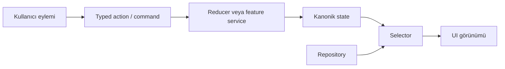
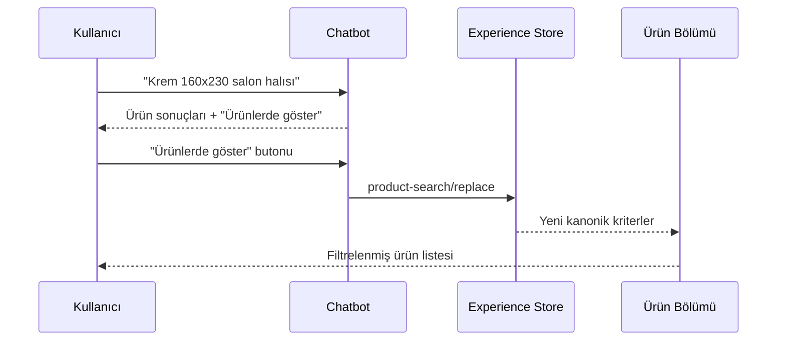

# 08 — Frontend Ortak State ve Veri Katmanı

> **Proje:** Merinos Chatbot Demo Localhost  
> **Görev türü:** Cursor uygulama görevi  
> **Ön koşullar:** `00`, `01`, `02`, `03`, `04`, `05`, `06` ve `07` numaralı görevler tamamlanmış olmalıdır.  
> **Kapsam:** Frontend state sahipliği, özellikler arası senkronizasyon, veri erişim sınırı, ortak sonuç/hata sözleşmeleri ve gelecekteki API geçişine hazırlık  
> **Sonraki görev:** `09-PYTHON-API-VE-SOZLESME-KATMANI.md`

---

## 1. Görevin amacı

Bu görevin amacı, Merinos localhost demosundaki frontend yapısını;

- her state alanı için tek ve açık bir sahip belirleme,
- yalnızca gerçekten paylaşılması gereken verileri ortak state'e taşıma,
- site ile chatbot arasındaki ürün ve bayi bağlamını kontrollü biçimde senkronize etme,
- ham demo verisini UI bileşenlerinden ayıran repository/veri erişim sınırı oluşturma,
- filtreleme, normalizasyon, sıralama ve seçim işlemlerini saf fonksiyonlarda toplama,
- yükleniyor, başarı, boş sonuç ve hata durumlarını standartlaştırma,
- stale response ve yarış durumu risklerini önleme,
- frontend'e özel hata mesajlarını domain hatalarından ayırma,
- kişisel veya hassas verilerin tarayıcıda gereksiz tutulmasını engelleme,
- gelecekte yerel demo kaynağından HTTP API'ye geçişi bileşenleri yeniden yazmadan mümkün kılma,
- otomatik testlerle reducer, selector, repository ve senkronizasyon davranışlarını doğrulama

ile sürdürülebilir hâle getirmektir.

Bu görev tamamlandığında:

1. ürün filtrelerinin tek bir kanonik frontend state'i olmalı,
2. ürün sonuçları state'e kopyalanmak yerine kanonik kriterlerden türetilmeli,
3. site üzerindeki filtre değişiklikleri chatbot tarafından güvenli biçimde okunabilmeli,
4. chatbot içindeki açık bir kullanıcı eylemi site ürün filtrelerini güncelleyebilmeli,
5. site ve chatbot aynı bayi seçimini paylaşabilmeli,
6. harita ile bayi listesi tek `selectedDealerId` kaynağı üzerinden çalışmalı,
7. widget açık/kapalı durumu tek bir sahip tarafından yönetilmeli,
8. mesaj geçmişi ile geçici gönderim durumu yalnızca konuşma katmanında kalmalı,
9. ürün, sipariş, bayi ve SSS verisine UI bileşenlerinden doğrudan erişilmemeli,
10. yerel demo repository'leri gelecekteki API repository'leriyle aynı işlevsel sözleşmeyi uygulayabilmeli,
11. hata, boş sonuç ve iptal durumları ortak bir sonuç modeliyle taşınabilmeli,
12. sipariş numarası, kullanıcı konumu ve konuşma geçmişi `localStorage`, `sessionStorage`, URL veya istemci loglarına yazılmamalıdır.

Bu adımda gerçek backend bağlantısı, Redis, LangGraph HTTP çağrısı, React Query, Redux, Zustand, XState, gerçek kimlik doğrulama, Service Worker, IndexedDB, çevrimdışı cache veya sunucu tarafı veri çekme eklenmeyecektir.

---

## 2. Başlamadan önce okunacak dosyalar

Cursor herhangi bir değişiklik yapmadan önce aşağıdaki dosyaları incelemelidir:

```text
cursor-tasks/00-PROJE-ANAYASASI.md
cursor-tasks/01-REPO-VE-GELISTIRME-TEMELI.md
cursor-tasks/02-MERINOS-DEMO-SITESI-VE-TASARIM-SISTEMI.md
cursor-tasks/03-CHATBOT-WIDGET-VE-KONUSMA-DENEYIMI.md
cursor-tasks/04-URUN-ARAMA-VE-FILTRELEME-AKISI.md
cursor-tasks/05-SIPARIS-DURUMU-SORGULAMA-AKISI.md
cursor-tasks/06-BAYI-BULMA-VE-HARITA-AKISI.md
cursor-tasks/07-SSS-VE-BILGI-BANKASI-AKISI.md
app/page.tsx
components/Chatbot.tsx
components/DealerMap.tsx
components/ProductVisual.tsx
lib/demo-data.ts
lib/types.ts
lib/chatbot/engine.ts
backend/src/merinos_agent/state.py
backend/src/merinos_agent/workers.py
docs/01-SISTEM-MIMARISI.md
docs/02-KULLANICI-AKISLARI.md
docs/03-MVP-KAPSAMI.md
docs/04-API-SOZLESMELERI.md
docs/05-TEST-SENARYOLARI.md
docs/06-LANGGRAPH-REDIS-STATE-MIMARISI.md
docs/07-SUPERVISOR-WORKER-MIMARISI.md
package.json
tsconfig.json
```

Değişiklik öncesinde mevcut kalite kapılarının sonucu kaydedilmelidir:

```bash
npm test
npm run lint
npm run build
```

Backend bağımlılıkları kurulmuşsa regresyon amacıyla:

```bash
cd backend
python -m pytest
```

Bir komut bağımlılık veya ortam eksikliği nedeniyle çalışmıyorsa hata gizlenmemeli; görev sonu raporunda komut, hata mesajı ve neden açıkça belirtilmelidir.

---

## 3. Mevcut durum ve temel sorunlar

### 3.1. `app/page.tsx` içindeki state'ler

Mevcut sayfa en az şu state alanlarını doğrudan yönetmektedir:

```ts
const [category, setCategory] = useState("Tümü");
const [color, setColor] = useState("Tümü");
const [size, setSize] = useState("Tümü");
const [chatOpen, setChatOpen] = useState(false);
const [menuOpen, setMenuOpen] = useState(false);
const [dealerCity, setDealerCity] = useState("Gaziantep");
const [selectedDealerId, setSelectedDealerId] = useState(dealers[0].id);
```

Bu state'lerin tamamı global değildir ve global yapılmamalıdır.

- `menuOpen` yalnızca header/mobil menü bileşenine aittir.
- modal, dropdown, hover, accordion ve odak gibi geçici UI state'leri ilgili bileşende kalmalıdır.
- ürün arama kriterleri site ve chatbot arasında paylaşılacağı için ortak deneyim state'ine adaydır.
- bayi arama kriterleri ve `selectedDealerId` site, harita ve chatbot arasında paylaşılacağı için ortak deneyim state'ine adaydır.
- `chatOpen`, launcher ve site CTA'ları tarafından kullanıldığı için ortak deneyim state'inde tutulabilir.

### 3.2. `components/Chatbot.tsx` içindeki state'ler

Mevcut widget en az şu state alanlarını doğrudan yönetmektedir:

```ts
const [chatInput, setChatInput] = useState("");
const [messages, setMessages] = useState<ChatMessage[]>(initialMessages);
const [activeIntent, setActiveIntent] = useState<ChatIntent>(null);
const [typing, setTyping] = useState(false);
const [unread, setUnread] = useState(true);
```

Bu alanların sahipliği aşağıdaki biçimde ayrılmalıdır:

| State | Sahip | Ortak state'e taşınmalı mı? |
| --- | --- | --- |
| Composer draft | Chatbot konuşma katmanı | Hayır |
| Mesaj geçmişi | Chatbot konuşma katmanı | Hayır |
| Aktif niyet | Chatbot konuşma katmanı | Hayır; dış bağlam yalnızca event ile aktarılır |
| Gönderim/yazıyor durumu | İlgili mesaj/istek | Hayır |
| Retry bilgisi | İlgili mesaj/istek | Hayır |
| Unread sayısı | Chatbot görünürlük katmanı | Gerekirse evet; yalnızca sayı |
| Widget açık/kapalı | Ortak deneyim state'i | Evet |
| Site kaynaklı başlangıç bağlamı | Ortak deneyim state'i | Evet; tek kullanımlık event/payload |

Konuşma transcript'i ortak sayfa context'ine konulmamalıdır. Aksi hâlde her yeni token veya mesaj tüm sayfanın yeniden render edilmesine neden olabilir ve hassas veri yayılım alanı büyür.

### 3.3. Ham veriye doğrudan erişim

Mevcut bileşenler aşağıdaki kaynağı doğrudan import etmektedir:

```text
lib/demo-data.ts
```

Bu dosya demo seed verisinin sahibi olarak kalabilir; ancak aşağıdaki katmanlar ham dizi import etmemelidir:

- sayfa bölüm bileşenleri,
- chatbot UI bileşenleri,
- harita görünümü,
- sonuç kartları,
- ileride eklenecek frontend transport katmanı.

Ham veri erişimi yalnızca local repository/adaptör katmanında yapılmalıdır.

### 3.4. Türetilmiş verinin state'e kopyalanma riski

Şu değerler bağımsız state olarak tutulmamalıdır:

- filtrelenmiş ürün listesi,
- şehirdeki bayi listesi,
- seçilen bayi nesnesi,
- ürün facet seçenekleri,
- SSS konu seçenekleri,
- toplam sonuç sayısı,
- `isEmpty` gibi başka verilerden türeyen bayraklar.

Bunlar selector veya saf fonksiyonlarla kanonik state ve repository çıktısından hesaplanmalıdır.

---

## 4. Mimari ilkeler

### 4.1. En küçük ortak state

Her state alanı için şu sıra izlenmelidir:

1. Tek bileşen kullanıyorsa bileşende tut.
2. Aynı özellik altındaki birkaç bileşen kullanıyorsa feature hook/reducer içinde tut.
3. Site ile chatbot gibi iki ayrı özellik gerçekten paylaşıyorsa ortak deneyim context'ine taşı.
4. Sunucudan gelen kalıcı domain verisini UI state'i gibi yönetme; repository sonucu olarak ele al.
5. Türetilmiş veriyi state'e kopyalama.

“İleride gerekebilir” gerekçesiyle state globalleştirilmemelidir.

### 4.2. Tek yönlü veri akışı

Akış şu yönde olmalıdır:



Kurallar:

- iki state alanı `useEffect` ile birbirini sürekli kopyalamamalıdır,
- props'tan state'e kör kopyalama yapılmamalıdır,
- site filtresi ve chatbot filtresi ayrı kaynaklarda tutulup effect ile senkronize edilmemelidir,
- senkronizasyon açık kullanıcı action'larıyla yapılmalıdır,
- reducer içinde yan etki, DOM erişimi, zamanlayıcı, `fetch` veya rastgele kimlik üretimi yapılmamalıdır.

### 4.3. Domain, veri ve görünüm ayrımı

Önerilen sorumluluklar:

| Katman | Sorumluluk | Yapmaması gereken |
| --- | --- | --- |
| Domain | Normalizasyon, doğrulama, filtreleme, sıralama, selector | React hook, DOM, ağ çağrısı |
| Data/Repository | Veri kaynağını okumak, ortak sonuç zarfı döndürmek | Görsel metin üretmek, toast göstermek |
| Application/Feature | Kullanıcı komutunu işlemek, repository ve state'i birleştirmek | Ham seed veriye erişmek |
| UI | State'i göstermek, erişilebilir etkileşim toplamak | İş kuralı ve veri sorgusu kopyalamak |
| Transport | Gelecekte HTTP çağrısı ve abort/timeout | Domain sonucu uydurmak |

### 4.4. Yeni bağımlılık eklememe

Bu görevde mevcut React araçları yeterlidir:

- `createContext`,
- `useContext`,
- `useReducer`,
- `useMemo`,
- `useCallback`,
- gerekirse küçük feature hook'ları.

Redux, Zustand, MobX, Recoil, Jotai, XState, React Query, SWR veya benzeri bir paket eklenmemelidir.

Yeni bir bağımlılık ancak mevcut araçlarla çözülemeyen somut bir gereksinim, bundle etkisi ve alternatif analizi yazılı olarak sunulursa değerlendirilebilir. Bu görevin varsayılanı **sıfır yeni runtime bağımlılığıdır**.

---

## 5. Hedef klasör ve modül yapısı

Mevcut proje küçük olduğu için tek seferde aşırı klasörleşme yapılmamalıdır. Aşağıdaki yapı önerilir; mevcut `04–07` görevleri farklı ama eşdeğer bir feature yapısı oluşturduysa ona uyum sağlanmalıdır:

```text
components/
  providers/
    DemoExperienceProvider.tsx

features/
  experience/
    state.ts
    actions.ts
    selectors.ts
    context.ts
  products/
    types.ts
    selectors.ts
    repository.ts
    local-product-repository.ts
  orders/
    types.ts
    repository.ts
    local-order-repository.ts
  dealers/
    types.ts
    selectors.ts
    repository.ts
    local-dealer-repository.ts
  knowledge/
    types.ts
    repository.ts
    local-knowledge-repository.ts

lib/
  data/
    result.ts
    repositories.ts
  formatters/
    currency.ts
    date.ts
    distance.ts
  demo-data.ts
  types.ts
```

Alternatif olarak mevcut uygulamada `lib/products`, `lib/dealers` gibi bir yapı daha önce oluşturulmuşsa aynı kavramlar o yapıda uygulanabilir. Aynı sorumluluk için ikinci bir paralel klasör ağacı oluşturulmamalıdır.

### 5.1. Geriye uyumluluk

Aşağıdaki public import ve bileşen sözleşmeleri korunmalıdır:

```ts
import { Chatbot } from "@/components/Chatbot";

<Chatbot
  open={chatOpen}
  onOpen={openChat}
  onClose={closeChat}
/>
```

`03` görevi kapsamında bu prop sözleşmesi genişletildiyse mevcut çağrılar bozulmamalıdır. Provider kullanımı public `Chatbot` import yolunu değiştirmemelidir.

Aşağıdaki motor sözleşmesi de backend görevi başlayana kadar korunmalıdır:

```ts
resolveChatInput(query: string, activeIntent: ChatIntent): ChatReply
```

Bu görev `resolveChatInput` fonksiyonunun iş mantığını HTTP'ye taşımamalıdır.

---

## 6. Ortak deneyim state modeli

### 6.1. State kapsamı

Ortak state yalnızca özellikler arası koordinasyon için gerekli alanları içermelidir.

Önerilen model:

```ts
export type ProductSearchCriteria = {
  query: string;
  categories: string[];
  colors: string[];
  sizes: string[];
  collections: string[];
};

export type DealerSearchCriteria = {
  city: string | null;
  district: string | null;
};

export type ChatEntryContext =
  | {
      id: string;
      kind: "product-search";
      criteria: ProductSearchCriteria;
    }
  | {
      id: string;
      kind: "product";
      productId: number;
    }
  | {
      id: string;
      kind: "dealer-search";
      criteria: DealerSearchCriteria;
    }
  | {
      id: string;
      kind: "dealer";
      dealerId: string;
    }
  | {
      id: string;
      kind: "faq";
      faqId: string;
    };

export type DemoExperienceState = {
  schemaVersion: 1;
  productSearch: ProductSearchCriteria;
  dealerSearch: DealerSearchCriteria;
  selectedDealerId: string | null;
  chat: {
    open: boolean;
    unreadCount: number;
    entryContext: ChatEntryContext | null;
  };
};
```

Bu model birebir kopyalanmak zorunda değildir; ancak aynı sahiplik sınırlarını sağlamalıdır.

### 6.2. State'e alınmayacak alanlar

Aşağıdaki alanlar `DemoExperienceState` içine eklenmemelidir:

- tüm ürün dizisi,
- filtrelenmiş ürün listesi,
- tüm bayi dizisi,
- seçilen bayi nesnesi,
- sipariş nesnesi,
- sipariş numarası,
- kullanıcının enlem/boylamı,
- tam mesaj geçmişi,
- composer metni,
- DOM referansları,
- timeout kimlikleri,
- `AbortController` nesnesi,
- formatlanmış fiyat veya tarih metinleri,
- global tek bir `loading` ya da `error` alanı.

### 6.3. Varsayılan state

Varsayılan değerler ham sabitler şeklinde farklı dosyalara kopyalanmamalıdır.

Örnek:

```ts
export const initialProductSearchCriteria: ProductSearchCriteria = {
  query: "",
  categories: [],
  colors: [],
  sizes: [],
  collections: [],
};

export const initialExperienceState: DemoExperienceState = {
  schemaVersion: 1,
  productSearch: initialProductSearchCriteria,
  dealerSearch: {
    city: "Gaziantep",
    district: null,
  },
  selectedDealerId: null,
  chat: {
    open: false,
    unreadCount: 0,
    entryContext: null,
  },
};
```

İlk bayi seçimi repository verisi yüklendikten sonra açık bir init/normalize işlemiyle belirlenebilir. Modül import edilirken demo dizisinin ilk elemanına doğrudan bağımlılık oluşturulmamalıdır.

---

## 7. Typed action ve reducer sözleşmesi

### 7.1. Action modeli

Reducer action'ları discriminated union olmalıdır.

Önerilen örnek:

```ts
export type ExperienceAction =
  | {
      type: "product-search/replace";
      criteria: ProductSearchCriteria;
      source: "site" | "chatbot";
    }
  | {
      type: "product-search/reset";
      source: "site" | "chatbot";
    }
  | {
      type: "dealer-search/replace";
      criteria: DealerSearchCriteria;
      source: "site" | "chatbot";
    }
  | {
      type: "dealer/select";
      dealerId: string | null;
      source: "list" | "map" | "chatbot" | "initialization";
    }
  | {
      type: "chat/open";
      context?: ChatEntryContext;
    }
  | { type: "chat/close" }
  | { type: "chat/context-consumed"; id: string }
  | { type: "chat/unread-set"; count: number };
```

Kurallar:

- action payload'ları `any` olmamalıdır,
- action adları kullanıcı niyetini veya domain olayını ifade etmelidir,
- `setState` benzeri belirsiz global action kullanılmamalıdır,
- reducer bilinmeyen action'da state'i değiştirmeden döndürmelidir,
- reducer input state'i veya iç içe dizileri mutate etmemelidir,
- `source` alanı analitik amaçla loglanmak zorunda değildir; effect döngülerini ve testleri açıklamak için kullanılabilir,
- hassas veri action payload'ına konulmamalıdır.

### 7.2. Reducer invariants

Reducer aşağıdaki invariant'ları korumalıdır:

1. `unreadCount` hiçbir zaman negatif olamaz.
2. `entryContext` tek kullanımlık ve kimlikli olmalıdır.
3. Tüketilmiş eski context, yanlış `id` ile temizlenmemelidir.
4. Ürün kriterlerinde duplicate değer kalmamalıdır.
5. Ürün kriterleri domain normalizasyonundan geçmeden state'e yazılmamalıdır.
6. İl değiştiğinde seçili bayi artık sonuç kümesinde değilse seçim güvenli biçimde sıfırlanmalıdır.
7. `selectedDealerId` bulunmayan bir bayi kimliğine sessizce sabitlenmemelidir.
8. Widget kapanınca transcript veya draft otomatik silinmemelidir.
9. Ürün veya bayi seçimleri widget açma işlemiyle birleştirilecekse bu tek atomik action/command üzerinden yapılmalıdır.

Reducer domain verisini doğrulamak için repository'ye çağrı yapmamalıdır. Veri kümesine bağlı seçim doğrulaması selector/application katmanında yapılmalıdır.

---

## 8. Context ve hook tasarımı

### 8.1. Provider sınırı

`DemoExperienceProvider` uygulamadaki site kabuğunu ve chatbot'u kapsamalıdır. `app/layout.tsx` tamamen server component olarak kalacaksa provider, küçük bir client `Providers` bileşeni üzerinden eklenebilir. Tüm layout gereksiz yere client component'e çevrilmemelidir.

Örnek kullanım:

```tsx
<DemoExperienceProvider>
  <HomePage />
</DemoExperienceProvider>
```

Provider değeri memoize edilmelidir:

```ts
const value = useMemo(
  () => ({ state, dispatch, commands }),
  [state, commands],
);
```

Ancak tek bir context içine büyük ve sık değişen transcript konulmamalıdır.

### 8.2. Okuma ve komut erişimi

Mümkünse okuma ile komut erişimi ayrılmalıdır:

```ts
const state = useDemoExperienceState();
const commands = useDemoExperienceCommands();
```

Bu ayrım gereksiz render'ları azaltmak için kullanılabilir. Proje boyutuna göre tek context kullanılacaksa profiler veya render sayacıyla belirgin bir performans sorunu oluşturmadığı doğrulanmalıdır.

### 8.3. Guard

Provider dışında hook kullanımında sessiz `undefined` dönülmemelidir:

```ts
export function useDemoExperienceState() {
  const value = useContext(DemoExperienceStateContext);
  if (!value) {
    throw new Error(
      "useDemoExperienceState, DemoExperienceProvider içinde kullanılmalıdır.",
    );
  }
  return value;
}
```

Kullanıcıya gösterilecek hata metni ile geliştirici hatası birbirine karıştırılmamalıdır.

---

## 9. Site ile chatbot arasında bağlam aktarımı

### 9.1. Temel ilke

Site ile chatbot birbirinin iç state'ini doğrudan değiştirmemelidir. Bağlam aktarımı typed command/event üzerinden yapılmalıdır.

Yanlış örnek:

```ts
chatbotRef.current?.setActiveIntent("product");
chatbotRef.current?.setMessages(...);
```

Doğru yaklaşım:

```ts
commands.openChat({
  kind: "product-search",
  id: createUiEventId(),
  criteria: state.productSearch,
});
```

### 9.2. Tek kullanımlık entry context

`entryContext` aşağıdaki akışla çalışmalıdır:

1. Kullanıcı sitede “Asistana sor” eylemini seçer.
2. Ortak state'e kimlikli ve kişisel veri içermeyen context yazılır.
3. Widget açılır.
4. Chatbot context'i yalnızca bir kez yorumlar.
5. Yorumlama başarılı olduktan sonra aynı `id` için `chat/context-consumed` dispatch edilir.
6. Yeniden render aynı mesajı veya action'ı tekrar üretmez.

`useEffect` bağımlılığı nedeniyle aynı context'in iki kez tüketilmesine karşı test yazılmalıdır. React Strict Mode davranışı dikkate alınmalıdır.

### 9.3. Chatbot'tan siteye işlem

Chatbot yalnızca açık kullanıcı eylemiyle site state'ini değiştirebilir.

Örnek action etiketleri:

- “Bu filtreleri ürünlerde göster”
- “Bayi haritasında aç”
- “Filtreleri temizle”

Bot cevabı geldiği anda site filtresi veya scroll konumu otomatik değiştirilmemelidir. Kullanıcı butona basmalıdır.

Örnek akış:



### 9.4. Scroll ve focus

Scroll/focus state'e yazılmamalıdır. State güncellendikten sonra ilgili command'in UI adaptörü:

- ürün bölümü başlığına scroll,
- bayi bölümüne scroll,
- uygun başlığa programatik focus

gibi erişilebilir yan etkileri yönetebilir.

`window.scrollTo` reducer veya repository içinde çağrılmamalıdır.

---

## 10. Feature state sınırları

### 10.1. Ürün arama state'i

Ürün arama kriterleri `04` görevindeki kanonik modele uygun olmalıdır.

Kurallar:

- site select alanları ve chatbot filtreleri aynı domain değerlerini kullanmalıdır,
- UI'daki `"Tümü"` domain state'ine gerçek kategori gibi yazılmamalıdır; boş seçimle temsil edilmelidir,
- filtre grupları arasındaki AND ve grup içi OR semantiği selector'da korunmalıdır,
- sonuç listesi state'e yazılmamalıdır,
- facet seçenekleri repository verisinden türetilmelidir,
- fiyat formatlama arama katmanında yapılmamalıdır,
- kullanıcıya gösterilmeyen relevance skoru UI state'ine konulmamalıdır.

Örnek selector:

```ts
export function selectProductSearchResult(
  products: readonly Product[],
  criteria: ProductSearchCriteria,
): ProductSearchResult {
  // Normalize et, filtrele, sırala ve facet bilgilerini döndür.
}
```

Selector aynı input için deterministik sonuç vermeli ve input dizisini değiştirmemelidir.

### 10.2. Bayi state'i

`06` görevindeki ortak seçim modeli korunmalıdır.

- `dealerSearch.city` ve `district` arama kriteridir.
- `selectedDealerId` tek seçim kaynağıdır.
- `selectedDealer` selector ile türetilir.
- `visibleDealers` selector ile türetilir.
- kullanıcı koordinatı ortak state'e yazılmaz.
- yaklaşık mesafeler arama oturumunun geçici sonucu olabilir; kalıcı state veya storage'a yazılmaz.
- şehir değişince ilk bayiyi otomatik seçme davranışı açık ve test edilmiş olmalıdır.
- liste ve harita farklı `selectedId` state'leri oluşturmamalıdır.

### 10.3. Sipariş state'i

`05` görevi gereği sipariş bilgisi özellikler arası global state'e taşınmamalıdır.

- normalize edilmiş sipariş numarası yalnızca sorgu işlemi süresince tutulmalıdır,
- başarılı demo sonuç yalnızca ilgili mesaj kartı veya feature request state'inde bulunmalıdır,
- widget kapanınca sipariş verisini sayfa context'ine aktarma yapılmamalıdır,
- sipariş sorgusu URL parametresine, storage'a veya analytics payload'ına yazılmamalıdır,
- gerçek sistemde auth/session sahipliği backend sorumluluğudur.

### 10.4. SSS state'i

- SSS kayıtları repository'den okunmalıdır.
- seçilen konu, chatbot konuşma state'inde veya SSS bölümünün yerel UI state'inde tutulabilir.
- tam SSS dizisi ortak experience state'ine kopyalanmamalıdır.
- `published` filtreleme repository/domain katmanında yapılmalıdır.
- source/version alanları sonuç kartına repository çıktısından gelmelidir.

### 10.5. Chatbot konuşma state'i

Konuşma state'i tercihen `useReducer` kullanan feature hook'a ayrılmalıdır:

```text
features/chat/
  conversation-reducer.ts
  useConversation.ts
  types.ts
```

Önerilen request durumu:

```ts
export type RequestState =
  | { status: "idle" }
  | { status: "submitting"; requestId: string }
  | { status: "failed"; requestId: string; retryable: boolean }
  | { status: "succeeded"; requestId: string };
```

Tek bir global `typing: boolean` yerine istek veya bot mesajıyla ilişkili durum kullanılmalıdır. Ancak `03` görevi hâlihazırda eşdeğer bir model kurduysa ikinci bir model eklenmemelidir.

---

## 11. Ortak veri sonucu ve hata sözleşmesi

### 11.1. `DataResult<T>`

Repository'ler exception'ı UI'ya kontrolsüz biçimde fırlatmak yerine ortak bir discriminated union kullanmalıdır.

Önerilen model:

```ts
export type DataSourceKind = "local-demo" | "http-api";

export type DataMeta = {
  source: DataSourceKind;
  isDemo: boolean;
  retrievedAt: string;
  version?: string;
};

export type DataErrorCode =
  | "INVALID_INPUT"
  | "NOT_FOUND"
  | "UNAVAILABLE"
  | "TIMEOUT"
  | "ABORTED"
  | "UNAUTHORIZED"
  | "FORBIDDEN"
  | "RATE_LIMITED"
  | "INVALID_RESPONSE"
  | "UNKNOWN";

export type DataError = {
  code: DataErrorCode;
  retryable: boolean;
  safeMessage: string;
  cause?: unknown;
};

export type DataResult<T> =
  | {
      ok: true;
      data: T;
      meta: DataMeta;
    }
  | {
      ok: false;
      error: DataError;
      meta?: DataMeta;
    };
```

`cause` UI'ya veya loga otomatik basılmamalıdır. Kullanıcıya yalnızca `safeMessage` veya hata kodundan üretilen onaylı metin gösterilmelidir.

### 11.2. “Bulunamadı” semantiği

Her domain için “bulunamadı” aynı anlama gelmez:

- ürün aramasında boş sonuç başarılı bir arama sonucudur,
- bayi aramasında desteklenen şehirde sıfır sonuç başarılı ama boş sonuçtur,
- SSS'de eşik altı eşleşme `no-match` domain sonucudur,
- sipariş sorgusunda güvenlik nedeniyle “yok” ve “erişilemiyor” kullanıcıya aynı güvenli mesajla sunulabilir.

Bu nedenle her boş durum otomatik olarak `DataErrorCode: "NOT_FOUND"` yapılmamalıdır. Domain output türleri açık olmalıdır.

Örnek:

```ts
export type ProductSearchOutput = {
  status: "results" | "empty";
  items: Product[];
  total: number;
  appliedCriteria: ProductSearchCriteria;
  suggestions: ProductSearchSuggestion[];
};
```

### 11.3. Kullanıcı mesajı ve teknik detay ayrımı

Aşağıdakiler kullanıcıya gösterilmemelidir:

- stack trace,
- HTTP body,
- Redis/LangGraph isimleri,
- dahili endpoint,
- environment variable adı,
- ham exception mesajı,
- sipariş numarası veya koordinat içeren log metni.

Geliştirici logları güvenli ve yapılandırılmış olmalıdır; bu görevde yeni telemetry servisi eklenmemelidir.

---

## 12. Repository sözleşmeleri

### 12.1. Genel kurallar

Repository sözleşmeleri:

- UI bileşenlerinden bağımsız olmalı,
- `ReactNode`, CSS class veya görünüm metni döndürmemeli,
- input nesnesini mutate etmemeli,
- çıktı listelerini kanonik ve deterministik sırada döndürmeli,
- demo kaynağını `isDemo: true` metadata'sıyla işaretlemeli,
- gelecekte HTTP implementasyonuna geçilebilecek kadar açık olmalı,
- gereksiz “generic repository” soyutlamasına dönüşmemelidir.

### 12.2. Ürün repository

Önerilen sözleşme:

```ts
export interface ProductRepository {
  getFacets(): Promise<DataResult<ProductFacets>>;
  search(
    criteria: ProductSearchCriteria,
    options?: DataRequestOptions,
  ): Promise<DataResult<ProductSearchOutput>>;
  getById(
    productId: number,
    options?: DataRequestOptions,
  ): Promise<DataResult<Product | null>>;
}
```

Local implementasyon sync hesap yapabilir; public sözleşmenin `Promise` olması gelecekteki HTTP geçişini kolaylaştırır. Bu karar mevcut synchronous engine akışını bozmamalıdır. Gerekirse engine için saf domain fonksiyonları repository'den ayrı tutulur.

### 12.3. Sipariş repository

```ts
export type OrderLookupOutput =
  | { status: "found"; order: DemoOrder }
  | { status: "unavailable" };

export interface OrderRepository {
  getStatus(
    canonicalOrderNumber: string,
    options?: DataRequestOptions,
  ): Promise<DataResult<OrderLookupOutput>>;
}
```

Güvenlik nedeniyle `not-found` durumunun kullanıcıya detaylı ayrıştırılması zorunlu değildir.

### 12.4. Bayi repository

```ts
export interface DealerRepository {
  getLocations(): Promise<DataResult<DealerLocationOptions>>;
  search(
    criteria: DealerSearchCriteria,
    options?: DataRequestOptions,
  ): Promise<DataResult<DealerSearchOutput>>;
  getById(
    dealerId: string,
    options?: DataRequestOptions,
  ): Promise<DataResult<Dealer | null>>;
}
```

Konum izni ve browser geolocation repository'nin sorumluluğu değildir. Geolocation ayrı bir browser adapter/service olmalıdır.

### 12.5. Bilgi bankası repository

```ts
export interface KnowledgeRepository {
  listTopics(): Promise<DataResult<KnowledgeTopicSummary[]>>;
  getPublishedById(
    faqId: string,
    options?: DataRequestOptions,
  ): Promise<DataResult<Faq | null>>;
  match(
    query: string,
    options?: DataRequestOptions,
  ): Promise<DataResult<KnowledgeMatchResult>>;
}
```

Yayın durumu kontrolü local repository içinde zorunlu olmalıdır. UI `status` filtresini tekrar uygulamak zorunda kalmamalıdır.

### 12.6. Request seçenekleri

Gelecekteki HTTP uygulamasına hazırlık için ortak seçenek tanımlanabilir:

```ts
export type DataRequestOptions = {
  signal?: AbortSignal;
  requestId?: string;
};
```

Local repository `signal.aborted` durumunda `ABORTED` sonucu döndürebilir. Timeout bu görevde gerçek ağ çağrısı olmadığı için simüle edilmemeli veya gereksiz zamanlayıcı eklenmemelidir.

---

## 13. Local demo repository'leri

### 13.1. Tek seed kaynağı

`lib/demo-data.ts` demo verisinin tek seed kaynağı olarak kalmalıdır. Aynı ürün, bayi, sipariş veya SSS dizisi başka dosyada kopyalanmamalıdır.

Local repository örneği:

```ts
import { products } from "@/lib/demo-data";

export const localProductRepository: ProductRepository = {
  async search(criteria, options) {
    if (options?.signal?.aborted) {
      return abortedResult();
    }

    const output = searchProducts(products, criteria);

    return {
      ok: true,
      data: output,
      meta: createLocalDemoMeta("products-demo-1"),
    };
  },
};
```

### 13.2. Mutation koruması

Repository tüketicisinin seed verisini değiştirmesi engellenmelidir.

- input dizileri mutate edilmemeli,
- sıralama öncesi kopya alınmalı,
- UI bileşeni ürün nesnesine geçici alan eklememeli,
- geliştirme ortamında uygun ise `Object.freeze` veya readonly türler kullanılabilir,
- deep-clone her render'da yapılmamalıdır.

### 13.3. Metadata üretimi

`retrievedAt` tek bir yardımcı fonksiyon üzerinden ISO tarih olarak üretilmelidir.

```ts
export function createLocalDemoMeta(version?: string): DataMeta {
  return {
    source: "local-demo",
    isDemo: true,
    retrievedAt: new Date().toISOString(),
    version,
  };
}
```

`retrievedAt` selector veya reducer testlerini kararsız hâle getirmemelidir. Testlerde clock enjekte edilmeli veya yalnızca biçim kontrol edilmelidir.

---

## 14. Repository sağlama ve bağımlılık enjeksiyonu

### 14.1. Bileşen içinde singleton import sınırı

Küçük demo için repository'ler doğrudan feature service'e import edilebilir; ancak test edilebilirlik amacıyla üst seviyede bir container önerilir:

```ts
export type FrontendRepositories = {
  products: ProductRepository;
  orders: OrderRepository;
  dealers: DealerRepository;
  knowledge: KnowledgeRepository;
};

export const localDemoRepositories: FrontendRepositories = {
  products: localProductRepository,
  orders: localOrderRepository,
  dealers: localDealerRepository,
  knowledge: localKnowledgeRepository,
};
```

Provider testlerde özel repository seti alabilmelidir:

```tsx
<DemoExperienceProvider repositories={testRepositories}>
  {children}
</DemoExperienceProvider>
```

Public uygulama kullanımında prop isteğe bağlı olup local demo default'u kullanılabilir.

### 14.2. Client/server import sınırı

Frontend repository dosyaları:

- `backend/` Python kodunu import etmemeli,
- secret veya server-only environment variable okumamalı,
- Node.js dosya sistemi kullanmamalı,
- private endpoint veya token içermemeli,
- client bundle'a `.env` secret taşımamalıdır.

Gelecekte HTTP repository eklendiğinde yalnızca public base URL gibi güvenli istemci yapılandırmaları kullanılmalıdır.

---

## 15. Request yaşam döngüsü ve yarış durumu güvenliği

Bu görevde local repository hızlı olsa da katman gelecekte ağ çağrısına hazır olmalıdır.

### 15.1. Feature request state

Her veri akışı kendi request durumunu taşımalıdır:

```ts
export type AsyncState<T> =
  | { status: "idle" }
  | { status: "loading"; requestId: string }
  | { status: "success"; requestId: string; data: T; meta: DataMeta }
  | { status: "empty"; requestId: string; data: T; meta: DataMeta }
  | {
      status: "error";
      requestId: string;
      error: DataError;
    };
```

Tek bir global `isLoading` veya `error` kullanılmamalıdır.

### 15.2. Son istek kazanır

Kullanıcı filtreleri hızlı değiştirirse eski istek yeni state'i ezmemelidir.

- her istek kimlikli olmalıdır,
- yeni sorgu başladığında önceki `AbortController` iptal edilebilir,
- yalnızca aktif `requestId` ile eşleşen sonuç state'e yazılmalıdır,
- iptal kullanıcıya hata toast'ı olarak gösterilmemelidir,
- component unmount sonrasında state update yapılmamalıdır.

Bu davranış kontrollü promise kullanan testle doğrulanmalıdır.

### 15.3. Strict Mode

Geliştirme ortamında React Strict Mode nedeniyle effect'lerin tekrar çalışması:

- duplicate bot mesajı,
- duplicate repository çağrısı,
- entry context'in iki kez tüketilmesi,
- iki ayrı timeout,
- iki ayrı konum izni isteği

oluşturmamalıdır.

Konum izni hiçbir mount effect'iyle istenmemelidir; yalnızca kullanıcı eylemiyle başlatılmalıdır.

---

## 16. Cache ve kalıcılık politikası

### 16.1. İzin verilen geçici cache

Aşağıdaki veriler modül ömrü veya memory cache içinde tutulabilir:

- statik demo ürün facet'leri,
- yayınlanmış SSS konu listesi,
- demo şehir/ilçe seçenekleri,
- immutable seed veriden türetilen deterministik indeksler.

Cache invalidation, repository metadata `version` alanıyla ilişkilendirilebilir. Ancak demo için karmaşık bir cache sistemi kurulmasına gerek yoktur.

### 16.2. Yasak kalıcılık

Aşağıdaki veriler `localStorage`, `sessionStorage`, IndexedDB, cookie veya URL'de tutulmamalıdır:

- konuşma geçmişi,
- composer draft'ı,
- sipariş numarası,
- sipariş sonucu,
- kargo kodu,
- enlem/boylam,
- konum izni sonucu,
- müşteri adı/e-posta/telefon,
- kullanıcı mesajının ham metni.

### 16.3. URL state

Bu MVP'de filtreleri URL parametresine yazmak zorunlu değildir. Uygulanacaksa yalnızca kişisel olmayan, whitelist edilmiş ürün filtreleri kullanılabilir. Sipariş, konum, chat metni veya bayi telefonu URL'ye yazılamaz.

Bu görevde URL senkronizasyonu eklenmemelidir; gelecekte ayrı karar olarak ele alınmalıdır.

---

## 17. Selector ve formatlama kuralları

### 17.1. Selector özellikleri

Selector'lar:

- saf olmalı,
- aynı input için aynı sıralamayı üretmeli,
- input'u mutate etmemeli,
- UI metni değil domain verisi döndürmeli,
- gereksiz `useMemo` zincirleri oluşturmamalıdır.

Örnekler:

```ts
selectFilteredProducts(products, criteria)
selectProductFacets(products)
selectVisibleDealers(dealers, criteria)
selectDealerById(visibleDealers, selectedDealerId)
selectPublishedFaqs(faqs)
```

### 17.2. Formatlayıcılar

Fiyat, tarih ve mesafe formatlama tekil yardımcı fonksiyonlarda tutulmalıdır:

```text
lib/formatters/currency.ts
lib/formatters/date.ts
lib/formatters/distance.ts
```

Kurallar:

- `Intl.NumberFormat("tr-TR")` merkezi kullanılmalıdır,
- ISO tarih domain katmanında kalmalı, kullanıcı metnine UI yakınında dönüştürülmelidir,
- yaklaşık mesafe görünür biçimde “yaklaşık” olarak işaretlenmelidir,
- formatlanmış değer repository'de saklanmamalıdır,
- `app/page.tsx` ve `components/Chatbot.tsx` içinde aynı `formatPrice` fonksiyonu kopyalanmamalıdır.

---

## 18. UI bileşenlerinin veri katmanıyla ilişkisi

### 18.1. Sayfa bileşeni

`app/page.tsx` aşağıdaki işleri yapmamalıdır:

- ham `products`, `dealers`, `faqs`, `orders` dizilerini filtrelemek,
- tüm repository çağrılarını tek dosyada yönetmek,
- domain normalizasyonu yapmak,
- farklı feature'ların error/loading state'lerini birleştirmek.

Sayfa bileşeni bölüm bileşenlerini bir araya getiren ince bir composition katmanı olmalıdır.

### 18.2. Ürün bölümü

Ürün bölümü:

- kanonik kriterleri ortak hook'tan okumalı,
- facet ve sonuçları feature hook/repository'den almalı,
- filtre kontrollerini typed command ile güncellemeli,
- ürün kartına yalnızca gerekli view model'i geçmelidir.

### 18.3. Bayi bölümü ve harita

Bayi listesi ile `DealerMap`:

- aynı görünür bayi dizisini kullanmalı,
- aynı `selectedDealerId` değerini okumalı,
- seçim değişikliğini aynı command'e dispatch etmeli,
- `DealerMap` içinde ikinci bir bağımsız `selectedId` oluşturmamalıdır.

`06` görevinde Chatbot içindeki mini bayi kartı yerel seçim gerektiriyorsa bunun site haritasındaki kanonik seçimle ilişkisi açıkça tanımlanmalıdır. “Haritada aç” eylemi kullanıcı tıklayınca ortak seçimi güncellemelidir.

### 18.4. Chatbot

Chatbot:

- transcript'i kendi feature reducer'ında tutmalı,
- ortak state'ten yalnızca `open`, `entryContext` ve gerekirse `unreadCount` okumalı,
- repository sonuçlarını mesaj view model'ine dönüştüren application katmanını kullanmalı,
- raw demo-data import etmemeli,
- site state'ini bot cevabı gelir gelmez otomatik değiştirmemelidir.

---

## 19. View model sınırı

Domain modelleri doğrudan her UI ihtiyacını taşımamalıdır. UI'ya özel alan gerekiyorsa typed view model kullanılabilir.

Örnek:

```ts
export type ProductCardViewModel = {
  id: number;
  name: string;
  collection: string;
  details: string;
  formattedPrice: string;
  stockLabel: string;
  stockTone: "available" | "limited";
};
```

Kurallar:

- domain `Product` tipi içine `formattedPrice`, CSS class veya button label eklenmemeli,
- view model oluşturma saf mapper fonksiyonunda yapılmalı,
- mapper iş kuralı veya repository çağrısı yapmamalı,
- aynı mapper site ve chatbot kartları arasında ortaklaştırılacaksa her iki görünümün erişilebilirlik ihtiyacı korunmalıdır.

---

## 20. Veri doğrulama ve type guard'lar

Bu görevde yeni runtime schema paketi eklenmeyecektir. Yerel demo verisi TypeScript ile derleme zamanında doğrulanabilir. Gelecekte HTTP cevabı geldiğinde runtime validation gerekeceği dokümante edilmelidir.

Gerekli yerlerde küçük type guard'lar yazılabilir:

```ts
export function isProduct(value: unknown): value is Product {
  // Alanları açıkça doğrula; yalnızca `as Product` kullanma.
}
```

Kurallar:

- `JSON.parse(...) as SomeType` kör cast yapılmamalıdır,
- `any` ile repository cevabı taşınmamalıdır,
- enum/union değerleri whitelist edilmelidir,
- geçersiz cevap `INVALID_RESPONSE` olarak dönmelidir,
- gerçek HTTP adaptörü `09` ve sonraki görevlerin kapsamıdır.

---

## 21. Hata, boş durum ve retry UX bağlantısı

`03–07` görevlerinde tanımlanan UI davranışları ortak veri sözleşmesine bağlanmalıdır:

| Data durumu | UI davranışı |
| --- | --- |
| `loading` | İlgili bölümde skeleton/progress; tüm sayfayı kilitleme |
| `success` | Sonuç ve demo metadata'sı |
| `empty` | Domain'e özel güvenli öneriler |
| `ABORTED` | Sessiz iptal; hata mesajı gösterme |
| `TIMEOUT` / `UNAVAILABLE` | Retry butonu ve güvenli açıklama |
| `INVALID_INPUT` | Alan yakınında doğrulama mesajı |
| `INVALID_RESPONSE` | Genel güvenli hata; ham detay yok |
| `UNAUTHORIZED` / `FORBIDDEN` | Canlı sistem için doğrulama yönlendirmesi |

Retry işlemi aynı kullanıcı girdisini kontrollü biçimde tekrar kullanmalı; duplicate kullanıcı mesajı eklememelidir.

---

## 22. Güvenlik ve KVKK sınırları

### 22.1. Veri minimizasyonu

Frontend ortak state'i yalnızca görünüm ve akış için zorunlu veriyi tutmalıdır.

- sipariş numarası global state'e yazılmaz,
- ham konum global state'e yazılmaz,
- kullanıcı mesajı experience context'e yazılmaz,
- chat entry context yalnızca ürün/bayi/SSS kimlikleri ve güvenli filtrelerden oluşur,
- bayi telefon numarası state'e kopyalanmak yerine repository sonucundan okunur,
- hassas veriler debug paneline veya Redux benzeri devtools'a açılmaz.

### 22.2. Loglama

Bu görevde log helper yazılırsa:

- sipariş numarası maskelenmeli veya hiç loglanmamalı,
- kullanıcı mesajı loglanmamalı,
- enlem/boylam loglanmamalı,
- repository hata `cause` nesnesi production console'a basılmamalı,
- yalnızca güvenli event adı, request ID ve hata kodu kullanılmalıdır.

### 22.3. XSS ve güvenli render

Repository veya chatbot motorundan gelen metin:

- plain text olarak render edilmeli,
- `dangerouslySetInnerHTML` kullanılmamalı,
- harici URL whitelist/URL API ile doğrulanmalı,
- `javascript:` gibi protokoller engellenmelidir.

---

## 23. Performans kuralları

### 23.1. Yeniden render sınırı

- transcript değişince tüm ana sayfa yeniden render edilmemelidir,
- context value her render'da gereksiz yeni nesne üretmemelidir,
- handler'lar yalnızca faydalı olduğunda `useCallback` ile stabilize edilmelidir,
- her küçük değer için context oluşturulmamalıdır,
- performans optimizasyonu okunabilirliği bozacak seviyede yapılmamalıdır.

### 23.2. Memoization

`useMemo` yalnızca:

- maliyetli selector,
- referans kararlılığı gereken provider value,
- büyük sonuç listesi dönüşümü

için kullanılmalıdır.

Basit boolean veya küçük string hesapları için gereksiz memoization yapılmamalıdır.

### 23.3. Liste kimlikleri

React key olarak:

- ürünlerde `product.id`,
- bayilerde `dealer.id`,
- SSS'de `faq.id`,
- mesajlarda kararlı message ID

kullanılmalıdır. Liste index'i dinamik listelerde key yapılmamalıdır.

---

## 24. Test stratejisi

Bu görev yalnızca manuel kontrolle tamamlanmış sayılmaz.

### 24.1. Reducer unit testleri

En az şu senaryolar test edilmelidir:

1. ürün kriterleri replace işlemi canonical state üretir,
2. duplicate filtre değerleri kaldırılır,
3. ürün reset başlangıç kriterlerine döner,
4. `chat/open` widget'ı açar ve context'i atomik yazar,
5. doğru context ID tüketildiğinde temizlenir,
6. yanlış context ID mevcut context'i temizlemez,
7. unread count negatif olamaz,
8. bayi seçimi explicit action ile güncellenir,
9. reducer önceki state'i mutate etmez,
10. bilinmeyen action state'i değiştirmez.

### 24.2. Selector/domain testleri

1. site ve chatbot aynı ürün kriterinde aynı ürün kümesini üretir,
2. farklı filtre grupları AND semantiğini korur,
3. aynı grup OR semantiğini korur,
4. ürün sıralaması deterministiktir,
5. `"Tümü"` domain facet'i olarak değerlendirilmez,
6. görünür bayi listesi şehir/ilçe kriterini uygular,
7. seçilen bayi görünür listede değilse güvenli fallback üretilir,
8. yalnızca `published` SSS kayıtları döner,
9. input dizileri sıralama sırasında mutate edilmez.

### 24.3. Repository testleri

1. tüm local repository sonuçları `source: "local-demo"` ve `isDemo: true` taşır,
2. ürün repository'si seed veriyi mutate etmez,
3. iptal edilmiş signal `ABORTED` döndürür,
4. geçersiz sipariş input'u güvenli sonuç üretir,
5. sipariş bulunamadı sonucu veri sızıntısı yapmaz,
6. bilgi bankası unpublished kaydı döndürmez,
7. bayi repository'si konum izni istemez,
8. sonuç listeleri aynı input için aynı sıradadır.

### 24.4. Site–chatbot entegrasyon testleri

1. ürün bölümündeki “Asistana sor” widget'ı doğru context ile açar,
2. entry context yalnızca bir kez tüketilir,
3. chatbot içindeki “Ürünlerde göster” action'ı ortak filtreleri günceller,
4. bot cevabı kullanıcı action'ı olmadan sayfa filtresini değiştirmez,
5. chatbot “Haritada aç” action'ı doğru bayi kimliğini seçer,
6. liste ve harita seçimi aynı `selectedDealerId` değerini gösterir,
7. chat transcript değişikliği ürün filtre state'ini değiştirmez,
8. widget kapanıp açıldığında conversation state `03` kurallarına göre korunur,
9. sipariş sorgusu ortak experience state'inde görünmez,
10. konum izni mount sırasında tetiklenmez.

### 24.5. Yarış durumu testleri

Kontrollü promise ile:

1. A sorgusu başlatılır,
2. B sorgusu başlatılır,
3. B önce tamamlanır,
4. A daha sonra tamamlanır,
5. UI yalnızca B sonucunu gösterir.

İptal edilmiş request kullanıcıya hata olarak gösterilmemelidir.

### 24.6. Güvenlik testleri

- `localStorage` ve `sessionStorage` içine sipariş/konum/chat yazılmadığı doğrulanmalı,
- `dangerouslySetInnerHTML` eklenmediği kontrol edilmeli,
- frontend bundle'a backend secret import edilmediği doğrulanmalı,
- kullanıcı mesajı console'a yazılmamalı,
- bilinmeyen dış URL protokolü engellenmelidir.

### 24.7. Regresyon testleri

Önceki görevlerdeki davranışlar korunmalıdır:

- ürün arama ve filtreleme,
- sipariş durum kartı,
- bayi liste/harita akışı,
- SSS eşleştirme,
- chatbot klavye ve focus davranışı,
- responsive tasarım,
- demo etiketleri.

---

## 25. Dokümantasyon çıktıları

Bu görev sonunda aşağıdaki dokümantasyon güncellenmelidir:

```text
docs/01-SISTEM-MIMARISI.md
docs/04-API-SOZLESMELERI.md
docs/05-TEST-SENARYOLARI.md
```

Gerekirse yeni bir dosya oluşturulabilir:

```text
docs/08-FRONTEND-STATE-VE-VERI-KATMANI.md
```

Dokümanda en az şunlar bulunmalıdır:

- state sahiplik tablosu,
- provider/reducer yapısı,
- site–chatbot event akışı,
- repository sözleşmeleri,
- local demo ve gelecekteki HTTP implementasyonu ayrımı,
- cache ve persistence politikası,
- hassas veri sınırları,
- stale response önleme yaklaşımı,
- test matrisi.

Önerilen state sahiplik tablosu:

| Veri | Sahip | Kalıcılık | Paylaşım |
| --- | --- | --- | --- |
| Ürün kriterleri | Experience state | Bellek | Site + chatbot |
| Ürün sonuçları | Selector/repository output | Bellek | İlgili görünüm |
| Bayi kriterleri | Experience state | Bellek | Site + chatbot |
| Seçili bayi ID | Experience state | Bellek | Liste + harita + chatbot action |
| Ham konum | Geolocation işlemi | Yok | Yalnızca geçici hesap |
| Widget open | Experience state | Bellek | Site + launcher |
| Chat transcript | Conversation feature | Bellek | Yalnızca chatbot |
| Composer draft | Composer component/feature | Bellek | Yalnızca chatbot |
| Sipariş numarası | Order request | Yok | Yalnızca ilgili işlem |
| SSS içeriği | Knowledge repository | Memory cache olabilir | Site + chatbot sonucu |

---

## 26. Beklenen dosya değişiklikleri

Mevcut uygulamaya göre dosya adları uyarlanabilir; ancak görev sonunda en az şu sorumluluklar karşılanmalıdır:

```text
components/providers/DemoExperienceProvider.tsx
features/experience/state.ts
features/experience/context.ts
features/experience/selectors.ts
lib/data/result.ts
lib/data/repositories.ts
features/products/local-product-repository.ts
features/orders/local-order-repository.ts
features/dealers/local-dealer-repository.ts
features/knowledge/local-knowledge-repository.ts
lib/formatters/currency.ts
```

Mevcut `04–07` görevleri eşdeğer dosyalar oluşturduysa yeni duplicate dosyalar oluşturulmamalı; mevcut modüller iyileştirilmelidir.

Aşağıdaki dosyalarda kontrollü refactor beklenebilir:

```text
app/page.tsx
components/Chatbot.tsx
components/DealerMap.tsx
lib/demo-data.ts
lib/types.ts
lib/chatbot/engine.ts
```

`lib/demo-data.ts` içindeki seed veriler korunmalıdır. İçerik değişikliği yalnızca önceki görevlerin veri modeli gereksinimleriyle sınırlı olmalıdır.

---

## 27. Uygulama sırası

Cursor aşağıdaki sırayı izlemelidir:

### Aşama 1 — Envanter

1. Tüm mevcut `useState`, `useReducer`, context ve veri importlarını listele.
2. Her state alanını local UI, feature, shared experience veya server/domain olarak sınıflandır.
3. Aynı domain verisinin kopyalandığı noktaları belirle.
4. `04–07` görevlerinin oluşturduğu mevcut modülleri tespit et.
5. Mevcut test sonuçlarını kaydet.

### Aşama 2 — Domain ve ortak türler

1. Ürün ve bayi kriter tiplerini kanonik hâle getir.
2. `DataResult`, `DataError`, `DataMeta` ve request option türlerini ekle.
3. Selector ve normalizasyon fonksiyonlarını UI'dan ayır.
4. Formatlayıcıları merkezileştir.

### Aşama 3 — Local repository

1. Seed veriye yalnızca repository'lerden eriş.
2. Ürün, sipariş, bayi ve bilgi bankası repository sözleşmelerini oluştur.
3. Local demo implementasyonlarını ekle.
4. Mutation ve deterministik sıralama testlerini yaz.

### Aşama 4 — Ortak experience state

1. Reducer ve typed action'ları oluştur.
2. Provider ve güvenli hook'ları ekle.
3. Ürün kriterleri, bayi kriterleri, seçili bayi ve chat görünürlüğünü taşı.
4. Local UI state'lerini yerinde bırak.
5. Transcript ve sipariş verisini ortak state'e taşımadığını doğrula.

### Aşama 5 — Site entegrasyonu

1. `app/page.tsx` içindeki domain filtreleme mantığını kaldır.
2. Ürün bölümünü selector/repository ile çalıştır.
3. Bayi listesi ve haritayı tek seçime bağla.
4. Site CTA'larını typed chat entry context ile bağla.
5. Erişilebilir scroll/focus adaptörünü ekle.

### Aşama 6 — Chatbot entegrasyonu

1. Chatbot transcript state'ini feature sınırında tut.
2. Entry context'i idempotent biçimde tüket.
3. “Ürünlerde göster” ve “Haritada aç” action'larını açık kullanıcı eylemine bağla.
4. Chatbot'taki doğrudan demo-data importlarını kaldır.
5. `resolveChatInput` public sözleşmesini koru.

### Aşama 7 — Async ve yarış durumu güvenliği

1. Request ID ve abort sözleşmesini uygula.
2. Eski cevabın yeni state'i ezmesini önle.
3. İptal durumunu sessiz yönet.
4. Strict Mode duplicate effect risklerini test et.

### Aşama 8 — Dokümantasyon ve kalite

1. State sahiplik tablosunu yaz.
2. Repository ve event akışlarını dokümante et.
3. Unit, entegrasyon, güvenlik ve regresyon testlerini çalıştır.
4. Lint ve build sonuçlarını kaydet.
5. Değiştirilen dosyaları ve kalan teknik borcu raporla.

---

## 28. Kabul ölçütleri

Görev ancak aşağıdaki koşulların tamamı sağlandığında tamamlanmış sayılır.

### 28.1. State sahipliği

- [ ] Her state alanının açık bir sahibi vardır.
- [ ] Yalnızca site–chatbot arasında gereken state ortak provider'a taşınmıştır.
- [ ] `menuOpen`, modal ve benzeri local UI state'leri globalleştirilmemiştir.
- [ ] Chat transcript ve composer draft ortak experience state'inde değildir.
- [ ] Sipariş numarası/sonucu ortak state'te değildir.
- [ ] Ham kullanıcı konumu ortak state'te değildir.
- [ ] Türetilmiş sonuç listeleri state'e kopyalanmamıştır.

### 28.2. Site–chatbot senkronizasyonu

- [ ] Ürün filtreleri tek kanonik state kullanır.
- [ ] Chatbot site kriterlerini güvenli context olarak okuyabilir.
- [ ] Chatbot yalnızca kullanıcı action'ıyla site filtresini değiştirebilir.
- [ ] Entry context bir kez tüketilir ve duplicate mesaj oluşturmaz.
- [ ] Bayi listesi, harita ve chatbot action'ı aynı `selectedDealerId` kaynağını kullanır.
- [ ] Scroll/focus reducer dışında yönetilir.
- [ ] Public `Chatbot` import ve prop sözleşmesi korunmuştur.

### 28.3. Veri katmanı

- [ ] Ürün, sipariş, bayi ve SSS için açık repository sözleşmeleri vardır.
- [ ] UI bileşenleri ham `lib/demo-data.ts` dizilerini doğrudan import etmez.
- [ ] Local repository'ler `local-demo` metadata'sı döndürür.
- [ ] Repository sonuçları ortak `DataResult<T>` zarfını kullanır.
- [ ] Domain boş durumları ile teknik hatalar ayrılmıştır.
- [ ] Seed veri mutate edilmez.
- [ ] Sonuç sıralaması deterministiktir.
- [ ] Gelecekteki HTTP implementasyonu için `AbortSignal` sınırı vardır.

### 28.4. Async güvenliği

- [ ] Her feature kendi request durumuna sahiptir.
- [ ] Global tek `loading/error` kullanılmaz.
- [ ] Son istek kazanır davranışı test edilmiştir.
- [ ] Eski response yeni sonucu ezmez.
- [ ] Abort kullanıcıya hata olarak gösterilmez.
- [ ] Unmount sonrası state update uyarısı oluşmaz.
- [ ] Strict Mode duplicate context tüketimi oluşturmaz.

### 28.5. Güvenlik ve gizlilik

- [ ] Sipariş numarası storage, URL veya loga yazılmaz.
- [ ] Ham konum storage, URL veya loga yazılmaz.
- [ ] Konuşma geçmişi storage'a yazılmaz.
- [ ] Frontend bundle'a backend secret taşınmaz.
- [ ] `dangerouslySetInnerHTML` eklenmemiştir.
- [ ] Ham exception kullanıcıya gösterilmez.
- [ ] Entry context kişisel veri içermez.

### 28.6. Kod kalitesi

- [ ] Reducer saf ve typed'dır.
- [ ] Action payload'larında `any` yoktur.
- [ ] Selector'lar input'u mutate etmez.
- [ ] Fiyat/tarih/mesafe formatlayıcıları kopyalanmamıştır.
- [ ] Yeni runtime bağımlılığı eklenmemiştir.
- [ ] Aynı sorumluluk için paralel duplicate modüller oluşturulmamıştır.
- [ ] `app/page.tsx` daha ince bir composition katmanına dönüşmüştür.

### 28.7. Test ve dokümantasyon

- [ ] Reducer unit testleri geçer.
- [ ] Selector/domain testleri geçer.
- [ ] Repository testleri geçer.
- [ ] Site–chatbot entegrasyon testleri geçer.
- [ ] Stale response testi geçer.
- [ ] Güvenlik regresyon testleri geçer.
- [ ] Önceki `03–07` davranışları korunur.
- [ ] `npm run lint` geçer.
- [ ] `npm run build` geçer.
- [ ] Uygun test komutu geçer.
- [ ] State sahiplik ve veri katmanı dokümanı güncellenmiştir.

---

## 29. Yasak değişiklikler

Bu görev kapsamında aşağıdakiler yapılmamalıdır:

- gerçek Python API'sine `fetch` bağlamak,
- LangGraph veya Redis oturumunu frontend'e bağlamak,
- gerçek müşteri/sipariş verisi kullanmak,
- Redux, Zustand, React Query, SWR veya başka state/data paketi eklemek,
- tüm state'i tek devasa context'e taşımak,
- transcript'i ortak sayfa state'ine koymak,
- filtrelenmiş sonuçları ikinci bir state'te saklamak,
- state'leri `useEffect` ile çift yönlü kopyalamak,
- sipariş numarasını veya konumu browser storage'a yazmak,
- konuşma geçmişini kalıcılaştırmak,
- URL'ye hassas veri eklemek,
- bileşenlerden doğrudan `backend/` veya secret import etmek,
- `dangerouslySetInnerHTML` kullanmak,
- gerçek harita SDK'sı eklemek,
- `04–07` görevlerindeki domain kurallarını değiştirmek,
- `resolveChatInput` public sözleşmesini bozmak,
- mevcut çalışan ürün, sipariş, bayi veya SSS akışını kaldırmak,
- sonraki `09` veya daha ileri görevlerin kodunu erken uygulamak.

---

## 30. Görev sonu raporu

Cursor görev sonunda aşağıdaki biçimde rapor vermelidir:

```text
## 08 görev raporu

### State envanteri
- Yerel bırakılan state'ler:
- Feature state'leri:
- Ortak experience state'leri:
- State'e alınmayan hassas/türetilmiş veriler:

### Veri katmanı
- Eklenen repository sözleşmeleri:
- Eklenen local demo implementasyonları:
- Ortak sonuç/hata modeli:

### Site–chatbot entegrasyonu
- Ürün bağlamı:
- Bayi bağlamı:
- Tek kullanımlık context davranışı:

### Değiştirilen dosyalar
- ...

### Test sonuçları
- npm test:
- npm run lint:
- npm run build:
- backend pytest (çalıştırıldıysa):

### Güvenlik kontrolleri
- Storage kontrolü:
- Log kontrolü:
- Client/server import sınırı:

### Kalan teknik borç
- ...
```

Başarısız veya çalıştırılamayan testler “geçti” olarak raporlanmamalıdır.

---

## 31. Cursor'a verilecek görev komutu

```text
@cursor-tasks/08-FRONTEND-ORTAK-STATE-VE-VERI-KATMANI.md içindeki görevi uygula.

Önce 00–07 numaralı görev dosyalarını ve mevcut frontend state/veri
kullanımını incele. Her state alanının sahibini belirle; yalnızca site ile
chatbot arasında gerçekten paylaşılması gereken ürün arama kriterleri,
bayi kriterleri/seçimi ve widget görünürlüğünü ortak experience state'ine al.

Chat transcript, composer draft, sipariş numarası/sonucu ve ham kullanıcı
konumunu ortak state'e veya browser storage'a taşıma. Türetilmiş ürün/bayi
listelerini state'e kopyalama.

Ürün, sipariş, bayi ve SSS için typed repository sözleşmeleri, local demo
implementasyonları ve ortak DataResult hata/metadata modelini oluştur. UI
bileşenlerinin lib/demo-data.ts dizilerine doğrudan erişimini kaldır; seed
veriyi tek kaynak olarak koru.

Site–chatbot bağlamını kimlikli, tek kullanımlık ve kişisel veri içermeyen
event/command modeliyle senkronize et. Chatbot yalnızca açık kullanıcı
eylemiyle site filtrelerini veya seçili bayiyi değiştirsin. Public Chatbot
import/prop sözleşmesini ve resolveChatInput imzasını koru.

Yeni state/data runtime bağımlılığı ekleme; gerçek backend, Redis veya
LangGraph entegrasyonu yapma. Reducer, selector, repository, stale response,
site–chatbot entegrasyonu ve güvenlik testlerini tamamla. Kabul ölçütleri
karşılanmadan sonraki göreve geçme.
```

---

## 32. Durma kuralı

Bu görev tamamlandıktan sonra Cursor:

1. `09-PYTHON-API-VE-SOZLESME-KATMANI.md` görevini kendiliğinden uygulamamalı,
2. gerçek backend endpoint bağlantısı eklememeli,
3. Redis veya LangGraph entegrasyonuna başlamamalı,
4. tamamlanan ve başarısız kalite kapılarını açıkça raporlamalı,
5. değişiklik özetini sunduktan sonra kullanıcı onayını beklemelidir.

