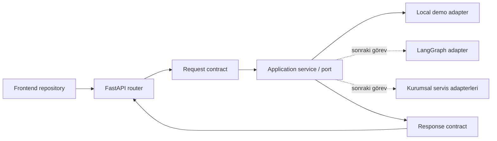

# 09 — Python API ve Sözleşme Katmanı

## 0. Görev kimliği

| Alan | Değer |
| --- | --- |
| Görev | Python HTTP API ve sürümlü sözleşme katmanını kurmak |
| Ön koşul | `00–08` görevlerinin uygulanmış ve testlerinin geçirilmiş olması |
| Ana teknoloji | Python 3.11+, FastAPI, Pydantic v2, Uvicorn |
| API kökü | `/api/v1` |
| Çalışma modu | Localhost demo; gerçek kurumsal servis bağlantısı yok |
| Çıktı | Test edilebilir API uygulaması, typed sözleşmeler, OpenAPI çıktısı ve dokümantasyon |
| Kapsam dışı | Kalıcı Redis oturumu, LangGraph yeniden tasarımı, gerçek kimlik doğrulama, gerçek katalog/OMS/bayi/CMS entegrasyonu |

---

## 1. Amaç

Bu görevin amacı, mevcut Python Supervisor–Worker şablonunun ve `08` numaralı görevde tanımlanan frontend repository katmanının arasına **kararlı, sürümlü ve doğrulanabilir bir HTTP sözleşmesi** yerleştirmektir.

Görev tamamlandığında:

1. Python backend bir FastAPI uygulaması olarak çalışabilmeli,
2. CLI uygulaması çalışmaya devam etmeli,
3. tüm dış JSON alanları tutarlı biçimde `camelCase` olmalı,
4. Python iç modelleri `snake_case` kullanabilmeli,
5. ürün, sipariş, bayi, SSS ve sohbet endpoint'leri typed Pydantic modelleri kullanmalı,
6. route fonksiyonları iş kuralı veya ham demo veri erişimi içermemeli,
7. doğrulama ve çalışma zamanı hataları tek ortak hata zarfına dönüştürülmeli,
8. OpenAPI şeması testle korunmalı,
9. localhost frontend için güvenli CORS yapılandırması bulunmalı,
10. hassas alanlar log, hata ayrıntısı veya trace içinde açığa çıkmamalı,
11. Redis bulunmadan API testleri çalışabilmeli,
12. sonraki Redis ve LangGraph görevleri API sözleşmesini bozmadan sisteme bağlanabilmelidir.

Bu adımda API katmanı kurulacaktır; kurumsal sistemlerin gerçek verileri bağlanmayacaktır.

---

## 2. Başlamadan önce okunacak dosyalar

Cursor değişiklik yapmadan önce aşağıdaki dosyaları incelemelidir:

```text
cursor-tasks/00-PROJE-ANAYASASI.md
cursor-tasks/01-REPO-VE-GELISTIRME-TEMELI.md
cursor-tasks/02-MERINOS-DEMO-SITESI-VE-TASARIM-SISTEMI.md
cursor-tasks/03-CHATBOT-WIDGET-VE-KONUSMA-DENEYIMI.md
cursor-tasks/04-URUN-ARAMA-VE-FILTRELEME-AKISI.md
cursor-tasks/05-SIPARIS-DURUMU-SORGULAMA-AKISI.md
cursor-tasks/06-BAYI-BULMA-VE-HARITA-AKISI.md
cursor-tasks/07-SSS-VE-BILGI-BANKASI-AKISI.md
cursor-tasks/08-FRONTEND-ORTAK-STATE-VE-VERI-KATMANI.md
backend/pyproject.toml
backend/README.md
backend/.env.example
backend/src/merinos_agent/main.py
backend/src/merinos_agent/config.py
backend/src/merinos_agent/state.py
backend/src/merinos_agent/graph.py
backend/src/merinos_agent/workers.py
backend/src/merinos_agent/session_store.py
backend/tests/
docs/01-SISTEM-MIMARISI.md
docs/04-API-SOZLESMELERI.md
docs/05-TEST-SENARYOLARI.md
docs/06-LANGGRAPH-REDIS-STATE-MIMARISI.md
docs/07-SUPERVISOR-WORKER-MIMARISI.md
features/
lib/data/
lib/types.ts
package.json
```

`08` görevi farklı ama eşdeğer bir klasör yapısı oluşturmuşsa bu görev mevcut yapıya uyum sağlamalı; aynı sorumluluk için paralel ikinci bir mimari oluşturmamalıdır.

Değişiklikten önce çalıştırılabilen kalite kapıları kaydedilmelidir:

```bash
npm test
npm run lint
npm run build

cd backend
python -m unittest discover -s tests -v
```

Bir komut ortam veya bağımlılık eksikliği nedeniyle çalışmıyorsa hata gizlenmemeli; görev sonu raporunda komut, hata ve neden yazılmalıdır.

---

## 3. Mevcut durum ve çözülmesi gereken sorunlar

Mevcut Python şablonu:

- komut satırından çalışmaktadır,
- `main.py` içinde Redis istemcisi ve graph yaşam döngüsünü doğrudan yönetmektedir,
- LangGraph state modellerini aynı zamanda dış taşıma modeli gibi kullanmaya elverişli değildir,
- HTTP route, ortak hata modeli, CORS, OpenAPI snapshot veya API testleri içermemektedir,
- `docs/04-API-SOZLESMELERI.md` içinde hedef endpoint örnekleri bulunmasına rağmen bunlar yürütülebilir sözleşmeler değildir.

Aşağıdaki sorunlar çözülmelidir:

1. CLI ve HTTP uygulaması aynı application servislerini kullanabilmeli,
2. LangGraph iç state'i doğrudan dış API yanıtı olarak döndürülmemeli,
3. `dict[str, Any]` dış sözleşmenin varsayılanı olmamalı,
4. FastAPI'nin varsayılan doğrulama hata biçimi ortak hata sözleşmesini delmemeli,
5. frontend ile backend alan adları ve enum değerleri açıkça tanımlanmalı,
6. demo verisi frontend ve backend tarafında birbirinden bağımsız kopyalar hâline gelmemeli,
7. sipariş bulunamadı ve yetkisiz erişim üretim sözleşmesinde bilgi sızdırmamalı,
8. ham kullanıcı konumu, sipariş numarası ve mesaj metni loglara düşmemelidir.

---

## 4. Değişmez mimari kararlar

### 4.1. Transport ve domain ayrımı

Katman akışı aşağıdaki yönde olmalıdır:



Kurallar:

- Router normalizasyon, arama, sıralama veya yanıt metni üretmemelidir.
- Pydantic contract modelleri LangGraph `GraphState` modeli değildir.
- Application servisleri FastAPI `Request`, `Response` veya HTTPException almamalıdır.
- Domain/application hataları API katmanında HTTP hatasına çevrilmelidir.
- Worker iç verileri kullanıcıya açılmadan API response modeline map edilmelidir.

### 4.2. API sürümleme

Tüm iş endpoint'leri aşağıdaki kök altında olmalıdır:

```text
/api/v1
```

Health endpoint'leri sürüm kökünün dışında kalabilir:

```text
/health/live
/health/ready
```

`v1` sözleşmesi yayımlandıktan sonra alan silme, alan tipini değiştirme veya enum anlamını değiştirme yapılmamalıdır. Geriye uyumsuz değişiklik yeni API sürümü gerektirir.

### 4.3. JSON adlandırma

- Python iç alanları: `snake_case`
- Dış JSON alanları: `camelCase`
- Enum değerleri: dile bağımlı olmayan kararlı `UPPER_SNAKE_CASE`
- Kullanıcıya gösterilecek Türkçe metinler enum yerine ayrı görüntü alanlarında tutulmalıdır.

Pydantic v2 için ortak bir base model kullanılmalıdır:

```python
from pydantic import BaseModel, ConfigDict
from pydantic.alias_generators import to_camel


class ApiModel(BaseModel):
    model_config = ConfigDict(
        alias_generator=to_camel,
        populate_by_name=True,
        extra="forbid",
        str_strip_whitespace=True,
    )
```

`extra="forbid"` request modellerinde varsayılan olmalıdır. Response modellerinde de yanlışlıkla eklenen iç alanların dışarı çıkmasını engelleyecek açık model kullanılmalıdır.

### 4.4. Zaman, para ve mesafe

- Tüm timestamp değerleri UTC ve ISO 8601 biçiminde dönmelidir.
- Tarih alanları `YYYY-MM-DD` biçiminde olmalıdır.
- Para değerleri binary float ile taşınmamalıdır.
- API'de para aşağıdaki sözleşmeyle dönmelidir:

```json
{
  "amountMinor": 1289000,
  "currency": "TRY",
  "fractionDigits": 2
}
```

- Mesafe sayısal `distanceKm` olarak dönmeli; virgüllü Türkçe görüntü formatı frontend formatter'a bırakılmalıdır.
- Görüntü amaçlı `"3,2 km"` gibi alanlar domain sözleşmesinde tutulmamalıdır.

### 4.5. Dil ve locale

MVP locale değeri:

```text
tr-TR
```

Desteklenmeyen locale geldiğinde sessizce farklı dile geçilmemeli. Endpoint'e göre `400 UNSUPPORTED_LOCALE` veya tanımlı varsayılan davranış uygulanmalı; davranış testle sabitlenmelidir.

---

## 5. Hedef backend yapısı

Mevcut paket yapısına uyarlanarak aşağıdaki sorumluluklar oluşturulmalıdır:

```text
backend/
  src/merinos_agent/
    api/
      __init__.py
      app.py
      run.py
      lifespan.py
      dependencies.py
      middleware.py
      error_handlers.py
      routers/
        health.py
        products.py
        orders.py
        dealers.py
        knowledge.py
        chat.py
    contracts/
      __init__.py
      base.py
      common.py
      errors.py
      products.py
      orders.py
      dealers.py
      knowledge.py
      chat.py
    application/
      __init__.py
      errors.py
      ports.py
      services.py
    adapters/
      __init__.py
      demo/
        product_service.py
        order_service.py
        dealer_service.py
        knowledge_service.py
        chat_service.py
    config.py
    main.py
    graph.py
    state.py
    workers.py
  tests/
    api/
      test_health.py
      test_error_contract.py
      test_products_api.py
      test_orders_api.py
      test_dealers_api.py
      test_knowledge_api.py
      test_chat_api.py
      test_openapi_contract.py
```

Bu yapı birebir zorunlu değildir; ancak aşağıdaki sınırlar zorunludur:

- API router'ları ayrı,
- request/response contract'ları ayrı,
- application port ve servisleri ayrı,
- local demo adapter'ları ayrı,
- graph/state iç modelleri dış contract'lardan ayrı olmalıdır.

---

## 6. Python bağımlılıkları ve çalıştırma komutları

`backend/pyproject.toml` içine Python 3.11 ile uyumlu, üst sınırı tanımlanmış bağımlılıklar eklenmelidir:

- `fastapi`
- `uvicorn[standard]`

API testleri için development optional dependency grubu oluşturulmalıdır:

- `httpx`
- proje test standardı pytest'e geçirilecekse `pytest` ve `pytest-asyncio`; aksi hâlde mevcut `unittest` korunmalıdır.

Sürüm seçim kuralları:

1. sınırsız `>=` kullanılmamalı,
2. FastAPI ve Pydantic v2 uyumluluğu doğrulanmalı,
3. lock veya kurulum çıktısı güncellenmeli,
4. yalnızca gerçekten kullanılan paket eklenmeli,
5. `requirements.txt` ve `pyproject.toml` arasında iki ayrı bağımlılık kaynağı oluşturulmamalıdır.

Mevcut CLI girişi korunmalıdır:

```toml
[project.scripts]
merinos-chatbot = "merinos_agent.main:run"
merinos-api = "merinos_agent.api.run:run"
```

API aşağıdaki komutlardan biriyle çalışabilmelidir:

```bash
cd backend
merinos-api
```

veya:

```bash
cd backend
uvicorn merinos_agent.api.app:app --host 127.0.0.1 --port 8000 --reload
```

Varsayılan bind adresi localhost olmalıdır. `0.0.0.0` yalnızca container veya açık ortam değişkeniyle seçilmelidir.

---

## 7. Uygulama fabrikası ve yaşam döngüsü

API modülü import edildiğinde Redis bağlantısı, graph derleme veya ağ çağrısı yapılmamalıdır.

Zorunlu yapı:

```python
def create_app(settings: Settings | None = None) -> FastAPI:
    ...


app = create_app()
```

Yaşam döngüsü kuralları:

- Servisler `lifespan` içinde bir kez oluşturulmalı.
- Testlerde local/in-memory servisler dependency override ile verilebilmeli.
- Her request'te graph veya repository yeniden oluşturulmamalı.
- Startup başarısızlığı loglanırken secret veya bağlantı dizesi gösterilmemeli.
- Shutdown sırasında açık istemciler düzgün kapatılmalı.
- Redis bu görevde zorunlu startup bağımlılığı olmamalı.

Mevcut `main.py` içindeki CLI davranışı korunmalı; ortak graph/application oluşturma kodu gerekiyorsa küçük bir factory modülüne çıkarılmalı, CLI HTTP katmanına bağımlı hâle getirilmemelidir.

---

## 8. Ortak response metadata modeli

Başarılı endpoint yanıtları domain payload ile birlikte ortak metadata taşımalıdır:

```json
{
  "data": {},
  "meta": {
    "apiVersion": "v1",
    "requestId": "req_...",
    "timestamp": "2026-07-25T16:30:00Z",
    "demo": true
  }
}
```

Kurallar:

- `requestId` response header ve body metadata içinde aynı olmalıdır.
- `timestamp` sunucuda üretilmelidir.
- Local fixture kullanan sonuçlarda `demo: true` görünür olmalıdır.
- Üretim bağlantısına geçildiğinde `demo` yanlışlıkla true kalmamalıdır.
- İç `transition_trace`, Redis key, stack trace veya worker prompt'u metadata içine eklenmemelidir.

Liste endpoint'lerinde ek metadata bulunabilir:

```json
{
  "page": 1,
  "pageSize": 12,
  "total": 8,
  "hasNext": false
}
```

Pagination alanları kararlı sıralama ile birlikte kullanılmalıdır.

---

## 9. Ortak hata sözleşmesi

Tüm hata yolları aşağıdaki dış biçime dönüştürülmelidir:

```json
{
  "error": {
    "code": "VALIDATION_ERROR",
    "message": "Gönderilen bilgiler doğrulanamadı.",
    "requestId": "req_...",
    "fields": [
      {
        "path": "query.pageSize",
        "code": "OUT_OF_RANGE",
        "message": "Değer izin verilen aralıkta değil."
      }
    ]
  },
  "meta": {
    "apiVersion": "v1",
    "timestamp": "2026-07-25T16:30:00Z"
  }
}
```

### 9.1. Hata kuralları

- FastAPI/Pydantic varsayılan `422` body biçimi doğrudan dışarı verilmemeli.
- Hata alanlarında kullanıcının gönderdiği gerçek değer tekrar edilmemeli.
- Stack trace yalnızca sunucu tarafı geliştirme logunda bulunabilir.
- Üretim yanıtında exception sınıfı, dosya yolu, SQL, Redis key veya servis URL'si bulunmamalıdır.
- Bilinmeyen hata `INTERNAL_ERROR` ve genel mesajla dönmelidir.
- `requestId` her hata yanıtında bulunmalıdır.
- Uygulama hataları typed exception sınıflarıyla taşınmalıdır.

### 9.2. HTTP durum eşlemesi

| Durum | HTTP | API kodu örneği |
| --- | ---: | --- |
| Geçersiz alan/parametre | 400 veya normalize edilmiş 422 | `VALIDATION_ERROR` |
| Kimlik doğrulama gerekli | 401 | `AUTHENTICATION_REQUIRED` |
| Yetki yok | 403 | `FORBIDDEN` |
| Güvenli bulunamadı | 404 | `RESOURCE_NOT_AVAILABLE` |
| Aynı idempotency kimliği farklı payload | 409 | `IDEMPOTENCY_CONFLICT` |
| Oran sınırı | 429 | `RATE_LIMITED` |
| Bağımlı servis hatası | 502 | `DEPENDENCY_ERROR` |
| Geçici servis kullanılamıyor | 503 | `SERVICE_UNAVAILABLE` |
| Beklenmeyen sunucu hatası | 500 | `INTERNAL_ERROR` |

Sipariş endpoint'inde üretim modunda “sipariş yok” ve “bu kullanıcıya ait değil” durumları dışarıdan ayrıştırılabilir mesajlar vermemelidir.

---

## 10. Request ID ve güvenli gözlemlenebilirlik

### 10.1. Request ID middleware

Her istekte:

1. geçerli bir `X-Request-ID` geldiyse güvenli biçimde kabul et,
2. yoksa sunucu üret,
3. çok uzun veya izin verilmeyen karakter içeren değeri reddet ya da yenisiyle değiştir,
4. response'a `X-Request-ID` header'ı ekle,
5. request scope'a yerleştir,
6. hata zarfında aynı değeri kullan.

İzin verilen format kısa ve dokümante edilmiş olmalıdır. Kullanıcıdan gelen header kontrol edilmeden log alanına yazılmamalıdır.

### 10.2. Log veri minimizasyonu

Aşağıdakiler loglanmamalıdır:

- tam kullanıcı mesajı,
- sipariş numarası,
- takip kodu,
- ham enlem/boylam,
- telefon numarası,
- session state veya konuşma geçmişi,
- Authorization/Cookie header'ı,
- idempotency payload'ı,
- environment secret değerleri.

Loglanabilecek alanlar:

- request ID,
- route şablonu,
- HTTP method,
- durum kodu,
- süre,
- hata kodu,
- anonimleştirilmiş/tek yönlü session korelasyon kimliği gerekiyorsa açıkça belgelenmiş hash.

Bu görevde kapsamlı observability platformu eklenmeyecektir; yalnızca güvenli structured log sınırı kurulacaktır.

---

## 11. CORS, host ve temel HTTP güvenliği

### 11.1. CORS

Varsayılan izinli origin listesi ortam değişkeninden okunmalıdır. Localhost demo için en az şu origin'ler desteklenebilir:

```text
http://localhost:3000
http://127.0.0.1:3000
http://localhost:5173
http://127.0.0.1:5173
```

Kurallar:

- `*` origin ve `allow_credentials=True` birlikte kullanılmamalıdır.
- Yalnızca kullanılan method ve header'lar açılmalıdır.
- Üretim origin'i koda gömülmemelidir.
- CORS bir yetkilendirme mekanizması olarak sunulmamalıdır.

### 11.2. Host ve dokümantasyon

- Trusted host listesi ayarlanabilir olmalıdır.
- Swagger/ReDoc local development'ta açık olabilir.
- Üretim modunda dokümantasyon endpoint'leri ayarla kapatılabilmelidir.
- OpenAPI JSON üretimi test ve dokümantasyon için erişilebilir kalmalıdır.

### 11.3. Body sınırları

- Chat mesajı en fazla `2000` Unicode karakter olmalıdır.
- Bilgi bankası sorgusu en fazla `500` karakter olmalıdır.
- Session ID en fazla `128` karakter ve izinli karakter kümesiyle doğrulanmalıdır.
- `clientMessageId` UUID veya açıkça belgelenmiş eşdeğer kararlı format olmalıdır.
- Gereksiz büyük body'ler erken reddedilmelidir.

---

## 12. Health endpoint'leri

### 12.1. Liveness

```http
GET /health/live
```

Amaç yalnızca process'in yanıt verebildiğini göstermektir. Redis, harici servis veya demo veri içeriği kontrolü yapmamalıdır.

Örnek:

```json
{
  "status": "ok"
}
```

### 12.2. Readiness

```http
GET /health/ready
```

Bu görevde readiness en az şunları doğrulamalıdır:

- uygulama servisleri oluşturulmuş,
- local demo veri kaynağı okunabilir,
- zorunlu config geçerli.

Redis bu görevde zorunlu readiness şartı değildir. Sonraki Redis görevinde readiness bileşenleri genişletilecektir.

Readiness başarısızsa `503` dönmelidir; ayrıntılı secret veya bağlantı bilgisi response'a yazılmamalıdır.

---

## 13. Ürün arama endpoint'i

```http
GET /api/v1/products
```

Desteklenecek query parametreleri:

```text
query
category
color
size
collection
page
pageSize
sort
```

Aynı facet birden fazla kez verilebiliyorsa tekrar eden query parametreleri veya açık liste sözleşmesi kullanılmalıdır. `04` görevindeki semantik korunmalıdır:

- farklı facet grupları: AND,
- aynı facet içindeki değerler: OR,
- sıralama deterministik,
- boş sonuçta veri uydurma yok.

Örnek response payload:

```json
{
  "data": {
    "items": [
      {
        "id": "demo-product-1",
        "name": "Elegance 90823",
        "collection": "Elegance",
        "category": "Salon Halısı",
        "color": "Krem",
        "size": "160x230",
        "price": {
          "amountMinor": 1289000,
          "currency": "TRY",
          "fractionDigits": 2
        },
        "stockStatus": "IN_STOCK",
        "updatedAt": "2026-07-25T00:00:00Z"
      }
    ],
    "facets": {
      "categories": [],
      "colors": [],
      "sizes": [],
      "collections": []
    }
  },
  "meta": {
    "apiVersion": "v1",
    "requestId": "req_demo",
    "timestamp": "2026-07-25T16:30:00Z",
    "demo": true,
    "page": 1,
    "pageSize": 12,
    "total": 1,
    "hasNext": false
  }
}
```

Kurallar:

- `page >= 1`
- `1 <= pageSize <= 24`
- bilinmeyen sort değeri reddedilmeli,
- filtre seçenekleri izin verilen veri kümesinden doğrulanmalı veya güvenli boş sonuç üretmeli; davranış açıkça testlenmeli,
- stok bilgisi güncelleme zamanı olmadan kesin taahhüt olarak sunulmamalı,
- kullanıcıya iç arama skoru dönülmemelidir.

---

## 14. Sipariş durumu endpoint'i

```http
GET /api/v1/orders/{orderNumber}/status
```

`05` görevindeki kurallar korunmalıdır:

- kanonik `MRN-YYYY-NNNN`,
- yalnızca kesin eşleşme,
- fuzzy/kısmi eşleşme yok,
- takip kodu maskeli,
- tahmini teslimat garanti gibi yazılmaz,
- zaman çizelgesi sıralı ve typed.

Örnek payload:

```json
{
  "data": {
    "orderNumber": "MRN-2026-1042",
    "status": "SHIPPED",
    "statusLabel": "Kargoya verildi",
    "summary": "Siparişiniz dağıtım merkezine doğru yola çıktı.",
    "estimatedDeliveryDate": "2026-07-25",
    "shipment": {
      "carrier": "Demo Kargo",
      "trackingCodeMasked": "DEMO-78***"
    },
    "timeline": [
      {
        "code": "RECEIVED",
        "label": "Sipariş alındı",
        "state": "COMPLETED",
        "completedAt": "2026-07-22T10:14:00Z"
      }
    ]
  },
  "meta": {
    "apiVersion": "v1",
    "requestId": "req_demo",
    "timestamp": "2026-07-25T16:30:00Z",
    "demo": true
  }
}
```

### 14.1. Demo ve üretim modu

- Local demo modunda yalnızca fixture siparişleri dönebilir ve `meta.demo=true` olmalıdır.
- Demo endpoint'i gerçek kimlik doğrulaması varmış gibi gösterilmemelidir.
- Üretim modunda ownership doğrulama portu bulunmadan sipariş bilgisi döndürülmemelidir.
- Gerçek auth henüz kurulmadıysa üretim modunda güvenli `AUTHENTICATION_REQUIRED` veya `SERVICE_NOT_CONFIGURED` dönmelidir.
- Sadece sipariş numarası sahiplik kanıtı değildir.

---

## 15. Bayi arama endpoint'i

```http
GET /api/v1/dealers
```

Desteklenen iki sorgu biçimi:

```text
city + isteğe bağlı district
```

veya açık konum izninden sonra:

```text
lat + lng + isteğe bağlı radiusKm
```

Doğrulama kuralları:

- `lat` ve `lng` birlikte verilmelidir,
- şehir/ilçe ile koordinat sorgusunun birlikte verilmesi reddedilmeli veya öncelik açıkça tanımlanmalıdır,
- `-90 <= lat <= 90`,
- `-180 <= lng <= 180`,
- `1 <= radiusKm <= 100`,
- koordinatlar request loguna yazılmamalıdır.

Örnek payload:

```json
{
  "data": {
    "items": [
      {
        "id": "gantep-sehitkamil",
        "name": "Merinos Demo Şehitkamil",
        "city": "Gaziantep",
        "district": "Şehitkamil",
        "address": "İncilipınar Mahallesi, Gaziantep",
        "phoneDisplay": "0342 000 00 01",
        "phoneUri": "tel:+903420000001",
        "hours": "09.00–20.00",
        "distanceKm": 3.2,
        "location": {
          "lat": 37.06,
          "lng": 37.38,
          "isApproximate": true
        }
      }
    ]
  },
  "meta": {
    "apiVersion": "v1",
    "requestId": "req_demo",
    "timestamp": "2026-07-25T16:30:00Z",
    "demo": true,
    "distanceMode": "DEMO_APPROXIMATE"
  }
}
```

Demo koordinatları gerçek bayi konumu gibi sunulmamalıdır. `06` görevindeki manuel şehir/ilçe fallback'i korunmalıdır.

---

## 16. SSS / bilgi bankası endpoint'i

```http
POST /api/v1/knowledge/search
```

Request:

```json
{
  "query": "İade süreci nasıl işler?",
  "locale": "tr-TR"
}
```

`sessionId` salt SSS araması için zorunlu olmamalıdır. Korelasyon gerekiyorsa ayrı güvenli telemetry katmanında çözülmelidir.

Response örneği:

```json
{
  "data": {
    "status": "ANSWERED",
    "answer": "...",
    "topic": "RETURNS",
    "contentVersion": "2026.07.1",
    "confidenceBand": "HIGH",
    "source": {
      "id": "faq-return",
      "label": "Onaylı SSS",
      "reviewedAt": "2026-07-20"
    },
    "suggestions": []
  },
  "meta": {
    "apiVersion": "v1",
    "requestId": "req_demo",
    "timestamp": "2026-07-25T16:30:00Z",
    "demo": true
  }
}
```

Kurallar:

- Ham iç skor yerine `LOW`, `MEDIUM`, `HIGH` gibi güven bandı tercih edilmelidir.
- İç puan gerekiyorsa kullanıcı sözleşmesine bağlanmamalı.
- Düşük güvenli sonuçta kesin yanıt yerine öneri/seçim dönmelidir.
- Yalnızca `published` ve onaylı içerik kullanılmalıdır.
- Kaynak doküman içeriği prompt olarak değerlendirilmemeli; bu görevde LLM/RAG eklenmemelidir.

---

## 17. Sohbet mesajı endpoint'i

```http
POST /api/v1/chat/messages
```

Request:

```json
{
  "sessionId": "demo-session-001",
  "clientMessageId": "6c34eacd-7275-468f-bc6e-c1aab7e7c061",
  "message": "Krem 160x230 salon halısı arıyorum",
  "locale": "tr-TR",
  "context": {
    "kind": "PRODUCT_SEARCH",
    "criteria": {
      "categories": ["Salon Halısı"],
      "colors": ["Krem"],
      "sizes": ["160x230"]
    }
  }
}
```

### 17.1. Request kuralları

- `message` boşluk temizlendikten sonra 1–2000 karakter olmalıdır.
- `sessionId` URL-safe ve en fazla 128 karakter olmalıdır.
- `clientMessageId` zorunludur.
- Context discriminated union olmalıdır.
- Context içine sipariş sonucu, ham konum, konuşma geçmişi veya keyfi `dict` alınmamalıdır.
- Bilinmeyen alanlar reddedilmelidir.

### 17.2. Response modeli

```json
{
  "data": {
    "sessionId": "demo-session-001",
    "clientMessageId": "6c34eacd-7275-468f-bc6e-c1aab7e7c061",
    "assistantMessage": {
      "id": "msg_01J...",
      "text": "Kriterlerinize uygun ürünleri buldum.",
      "createdAt": "2026-07-25T16:30:00Z"
    },
    "intent": "PRODUCT_SEARCH",
    "status": "OK",
    "result": {
      "kind": "PRODUCT_SEARCH",
      "items": []
    },
    "actions": [
      {
        "id": "show-products",
        "label": "Ürünleri göster",
        "kind": "APPLY_PRODUCT_FILTERS"
      }
    ]
  },
  "meta": {
    "apiVersion": "v1",
    "requestId": "req_demo",
    "timestamp": "2026-07-25T16:30:00Z",
    "demo": true
  }
}
```

`result` alanı discriminated union olmalıdır:

```text
PRODUCT_SEARCH
ORDER_STATUS
DEALER_SEARCH
KNOWLEDGE
CLARIFICATION
UNAVAILABLE
```

`dict[str, Any]` doğrudan dış sözleşme olarak kullanılmamalıdır.

### 17.3. Mevcut graph ile sınır

Bu görevde iki kabul edilebilir uygulama yolu vardır:

1. mevcut graph, `InMemorySessionStore` üzerinden bir `ChatTurnService` adapter'ına sarılır; routing/worker mantığı değiştirilmez,
2. mevcut graph entegrasyonu sonraki göreve bırakılır ve typed local demo `ChatTurnService` kullanılır.

Her iki durumda da:

- API route graph state'i doğrudan bilmemeli,
- Redis zorunlu olmamalı,
- response `transition_trace` içermemeli,
- mevcut CLI ve graph testleri bozulmamalı,
- geçici implementasyon dokümante edilmelidir.

### 17.4. Idempotency

Aynı `sessionId + clientMessageId` tekrar gönderildiğinde çift kullanıcı mesajı veya çift işlem oluşmamalıdır.

Bu görevde kalıcı Redis idempotency beklenmez. Local demo için:

- bounded, process içi idempotency store kullanılabilir,
- aynı kimlik ve aynı payload tekrarında önceki response dönülebilir,
- aynı kimlik farklı payload ile gelirse `409 IDEMPOTENCY_CONFLICT` dönmelidir,
- bunun tek process garantisi olduğu dokümante edilmelidir,
- TTL ve maksimum kayıt sayısı bulunmalıdır.

Sonraki Redis görevinde bu port kalıcı adapter ile değiştirilecektir.

---

## 18. Demo verisinin tek kaynak politikası

Frontend ve Python tarafında ürün, sipariş, bayi ve SSS verisinin elle kopyalanmış iki farklı sürümü bulunmamalıdır.

Tercih edilen çözüm:

```text
shared/
  demo-data/
    products.json
    orders.json
    dealers.json
    faqs.json
```

Kurallar:

- JSON dosyaları yalnızca demo fixture'dır.
- Frontend local repository ve Python demo adapter aynı fixture'ları okur.
- `lib/demo-data.ts` gerekiyorsa geriye uyumlu typed adapter/re-export olarak kalabilir; veri değerlerini ikinci kez tanımlamamalıdır.
- JSON yüklenirken her iki tarafta schema doğrulaması yapılmalıdır.
- Uygulama başlangıcında geçersiz fixture sessizce kabul edilmemelidir.
- Üretimde bu fixture'ların kurumsal veri kaynağı olduğu izlenimi verilmemelidir.

`08` görevi daha önce eşdeğer tek kaynak oluşturduysa yeni bir fixture dizini açılmamalı; mevcut kaynak kullanılmalıdır.

---

## 19. Frontend sözleşme hazırlığı

Bu görev frontend'i gerçek API'ye geçirmek zorunda değildir; ancak `08` görevindeki repository portlarının karşılığı netleştirilmelidir.

Aşağıdaki eşleşme dokümante edilmelidir:

| Frontend port | API endpoint |
| --- | --- |
| Product repository | `GET /api/v1/products` |
| Order repository | `GET /api/v1/orders/{orderNumber}/status` |
| Dealer repository | `GET /api/v1/dealers` |
| Knowledge repository | `POST /api/v1/knowledge/search` |
| Chat transport | `POST /api/v1/chat/messages` |

TypeScript modelleri elle bağımsız yorumlanmamalıdır. Aşağıdaki seçeneklerden biri seçilip belgelenmelidir:

1. OpenAPI'den type üretimini sonraki frontend entegrasyon görevine bırakmak,
2. contract fixture testleriyle TS–Python alan eşleşmesini doğrulamak.

Bu görevde yeni ağır codegen zinciri eklenmesi zorunlu değildir.

---

## 20. OpenAPI sözleşmesi ve drift kontrolü

FastAPI tarafından üretilen OpenAPI şeması aşağıdaki gibi sabit bir dosyaya yazılmalıdır:

```text
docs/openapi/merinos-api-v1.json
```

Kurallar:

- Dosya uygulamadan üretilmeli, elle yazılmamalıdır.
- Deterministik üretim sağlanmalıdır.
- Test, çalışma zamanındaki şema ile snapshot arasında fark olup olmadığını kontrol etmelidir.
- Bilinçli contract değişikliğinde snapshot güncellenmeli ve değişiklik raporlanmalıdır.
- OpenAPI içinde secret, gerçek müşteri verisi veya local dosya yolu bulunmamalıdır.
- Endpoint açıklamaları Türkçe olabilir; `operationId` değerleri kararlı olmalıdır.

Önerilen script:

```bash
cd backend
python -m merinos_agent.api.export_openapi
```

Script adı farklı olabilir; eşdeğer tek komut bulunmalıdır.

---

## 21. Yapılandırma alanları

`Settings` modeli en az aşağıdaki alanlarla genişletilmelidir:

```text
MERINOS_ENV=development
MERINOS_API_HOST=127.0.0.1
MERINOS_API_PORT=8000
MERINOS_API_PREFIX=/api/v1
MERINOS_API_DOCS_ENABLED=true
MERINOS_API_ALLOWED_ORIGINS=http://localhost:3000,http://127.0.0.1:3000
MERINOS_API_TRUSTED_HOSTS=localhost,127.0.0.1
MERINOS_DEMO_MODE=true
MERINOS_DEMO_DATA_DIR=../shared/demo-data
MERINOS_LOG_LEVEL=INFO
```

Kurallar:

- Liste alanları tek yerde güvenli biçimde parse edilmeli.
- Geçersiz config startup'ta anlaşılır, secret içermeyen hata vermeli.
- `.env.example` güncellenmeli.
- `.env` dosyası repoya eklenmemeli.
- Config import anında side effect oluşturmamalıdır.

---

## 22. Test stratejisi

Testler gerçek Redis, ağ veya kurumsal servis gerektirmemelidir.

### 22.1. Health testleri

- `/health/live` `200` döner.
- `/health/ready` local servisler sağlıklıysa `200` döner.
- readiness dependency hatasında `503` ve ortak hata zarfı döner.

### 22.2. Contract ve validation testleri

- Dış JSON alanları `camelCase` döner.
- Bilinmeyen request alanı reddedilir.
- Boş chat mesajı reddedilir.
- 2000 karakter sınırı test edilir.
- Geçersiz session ID reddedilir.
- FastAPI validation hatası ortak zarfla döner.
- Hata body’si gönderilen hassas değeri tekrar etmez.
- Request ID header ve body içinde aynıdır.

### 22.3. Ürün testleri

- kategori + renk + ölçü AND semantiği,
- aynı facet çoklu değer OR semantiği,
- deterministik sıralama,
- pagination sınırları,
- boş sonuç,
- para modelinin integer minor unit olması,
- iç skorun response'ta bulunmaması.

### 22.4. Sipariş testleri

- kanonik numara başarılı,
- küçük harf/boşluk normalizasyonu başarılı,
- kısmi sipariş numarası reddedilir,
- bulunamadı güvenli hata verir,
- takip kodu maskelidir,
- üretim modu auth olmadan veri döndürmez.

### 22.5. Bayi testleri

- şehir ve ilçe filtreleme,
- `lat` tek başına reddedilir,
- `lng` tek başına reddedilir,
- koordinat sınırları,
- deterministik mesafe sıralaması,
- response demo/approximate işareti,
- log capture içinde ham koordinat bulunmaması.

### 22.6. Bilgi bankası testleri

- yalnızca yayınlanmış kayıt,
- yüksek güvenli doğrudan yanıt,
- düşük güvenli öneri/clarification,
- kaynak ve içerik sürümü,
- ham iç skorun dışarı verilmemesi,
- prompt injection benzeri metnin sistem talimatı olarak çalışmaması.

### 22.7. Sohbet testleri

- typed result union,
- duplicate `clientMessageId` aynı sonucu üretir,
- aynı ID farklı payload `409` verir,
- response içinde `transitionTrace`, Redis key veya stack trace yoktur,
- paralel iki farklı mesaj birbirini ezmez,
- local adapter Redis olmadan çalışır.

### 22.8. CORS ve OpenAPI testleri

- izinli origin gerekli header'ları alır,
- izin verilmeyen origin kabul edilmez,
- OpenAPI endpoint'leri ve schema'ları içerir,
- snapshot drift testi geçer,
- secret veya gerçek fixture sipariş numarası OpenAPI örneğine yanlışlıkla gömülmez; örnekler açıkça demo olmalıdır.

### 22.9. Regresyon testleri

Aşağıdakiler geçmeye devam etmelidir:

```bash
npm test
npm run lint
npm run build

cd backend
python -m unittest discover -s tests -v
```

Test altyapısı pytest'e çevrildiyse eski testler kaybolmamalı ve eşdeğer test komutu README'de açıkça yazılmalıdır.

---

## 23. Dokümantasyon çıktıları

Aşağıdaki dosyalar güncellenmelidir:

```text
backend/README.md
backend/.env.example
docs/01-SISTEM-MIMARISI.md
docs/04-API-SOZLESMELERI.md
docs/05-TEST-SENARYOLARI.md
docs/openapi/merinos-api-v1.json
```

Backend README en az şunları içermelidir:

- kurulum,
- API çalıştırma,
- CLI çalıştırma,
- test komutu,
- OpenAPI export komutu,
- local URL'ler,
- demo modu açıklaması,
- Redis'in bu adımda zorunlu olmadığı,
- hata/CORS yapılandırması,
- örnek `curl` komutları.

Örnekler gerçek kullanıcı verisi içermemelidir.

---

## 24. Uygulama sırası

Cursor aşağıdaki sırayla ilerlemelidir:

1. `00–08` görevlerini ve mevcut backend'i incele.
2. Mevcut test sonuçlarını kaydet.
3. API contract isimlendirme ve enum listesini yazılı hâle getir.
4. Ortak `ApiModel`, metadata ve hata modellerini oluştur.
5. Application port ve typed hata sınıflarını oluştur.
6. Tek kaynak demo fixture yaklaşımını uygula veya mevcut tek kaynağı bağla.
7. Local demo application adapter'larını oluştur.
8. `create_app()` fabrikası ve lifespan yapısını kur.
9. Request ID ve hata handler'larını ekle.
10. CORS, trusted host ve config sınırlarını ekle.
11. Health router'larını oluştur.
12. Ürün, sipariş, bayi ve bilgi bankası router'larını oluştur.
13. Sohbet contract ve route'unu adapter üzerinden ekle.
14. OpenAPI export ve snapshot testini ekle.
15. API testlerini yaz.
16. CLI regresyonunu doğrula.
17. Frontend lint/test/build regresyonunu doğrula.
18. Dokümantasyonu güncelle.
19. Değişen dosya listesini ve test sonuçlarını raporla.
20. Dur ve `10` numaralı göreve kendiliğinden geçme.

---

## 25. Kabul ölçütleri

Görev ancak aşağıdaki maddelerin tamamı sağlandığında tamamlanmış sayılır:

### API temeli

- [ ] FastAPI uygulaması `create_app()` fabrikasıyla kurulmuştur.
- [ ] API import edildiğinde Redis veya ağ bağlantısı açılmaz.
- [ ] `merinos-api` komutu localhost'ta çalışır.
- [ ] Mevcut `merinos-chatbot` CLI komutu korunmuştur.
- [ ] `/health/live` ve `/health/ready` çalışır.

### Katmanlar

- [ ] Router'larda domain arama/sıralama iş kuralı yoktur.
- [ ] Contract, application port ve adapter katmanları ayrıdır.
- [ ] LangGraph `GraphState` doğrudan API response'u değildir.
- [ ] Demo veri frontend ve backend arasında kopyalanmış iki kaynak değildir.

### Sözleşmeler

- [ ] Dış JSON alanları `camelCase` biçimindedir.
- [ ] Request modelleri bilinmeyen alanları reddeder.
- [ ] Response payload'ları typed ve açık modellerdir.
- [ ] Chat `result` alanı discriminated union kullanır.
- [ ] Para integer minor unit modeliyle taşınır.
- [ ] Enum değerleri kararlı ve dile bağımsızdır.
- [ ] Tarih/zaman biçimleri tanımlıdır.

### Endpoint'ler

- [ ] `GET /api/v1/products` çalışır.
- [ ] `GET /api/v1/orders/{orderNumber}/status` çalışır.
- [ ] `GET /api/v1/dealers` çalışır.
- [ ] `POST /api/v1/knowledge/search` çalışır.
- [ ] `POST /api/v1/chat/messages` çalışır.
- [ ] Local demo response'larında `meta.demo=true` bulunur.

### Hata ve güvenlik

- [ ] FastAPI validation hataları ortak hata zarfına dönüşür.
- [ ] Her response'ta request ID header'ı vardır.
- [ ] Hata yanıtlarında request ID bulunur.
- [ ] Sipariş numarası, ham konum ve kullanıcı mesajı loglanmaz.
- [ ] Stack trace ve iç worker bilgileri API response'una çıkmaz.
- [ ] CORS wildcard + credentials kombinasyonu kullanılmaz.
- [ ] Body ve alan uzunluk sınırları testlidir.
- [ ] Üretim modunda sahte sipariş yetkilendirmesi yapılmaz.

### Idempotency ve OpenAPI

- [ ] Chat mesajında `clientMessageId` zorunludur.
- [ ] Aynı ID + aynı payload çift işlem üretmez.
- [ ] Aynı ID + farklı payload `409` verir.
- [ ] Local idempotency garantisinin process içi olduğu belgelenmiştir.
- [ ] OpenAPI snapshot üretilmiştir.
- [ ] Contract drift testi vardır.

### Test ve dokümantasyon

- [ ] API testleri Redis olmadan geçer.
- [ ] Mevcut backend testleri geçer.
- [ ] Frontend kapsam testleri geçer.
- [ ] Çalıştırılabilen lint/build kontrolleri geçer.
- [ ] Backend README ve API sözleşme dokümanı günceldir.
- [ ] Çalışmayan komut varsa hata ve neden görev raporunda açıkça yazılmıştır.

---

## 26. Yasak değişiklikler

Bu görevde aşağıdakiler yapılmamalıdır:

- gerçek Merinos katalog, stok, OMS, CRM, bayi veya CMS servisine bağlanmak,
- gerçek müşteri veya sipariş verisi eklemek,
- gerçek authentication sistemi varmış gibi sahte yetkilendirme yapmak,
- Redis'i API startup için zorunlu hâle getirmek,
- LangGraph Supervisor–Worker routing mantığını yeniden yazmak,
- graph state veya transition trace'i dışarı açmak,
- route içinde ham fixture dizisi filtrelemek,
- request/response için kontrolsüz `dict[str, Any]` kullanmak,
- FastAPI varsayılan validation body’sini dış sözleşme olarak bırakmak,
- `allow_origins=["*"]` ile credential açmak,
- kullanıcı mesajı, sipariş numarası veya koordinatı loglamak,
- stack trace'i kullanıcıya döndürmek,
- demo koordinatını gerçek bayi konumu gibi sunmak,
- frontend'i bu görevde zorunlu olarak tamamen HTTP moduna geçirmek,
- yeni görev dosyasına geçmek.

---

## 27. Görev sonu rapor biçimi

Cursor görev sonunda şu formatta rapor vermelidir:

```text
Tamamlananlar
- ...

Eklenen/değiştirilen dosyalar
- ...

API endpoint'leri
- METHOD /path — durum

Sözleşme kararları
- JSON casing:
- Error envelope:
- Demo data source:
- Chat idempotency:

Çalıştırılan kontroller
- komut: sonuç

Çalıştırılamayan kontroller
- komut: hata ve neden

Kalan riskler
- ...

Sonraki görev
- 10 numaralı göreve geçilmedi.
```

---

## 28. Durma kuralı

Bu görev tamamlandıktan sonra Cursor:

1. test ve kabul ölçütlerini raporlamalı,
2. API URL'lerini ve demo çalıştırma komutunu yazmalı,
3. bilinen eksikleri açıkça belirtmeli,
4. **kendiliğinden Redis, session state, context compression veya yeni LangGraph geliştirmesine başlamamalı,**
5. **`10` numaralı görev dosyasını uygulamamalı,**
6. kullanıcıdan sonraki adımı beklemelidir.

