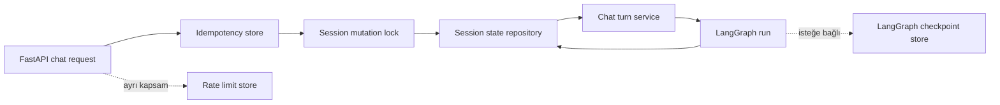
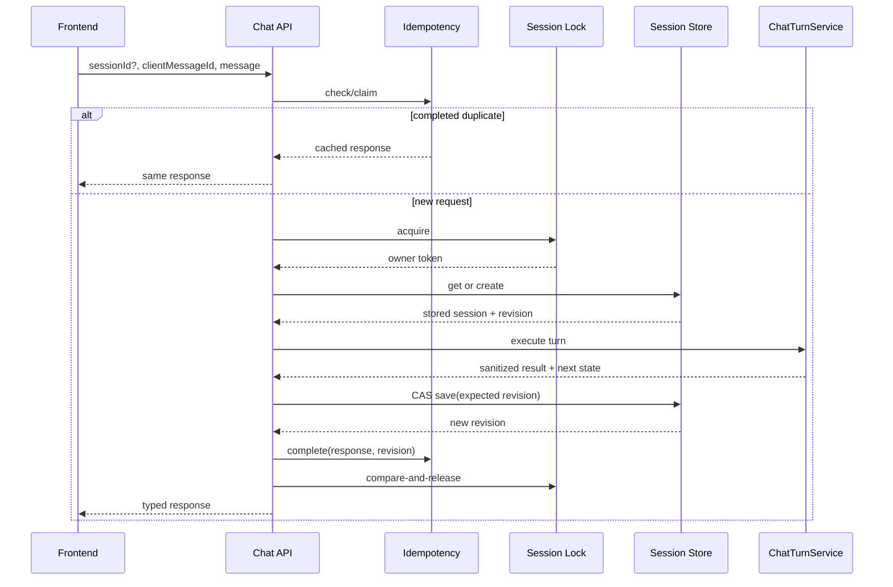

# 10 — Redis Oturum ve Session State Yönetimi

> **Proje:** Merinos Chatbot Demo Localhost  
> **Görev türü:** Cursor uygulama görevi  
> **Ön koşullar:** `00–09` numaralı görevler tamamlanmış, çalışan testler korunmuş olmalıdır.  
> **Kapsam:** Redis tabanlı session state, TTL, anahtar tasarımı, eşzamanlılık, idempotency, güvenlik, local test ikizi ve API yaşam döngüsü  
> **Sonraki görev:** `11-TOKEN-BUTCESI-VE-CONTEXT-COMPRESSION.md`

---

## 1. Görevin amacı

Bu görevin amacı, mevcut Redis session örneğini localhost demosunda ve çoklu
backend instance'ında güvenilir çalışabilecek bir **oturum kalıcılığı
katmanına** dönüştürmektir.

Görev tamamlandığında:

1. session state ile LangGraph checkpoint verisi birbirinden açıkça ayrılmış olmalı,
2. Redis anahtarlarında ham session ID veya kullanıcı verisi bulunmamalı,
3. session state sürümlü ve şema versiyonlu saklanmalı,
4. paralel mesajlar birbirinin state değişikliklerini ezmemeli,
5. yazma işlemleri sürüm kontrolü ve atomik TTL yenilemesiyle yapılmalı,
6. aynı `clientMessageId` tekrarında çift mesaj veya çift işlem oluşmamalı,
7. Redis kesintisinde sessizce process içi belleğe geçilmemeli,
8. test ve açıkça seçilmiş local demo modu Redis olmadan çalışabilmeli,
9. hassas veri kalıcı session state'e veya loglara gereksiz taşınmamalı,
10. session payload boyutu, mesaj sayısı ve yaşam süresi sınırlandırılmalı,
11. API lifespan tek Redis istemcisi/connection pool yönetmeli,
12. readiness kontrolü seçilen session backend'ine göre doğru davranmalı,
13. mevcut CLI, FastAPI sözleşmesi ve dört temel chatbot akışı korunmalı,
14. sonraki token/context ve LangGraph görevleri bu katmanı yeniden yazmadan
    kullanabilmelidir.

Bu adımda Redis session altyapısı sağlamlaştırılacaktır. LangGraph Supervisor
planlama mantığı, yeni LLM entegrasyonu veya kurumsal veri bağlantıları bu
adımın konusu değildir.

---

## 2. Başlamadan önce okunacak dosyalar

Cursor değişiklik yapmadan önce en az aşağıdaki dosyaları incelemelidir:

```text
cursor-tasks/00-PROJE-ANAYASASI.md
cursor-tasks/01-REPO-VE-GELISTIRME-TEMELI.md
cursor-tasks/02-MERINOS-DEMO-SITESI-VE-TASARIM-SISTEMI.md
cursor-tasks/03-CHATBOT-WIDGET-VE-KONUSMA-DENEYIMI.md
cursor-tasks/04-URUN-ARAMA-VE-FILTRELEME-AKISI.md
cursor-tasks/05-SIPARIS-DURUMU-SORGULAMA-AKISI.md
cursor-tasks/06-BAYI-BULMA-VE-HARITA-AKISI.md
cursor-tasks/07-SSS-VE-BILGI-BANKASI-AKISI.md
cursor-tasks/08-FRONTEND-ORTAK-STATE-VE-VERI-KATMANI.md
cursor-tasks/09-PYTHON-API-VE-SOZLESME-KATMANI.md
backend/pyproject.toml
backend/.env.example
backend/docker-compose.yml
backend/README.md
backend/src/merinos_agent/config.py
backend/src/merinos_agent/state.py
backend/src/merinos_agent/session_store.py
backend/src/merinos_agent/checkpointing.py
backend/src/merinos_agent/graph.py
backend/src/merinos_agent/main.py
backend/tests/test_session_store.py
backend/tests/test_graph.py
docs/01-SISTEM-MIMARISI.md
docs/04-API-SOZLESMELERI.md
docs/06-LANGGRAPH-REDIS-STATE-MIMARISI.md
docs/07-SUPERVISOR-WORKER-MIMARISI.md
```

`09` görevi farklı ama eşdeğer bir API/application klasör yapısı oluşturmuşsa
bu görev o yapıya uyum sağlamalıdır. Aynı sorumluluk için paralel ikinci bir
session katmanı oluşturulmamalıdır.

Değişiklik öncesinde çalıştırılabilen kalite kapıları kaydedilmelidir:

```bash
npm test
npm run lint
npm run build

cd backend
python -m unittest discover -s tests -v
```

Bir komut ortam veya bağımlılık nedeniyle çalışmıyorsa hata gizlenmemeli;
görev sonu raporunda komut, hata ve neden açıkça yazılmalıdır.

---

## 3. Mevcut durum ve çözülmesi gereken sorunlar

Mevcut örnek `RedisSessionStore`:

- `SessionState` modelini tek JSON string olarak saklamaktadır,
- `SET ... EX` ile TTL'yi atomik yenilemektedir,
- her kayıtta `version + 1` üretmektedir,
- test için `InMemorySessionStore` sağlamaktadır,
- Redis istemcisini async olarak kapatmaktadır.

Bu temel davranış korunabilir; ancak üretime hazırlanmak için aşağıdaki
sorunlar çözülmelidir:

1. aynı session için iki paralel istek aynı version'ı okuyup son-yazan-kazan
   biçiminde birbirini ezebilir,
2. `save()` beklenen version'ı doğrulamamaktadır,
3. ham `session_id` Redis anahtarında kullanılmaktadır,
4. session veri şeması için ayrı `schemaVersion` bulunmamaktadır,
5. eski state şemalarını okuyacak migration sınırı yoktur,
6. bozuk veya beklenmeyen Redis payload'ı kontrollü uygulama hatasına
   çevrilmemektedir,
7. kalıcı idempotency kaydı yoktur,
8. aynı session içindeki paralel graph çalıştırmaları seri hâle getirilmemektedir,
9. lock sahipliği ve güvenli release mekanizması yoktur,
10. session state içinde debug trace ve gereksiz hassas alanların kalıcı hâle
    gelme riski vardır,
11. payload büyüklüğü için üst sınır yoktur,
12. local memory fallback'in hangi ortamda kullanılacağı açık değildir,
13. Redis bağlantı timeout, pool, TLS ve readiness davranışları tanımlı değildir,
14. Redis kesildiğinde sessiz fallback yapılırsa instance'lar arasında session
    ayrışması oluşabilir,
15. session state, graph checkpoint ve idempotency verileri aynı kavram gibi
    ele alınmaya elverişlidir.

Bu görev yalnızca sınıf adlarını değiştiren yüzeysel bir refactor olmamalı;
yukarıdaki veri bütünlüğü ve güvenlik sorunlarını testlerle çözmelidir.

---

## 4. Kapsam ve kapsam dışı alanlar

### 4.1. Bu görevde yapılacaklar

- Redis session repository portunu kesinleştirmek,
- session ID üretimi ve doğrulamasını tanımlamak,
- Redis key namespace ve key derivation katmanı oluşturmak,
- sürümlü session envelope/modeli eklemek,
- optimistic concurrency kontrolü eklemek,
- session başına dağıtık mutation lock eklemek,
- Redis tabanlı idempotency adapter'ı oluşturmak,
- TTL ve absolute lifetime politikası uygulamak,
- session state veri minimizasyonunu zorunlu kılmak,
- in-memory test ikizini Redis davranışıyla eşlemek,
- API lifespan/readiness ve CLI bağlantı yaşam döngüsünü güncellemek,
- local Docker Redis yapılandırmasını güvenli hâle getirmek,
- unit ve gerçek Redis entegrasyon testleri eklemek,
- dokümantasyonu güncellemek.

### 4.2. Bu görevde yapılmayacaklar

- LangGraph Supervisor veya Worker routing mantığını yeniden tasarlamak,
- context summary algoritmasını veya token bütçesini yeniden yazmak,
- LangGraph checkpoint'i session state'in yerine kullanmak,
- gerçek kullanıcı authentication/authorization sistemi eklemek,
- gerçek sipariş veya müşteri verisi saklamak,
- Redis'i ürün kataloğu için genel cache katmanına dönüştürmek,
- rate limiting sistemini tamamlamak,
- Redis Cluster, Sentinel veya Kubernetes kurulumu yapmak,
- yeni bir mesaj kuyruğu eklemek,
- web socket veya streaming protokolü eklemek,
- üretim secret değerlerini repoya yazmak.

---

## 5. Değişmez mimari ayrımlar

Aşağıdaki veri sınıfları birbirinden ayrı tutulmalıdır:



| Veri | Amaç | TTL | Bu görevdeki sahip |
| --- | --- | ---: | --- |
| Session state | Konuşmalar arası güvenli iş bağlamı | Kayan + mutlak sınır | `SessionRepository` |
| Idempotency | Aynı istemci mesajının tekrar işlenmesini önlemek | Kısa/oturumla sınırlı | `IdempotencyStore` |
| Mutation lock | Aynı session'daki state değişikliklerini seri hâle getirmek | Çok kısa lease | `SessionLockManager` |
| LangGraph checkpoint | Uygun graph yürütmesini resume etmek | Ayrı retention | `AsyncRedisSaver` adapter'ı |
| Rate limit | Abuse/oran sınırı | Ayrı pencere | Sonraki güvenlik görevi |
| Ürün/SSS cache | Domain performansı | Domain'e özgü | Bu görevin dışında |

Kurallar:

1. `SessionRepository`, LangGraph checkpointer API'si değildir.
2. Checkpoint key'leri session state key'leriyle aynı prefix'i kullanmamalıdır.
3. Idempotency kaydı session payload içine gömülmemelidir.
4. Lock bilgisi session payload içine yazılmamalıdır.
5. API router Redis komutu çalıştırmamalıdır.
6. Redis detayları application portlarının arkasında kalmalıdır.
7. Worker'lar doğrudan Redis anahtarı oluşturmamalıdır.

---

## 6. Session state veri sınıflandırması

Kalıcı session state yalnızca sonraki konuşma turunda gerçekten gerekli olan,
minimum veriyi içermelidir.

### 6.1. Kalıcı tutulabilecek alanlar

- server tarafından üretilmiş session kimliği,
- current intent,
- güvenli ürün facet'leri: kategori, renk, ölçü, koleksiyon,
- güvenli bayi facet'leri: şehir ve ilçe,
- yayınlanmış SSS konu kimliği,
- sınırlı sayıdaki son kullanıcı/asistan mesajı,
- PII temizlenmiş rolling summary,
- token budget yapılandırması veya referansı,
- son güvenli worker planı gerekiyorsa allowlist değerleri,
- session revision,
- schema version,
- created/updated/expiry timestamp'leri.

### 6.2. Kalıcı tutulmaması gereken alanlar

Aşağıdakiler session state'e yazılmamalıdır:

- tam sipariş numarası,
- takip kodu,
- müşteri adı, e-posta veya telefon,
- ham enlem/boylam,
- Authorization, Cookie veya token,
- ödeme bilgisi,
- worker prompt'u,
- model chain-of-thought veya iç muhakeme,
- ham tool response,
- stack trace,
- tam transition trace,
- request body kopyası,
- dış servis secret'ı,
- idempotency payload'ının düz metni.

Sipariş akışı tek tur içinde sipariş numarasını kullanmak zorundaysa bu değer
request-scope ephemeral state'te tutulmalı ve kalıcı session oluşturulmadan
önce çıkarılmalıdır. Sonraki turda doğrulama gerekirse kullanıcıdan yeniden
istenmelidir; kolaylık için hassas veri saklanmamalıdır.

### 6.3. Güvenli slot allowlist'i

`dict[str, str]` biçimindeki kontrolsüz `slots` alanı kalıcı modelin varsayılanı
olmamalıdır. Aşağıdaki seçeneklerden biri uygulanmalıdır:

1. typed `SessionSlots` Pydantic modeli,
2. anahtar allowlist'i ve değer başına uzunluk/enum doğrulaması.

Önerilen typed model:

```python
class SessionSlots(BaseModel):
    product_categories: tuple[str, ...] = ()
    product_colors: tuple[str, ...] = ()
    product_sizes: tuple[str, ...] = ()
    product_collections: tuple[str, ...] = ()
    dealer_city: str | None = None
    dealer_district: str | None = None
    knowledge_topic: str | None = None
```

- Bilinmeyen slot alanları reddedilmelidir.
- Her liste için makul maksimum öğe sayısı bulunmalıdır.
- Her string normalize edilmiş ve uzunluk sınırlı olmalıdır.
- Sipariş numarası veya koordinat için slot alanı açılmamalıdır.

---

## 7. Session kimliği sözleşmesi

### 7.1. Üretim ve demo kimliği

Yeni session kimliği sunucu tarafından üretilmelidir. En az 128 bit rastgelelik
sağlayan URL-safe bir biçim kullanılmalıdır:

```text
ses_<base64url-random>
```

veya eşdeğer güvenli bir UUID tabanlı biçim.

Kurallar:

- sıralı integer kullanılmamalı,
- kullanıcı adı, e-posta veya sipariş numarası kimliğe gömülmemeli,
- en az 22 URL-safe rastgele karakter bulunmalı,
- toplam uzunluk en fazla 128 karakter olmalı,
- izinli karakter kümesi açık regex ile doğrulanmalı,
- ilk chat request'inde session yoksa server oluşturmalı,
- response mevcut `sessionId` alanında server kimliğini dönmeli,
- gelen session ID tek başına authentication veya sipariş yetkisi sayılmamalıdır.

Local demo geriye uyumluluğu için eski `demo-session-*` kimlikleri geçici olarak
kabul edilecekse bu davranış yalnızca `local/test` ortamıyla sınırlanmalı,
uyarıyla belgelenmeli ve production modunda kapalı olmalıdır.

### 7.2. Session key türetme

Ham session ID Redis key'ine yazılmamalıdır. Storage key kimliği aşağıdaki gibi
türetilmelidir:

```text
storageId = base64url(HMAC-SHA256(sessionKeySecret, sessionId))[0:32]
```

- Production ortamında `MERINOS_SESSION_KEY_SECRET` zorunlu olmalıdır.
- Secret en az 32 rastgele byte eşdeğerinde olmalıdır.
- Secret loglanmamalı veya hata mesajında gösterilmemelidir.
- Local/test ortamında deterministik test secret'ı dependency injection ile
  verilebilir; repoya üretim secret'ı yazılmamalıdır.
- Düz SHA-256 yalnızca açıkça test adapter'ında kullanılabilir; production için
  HMAC tercih edilmelidir.

Raw session ID yalnızca API transport'unda ve doğrulanmış state payload'ında
bulunabilir. Loglarda storage ID'nin tamamı değil, gerekiyorsa kısa korelasyon
prefix'i kullanılmalıdır.

---

## 8. Redis key namespace tasarımı

Tüm key'ler environment ve veri türü namespace'i taşımalıdır:

```text
merinos:<environment>:session:v1:{<storageId>}:state
merinos:<environment>:session:v1:{<storageId>}:lock
merinos:<environment>:session:v1:{<storageId>}:idem:<clientMessageDigest>
merinos:<environment>:session:v1:{<storageId>}:tombstone
```

Örnek:

```text
merinos:local:session:v1:{V8u9...}:state
```

Kurallar:

1. `environment` allowlist'ten gelmelidir: `local`, `test`, `staging`,
   `production`.
2. Kullanıcı girdisi doğrudan prefix veya suffix'e eklenmemelidir.
3. Redis Cluster hash tag biçimi olan `{storageId}` aynı session'a ait key'leri
   aynı slotta tutacak şekilde kullanılabilir.
4. `KEYS merinos:*` uygulama çalışma yolunda kullanılmamalıdır.
5. Session listeleme özelliği eklenmemelidir.
6. Runtime cleanup için global `SCAN` bağımlılığı oluşturulmamalıdır; TTL ana
   temizleme mekanizmasıdır.
7. Checkpoint key namespace'i Redis checkpointer kütüphanesinin kendi
   yapılandırmasıyla ayrı kalmalıdır.
8. Key prefix ayardan gelse bile `:` ve kontrol karakterleriyle key injection'a
   izin verilmemelidir.

Key üretimi tek `RedisKeyFactory` veya eşdeğer sınıfta toplanmalıdır. Kodun
farklı yerlerinde string birleştirilerek key üretilmemelidir.

---

## 9. Session storage biçimi ve envelope

Tek Redis key'i bir **hash** olarak kullanılmalıdır. Önerilen alanlar:

```text
schema_version
revision
created_at_ms
updated_at_ms
absolute_expires_at_ms
payload
```

`payload`, yalnızca typed persistent session modelinin canonical JSON
çıktısıdır.

Örnek Python modeli:

```python
class PersistentSession(BaseModel):
    session_id: str
    current_intent: Intent = "unknown"
    slots: SessionSlots = Field(default_factory=SessionSlots)
    recent_messages: list[PersistedChatMessage] = Field(default_factory=list)
    rolling_summary: str = ""
    token_budget: TokenBudget = Field(default_factory=TokenBudget)
    created_at: datetime
    updated_at: datetime


class StoredSession(BaseModel):
    schema_version: int
    revision: int
    absolute_expires_at: datetime
    data: PersistentSession
```

Redis hash kullanılması zorunlu değilse eşdeğer atomik bir envelope string
uygulanabilir; ancak aşağıdaki gereksinimler değişmez:

- revision ayrı doğrulanabilmeli,
- schema version açık olmalı,
- CAS yazımı atomik olmalı,
- TTL aynı atomik yazma içinde ayarlanmalı,
- payload boyutu yazmadan önce kontrol edilmeli,
- arbitrary Python object serialization kullanılmamalıdır.

### 9.1. Serileştirme kuralları

- UTF-8 JSON kullanılmalıdır.
- `pickle`, `marshal` veya executable serialization kullanılmamalıdır.
- Timestamp'ler UTC olmalıdır.
- Canonical JSON için kararlı field/model çıktısı kullanılmalıdır.
- Unknown field varsayılan olarak reddedilmelidir.
- Session payload sıkıştırılacaksa bu görevde genel gzip/zlib eklenmemelidir;
  önce context verisi küçültülmelidir.
- Redis'ten okunan içerik güvenilmeyen veri gibi doğrulanmalıdır.

### 9.2. Payload sınırı

Varsayılan session payload üst sınırı:

```text
65536 byte
```

Ayar:

```text
MERINOS_SESSION_MAX_BYTES=65536
```

Yazmadan önce UTF-8 byte uzunluğu ölçülmelidir. Sınır aşılırsa:

1. bu görevde yalnızca güvenli, deterministik message trim/özetleme hook'u
   çağrılabilir,
2. hâlâ büyükse `SessionPayloadTooLargeError` üretilmeli,
3. son sağlam state ezilmemeli,
4. ham payload loglanmamalıdır.

Asıl token/context compression algoritması `11` numaralı görevde uygulanacaktır.

---

## 10. Schema version ve migration politikası

`revision` ile `schema_version` aynı şey değildir:

- `revision`: session her başarılı mutasyonda artar,
- `schema_version`: kalıcı veri modelinin biçimini gösterir.

İlk sürüm:

```text
schema_version = 1
```

Zorunlu davranış:

1. aynı schema version doğrudan doğrulanır,
2. desteklenen eski version migration fonksiyonundan geçirilir,
3. gelecekteki bilinmeyen version sessizce okunmaz,
4. migration saf ve deterministik olmalıdır,
5. migration sonucu normal typed validation'dan geçmelidir,
6. başarılı migration bir sonraki save'de güncel schema ile yazılmalıdır,
7. migration hatasında kullanıcıya iç veri ayrıntısı açılmamalıdır.

Önerilen yapı:

```text
backend/src/merinos_agent/session/
  migrations.py
```

```python
Migration = Callable[[dict[str, object]], dict[str, object]]
MIGRATIONS: dict[int, Migration] = {
    # 1 -> 2 gerektiğinde eklenir
}
```

Bu görevde gereksiz sahte migration zinciri yazılmamalı; ancak unknown version
ve migration sınırı test edilmelidir.

Bozuk payload davranışı:

- `SESSION_CORRUPTED` iç hata kodu üret,
- raw payload'ı loglama,
- state key'i sonsuz hata döngüsü oluşturmayacak biçimde güvenli sil veya kısa
  tombstone ile işaretle,
- kullanıcıya yeni session başlatılabileceğini söyleyen genel sonuç dön,
- production'da bozuk içeriği başka bir key'e kopyalayarak retention'ı artırma.

---

## 11. TTL ve session yaşam döngüsü

### 11.1. Varsayılan süreler

| Veri | Varsayılan | Ayar |
| --- | ---: | --- |
| Idle session TTL | 1800 saniye | `MERINOS_SESSION_IDLE_TTL_SECONDS` |
| Absolute session lifetime | 86400 saniye | `MERINOS_SESSION_ABSOLUTE_TTL_SECONDS` |
| Mutation lock lease | 15000 ms | `MERINOS_SESSION_LOCK_LEASE_MS` |
| Lock wait timeout | 2000 ms | `MERINOS_SESSION_LOCK_WAIT_MS` |
| Idempotency TTL | 3600 saniye | `MERINOS_IDEMPOTENCY_TTL_SECONDS` |
| Corruption tombstone | 300 saniye | `MERINOS_SESSION_TOMBSTONE_TTL_SECONDS` |

`MERINOS_SESSION_TTL_SECONDS` mevcut geriye uyumlu isim olarak bir geçiş
süresince desteklenebilir; yeni kod içinde kanonik isim idle TTL olmalıdır.

### 11.2. Kayan TTL davranışı

Idle TTL yalnızca başarılı state mutasyonunda yenilenmelidir:

- yeni session oluşturma,
- başarılı chat turn save,
- güvenli session reset güncellemesi.

Salt `get()` çağrısı TTL'yi yenilememelidir. Aksi hâlde health/diagnostic veya
tekrar okuma süresi dolması gereken session'ı sonsuza yakın yaşatabilir.

Yazma sırasında Redis expiry şu değerden küçük olanla ayarlanmalıdır:

```text
min(idle_ttl, absolute_expires_at - now)
```

Absolute lifetime uzatılmamalıdır. Session süresi dolduğunda yeni session
başlatılmalıdır.

### 11.3. Reset ve delete

- Kullanıcının açık reset işlemi state, idempotency ve lock dışındaki ilgili
  session verisini temizlemelidir.
- Aktif lock başka request'e aitse kontrolsüz `DEL lock` yapılmamalıdır.
- Delete idempotent olmalıdır.
- Delete sonrası eski `clientMessageId` response'u tekrar dönmemelidir.
- Session reset kullanıcının doğrulanmış session bağlamında çalışmalıdır;
  session ID tek başına yetki olarak sunulmamalıdır.

---

## 12. Redis bağlantı ve istemci yaşam döngüsü

Redis istemcisi uygulama import edildiğinde oluşturulmamalıdır. FastAPI
`lifespan` veya ortak backend resource factory içinde bir kez oluşturulmalı ve
shutdown'da kapatılmalıdır.

Önerilen istemci ayarları:

```python
Redis.from_url(
    settings.redis_url,
    decode_responses=True,
    socket_connect_timeout=settings.redis_connect_timeout_seconds,
    socket_timeout=settings.redis_operation_timeout_seconds,
    health_check_interval=settings.redis_health_check_interval_seconds,
    max_connections=settings.redis_max_connections,
)
```

Gerçek parametreler kullanılan `redis-py` sürümüyle doğrulanmalıdır.

### 12.1. Zorunlu ayarlar

```text
MERINOS_SESSION_BACKEND=memory|redis
MERINOS_REDIS_URL=redis://localhost:6379/0
MERINOS_REDIS_CONNECT_TIMEOUT_SECONDS=1.0
MERINOS_REDIS_OPERATION_TIMEOUT_SECONDS=2.0
MERINOS_REDIS_HEALTH_CHECK_INTERVAL_SECONDS=30
MERINOS_REDIS_MAX_CONNECTIONS=20
MERINOS_REDIS_REQUIRED=true|false
MERINOS_SESSION_KEY_SECRET=<secret>
```

Kurallar:

- `test`: varsayılan `memory` olabilir,
- `local`: açık ayarla `memory` veya `redis` seçilebilir,
- `staging/production`: `redis` zorunlu olmalıdır,
- production `redis://` yerine TLS destekli `rediss://` veya güvenli özel ağ
  politikası zorunlu olarak dokümante edilmelidir,
- Redis URL'si loglanmamalıdır,
- URL içindeki parola hata mesajında açığa çıkmamalıdır,
- connection pool request başına oluşturulmamalıdır.

### 12.2. Retry politikası

Kör otomatik write retry yapılmamalıdır. Aşağıdaki ayrım uygulanmalıdır:

- `PING`/read gibi güvenli işlemlerde sınırlı connection retry uygulanabilir,
- CAS/idempotency Lua script'leri atomik ve tekrar güvenli tasarlanmalıdır,
- timeout sonrası yazının gerçekleşip gerçekleşmediği belirsizse aynı
  `clientMessageId` üzerinden idempotency kontrolü yapılmalıdır,
- sınırsız retry veya uzun blocking yapılmamalıdır,
- retry sayısı ve backoff üst sınırı test edilmelidir.

---

## 13. Session repository portu

Mevcut `SessionStore` portu açık concurrency semantiği taşıyacak biçimde
güncellenmelidir.

Önerilen sözleşme:

```python
class SessionRepository(Protocol):
    async def create(
        self,
        session: PersistentSession,
    ) -> StoredSession: ...

    async def get(
        self,
        session_id: str,
    ) -> StoredSession | None: ...

    async def save(
        self,
        session: StoredSession,
        *,
        expected_revision: int,
    ) -> StoredSession: ...

    async def delete(
        self,
        session_id: str,
    ) -> None: ...

    async def close(self) -> None: ...
```

İsimler mevcut koda göre değişebilir; ancak aşağıdaki hatalar typed olmalıdır:

```text
SessionNotFoundError
SessionAlreadyExistsError
SessionConflictError
SessionExpiredError
SessionCorruptedError
SessionPayloadTooLargeError
SessionBackendUnavailableError
SessionLockTimeoutError
```

Port HTTP durum kodu bilmemelidir. Application/API error mapper bu hataları
uygun dış sözleşmeye dönüştürmelidir.

### 13.1. API hata eşlemesi

| Application hatası | HTTP | Dış kod |
| --- | ---: | --- |
| Session süresi dolmuş/yok | 404 veya yeni session akışı | `SESSION_NOT_AVAILABLE` |
| Revision conflict | 409 | `SESSION_CONFLICT` |
| Lock alınamadı | 409 veya 429 | `SESSION_BUSY` |
| Redis gerekli ama yok | 503 | `SESSION_SERVICE_UNAVAILABLE` |
| Payload büyük | 500/503 genel kullanıcı mesajı | `SESSION_CAPACITY_ERROR` |
| Bozuk state | 503 + yeni session seçeneği | `SESSION_RECOVERY_REQUIRED` |

`SESSION_CONFLICT` kullanıcıya teknik version numarası göstermemelidir.
Frontend'e `retryable: true` ve güvenli `retryAfterMs` metadata'sı verilebilir.

---

## 14. Optimistic concurrency ve atomik CAS yazımı

Session save işlemi aşağıdakileri tek atomik Redis operasyonunda yapmalıdır:

1. key mevcut mu kontrol et,
2. mevcut revision beklenen revision'a eşit mi kontrol et,
3. revision'ı bir artır,
4. metadata ve payload'ı yaz,
5. kalan idle/absolute TTL'yi ayarla,
6. yeni revision'ı döndür.

Redis hash kullanılıyorsa Lua script veya WATCH/MULTI/EXEC uygulanabilir.
Önerilen Lua davranışı:

```text
if key yok ve expectedRevision != 0      -> NOT_FOUND/CONFLICT
if currentRevision != expectedRevision   -> CONFLICT
if absoluteExpiry geçmiş                 -> EXPIRED
HSET schema/revision/timestamps/payload
PEXPIRE remainingTtlMs
return newRevision
```

Kurallar:

- Revision application tarafında kör artırılıp normal `SET` ile yazılmamalıdır.
- CAS failure son sağlam state'i değiştirmemelidir.
- Lua script SHA caching desteklenebilir; `NOSCRIPT` durumunda güvenli reload
  uygulanmalıdır.
- Script argümanlarına raw kullanıcı mesajı değil serialize edilmiş doğrulanmış
  session payload'ı verilmelidir.
- CAS integration testi gerçek Redis üzerinde iki paralel client ile
  yapılmalıdır.

### 14.1. Conflict davranışı

Aynı session için iki farklı yeni mesaj paralel geldiğinde önerilen ana davranış
session mutation lock ile seri çalıştırmadır. CAS ikinci savunma katmanıdır.

Lock olmadan conflict oluşursa:

- graph sonucu kontrolsüz tekrar yazılmamalı,
- dış servis yan etkisi olmuş olabilecek bir turn otomatik yeniden
  çalıştırılmamalı,
- idempotent ve salt-okuma olduğu kanıtlanmış local demo turn için en fazla bir
  kontrollü reload/retry yapılabilir,
- aksi hâlde `SESSION_CONFLICT` dönülmelidir.

---

## 15. Session mutation lock

Aynı session'da state değiştiren chat request'leri multi-instance ortamında
seri hâle getirilmelidir.

### 15.1. Lock alma

```text
SET <lockKey> <ownerToken> NX PX <leaseMs>
```

- `ownerToken` her request için kriptografik rastgele olmalıdır.
- Lock wait bounded olmalıdır; sonsuz polling yapılmamalıdır.
- Polling jitter'lı ve kısa aralıklı olmalıdır.
- Lock alınamazsa `SESSION_BUSY` dönülmelidir.
- Product/FAQ gibi session değiştirmeyen bağımsız endpoint'ler lock almamalıdır.

### 15.2. Lock yenileme

Graph çalışması lock lease süresini aşabiliyorsa:

- owner token doğrulayan atomik lease renewal script'i kullanılmalı,
- renewal periyodu lease'in yaklaşık üçte biri olmalı,
- renewal başarısızsa save yapılmadan işlem güvenli biçimde durmalı,
- sonsuz lock renewal yapılmamalı,
- request cancellation renewal task'ını da durdurmalıdır.

### 15.3. Güvenli release

Aşağıdaki hatalı davranış yasaktır:

```python
await redis.delete(lock_key)
```

Lock yalnızca değeri mevcut `ownerToken` ile eşleşiyorsa Lua compare-and-delete
ile kaldırılmalıdır. Süresi dolup başka request tarafından alınmış lock eski
owner tarafından silinmemelidir.

Tek Redis instance için ayrı Redlock bağımlılığı eklenmesi gerekmez. Sistem
ileride çok bağımsız Redis master mimarisine geçerse lock stratejisi ayrıca
değerlendirilmelidir.

### 15.4. Lock kapsamı

Lock kapsamı aşağıdaki sırayı içermelidir:

```text
idempotency claim/check
session load
chat turn/graph execution
session CAS save
idempotency completion
```

Ancak idempotency kayıt sahipliği tasarımına göre duplicate completed request
lock almadan cached response dönebilir. Bu optimizasyon testle doğrulanmalıdır.

---

## 16. Redis tabanlı idempotency

`09` görevindeki process içi idempotency portu Redis adapter ile
uygulanmalıdır.

Kimlik:

```text
sessionStorageId + HMAC(clientMessageId)
```

Ham `clientMessageId` key içinde kullanılmamalıdır.

### 16.1. Kayıt modeli

```json
{
  "status": "IN_PROGRESS",
  "requestFingerprint": "...",
  "ownerToken": "...",
  "createdAt": "..."
}
```

Tamamlandığında:

```json
{
  "status": "COMPLETED",
  "requestFingerprint": "...",
  "response": {
    "...": "typed ve dışarı verilebilir sanitize edilmiş chat response"
  },
  "sessionRevision": 4,
  "completedAt": "..."
}
```

### 16.2. Request fingerprint

Fingerprint aşağıdaki normalize edilmiş alanlardan HMAC ile türetilmelidir:

- session ID bağlamı,
- client message ID,
- message içeriği,
- locale,
- izinli typed entry context.

Düz message veya sipariş numarası idempotency payload'ında kopyalanmamalıdır.
Fingerprint loglanacaksa tamamı yerine kısa prefix kullanılmalıdır.

### 16.3. Davranış matrisi

| Durum | Davranış |
| --- | --- |
| İlk kimlik | `IN_PROGRESS` atomik claim |
| Aynı ID + aynı fingerprint + completed | Önceki typed response dön |
| Aynı ID + farklı fingerprint | `409 IDEMPOTENCY_CONFLICT` |
| Aynı ID + in-progress | Kısa bounded wait veya `REQUEST_IN_PROGRESS` |
| Sahibi timeout olmuş in-progress | TTL sonrası yeni claim |
| Session silinmiş | İlgili idempotency key'leri session TTL ile kaybolur |

İlk claim `SET NX EX` veya eşdeğer atomik script ile yapılmalıdır.

### 16.4. Idempotency ve hata

- Validation hatası için kalıcı idempotency kaydı oluşturulması zorunlu değildir.
- Redis/backend geçici hatasında `IN_PROGRESS` kayıt kısa TTL ile bırakılabilir
  veya owner doğrulamalı silinebilir.
- Başarılı olmayan ama deterministik business response'ları (`NEEDS_INPUT`
  gibi) completed olarak cache'lenebilir.
- Stack trace veya iç exception cached response'a yazılmamalıdır.
- Sipariş sonucu dış response'da zaten maskelenmiş ve yetkilendirilmiş değilse
  idempotency cache'e yazılmamalıdır.

---

## 17. In-memory adapter davranışı

`InMemorySessionStore` yalnızca basit bir dict olmamalı; Redis portunun kritik
semantiğini test ortamında taklit etmelidir:

- revision kontrolü,
- idle ve absolute TTL,
- payload boyutu,
- schema validation,
- create conflict,
- deep copy,
- deterministic clock injection,
- async lock ile paralel save güvenliği,
- close sonrası davranış.

Ek olarak in-memory:

```text
InMemorySessionRepository
InMemoryIdempotencyStore
InMemorySessionLockManager
```

veya birleşik ama portları koruyan test adapter'ları bulunabilir.

Kurallar:

1. Production ortamında memory backend seçilememeli veya startup açıkça
   reddetmelidir.
2. Redis runtime'da düştüğünde memory'ye otomatik geçilmemelidir.
3. Memory backend response metadata/log başlangıcında `demo` olarak açıkça
   belirtilmelidir.
4. Test fake'i Redis'ten farklı revision/TTL davranışı göstermemelidir.
5. Process restart'ında state kaybolduğu dokümante edilmelidir.

---

## 18. Application service entegrasyonu

Chat turn orchestration sırası aşağıdaki gibi olmalıdır:



Kurallar:

- Router bu adımları doğrudan yürütmemeli; application-level coordinator
  kullanmalıdır.
- Request validation lock alınmadan yapılmalıdır.
- Yeni session ID server tarafından coordinator'da üretilebilir.
- Graph'a persistent state'in kopyası verilmeli; graph Redis repository sınıfını
  bilmemelidir.
- Graph sonucu kalıcı modele sanitize/map edilmelidir.
- API response session revision içermese bile internal metadata'da kullanılabilir.
- Lock her exception/cancellation yolunda owner-safe release edilmelidir.
- Idempotency completed yazımı session save başarılı olduktan sonra olmalıdır.

---

## 19. FastAPI lifespan ve dependency injection

`09` görevindeki `create_app()` fabrikası korunmalıdır.

Önerilen resource yapısı:

```python
@dataclass(slots=True)
class SessionResources:
    repository: SessionRepository
    idempotency: IdempotencyStore
    locks: SessionLockManager

    async def close(self) -> None:
        ...
```

`lifespan`:

1. settings doğrular,
2. seçilen backend'e göre resource factory çağırır,
3. Redis gerekli ise bounded `PING` yapar,
4. application servislerini oluşturur,
5. `app.state` veya typed dependency container'a yazar,
6. shutdown'da background lock renewal task'larını durdurur,
7. repository/Redis pool'u bir kez kapatır.

Kurallar:

- Module import sırasında Redis bağlantısı kurulmaz.
- Request başına Redis client oluşturulmaz.
- Test dependency override ile in-memory resource verilebilir.
- CLI ve API ortak resource factory kullanabilir; CLI FastAPI'ye bağımlı
  olmamalıdır.
- Shutdown iki kez çağrılsa bile güvenli olmalıdır.

---

## 20. Readiness ve degradation davranışı

### 20.1. Memory backend

`MERINOS_SESSION_BACKEND=memory` ise readiness:

- session resource oluşturulmuş mu,
- local demo config geçerli mi

kontrol eder. Sonuç açıkça demo backend olduğunu iç telemetry'de belirtmelidir.

### 20.2. Redis backend

Redis zorunlu ise readiness en az bounded `PING` yapmalı ve bağlantı yoksa:

```http
503 SERVICE_UNAVAILABLE
```

dönmelidir. Body Redis URL, host, parola veya exception detayını içermemelidir.

### 20.3. Runtime kesintisi

Redis kesildiğinde:

- session mutasyonu fail closed olmalı,
- uydurulmuş/stateless devam ile eski bağlam varmış gibi davranılmamalı,
- kullanıcıya geçici olarak sohbet geçmişine erişilemediği söylenmeli,
- ürün, bayi ve SSS'nin session gerektirmeyen bağımsız API endpoint'leri
  çalışmaya devam edebilir,
- sipariş endpoint'i kendi güvenlik/bağımlılık kuralına göre davranmalıdır,
- Redis geri geldiğinde yeni ve mevcut session'lar tekrar okunabilmelidir,
- otomatik memory fallback yapılmamalıdır.

Readiness her request'te `PING` yapmamalıdır. Kısa cache veya health checker
kullanılabilir; ancak başarısız state uzun süre saklanmamalıdır.

---

## 21. LangGraph checkpoint sınırı

Mevcut `checkpointing.py` ve `AsyncRedisSaver` desteği korunabilir; ancak bu
adımda aşağıdaki sınırlar zorunludur:

1. Session repository ve checkpointer aynı Python nesnesi olmamalıdır.
2. `thread_id` için raw user girdisi yerine doğrulanmış server session ID veya
   türetilmiş güvenli değer kullanılmalıdır.
3. Checkpoint kullanımının açık feature flag'i olmalıdır.
4. Checkpoint kapalıyken session state çalışmaya devam etmelidir.
5. Checkpoint açıkken aynı konuşma verisi kontrolsüz biçimde iki farklı yerde
   sınırsız tutulmamalıdır.
6. Checkpoint retention session TTL'den bağımsız ve belgelenmiş olmalıdır.
7. Checkpoint'te hassas request-scope alanlar bulunmamalıdır.
8. `asetup()` her request'te çağrılmamalıdır.

Bu görev checkpointer iç şemasını yeniden yazmamalıdır. Supervisor–Worker resume
ve human-in-the-loop gereksinimleri sonraki LangGraph görevinde ele alınacaktır.

---

## 22. Context ve mesaj sınırları

Detaylı token yönetimi `11` numaralı görevde yapılacaktır. Bu görev Redis
büyümesini sınırlamak için minimum guardrail eklemelidir:

- kalıcı recent message sayısı varsayılan en fazla `8`,
- tek mesaj kalıcı içerik sınırı API'deki `2000` karakteri aşmamalı,
- rolling summary için makul karakter/byte sınırı bulunmalı,
- debug trace kalıcı payload'a eklenmemeli,
- worker result içindeki büyük ürün listeleri kalıcı session'a yazılmamalı,
- yalnızca ürün/bayi ID veya güvenli facet tutulmalı,
- save öncesi persistent projection oluşturulmalı,
- projection PII sanitizer testinden geçmelidir.

```python
def to_persistent_session(graph_state: GraphState) -> PersistentSession:
    """Request-scope ve hassas alanları dışarıda bırakan açık projection."""
```

`SessionState.model_dump()` sonucunu doğrudan Redis'e yazmak yasaktır; açık
projection allowlist'i kullanılmalıdır.

---

## 23. Redis güvenlik ve KVKK kuralları

### 23.1. Network ve credentials

Production için:

- Redis public internete açılmamalı,
- private network/VPC kullanılmalı,
- TLS veya eşdeğer korumalı transport kullanılmalı,
- dedicated ACL user kullanılmalı,
- default user kapatılmalı veya sınırlandırılmalı,
- secret yönetim sistemi kullanılmalı,
- parola `.env.example` dışında gerçek değer olarak repoya yazılmamalıdır.

ACL komutları uygulamanın gerçekten kullandığı minimum setle sınırlandırılmalıdır.
Örnek ihtiyaçlar:

```text
PING GET SET DEL EXISTS PTTL EXPIRE HGET HMGET HSET EVALSHA SCRIPT
```

WATCH/MULTI yaklaşımı seçilirse gerekli transaction komutları ayrıca eklenir.
Komut allowlist'i kullanılan gerçek implementasyonla eşleşmelidir.

### 23.2. Retention

Session verisi geçici kullanıcı verisidir:

- tüm session/idempotency key'lerinde TTL olmalı,
- session key'i TTL'siz kalmamalı,
- uzun süreli backup zorunlu kabul edilmemeli,
- AOF/RDB retention kararı KVKK ve operasyon ekibiyle belgelenmeli,
- local Docker AOF production retention kararı olarak kopyalanmamalı,
- data export veya session listeleme endpoint'i eklenmemelidir.

### 23.3. Redis memory policy

Local compose için makul `maxmemory` ve tüm geçici key'lerde TTL varsa
`volatile-ttl` gibi bir eviction yaklaşımı değerlendirilebilir. Seçim şu riskle
belgelenmelidir:

- eviction session reset'e neden olabilir,
- `noeviction` write failure'a neden olabilir.

Production policy kapasite testi ve SLO'ya göre seçilmelidir; görevde kesin
üretim kapasitesi uydurulmamalıdır.

### 23.4. Loglama

Aşağıdakiler loglanmamalıdır:

- Redis URL,
- session ID'nin tamamı,
- storage key'in tamamı,
- user message,
- sipariş numarası,
- koordinat,
- payload JSON,
- idempotency cached response,
- lock owner token,
- HMAC secret.

Loglanabilecek alanlar:

- request ID,
- kısa anonim session korelasyon prefix'i,
- operation adı,
- latency,
- result code,
- revision conflict sayısı,
- payload byte bucket'ı,
- retry sayısı.

---

## 24. Gözlemlenebilirlik ölçümleri

Bu görev kapsamlı telemetry vendor entegrasyonu gerektirmez; ancak ölçüm
noktaları açık olmalıdır:

```text
session_load_total{backend,result}
session_save_total{backend,result}
session_operation_duration_ms{operation}
session_conflict_total
session_lock_wait_ms
session_lock_timeout_total
session_payload_bytes
session_expired_total
session_corrupted_total
idempotency_claim_total{result}
idempotency_hit_total
idempotency_conflict_total
redis_connection_error_total
```

Kurallar:

- session ID metric label olmamalıdır,
- clientMessageId metric label olmamalıdır,
- message/intent serbest metni label olmamalıdır,
- yüksek cardinality alan eklenmemelidir,
- local demo için ölçüm interface'i no-op olabilir,
- log/metric işlemi session save'i başarısız kılmamalıdır.

---

## 25. Docker Compose ve local geliştirme

Mevcut `backend/docker-compose.yml` korunarak aşağıdakiler düzenlenmelidir:

- Redis image tam major/minor veya digest politikasıyla sabitlenmeli,
- healthcheck korunmalı,
- data volume davranışı belgelenmeli,
- production secret veya açık parola eklenmemeli,
- Redis yalnızca localhost'a bind edilecekse port açıkça `127.0.0.1:6379:6379`
  biçiminde sınırlandırılmalı,
- local reset komutu belgelenmeli,
- test için ayrı DB numarasına güvenmek yerine mümkünse ayrı container/prefix
  kullanılmalı,
- testler production/local session key'lerini silememelidir.

Örnek local komutları:

```bash
cd backend
docker compose up -d redis
docker compose ps
docker compose exec redis redis-cli ping
```

Session key inceleme, kullanıcı verisini terminale basan rutin bir geliştirme
adımı olarak önerilmemelidir.

Test sonu temizliği yalnızca test namespace'ini hedeflemelidir. `FLUSHALL` veya
`FLUSHDB` shared Redis üzerinde kullanılmamalıdır.

---

## 26. Hedef backend klasör yapısı

Mevcut yapıya uyarlanarak aşağıdaki sorumluluk ayrımı oluşturulmalıdır:

```text
backend/src/merinos_agent/
  session/
    __init__.py
    models.py
    ports.py
    errors.py
    ids.py
    keys.py
    serialization.py
    migrations.py
    coordinator.py
    adapters/
      memory.py
      redis_repository.py
      redis_idempotency.py
      redis_lock.py
    scripts/
      cas_save.lua
      compare_delete.lua
      compare_renew.lua
  resources.py
  config.py
  state.py
  graph.py
  main.py
  checkpointing.py
  api/
    lifespan.py
    dependencies.py
    routers/chat.py
    error_handlers.py

backend/tests/
  session/
    test_ids.py
    test_keys.py
    test_serialization.py
    test_memory_repository.py
    test_coordinator.py
    test_projection_privacy.py
  integration/
    test_redis_session_repository.py
    test_redis_session_concurrency.py
    test_redis_idempotency.py
    test_redis_lock.py
    test_redis_ttl.py
```

Bu birebir zorunlu değildir. Zorunlu olanlar:

- model/port/adapter ayrımı,
- key üretiminin tek yerde olması,
- Redis script'lerinin test edilebilir olması,
- API router'ın Redis detayını bilmemesi,
- memory ve Redis adapter'larının aynı portu uygulaması,
- mevcut importların kontrollü migration ile korunmasıdır.

`session_store.py` geriye uyumlu re-export olarak kısa süre kalabilir; aynı
mantığın iki farklı implementasyonu bırakılmamalıdır.

---

## 27. Config doğrulaması

`Settings` aşağıdaki kuralları doğrulamalıdır:

1. idle TTL > 0,
2. absolute TTL >= idle TTL,
3. idempotency TTL > lock lease,
4. lock wait bounded ve lease'ten küçük,
5. max payload makul aralıkta,
6. production backend yalnızca Redis,
7. production session HMAC secret zorunlu ve yeterli uzunlukta,
8. production memory backend reddedilir,
9. environment allowlist dışı değer reddedilir,
10. Redis timeout değerleri sıfırdan büyük,
11. max connections sıfırdan büyük,
12. key prefix kontrol karakteri içermez.

Yanlış config uygulama başlatılırken açık, secret içermeyen hata üretmelidir.

`.env.example` gerçek secret içermeden aşağıdaki açıklayıcı alanları taşımalıdır:

```dotenv
MERINOS_APP_ENV=local
MERINOS_SESSION_BACKEND=redis
MERINOS_REDIS_URL=redis://localhost:6379/0
MERINOS_REDIS_REQUIRED=true
MERINOS_SESSION_IDLE_TTL_SECONDS=1800
MERINOS_SESSION_ABSOLUTE_TTL_SECONDS=86400
MERINOS_SESSION_MAX_BYTES=65536
MERINOS_SESSION_LOCK_LEASE_MS=15000
MERINOS_SESSION_LOCK_WAIT_MS=2000
MERINOS_IDEMPOTENCY_TTL_SECONDS=3600
MERINOS_REDIS_CONNECT_TIMEOUT_SECONDS=1.0
MERINOS_REDIS_OPERATION_TIMEOUT_SECONDS=2.0
MERINOS_REDIS_HEALTH_CHECK_INTERVAL_SECONDS=30
MERINOS_REDIS_MAX_CONNECTIONS=20
MERINOS_SESSION_KEY_SECRET=replace-with-local-dev-secret
```

`replace-with-local-dev-secret` yalnızca örnek placeholder'dır; production
secret değildir.

---

## 28. Uygulama sırası

Cursor aşağıdaki sırayla ilerlemelidir.

### Faz 1 — Envanter ve sınır

1. `09` görevinden sonra oluşan API/application yapısını incele.
2. Session state'in hangi noktalarda okunduğunu/yazıldığını listele.
3. Redis, memory, checkpoint ve idempotency sorumluluklarını ayır.
4. Kalıcı ve ephemeral alan matrisi çıkar.
5. Önce mevcut testlerin sonucunu kaydet.

**Bitti ölçütü:** Değişiklik yapılmadan önce sahiplik ve veri akışı açıkça
belgelenmiştir.

### Faz 2 — Model, ID ve key katmanı

1. Typed persistent session modelini oluştur.
2. `revision` ve `schema_version` ayrımını ekle.
3. Güvenli session ID generator/validator yaz.
4. HMAC storage ID türetmesini ekle.
5. Tek key factory oluştur.
6. Persistent projection ve PII allowlist'i yaz.

**Bitti ölçütü:** Ham graph state veya ham session ID doğrudan Redis'e
yazılmamaktadır.

### Faz 3 — Memory adapter

1. Yeni repository portunu memory adapter ile uygula.
2. TTL için inject edilebilir clock kullan.
3. CAS conflict davranışını uygula.
4. Payload limitini uygula.
5. Memory idempotency ve lock test ikizlerini ekle.
6. Mevcut graph/API testlerini önce memory backend ile geçir.

**Bitti ölçütü:** Redis olmadan repository semantiği hızlı unit testlerle
kanıtlanmıştır.

### Faz 4 — Redis repository ve script'ler

1. Redis hash/envelope serialization'ı uygula.
2. Atomic create ve CAS save script'lerini ekle.
3. TTL ve absolute expiry hesabını ekle.
4. Corruption/unknown schema davranışını ekle.
5. Key'lerde raw ID bulunmadığını test et.
6. Gerçek Redis entegrasyon testlerini yaz.

**Bitti ölçütü:** Paralel iki save'den yalnızca doğru revision'lı işlem başarılı
olur; TTL atomik güncellenir.

### Faz 5 — Lock ve idempotency

1. Owner token'lı lock acquire ekle.
2. Compare-and-delete release script'i ekle.
3. Gerekliyse owner doğrulamalı renewal ekle.
4. Redis idempotency claim/complete adapter'ını ekle.
5. Duplicate ve conflict testlerini yaz.
6. Cancellation/exception release testini yaz.

**Bitti ölçütü:** Aynı mesaj iki kere state'e yazılmaz; başka request'in lock'u
silinmez.

### Faz 6 — API/CLI entegrasyonu

1. Session resource factory oluştur.
2. FastAPI lifespan'a bağla.
3. Chat coordinator'ı repository/idempotency/lock ile bağla.
4. Error mapper'ı güncelle.
5. Readiness davranışını backend moduna göre güncelle.
6. CLI'ı ortak resource factory ile çalıştır.
7. Sessiz memory fallback olmadığını test et.

**Bitti ölçütü:** API ve CLI aynı session semantiğini kullanır; Redis gerekli
olduğu durumda kesinti güvenli 503 üretir.

### Faz 7 — Dokümantasyon ve kalite kapıları

1. `backend/README.md` güncelle.
2. `.env.example` güncelle.
3. `docs/06-LANGGRAPH-REDIS-STATE-MIMARISI.md` gerçek implementasyonla eşleştir.
4. `docs/04-API-SOZLESMELERI.md` session/idempotency hatalarını güncelle.
5. Unit, integration, lint ve build komutlarını çalıştır.
6. Değişiklik ve kalan risk raporunu hazırla.

**Bitti ölçütü:** Doküman ile kod arasında key, TTL veya hata sözleşmesi drift'i
yoktur.

---

## 29. Test planı

### 29.1. Unit testleri

Aşağıdaki testler Redis olmadan çalışmalıdır:

- güvenli session ID üretimi,
- geçersiz session ID reddi,
- production legacy demo ID reddi,
- HMAC storage ID deterministikliği,
- farklı secret ile farklı storage ID,
- raw session ID'nin key içinde bulunmaması,
- environment namespace doğrulaması,
- persistent projection'ın hassas alanları çıkarması,
- typed slot allowlist'i,
- schema version doğrulaması,
- unknown future schema reddi,
- payload byte limit hesabı,
- idle ve absolute TTL hesabı,
- memory create conflict,
- memory revision conflict,
- memory expiration,
- memory deep-copy davranışı,
- config validation,
- API error mapping.

### 29.2. Redis entegrasyon testleri

Gerçek Redis container ile:

1. create sonrası hash alanları ve TTL doğrudur,
2. get payload'ı typed modele döner,
3. save revision'ı bir artırır,
4. yanlış expected revision state'i değiştirmez,
5. iki paralel save'den biri conflict olur,
6. idle TTL başarılı save'de yenilenir,
7. get TTL'yi yenilemez,
8. absolute lifetime aşılmaz,
9. expired key `None`/typed expiration davranışı üretir,
10. owner lock başka owner tarafından silinmez,
11. lock lease sona erdiğinde yeni owner alabilir,
12. renewal yalnızca owner token ile çalışır,
13. idempotency first claim başarılıdır,
14. duplicate same fingerprint cached response döner,
15. duplicate different fingerprint conflict olur,
16. in-progress TTL sonrası yeniden claim edilebilir,
17. bozuk payload güvenli corruption hatası üretir,
18. Redis close connection pool'u kapatır,
19. key'lerin tamamında TTL vardır,
20. test cleanup yalnızca test prefix'ini etkiler.

### 29.3. API entegrasyon testleri

- İlk chat request'i session ID üretir.
- Response session ID ikinci request'te state'i devam ettirir.
- Aynı `clientMessageId` iki kullanıcı mesajı oluşturmaz.
- Aynı kimlik farklı message ile `409` üretir.
- Paralel iki farklı message session'ı bozmaz.
- Lock timeout güvenli retryable hata üretir.
- Redis required ve kapalıysa readiness `503` olur.
- Memory backend local/test modunda çalışır.
- Production memory backend startup'ta reddedilir.
- Redis runtime kesintisinde stateless sahte devam yapılmaz.
- Session reset state ve idempotency davranışını temizler.
- API response transition trace veya Redis key içermez.

### 29.4. Gizlilik testleri

Aşağıdaki örnek değerler session payload, key, log capture ve idempotency kaydı
içinde bulunmamalıdır:

```text
MRN-2026-1234
37.0662, 37.3833
0555 111 22 33
customer@example.com
Bearer test-secret
```

Test, yalnızca field adını değil serialize edilmiş gerçek değerleri aramalıdır.

### 29.5. Fault injection testleri

- Redis connection refused,
- operation timeout,
- `NOSCRIPT`,
- lock renewal failure,
- CAS conflict,
- malformed JSON,
- future schema version,
- payload too large,
- request cancellation,
- shutdown sırasında açık operation.

Her hata yolunda son sağlam state korunmalı ve secret/PII açığa çıkmamalıdır.

---

## 30. Kabul ölçütleri

### Mimari

- [ ] Session state, idempotency, lock ve checkpoint ayrı port/adapter'lardır.
- [ ] API router Redis komutu bilmez.
- [ ] Graph/Worker doğrudan Redis key üretmez.
- [ ] Memory ve Redis backend aynı application portunu uygular.
- [ ] `create_app()` import sırasında Redis bağlantısı kurmaz.

### Veri modeli

- [ ] Kalıcı state typed ve allowlist tabanlıdır.
- [ ] `schema_version` ve `revision` ayrıdır.
- [ ] Persistent projection request-scope/hassas alanları çıkarır.
- [ ] Payload byte üst sınırı uygulanır.
- [ ] Unknown schema version güvenli biçimde reddedilir.

### Anahtar ve güvenlik

- [ ] Raw session ID Redis key'inde bulunmaz.
- [ ] Storage ID production'da HMAC ile türetilir.
- [ ] Environment namespace doğrulanır.
- [ ] Tüm session/idempotency key'lerinde TTL vardır.
- [ ] Redis URL/secret/loglarda açığa çıkmaz.
- [ ] Production memory backend reddedilir.

### Eşzamanlılık

- [ ] CAS revision kontrolü atomiktir.
- [ ] Başarılı write ile TTL aynı atomik işlemde uygulanır.
- [ ] Session mutation lock owner token kullanır.
- [ ] Lock release compare-and-delete ile yapılır.
- [ ] Lock timeout bounded'dır.
- [ ] Paralel request testi veri kaybı olmadığını doğrular.

### Idempotency

- [ ] Redis tabanlı idempotency adapter vardır.
- [ ] Aynı ID/aynı payload cached response döndürür.
- [ ] Aynı ID/farklı payload conflict üretir.
- [ ] Raw message idempotency kaydında kopyalanmaz.
- [ ] Completed kayıt session revision ile ilişkilidir.

### TTL ve yaşam döngüsü

- [ ] Idle TTL yalnızca başarılı mutasyonda yenilenir.
- [ ] Absolute lifetime uzatılmaz.
- [ ] Expired session yeni session akışına güvenli biçimde gider.
- [ ] Reset/delete idempotent ve owner-safe'dir.
- [ ] API/CLI shutdown Redis pool'unu kapatır.

### Dayanıklılık

- [ ] Redis gerekli ve yoksa readiness `503` döner.
- [ ] Runtime Redis kesintisinde sessiz memory fallback yapılmaz.
- [ ] Memory backend yalnızca açık local/test seçimiyle kullanılır.
- [ ] Corrupt payload genel, PII içermeyen hata üretir.
- [ ] Son sağlam state conflict/hata yolunda ezilmez.

### Test ve dokümantasyon

- [ ] Unit testler Redis olmadan geçer.
- [ ] Gerçek Redis entegrasyon testleri geçer.
- [ ] Mevcut graph/API testleri geçer.
- [ ] Frontend kapsam testleri geçer.
- [ ] Çalıştırılabilen lint/build kontrolleri geçer.
- [ ] Backend README, `.env.example` ve Redis mimari dokümanı günceldir.
- [ ] Çalışmayan test varsa komut ve gerçek neden raporlanmıştır.

---

## 31. Yasak değişiklikler

Bu görevde aşağıdakiler yapılmamalıdır:

- session ID'yi authentication kabul etmek,
- tam sipariş numarası veya koordinatı Redis session'a yazmak,
- raw session ID'yi key'e eklemek,
- Redis key'lerinde kullanıcı mesajı kullanmak,
- `KEYS`, `FLUSHALL` veya shared ortamda `FLUSHDB` çalıştırmak,
- session state'i `pickle` ile serialize etmek,
- revision kontrolü olmadan son-yazan-kazan save bırakmak,
- lock release için owner kontrolsüz `DEL` kullanmak,
- Redis kesintisinde otomatik memory fallback yapmak,
- production'da memory backend çalıştırmak,
- request başına Redis client/pool oluşturmak,
- Redis URL veya secret'ı loglamak,
- tüm GraphState'i doğrudan Redis'e yazmak,
- transition trace ve worker prompt'unu kalıcılaştırmak,
- session state ile LangGraph checkpoint'i birleştirmek,
- checkpoint'i varsayılan zorunlu hâle getirmek,
- gerçek müşteri veya sipariş verisi eklemek,
- Supervisor/Worker routing mantığını bu görevde yeniden yazmak,
- yeni LLM/RAG servisi bağlamak,
- frontend sözleşmesini sebepsiz kırmak,
- `11` numaralı göreve kendiliğinden başlamak.

---

## 32. Görev sonu rapor biçimi

Cursor görev sonunda şu formatta rapor vermelidir:

```text
Tamamlananlar
- ...

Eklenen/değiştirilen dosyalar
- ...

Session storage kararları
- Backend seçimi:
- Key namespace:
- ID/key derivation:
- Serialization:
- Schema version:
- Idle TTL:
- Absolute TTL:
- Max payload:

Concurrency kararları
- CAS yöntemi:
- Lock yöntemi:
- Lock lease/wait:
- Conflict davranışı:

Idempotency kararları
- Claim biçimi:
- Fingerprint:
- TTL:
- Duplicate davranışı:

Güvenlik ve KVKK
- Kalıcı alanlar:
- Dışarıda bırakılan hassas alanlar:
- Redis bağlantı güvenliği:

Çalıştırılan kontroller
- komut: sonuç

Çalıştırılamayan kontroller
- komut: hata ve neden

Kalan riskler
- ...

Sonraki görev
- 11 numaralı göreve geçilmedi.
```

---

## 33. Durma kuralı

Bu görev tamamlandıktan sonra Cursor:

1. yapılan değişiklikleri ve migration etkisini raporlamalı,
2. Redis ve memory backend çalıştırma komutlarını yazmalı,
3. TTL, CAS, lock ve idempotency kararlarını açıkça belirtmeli,
4. gerçek Redis entegrasyon testlerinin sonucunu raporlamalı,
5. Redis olmadan çalışan testleri ayrıca belirtmeli,
6. bilinen güvenlik ve operasyon risklerini gizlememeli,
7. **token bütçesi/context compression algoritmasını kendiliğinden
   geliştirmemeli,**
8. **Supervisor–Worker graph'ını yeniden tasarlamamalı,**
9. **`11-TOKEN-BUTCESI-VE-CONTEXT-COMPRESSION.md` görevine geçmemeli,**
10. kullanıcıdan sonraki adımı beklemelidir.

---

## 34. Cursor'a verilecek uygulama komutu

```text
@cursor-tasks/10-REDIS-OTURUM-VE-SESSION-STATE-YONETIMI.md içindeki görevi uygula.

Önce 00–09 numaralı görev dosyalarını, mevcut FastAPI/application yapısını,
session_store.py, state.py, graph.py, checkpointing.py, config.py ve backend
testlerini incele. Çalışan CLI, API sözleşmeleri ve dört temel chatbot akışını
koru.

Session state, idempotency, mutation lock ve LangGraph checkpoint
sorumluluklarını ayır. Ham session ID'yi Redis key'ine yazma; production'da
HMAC tabanlı storage ID ve environment namespace kullan. Kalıcı state'i typed,
şema versiyonlu ve PII allowlist'li bir modele dönüştür.

Session save işlemini expected revision doğrulayan atomik CAS ve aynı işlemde
TTL yenilemesiyle uygula. Aynı session'daki mutasyonları owner token'lı,
compare-and-release güvenli Redis lock ile seri hâle getir. Aynı
clientMessageId için Redis tabanlı idempotency claim/complete davranışını ekle.

Idle TTL, absolute lifetime, payload byte sınırı, bozuk payload ve Redis kesinti
davranışlarını görevdeki kurallara göre uygula. Redis runtime kesintisinde
sessizce memory backend'e geçme. Memory adapter'ı yalnızca açık local/test modu
ve hızlı test ikizi olarak kullan.

API lifespan, readiness, CLI resource yaşam döngüsü, .env.example, Docker
Compose ve Redis mimari dokümanlarını güncelle. Unit testlerle birlikte gerçek
Redis üzerinde concurrency, TTL, lock ve idempotency entegrasyon testlerini yaz.

Token/context compression algoritmasını veya Supervisor–Worker routing'ini bu
görevde yeniden tasarlama. Kabul ölçütleri karşılanmadan sonraki göreve geçme.
```
