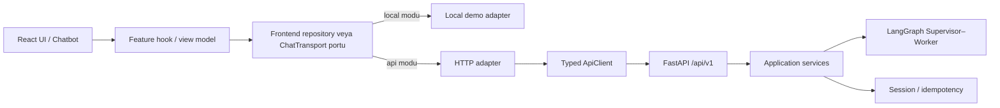
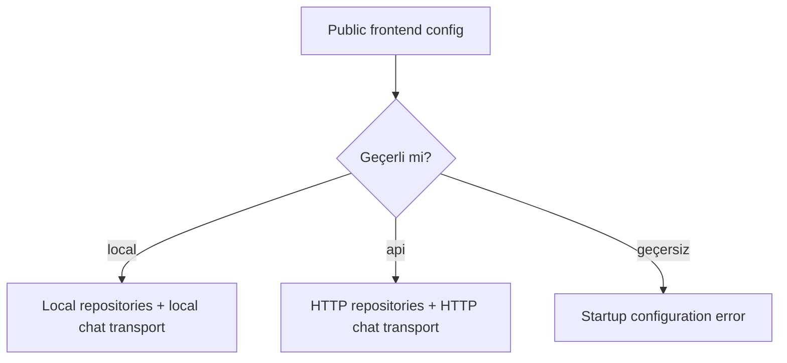

# 13 — Frontend–Backend Entegrasyonu

## 0. Görev kimliği

| Alan | Değer |
| --- | --- |
| Görev | Frontend repository ve chatbot transport katmanını FastAPI `/api/v1` sözleşmesine bağlamak |
| Ön koşul | `00–12` görevlerinin uygulanmış ve kalite kapılarının geçirilmiş olması |
| Ana teknolojiler | TypeScript, React, Fetch API, FastAPI/OpenAPI sözleşmesi |
| Frontend | Mevcut Vite/vinext tabanlı Merinos localhost demo sitesi |
| Backend | `09`, `10`, `11` ve `12` görevleriyle hazırlanmış Python API + Redis + LangGraph katmanı |
| Çalışma modu | Açıkça seçilen `local` veya `api`; sessiz fallback yok |
| API kökü | `/api/v1` |
| Çıktı | Typed HTTP client, API repository adapter'ları, chat transport, session/idempotency akışı, testler ve dokümantasyon |
| Kapsam dışı | Gerçek kurumsal kimlik doğrulama, gerçek katalog/OMS/bayi/CMS bağlantısı, ödeme, Chatwoot/Frappe devri, production deployment |
| Sonraki görev | Güvenlik, KVKK, rate limiting ve gözlemlenebilirlik katmanı |

---

## 1. Amaç

Bu görevin amacı, `08` numaralı görevde oluşturulan frontend portlarını ve `03`
numaralı görevde tanımlanan chatbot konuşma deneyimini, `09` numaralı görevdeki
sürümlü FastAPI sözleşmesine **güvenli, typed, iptal edilebilir ve test edilebilir**
şekilde bağlamaktır.

Görev tamamlandığında:

1. ürün, sipariş, bayi ve bilgi bankası repository'lerinin HTTP implementasyonları bulunmalı,
2. chatbot doğrudan `resolveChatInput` çağırmak yerine seçilen transport üzerinden çalışabilmeli,
3. local demo davranışı ayrı bir local adapter olarak korunmalı,
4. veri kaynağı başlangıçta açıkça seçilmeli ve request sırasında değişmemeli,
5. API hatasında yerel veriye sessiz fallback yapılmamalı,
6. tüm dış JSON payload'ları runtime'da doğrulanmalı,
7. backend hata zarfı frontend `DataError` modeline güvenli biçimde çevrilmeli,
8. request ID hata ve destek ekranlarında kullanılabilmeli,
9. timeout, abort, stale response ve tekrar gönderim davranışları deterministik olmalı,
10. ilk chat isteğinde sunucu tarafından dönen session ID yalnızca gerekli scope'ta tutulmalı,
11. aynı kullanıcı mesajı retry edildiğinde aynı `clientMessageId` kullanılmalı,
12. yeni veya değiştirilmiş mesaj yeni `clientMessageId` üretmeli,
13. sohbet, sipariş numarası ve ham konum browser storage'a yazılmamalı,
14. site ile chatbot arasındaki ortak ürün/bayi state davranışı korunmalı,
15. frontend backend'in iç graph state'ini, Worker trace'ini veya Redis ayrıntılarını bilmemeli,
16. local ve API adapter'ları aynı frontend port test paketinden geçmeli,
17. backend kapalıyken kullanıcı kontrollü ve anlaşılır bir “servis kullanılamıyor” durumu görmeli,
18. frontend build ve backend contract testleri sözleşme kaymasını yakalamalıdır.

Bu görev bağlantı katmanını kurar. Gerçek Merinos sistemleriyle veri entegrasyonu
ve production güvenlik sertleştirmesi bu adımda yapılmaz.

---

## 2. Başlamadan önce okunacak dosyalar

Cursor değişiklik yapmadan önce en az aşağıdaki dosyaları incelemelidir:

```text
cursor-tasks/00-PROJE-ANAYASASI.md
cursor-tasks/01-REPO-VE-GELISTIRME-TEMELI.md
cursor-tasks/02-MERINOS-DEMO-SITESI-VE-TASARIM-SISTEMI.md
cursor-tasks/03-CHATBOT-WIDGET-VE-KONUSMA-DENEYIMI.md
cursor-tasks/04-URUN-ARAMA-VE-FILTRELEME-AKISI.md
cursor-tasks/05-SIPARIS-DURUMU-SORGULAMA-AKISI.md
cursor-tasks/06-BAYI-BULMA-VE-HARITA-AKISI.md
cursor-tasks/07-SSS-VE-BILGI-BANKASI-AKISI.md
cursor-tasks/08-FRONTEND-ORTAK-STATE-VE-VERI-KATMANI.md
cursor-tasks/09-PYTHON-API-VE-SOZLESME-KATMANI.md
cursor-tasks/10-REDIS-OTURUM-VE-SESSION-STATE-YONETIMI.md
cursor-tasks/11-TOKEN-BUTCESI-VE-CONTEXT-COMPRESSION.md
cursor-tasks/12-LANGGRAPH-SUPERVISOR-WORKER-AKISI.md
package.json
package-lock.json
tsconfig.json
vite.config.ts
next.config.ts
app/page.tsx
components/Chatbot.tsx
components/DealerMap.tsx
lib/types.ts
lib/demo-data.ts
lib/chatbot/engine.ts
features/
lib/data/
lib/state/
shared/demo-data/
docs/04-API-SOZLESMELERI.md
docs/openapi/merinos-api-v1.json
backend/.env.example
backend/pyproject.toml
backend/src/merinos_agent/api/
backend/src/merinos_agent/application/
backend/src/merinos_agent/graph.py
backend/src/merinos_agent/session_store.py
backend/tests/
tests/
```

Önceki görevler eşdeğer ama farklı bir klasör yapısı oluşturmuşsa mevcut yapı
kullanılmalı; aynı sorumluluk için ikinci bir paralel katman açılmamalıdır.

Değişiklikten önce çalıştırılabilen kalite kapıları kaydedilmelidir:

```bash
npm test
npm run lint
npm run build

cd backend
python -m unittest discover -s tests -v
```

Projede `pytest`, `vitest` veya başka tek bir test standardı daha önce kurulmuşsa
o standart kullanılmalıdır. Aynı amaç için ikinci bir test framework'ü eklenmemelidir.

---

## 3. Mevcut durum ve çözülmesi gereken sorunlar

Mevcut başlangıç paketinde:

- chatbot yanıtları `lib/chatbot/engine.ts` içindeki yerel fonksiyonlardan üretilmektedir,
- UI doğrudan veya local repository üzerinden demo dizilerine erişmektedir,
- HTTP client ve backend transport adapter'ı bulunmamaktadır,
- session kimliği ve `clientMessageId` yaşam döngüsü frontend'de tanımlı değildir,
- FastAPI hata zarfını `DataError` modeline çeviren tek merkez bulunmamaktadır,
- request timeout ve abort politikası ortak değildir,
- API response'larının runtime doğrulaması bulunmamaktadır,
- CORS ve API base URL davranışı frontend tarafında belgelenmemiştir,
- API kapalıyken ne olacağı açık değildir,
- local ve HTTP adapter davranış eşitliği contract testleriyle korunmamaktadır.

Aşağıdaki riskler çözülmelidir:

1. UI bileşenlerinin `fetch()` çağrılarını kendi içinde yapması,
2. her feature'ın farklı hata/timeout biçimi kullanması,
3. API hatasında sessizce demo verisi gösterilerek kullanıcının yanıltılması,
4. aynı chat mesajının retry sırasında yeni kimlikle tekrar işlenmesi,
5. kapatılan veya resetlenen widget'a eski response'un yazılması,
6. TypeScript tipi doğru görünse de bozuk JSON'un çalışma zamanında kabul edilmesi,
7. backend'in `camelCase` sözleşmesinin frontend domain türleriyle karıştırılması,
8. backend'e ait enum veya hata mesajlarının doğrudan UI metni olarak gösterilmesi,
9. session ID, sipariş numarası veya koordinatların localStorage ve loglara düşmesi,
10. request ID'nin kaybedilmesi nedeniyle hata teşhisinin zorlaşması,
11. OpenAPI değiştiğinde frontend adapter'larının sessizce bozulması,
12. direct API URL'nin bileşenlere dağılması,
13. backend readiness kontrolünün gereksiz şekilde her request'i bloklaması,
14. farklı source'lar arasında aynı konuşma sırasında veri kaynağı değişmesidir.

---

## 4. Bağlayıcı mimari kararlar

### 4.1. UI doğrudan HTTP bilmez

Katman akışı aşağıdaki gibi olmalıdır:



Kurallar:

- React bileşenleri API URL'si veya HTTP status kodu yorumlamamalıdır.
- `ApiClient` domain filtreleme veya chatbot metni üretmemelidir.
- HTTP DTO'ları doğrudan UI state'e konulmamalıdır.
- HTTP DTO → frontend domain/view model dönüşümü adapter içinde yapılmalıdır.
- Backend `GraphState`, `WorkerResult`, checkpoint veya Redis modeli frontend'e taşınmamalıdır.
- Local ve HTTP adapter aynı portları uygulamalıdır.

### 4.2. Veri kaynağı başlangıçta seçilir

Desteklenen kaynaklar:

```ts
export type FrontendDataSource = "local" | "api";
```

Kaynak uygulama başlangıcında tek kez çözülmelidir. Request bazında veya hata
sonrasında otomatik kaynak değiştirilmemelidir.



Bağlayıcı kurallar:

- `api` modunda backend hatası local sonuçla gizlenmemelidir.
- `local` modunda ağ çağrısı yapılmamalıdır.
- Aynı sayfa oturumunda ürün repository `api`, chatbot `local` gibi karışık kaynak kullanılmamalıdır.
- Testler dependency injection ile hangi adapter'ın kullanılacağını belirlemelidir.
- UI, metadata içindeki `isDemo` durumunu görünür demo etiketiyle korumalıdır.

### 4.3. Tek HTTP client

Projede tüm API çağrıları için tek bir `ApiClient` veya eşdeğer transport
çekirdeği bulunmalıdır. Feature bazında ayrı `fetch` wrapper'ları yazılmamalıdır.

`ApiClient` şu sorumluluklarla sınırlıdır:

- base URL çözme,
- güvenli URL oluşturma,
- ortak header'ları ekleme,
- timeout/abort yönetimi,
- status ve content-type kontrolü,
- güvenli JSON okuma,
- success/error envelope doğrulama,
- request ID yakalama,
- transport hatasını typed sonuca dönüştürme.

`ApiClient` şu sorumlulukları almamalıdır:

- ürün filtreleme,
- sipariş numarası iş kuralı,
- bayi sıralama,
- SSS confidence kararı,
- chat intent belirleme,
- UI metni seçme,
- local fallback.

### 4.4. Runtime doğrulama zorunludur

TypeScript compile-time tipi, ağdan gelen veriyi doğrulamaz. Her endpoint response'u
runtime'da açık parser/type guard ile doğrulanmalıdır.

Kabul edilebilir yaklaşımlar:

1. projede önceden kurulmuş bir schema kütüphanesi varsa onu kullanmak,
2. küçük ve endpoint'e özel saf parser/type guard fonksiyonları yazmak,
3. OpenAPI generated types + ayrı runtime parser kullanmak.

Yasak yaklaşım:

```ts
const payload = (await response.json()) as ProductSearchResponse;
```

Bu cast tek başına doğrulama değildir.

Yeni ağır runtime schema kütüphanesi sırf bu görev için eklenmemelidir. Yeni
bağımlılık gerekiyorsa neden ve bundle etkisi raporlanmalıdır.

---

## 5. Hedef frontend modül yapısı

Önceki görevlerde eşdeğer yapı yoksa aşağıdaki gibi bir sorumluluk ayrımı
oluşturulmalıdır:

```text
lib/
  config/
    public-env.ts
  api/
    api-client.ts
    api-envelope.ts
    api-error.ts
    api-request.ts
    api-types.generated.ts       # seçilen codegen yolu varsa
    parsers/
      common.ts
      product.ts
      order.ts
      dealer.ts
      knowledge.ts
      chat.ts
    mappers/
      product-mapper.ts
      order-mapper.ts
      dealer-mapper.ts
      knowledge-mapper.ts
      chat-mapper.ts
  data/
    ports/
      product-repository.ts
      order-repository.ts
      dealer-repository.ts
      knowledge-repository.ts
    local/
      ...                        # 08 görevindeki adapter'lar
    http/
      http-product-repository.ts
      http-order-repository.ts
      http-dealer-repository.ts
      http-knowledge-repository.ts
    repository-factory.ts
  chatbot/
    ports/
      chat-transport.ts
    local/
      local-chat-transport.ts
    http/
      http-chat-transport.ts
    chat-session-controller.ts
    message-id.ts
    engine.ts                    # local adapter için korunur
features/
  products/
  orders/
  dealers/
  knowledge/
  chat/
    hooks/
    view-models/
shared/
  contracts/                    # yalnızca gerçekten ortak, transport bağımsız tipler
scripts/
  generate-api-types.*
  api-contract-check.*
tests/
  api/
  repositories/
  chatbot/
```

Kurallar:

- Aynı isimli ikinci repository port seti oluşturulmamalıdır.
- `lib/types.ts` kontrollü olarak domain dosyalarına ayrılabilir; public import'lar
  geçici re-export ile korunmalıdır.
- Generated dosya varsa elle düzenlenmemelidir.
- Generated dosya backend Python iç modellerini değil yalnızca OpenAPI dış
  sözleşmesini temsil etmelidir.
- `api/` klasörü React import etmemelidir.
- Repository adapter'ları CSS, JSX veya kullanıcıya gösterilecek hazır bileşen
  döndürmemelidir.

---

## 6. Public frontend yapılandırması

### 6.1. Önerilen değişkenler

Mevcut Vite/vinext yapısında public istemci ayarları tek typed config modülünden
okunmalıdır. Önerilen değerler:

```dotenv
VITE_MERINOS_DATA_SOURCE=api
VITE_MERINOS_API_BASE_URL=http://127.0.0.1:8000
VITE_MERINOS_API_TIMEOUT_MS=10000
VITE_MERINOS_CHAT_TIMEOUT_MS=30000
VITE_MERINOS_API_MAX_RESPONSE_BYTES=1048576
```

Projede `NEXT_PUBLIC_*` standardı daha önce bilinçli biçimde kurulmuşsa aynı
amaç için ikinci değişken ailesi eklenmemeli; mevcut build sisteminin gerçekten
client'a aktardığı tek standarda uyulmalıdır.

### 6.2. Config doğrulaması

Config import edildiğinde değil, açık bir `loadPublicConfig()` çağrısıyla
çözülmelidir. Model örneği:

```ts
export type PublicAppConfig = {
  dataSource: "local" | "api";
  apiBaseUrl?: URL;
  requestTimeoutMs: number;
  chatTimeoutMs: number;
  maxResponseBytes: number;
};
```

Kurallar:

- `local` modunda API URL zorunlu değildir.
- `api` modunda API URL zorunludur.
- Development'ta `http://localhost` ve `http://127.0.0.1` kabul edilebilir.
- Production benzeri modda düz HTTP URL reddedilmelidir.
- URL içinde username/password bulunmamalıdır.
- URL query veya fragment içermemelidir.
- Base URL son slash farkından bağımsız normalize edilmelidir.
- Geçersiz timeout, negatif sayı veya aşırı büyük değer startup'ta reddedilmelidir.
- Secret, Redis URL, API private key veya auth credential public env'e konmamalıdır.

### 6.3. `.env.example`

Frontend kökünde örnek dosya yoksa aşağıdaki amaçla eklenmelidir:

```text
.env.example
```

Gerçek `.env`, `.env.local` ve secret dosyaları `.gitignore` içinde kalmalıdır.

---

## 7. API base URL ve path güvenliği

API route'ları string birleştirme ile oluşturulmamalıdır:

```ts
// Yanlış
fetch(baseUrl + "/api/v1/products?" + rawQuery);
```

Tercih edilen model:

```ts
const url = new URL("/api/v1/products", config.apiBaseUrl);
url.searchParams.set("locale", "tr-TR");
```

Kurallar:

- Kullanıcı girdisi host veya protocol oluşturamamalıdır.
- Endpoint path'leri sabit allowlist'ten gelmelidir.
- Query parametreleri `URLSearchParams` ile encode edilmelidir.
- Chat mesajı, SSS sorgusu ve koordinatlar gereksiz biçimde URL'ye yazılmamalıdır.
- Sipariş endpoint'inin path parametresi API sözleşmesi gereğidir; canonical değer
  `encodeURIComponent` veya URL API ile güvenli oluşturulmalıdır.
- API base URL bileşenlerden okunmamalıdır.

---

## 8. Ortak API envelope türleri

Frontend transport katmanında backend sözleşmesini temsil eden minimum türler
bulunmalıdır:

```ts
export type ApiMeta = {
  apiVersion: "v1";
  requestId: string;
  timestamp: string;
  demo: boolean;
  page?: number;
  pageSize?: number;
  total?: number;
  hasNext?: boolean;
  contentVersion?: string;
  distanceMode?: "DEMO_APPROXIMATE" | "LIVE";
};

export type ApiSuccessEnvelope<T> = {
  data: T;
  meta: ApiMeta;
};

export type ApiFieldError = {
  path: string;
  code: string;
  message: string;
};

export type ApiErrorEnvelope = {
  error: {
    code: string;
    message: string;
    requestId: string;
    fields?: ApiFieldError[];
  };
  meta: {
    apiVersion: "v1";
    timestamp: string;
  };
};
```

Kurallar:

- `requestId` header ve body'de varsa aynı olmalıdır.
- Uyuşmazlık `INVALID_RESPONSE` olarak ele alınmalı ve ham değer UI'ya basılmamalıdır.
- `timestamp` geçerli ISO 8601 olmalıdır.
- `demo` zorunlu boolean olmalıdır.
- Bilinmeyen top-level alanlar sözleşme politikasına göre reddedilmeli veya açıkça
  ignore edilmelidir; davranış bütün endpoint'lerde tutarlı olmalıdır.
- Başarılı ve hatalı zarf aynı anda kabul edilmemelidir.
- Empty body, HTML error sayfası ve yanlış content-type kontrollü hataya dönmelidir.

---

## 9. `ApiClient` sözleşmesi

Önerilen temel port:

```ts
export type HttpMethod = "GET" | "POST";

export type ApiRequestOptions<TBody = unknown> = {
  method: HttpMethod;
  path: string;
  query?: Readonly<Record<string, string | number | boolean | readonly string[] | undefined>>;
  body?: TBody;
  signal?: AbortSignal;
  timeoutMs?: number;
  clientRequestId?: string;
};

export type ApiClientResult<T> =
  | {
      ok: true;
      data: T;
      meta: ApiMeta;
      httpStatus: number;
    }
  | {
      ok: false;
      error: TransportError;
      httpStatus?: number;
      requestId?: string;
    };

export interface ApiClient {
  request<T>(
    options: ApiRequestOptions,
    parseData: (value: unknown) => ParseResult<T>,
  ): Promise<ApiClientResult<T>>;
}
```

`fetch` fonksiyonu constructor veya factory ile enjekte edilebilir olmalıdır:

```ts
export type FetchLike = typeof fetch;
```

Bu sayede unit testler gerçek ağ gerektirmeden çalışmalıdır.

### 9.1. Header politikası

Varsayılan header'lar:

```http
Accept: application/json
Content-Type: application/json; charset=utf-8   # yalnızca body varsa
X-Request-ID: <güvenli client request id>       # server sözleşmesi kabul ediyorsa
```

Kurallar:

- `Content-Type` GET isteklerine gereksiz eklenmemelidir.
- `Authorization`, Cookie veya API key bu görevde eklenmemelidir.
- Browser `credentials` modu varsayılan olarak `omit` olmalıdır.
- Gelecekte cookie tabanlı auth gelirse CORS ve CSRF kararı ayrı güvenlik görevinde
  verilmeden `include` yapılmamalıdır.
- Kullanıcı tarafından verilen key/value serbestçe header'a taşınmamalıdır.
- Client request ID URL-safe, kısa ve rastgele olmalıdır; kullanıcı mesajından
  türetilmemelidir.

### 9.2. Request ID davranışı

- Her ağ isteği için ayrı `clientRequestId` üretilebilir.
- Retry aynı logical request ise aynı `clientRequestId` kullanabilir; bu karar
  testle sabitlenmelidir.
- Chat `clientMessageId`, HTTP `X-Request-ID` ile aynı kavram değildir.
- Backend response `X-Request-ID` değeri body `meta.requestId` ile eşleşmelidir.
- UI hata ekranında yalnızca güvenli destek kodu olarak request ID gösterilebilir.
- Request ID analytics label veya DOM dataset içinde gereksiz tutulmamalıdır.

---

## 10. Timeout ve abort yönetimi

### 10.1. Varsayılan timeout'lar

Başlangıç referansı:

| İşlem | Timeout |
| --- | ---: |
| Ürün arama/facet | 10 saniye |
| Bayi arama | 10 saniye |
| SSS arama | 10 saniye |
| Sipariş durumu | 12 saniye |
| Chat turn | 30 saniye |
| Health/readiness | 3 saniye |

Bu değerler config ile değiştirilebilir; hard-code edilmiş farklı timeout'lar
feature dosyalarına dağılmamalıdır.

### 10.2. Signal birleştirme

Caller `AbortSignal` ve timeout signal birlikte çalışmalıdır. Birinin abort
olması isteği sonlandırmalıdır.

Kurallar:

- Caller abort → `ABORTED`, `retryable: false`.
- Timeout abort → `TIMEOUT`, `retryable: true`.
- React component unmount her zaman chat request'i iptal etmek zorunda değildir;
  `03` görevindeki kapalıyken unread yanıt davranışı korunabilir.
- Chat reset aktif request'i iptal etmeli ve eski response'u ignore etmelidir.
- Ürün/bayi filtre değişiminde eski request iptal edilmelidir.
- Abort exception mesajı kullanıcıya doğrudan gösterilmemelidir.
- Timeout timer her sonuç yolunda temizlenmelidir.

### 10.3. Stale response koruması

Her feature request'i monotonik request token veya controller kimliği taşımalıdır.

```ts
if (responseRequestId !== activeRequestId) {
  return; // state'e yazma
}
```

Bu kontrol özellikle aşağıdaki durumlarda zorunludur:

- hızlı ürün filtresi değişimi,
- şehir değişimi,
- SSS sorgusu değişimi,
- chat reset,
- data source/provider yeniden oluşturulması,
- React Strict Mode geliştirme davranışı.

---

## 11. Response body boyutu ve JSON okuma

API client büyük veya bozuk response'a karşı sınır uygulamalıdır.

Kurallar:

- `Content-Length` varsa limitten büyük değer erken reddedilmelidir.
- Header yoksa response stream veya text okuma sırasında byte sınırı uygulanmalıdır.
- Varsayılan üst sınır `1 MiB` olabilir; config ile kontrollü değiştirilebilir.
- HTML proxy hata sayfası JSON diye parse edilmemelidir.
- `204` yalnızca endpoint sözleşmesi izin veriyorsa kabul edilmelidir; mevcut iş
  endpoint'lerinde başarı zarfı beklenir.
- JSON parse hatası `INVALID_RESPONSE` olmalıdır.
- Ham body loglanmamalı veya kullanıcıya gösterilmemelidir.

---

## 12. Transport hata modeli

Önerilen iç model:

```ts
export type TransportErrorCode =
  | "INVALID_CONFIG"
  | "INVALID_REQUEST"
  | "ABORTED"
  | "TIMEOUT"
  | "NETWORK_UNAVAILABLE"
  | "INVALID_CONTENT_TYPE"
  | "RESPONSE_TOO_LARGE"
  | "INVALID_RESPONSE"
  | "API_ERROR"
  | "UNKNOWN";

export type TransportError = {
  code: TransportErrorCode;
  apiCode?: string;
  retryable: boolean;
  safeMessageKey: string;
  requestId?: string;
  fieldErrors?: ReadonlyArray<ApiFieldError>;
  cause?: unknown;
};
```

`cause` yalnızca development tanılama scope'unda tutulabilir; UI render, analytics
payload veya browser storage'a yazılmamalıdır.

### 12.1. HTTP/API hata eşlemesi

| HTTP/API durumu | Frontend `DataErrorCode` | Retry |
| --- | --- | --- |
| Client validation | `INVALID_INPUT` | Hayır |
| `VALIDATION_ERROR` | `INVALID_INPUT` | Hayır |
| `AUTHENTICATION_REQUIRED` | `UNAUTHORIZED` | Kullanıcı aksiyonuna bağlı |
| `FORBIDDEN` | `FORBIDDEN` | Hayır |
| Güvenli resource unavailable | Domain'e göre sonuç veya `NOT_FOUND` | Hayır |
| `IDEMPOTENCY_CONFLICT` | `INVALID_INPUT` veya özel chat conflict | Hayır |
| `RATE_LIMITED` | `RATE_LIMITED` | Evet, kullanıcı kontrollü |
| `DEPENDENCY_ERROR` | `UNAVAILABLE` | Evet |
| `SERVICE_UNAVAILABLE` | `UNAVAILABLE` | Evet |
| Gateway/timeout | `TIMEOUT` veya `UNAVAILABLE` | Evet |
| Network error | `UNAVAILABLE` | Evet |
| Abort | `ABORTED` | Hayır |
| Bozuk JSON/schema | `INVALID_RESPONSE` | Genellikle hayır |
| Bilinmeyen | `UNKNOWN` | Kontrollü |

Backend'in `error.message` alanı güvenli kabul edilse bile UI'nın ana metni
olarak doğrudan kullanılmamalıdır. UI onaylı `safeMessageKey` sözlüğünden metin
üretmelidir. Backend mesajı development detayında bile hassas veri denetiminden
geçmeden gösterilmemelidir.

### 12.2. Alan hataları

Form alanı hataları yalnızca bilinen path allowlist'i üzerinden alanlara
bağlanmalıdır:

```text
message
query
orderNumber
city
district
lat
lng
radiusKm
```

Bilinmeyen path global hata olarak ele alınmalıdır. Backend'den gelen path HTML,
selector veya object path olarak çalıştırılmamalıdır.

---

## 13. Retry politikası

### 13.1. Varsayılan karar

`ApiClient` otomatik retry yapmamalıdır. Retry kararı repository veya feature
seviyesinde açıkça verilmelidir.

### 13.2. Otomatik retry yapılabilecek işlemler

Yalnızca aşağıdaki koşulların tümünde en fazla bir otomatik retry düşünülebilir:

- method `GET`,
- işlem side-effect içermiyor,
- caller abort etmemiş,
- hata network, `502`, `503` veya `504`,
- response body tüketimi güvenli tamamlanmış,
- feature aktif request hâlâ aynı,
- retry gecikmesi sınırlı ve test edilebilir.

MVP'de otomatik retry eklenmemesi kabul edilebilir ve daha güvenli varsayımdır.

### 13.3. Otomatik retry yasakları

Aşağıdaki çağrılar otomatik retry edilmemelidir:

- `POST /api/v1/chat/messages`,
- `POST /api/v1/knowledge/search`,
- `429` response,
- validation/authorization hataları,
- caller abort,
- idempotency conflict,
- runtime parser hatası.

Chat retry kullanıcı eylemiyle ve aynı `clientMessageId + aynı payload` ile
yapılmalıdır.

`Retry-After` bilgisi varsa UI bekleme süresini güvenli ve üst sınırlandırılmış
biçimde gösterebilir; otomatik uzun timer başlatılmamalıdır.

---

## 14. OpenAPI ve TypeScript contract stratejisi

### 14.1. Tek kaynak

Dış API sözleşmesinin kaynak dosyası:

```text
docs/openapi/merinos-api-v1.json
```

Bu dosya FastAPI uygulamasından üretilmiş olmalıdır. Frontend tarafında endpoint
alanları bağımsız biçimde tahmin edilmemelidir.

### 14.2. Önerilen codegen

Projede codegen yoksa `openapi-typescript` gibi yalnızca geliştirme zamanında
çalışan tek bir araç kullanılabilir. Sürüm `package-lock.json` içinde
sabitlenmelidir.

Örnek script:

```json
{
  "scripts": {
    "api:types": "openapi-typescript docs/openapi/merinos-api-v1.json -o lib/api/api-types.generated.ts",
    "api:types:check": "npm run api:types && git diff --exit-code -- lib/api/api-types.generated.ts"
  }
}
```

Kurallar:

- Generated dosya elle düzenlenmez.
- Generated dosya runtime validation yerine geçmez.
- Codegen eklenirse yalnızca dev dependency olmalıdır.
- Aynı amaçla ikinci codegen aracı eklenmemelidir.
- CI'da OpenAPI snapshot ve generated type drift kontrol edilmelidir.
- Codegen ortamda kurulamazsa contract fixture testleriyle eşdeğer drift kontrolü
  kurulmalı; sessizce elle yazılmış tipe dönülmemelidir.

### 14.3. DTO ve domain tipi ayrımı

Örnek:

```ts
// Transport DTO
export type ApiProductDto = paths["/api/v1/products"]["get"]["responses"]["200"]...;

// Frontend domain
export type Product = {
  id: number;
  name: string;
  // ...
};
```

Mapper:

```ts
function mapApiProduct(dto: ApiProductDto): Product {
  // runtime doğrulama sonrası explicit alan dönüşümü
}
```

Backend DTO değişiklikleri UI'nın her yerine yayılmamalıdır.

---

## 15. Repository factory ve dependency injection

Tek bir factory data source'a göre adapter setini oluşturmalıdır:

```ts
export type FrontendServices = {
  products: ProductRepository;
  orders: OrderRepository;
  dealers: DealerRepository;
  knowledge: KnowledgeRepository;
  chat: ChatTransport;
};

export function createFrontendServices(
  config: PublicAppConfig,
  dependencies?: { fetch?: FetchLike; now?: () => Date },
): FrontendServices;
```

Kurallar:

- Factory her render'da tekrar çalıştırılmamalıdır.
- Provider veya app root içinde bir kez oluşturulmalıdır.
- Testler fake adapter enjekte edebilmelidir.
- Feature bileşenleri global singleton import etmek zorunda kalmamalıdır.
- `local` ve `api` adapter'ları aynı anda UI'ya verilmemelidir.
- Runtime data source switch desteklenmeyecekse UI toggle eklenmemelidir.

---

## 16. Ürün HTTP repository'si

Endpoint:

```http
GET /api/v1/products
```

Repository, `04` ve `08` görevlerindeki `ProductRepository` sözleşmesini
uygulamalıdır.

### 16.1. Query serialization

- kategori, renk, ölçü ve koleksiyon parametreleri backend OpenAPI adlarıyla
  eşlenmelidir,
- aynı facet içindeki çoklu değerler backend sözleşmesine göre repeated query
  param veya virgülsüz array encoding kullanmalıdır,
- değerler deterministik sıraya konulmalıdır,
- boş diziler query'ye yazılmamalıdır,
- page/pageSize sınırları frontend'de de doğrulanmalıdır,
- locale `tr-TR` açıkça taşınmalıdır.

Örnek deterministik query:

```text
/api/v1/products?category=Salon%20Hal%C4%B1s%C4%B1&color=Krem&size=160x230&locale=tr-TR&page=1&pageSize=12
```

### 16.2. Mapping

- para `amountMinor/currency/fractionDigits` modelinden frontend money modeline
  kayıpsız çevrilmelidir,
- binary float ile fiyat hesaplanmamalıdır,
- enum görüntü metni frontend formatter/view model katmanında çözülmelidir,
- pagination metadata korunmalıdır,
- `demo: true` UI demo etiketiyle uyumlu olmalıdır,
- backend'in sıralaması korunmalı; frontend yeniden farklı puanlama yapmamalıdır.

### 16.3. Arama davranışı

API modunda ürün filtreleme iş kuralı frontend'de ikinci kez uygulanmamalıdır.
Frontend:

- kriterleri toplar,
- request'i gönderir,
- response'u doğrular,
- kartlara map eder,
- boş sonuç önerilerini gösterir.

Local modunda aynı domain kuralları local adapter içinde uygulanmaya devam eder.
Contract testleri iki adapter'ın aynı kriter için eşdeğer domain sonucu üretmesini
doğrulamalıdır.

---

## 17. Sipariş HTTP repository'si

Endpoint:

```http
GET /api/v1/orders/{orderNumber}/status
```

Kurallar:

- sipariş numarası `05` görevindeki canonicalizer ile request öncesi doğrulanmalıdır,
- invalid format ağ çağrısı yapılmadan `INVALID_INPUT` dönmelidir,
- fuzzy veya kısmi request gönderilmemelidir,
- numara browser history, localStorage, analytics veya console loga yazılmamalıdır,
- response `found/unavailable` güvenli domain union'ına map edilmelidir,
- takip kodu backend'den maskeli gelmeli; frontend ham kod varsaymamalıdır,
- tahmini tarih garanti metnine dönüştürülmemelidir,
- API `404 RESOURCE_NOT_AVAILABLE` durumunda kullanıcıya kayıt/yetki ayrımı
  açıklanmamalıdır,
- otomatik retry yapılmamalı; kullanıcı kontrollü retry sunulmalıdır,
- retry aynı lookup inputuyla yeni HTTP request ID üretebilir; sipariş sorgusu için
  `clientMessageId` kullanılmaz.

Sipariş sonucu chat dışında bir panelde tutuluyorsa widget reset veya sayfa
navigasyonu sonrası kalıcılık açıkça tanımlanmalı; browser storage yasaktır.

---

## 18. Bayi HTTP repository'si

Endpoint:

```http
GET /api/v1/dealers
```

Desteklenen iki request biçimi:

1. şehir/ilçe,
2. açık kullanıcı izni sonrası koordinat + yarıçap.

Kurallar:

- şehir/ilçe ile koordinat aynı request'te gönderilmemelidir,
- ham koordinat state, URL, log veya request ID üretimine dahil edilmemelidir,
- konum yalnızca aktif request süresince tutulmalı ve sonucu aldıktan sonra
  gereksiz kopyaları temizlenmelidir,
- response içindeki `isApproximate` ve `distanceMode` kullanıcıya görünür olmalıdır,
- API sıralaması korunmalıdır,
- telefon URI ve dış harita URL'leri allowlist/formatter ile üretilmelidir,
- backend keyfi dış URL döndürürse doğrudan anchor `href` yapılmamalıdır,
- seçilen bayi `selectedDealerId` ortak state'ine map edilmelidir,
- liste ve harita tek seçim kaynağını kullanmaya devam etmelidir.

Konum izni reddinde repository hata üretmemeli; browser geolocation adapter'ı
manuel şehir/ilçe akışına döndürmelidir.

---

## 19. Bilgi bankası HTTP repository'si

Endpoint:

```http
POST /api/v1/knowledge/search
```

Request:

```ts
{
  query: string;
  locale: "tr-TR";
}
```

Kurallar:

- query 500 karakter sınırına frontend'de de uymalıdır,
- query URL'ye yazılmamalıdır,
- düşük güven sonucu kesin yanıt gibi gösterilmemelidir,
- `confidenceBand` raw score'a dönüştürülmemelidir,
- kaynak ID, label, contentVersion ve review tarihi korunmalıdır,
- yalnızca backend'in `published` sonucu kabul edilmelidir,
- response içinde HTML varsa plain text/allowlist render politikası uygulanmalıdır;
  varsayılan plain text olmalıdır,
- related suggestion action'ları typed ve güvenli olmalıdır,
- otomatik POST retry yapılmamalıdır,
- kullanıcı retry ettiğinde yeni request yapılabilir; bu endpoint side-effect
  üretmemelidir ama transport varsayımıyla kör retry yapılmamalıdır.

---

## 20. Chat transport portu

`03` görevindeki UI, local engine'e doğrudan bağlı olmamalıdır. Önerilen port:

```ts
export type ChatTransportRequest = {
  sessionId?: string;
  clientMessageId: string;
  message: string;
  locale: "tr-TR";
  context?: ChatEntryContext;
  signal?: AbortSignal;
};

export type ChatTransportSuccess = {
  sessionId: string;
  clientMessageId: string;
  assistantMessage: ChatAssistantMessage;
  intent: ChatIntentCode;
  status: "OK" | "PARTIAL" | "CLARIFICATION" | "UNAVAILABLE";
  result: ChatResult;
  actions: ChatAction[];
  requestId: string;
  demo: boolean;
};

export interface ChatTransport {
  send(request: ChatTransportRequest): Promise<DataResult<ChatTransportSuccess>>;
}
```

Local adapter:

- `resolveChatInput` veya 04–07 sonrası oluşan local orchestrator'ı kullanır,
- aynı `ChatTransport` sözleşmesini uygular,
- local metadata üretir,
- gerçek session/Redis garantisi varmış gibi davranmaz,
- `source: "local-demo"` döndürür.

HTTP adapter:

- `POST /api/v1/chat/messages` çağırır,
- typed response parser kullanır,
- result union'ını frontend chat domain modeline map eder,
- session ve idempotency sözleşmesini korur,
- backend internal alanlarını UI'ya taşımaz.

---

## 21. Chat session yaşam döngüsü

### 21.1. Session ID

`10` görevine göre ilk chat request'inde `sessionId` olmayabilir. Backend response
sunucu tarafından üretilmiş session kimliğini döndürmelidir.

Frontend kuralları:

- session ID yalnızca chat session controller state'inde tutulmalıdır,
- `localStorage`, `sessionStorage`, IndexedDB, URL, cookie veya analytics'e
  yazılmamalıdır,
- widget kapatılıp açıldığında aynı React app yaşam döngüsü içinde korunabilir,
- sayfa reload sonrası yeni session başlatılması MVP için kabul edilir,
- session ID authentication olarak sunulmamalıdır,
- session ID UI'da tam biçimde gösterilmemelidir,
- loglanmamalıdır,
- backend farklı session ID döndürürse yalnızca kabul edilen transition kurallarıyla
  güncellenmelidir.

### 21.2. Reset

Kullanıcı onaylı sohbet reset işleminde:

1. aktif chat request abort edilir,
2. generation/request token artırılır,
3. UI mesajları başlangıç durumuna döner,
4. pending retry bilgileri temizlenir,
5. session ID `undefined` yapılır,
6. yeni mesaj yeni backend session başlatır.

Bu görevde API sözleşmesinde session delete endpoint'i yoksa uydurulmamalıdır.
Eski Redis session TTL ile sona erer. Gelecekte açık silme endpoint'i eklenecekse
ayrı contract değişikliği gerekir.

### 21.3. Session değişim güvenliği

- Response `sessionId` boş veya invalid ise response reddedilmelidir.
- İlk request'te dönen session kabul edilir.
- Mevcut session varken response farklı session döndürüyorsa bu normal kabul
  edilmemeli; `INVALID_RESPONSE` veya belgelenmiş rotation akışı uygulanmalıdır.
- Session resetten önce başlatılmış response yeni session'a yazılmamalıdır.

---

## 22. `clientMessageId` ve idempotency

### 22.1. Üretim

Her yeni kullanıcı mesajı için URL-safe UUID veya eşdeğer güvenli rastgele
`clientMessageId` üretilmelidir.

Kurallar:

- içerikten hash ile doğrudan üretilmemelidir,
- timestamp tek başına kullanılmamalıdır,
- kullanıcı mesajı ID içine gömülmemelidir,
- maksimum backend sözleşmesine uymalıdır,
- message modelinde retry yaşam döngüsü boyunca korunmalıdır.

### 22.2. Retry

Aynı kullanıcı mesajının transport retry'sinde:

- aynı `sessionId`,
- aynı `clientMessageId`,
- aynı normalize edilmemiş orijinal `message`,
- aynı locale,
- aynı typed context

gönderilmelidir.

Kullanıcı mesajı düzenler veya yeni bir hızlı aksiyon seçerse yeni
`clientMessageId` oluşturulmalıdır.

### 22.3. Conflict

Backend `409 IDEMPOTENCY_CONFLICT` döndürürse:

- otomatik yeni ID ile tekrar gönderilmemeli,
- mevcut mesaj “gönderilemedi” durumuna alınmalı,
- güvenli genel mesaj gösterilmeli,
- development logunda yalnızca request ID ve hata kodu bulunmalı,
- kullanıcı mesajı veya session ID loglanmamalıdır.

---

## 23. Chat request sıralaması

MVP'de aynı session içinde bir anda yalnızca bir aktif user turn işlenmelidir.

Kurallar:

- aktif send sırasında composer `03` görevindeki kurala göre disable veya queued
  davranmalıdır,
- ikinci user mesajı aynı anda backend'e gönderilmemelidir,
- hızlı aksiyon çift tıklaması duplicate request üretmemelidir,
- request tamamlanınca pending state doğru mesajla eşleştirilmelidir,
- widget kapatılması request'i otomatik iptal etmeyebilir; yanıt geldiğinde unread
  davranışı korunabilir,
- reset request'i iptal eder,
- route/unmount davranışı app mimarisine göre açıkça test edilmelidir.

Gelecekte paralel chat turn desteği düşünülse bile bu görevde eklenmemelidir.

---

## 24. Chat result discriminated union

Frontend aşağıdaki sonucu typed union olarak ele almalıdır:

```ts
export type ChatResult =
  | ProductChatResult
  | OrderChatResult
  | DealerChatResult
  | KnowledgeChatResult
  | ClarificationChatResult
  | UnavailableChatResult;
```

Discriminator backend sözleşmesiyle uyumlu olmalıdır:

```text
PRODUCT_SEARCH
ORDER_STATUS
DEALER_SEARCH
KNOWLEDGE
CLARIFICATION
UNAVAILABLE
```

Kurallar:

- `switch` exhaustive olmalıdır.
- Bilinmeyen `kind` `INVALID_RESPONSE` üretmelidir.
- Result içindeki ürün/order/dealer/knowledge DTO'ları ilgili mapper'lardan
  geçirilmelidir.
- Assistant text plain text olarak render edilmelidir.
- Worker trace, plan, score, prompt veya internal error kullanıcı mesajına
  eklenmemelidir.
- Partial success varsa başarılı alt sonuçlar korunmalı, başarısız alt işlem için
  güvenli durum gösterilmelidir.

---

## 25. Chat action güvenliği

Backend action'ları serbest komut değildir. Allowlist kullanılmalıdır:

```ts
export type ChatActionKind =
  | "APPLY_PRODUCT_FILTERS"
  | "FOCUS_DEALER"
  | "ASK_FOLLOW_UP"
  | "RETRY_MESSAGE"
  | "START_NEW_SEARCH";
```

Gerçek API sözleşmesinde farklı ama eşdeğer enum varsa tek kaynak olarak o
kullanılmalıdır.

Kurallar:

- Bilinmeyen action render edilmemelidir.
- Backend action JavaScript, CSS selector, raw URL veya keyfi object mutation
  taşıyamaz.
- `APPLY_PRODUCT_FILTERS` yalnızca `08` görevindeki typed command üzerinden
  ortak state'i günceller.
- `FOCUS_DEALER` yalnızca var olan dealer ID allowlist'iyle çalışır.
- Action kullanıcı tıklaması olmadan site state'ini değiştirmemelidir.
- Dış URL gerekiyorsa route/host allowlist ve `noopener noreferrer` uygulanmalıdır.
- Sipariş sonucu başka kullanıcıya gönderme veya paylaşma action'ı bu görevde
  eklenmemelidir.

---

## 26. Mesaj modeli ve UI mapping

Mevcut `ChatMessage` numeric ID kullanıyorsa HTTP entegrasyonunda iki kimlik
karıştırılmamalıdır:

```ts
export type UiChatMessage = {
  uiId: string;
  serverMessageId?: string;
  clientMessageId?: string;
  sender: "bot" | "user";
  text: string;
  delivery: "pending" | "sent" | "failed";
  requestId?: string;
  // typed cards/actions
};
```

Kurallar:

- UI list key olarak array index kullanılmamalıdır.
- Backend assistant ID tekrarında duplicate bot mesajı eklenmemelidir.
- Idempotent replay önceki assistant mesajını güncelleyebilir veya aynı kaldığını
  doğrulayabilir; ikinci kopya eklememelidir.
- `requestId` varsayılan görünümde gösterilmemeli; hata detayında destek kodu
  olarak kullanılabilir.
- Kullanıcı mesajı response beklenmeden UI'ya eklenebilir; failure durumunda aynı
  mesaj retry edilebilir.
- Failure retry yeni user bubble oluşturmamalıdır.

---

## 27. Site–chatbot ortak state entegrasyonu

`08` görevindeki experience state korunmalıdır.

### 27.1. Site → chatbot

Chatbot açılırken yalnızca izinli, kişisel veri içermeyen typed context
gönderilebilir:

```ts
export type ChatEntryContext =
  | {
      kind: "PRODUCT_SEARCH";
      criteria: ProductSearchCriteria;
    }
  | {
      kind: "DEALER_SELECTION";
      dealerId: string;
    };
```

Kurallar:

- sipariş sonucu context'e eklenmemelidir,
- ham koordinat eklenmemelidir,
- chat history eklenmemelidir,
- arbitrary object kabul edilmemelidir,
- context tek kullanımlık event kimliğiyle tüketilmelidir.

### 27.2. Chatbot → site

Backend action veya chat result site state'ini yalnızca kullanıcı açıkça butona
bastığında değiştirebilir.

- Product result kendiliğinden sayfa filtrelerini değiştirmez.
- “Bu filtreleri uygula” action'ı typed reducer command üretir.
- Dealer result kendiliğinden haritayı kaydırmaz; “Haritada göster” action'ı
  seçimi günceller.
- State değişiminden sonra focus/scroll erişilebilir biçimde yönetilir.

---

## 28. Loading, empty, error ve offline UX

Her feature şu durumları ayırmalıdır:

```text
idle
loading
success
empty
failed
aborted
```

Kurallar:

- Ürün/bayi boş sonucu transport hatası değildir.
- SSS no-match domain sonucudur.
- Sipariş unavailable güvenli domain sonucu veya sözleşmeye göre kontrollü hata
  olabilir.
- Chat clarification success türüdür; error değildir.
- Timeout ile offline aynı metin olmak zorunda değildir.
- `navigator.onLine` yalnızca yardımcı sinyaldir; backend erişilebilirliğinin
  kesin kanıtı olarak kullanılmamalıdır.
- Backend down durumunda “demo sonuç gösterme” yapılmamalıdır.
- Retry butonu yalnızca retryable hata için gösterilmelidir.
- Error panelinde request ID isteğe bağlı “Destek kodu” olarak gösterilebilir.
- Ekran okuyucu loading ve error değişimlerini uygun live region ile duymalıdır.

---

## 29. Health/readiness kullanımı

Frontend başlangıçta her iş çağrısından önce health request yapmak zorunda
değildir. Health kontrolü iş endpoint'inin yerine geçmez.

Kabul edilen kullanım:

- development status göstergesi,
- açık “Bağlantıyı kontrol et” işlemi,
- smoke test,
- full-stack startup doğrulaması.

Yasak kullanım:

- her repository çağrısından önce `/health/ready` çağırmak,
- health `200` ise sonraki işlemin kesin başarılı olacağını varsaymak,
- health hata verince local moda geçmek,
- readiness body iç ayrıntılarını son kullanıcıya göstermek.

---

## 30. CORS ve browser güvenlik sınırı

Backend `09` görevindeki exact localhost origin allowlist'ini kullanmalıdır.
Frontend entegrasyonu şu varsayımları korur:

- development frontend origin çoğunlukla `http://localhost:5173` veya
  `http://127.0.0.1:5173`,
- backend origin çoğunlukla `http://127.0.0.1:8000`,
- CORS `*` kullanılmaz,
- credentials bu görevde gönderilmez,
- production'da HTTPS zorunludur,
- CORS authentication değildir.

Frontend hata mesajında “CORS” teknik terimi son kullanıcıya gösterilmemelidir.
Development console/log yardımında request ID ve güvenli endpoint adı bulunabilir;
body veya hassas query bulunmamalıdır.

---

## 31. Güvenli loglama ve tanılama

Frontend production loglarına aşağıdakiler yazılmamalıdır:

- kullanıcı chat mesajı,
- sipariş numarası,
- session ID,
- `clientMessageId` tam değeri,
- ham koordinat,
- telefon/adres,
- response body,
- API error field value,
- Authorization/Cookie,
- backend URL secret query.

Güvenli diagnostic event örneği:

```ts
{
  event: "api_request_failed",
  routeKey: "chat_message",
  requestId: "req_...",
  errorCode: "SERVICE_UNAVAILABLE",
  durationBucket: "10s-30s",
  dataSource: "api"
}
```

Bu görevde gerçek analytics platformu eklenmemelidir. No-op veya development
logger portu yeterlidir. `console.log(response)` bırakılmamalıdır.

---

## 32. Para, tarih, mesafe ve locale mapping

Frontend formatter'lar:

- `Intl.NumberFormat("tr-TR", { style: "currency", currency: "TRY" })`,
- `Intl.DateTimeFormat("tr-TR", ...)`,
- mesafe için locale-aware decimal format

kullanabilir.

Kurallar:

- API display string'lerini business logic için parse etme,
- money minor units dönüşümünde fraction digits dikkate alma,
- tarih string'ini browser locale'e kör biçimde bırakma; timezone anlamını koru,
- estimated date için “tahmini” etiketi göster,
- demo distance için “yaklaşık” etiketi göster,
- API enum'unu kullanıcı metni olarak doğrudan basma,
- yalnızca `tr-TR` desteklendiğini açıkça koru.

---

## 33. Local ve HTTP adapter davranış eşitliği

Her iki adapter için ortak contract test suite yazılmalıdır.

Örnek factory tabanlı test:

```ts
export function productRepositoryContract(
  name: string,
  createRepository: () => ProductRepository,
) {
  // aynı kriter, boş sonuç, abort ve metadata testleri
}
```

Test edilecek eşitlik:

- aynı input normalizasyonu,
- aynı domain status türleri,
- deterministik sıralama,
- money/date mapping anlamı,
- boş sonuç semantiği,
- güvenli unavailable semantiği,
- action türleri,
- input mutation yapılmaması.

Local ve API sonuçlarının request ID veya retrievedAt değerlerinin birebir aynı
olması beklenmez. İşlevsel domain anlamı aynı olmalıdır.

---

## 34. Mock ve test transport stratejisi

`ApiClient` testleri gerçek backend gerektirmemelidir. `FetchLike` fake ile şu
response'lar simüle edilmelidir:

- valid success JSON,
- valid API error JSON,
- 422 ortak error envelope,
- empty body,
- invalid JSON,
- HTML content-type,
- çok büyük body,
- timeout,
- caller abort,
- network reject,
- request ID mismatch,
- unknown result discriminator,
- `409 IDEMPOTENCY_CONFLICT`,
- `429 RATE_LIMITED`,
- `503 SERVICE_UNAVAILABLE`.

Projede MSW veya eşdeğer araç zaten varsa kullanılabilir. Yoksa yalnızca bu görev
için ağır browser mocking bağımlılığı eklenmemelidir; injected fetch yeterlidir.

---

## 35. Frontend unit testleri

### 35.1. Config testleri

- local mod API URL olmadan geçer,
- api mod URL olmadan hata verir,
- production HTTP URL reddedilir,
- credential içeren URL reddedilir,
- invalid timeout reddedilir,
- data source unknown değerde fail-fast olur.

### 35.2. API client testleri

- URL deterministik üretilir,
- query encode edilir,
- GET body göndermez,
- POST JSON content-type gönderir,
- timeout timer temizlenir,
- caller abort ile timeout ayrılır,
- request ID eşleşmesi doğrulanır,
- max body sınırı uygulanır,
- raw body error içine taşınmaz.

### 35.3. Parser/mapper testleri

- her endpoint valid fixture'ı kabul eder,
- eksik zorunlu alanı reddeder,
- yanlış enum'u reddeder,
- unknown chat result kind'i reddeder,
- money kayıpsız map edilir,
- tarih/mesafe metadata'sı korunur,
- action allowlist dışı değer ignore/reject edilir.

### 35.4. Repository testleri

- ürün query parametreleri doğru oluşur,
- sipariş invalid formatta fetch çağırmaz,
- bayi koordinatları yalnızca izinli request'e girer,
- SSS query URL'ye yazılmaz,
- abort `ABORTED` sonucuna map edilir,
- API error doğru `DataErrorCode` üretir.

### 35.5. Chat session testleri

- ilk request session ID olmadan gider,
- response session ID controller'a yazılır,
- ikinci request aynı session ile gider,
- retry aynı `clientMessageId` kullanır,
- yeni mesaj yeni ID üretir,
- reset session ID'yi temizler,
- reset öncesi response ignore edilir,
- duplicate replay ikinci bot bubble eklemez,
- different session response reddedilir.

---

## 36. Backend contract ve entegrasyon testleri

Frontend testlerine ek olarak backend ile gerçek HTTP contract testi bulunmalıdır.

Önerilen senaryolar:

```text
GET  /health/live
GET  /health/ready
GET  /api/v1/products
GET  /api/v1/orders/MRN-2026-1042/status
GET  /api/v1/dealers?city=İstanbul&locale=tr-TR
POST /api/v1/knowledge/search
POST /api/v1/chat/messages
```

Doğrulanacaklar:

- CORS izinli localhost origin için doğru header,
- response content-type JSON,
- body ve header request ID eşitliği,
- `camelCase` alanlar,
- demo metadata,
- invalid input ortak hata zarfı,
- chat duplicate request aynı response'u üretir,
- aynı `clientMessageId` farklı body `409` üretir,
- Redis modu seçildiyse session ikinci turn'de korunur,
- frontend parser gerçek backend fixture'ını kabul eder.

Test gerçek kurumsal servise bağlanmamalıdır.

---

## 37. Full-stack smoke test

Tek komut veya açık belgelenmiş komut dizisi aşağıdakileri doğrulamalıdır:

1. Redis başlatılır veya açık memory local mode seçilir,
2. FastAPI `127.0.0.1:8000` üzerinde başlatılır,
3. frontend API mode ile başlatılır,
4. health/readiness kontrol edilir,
5. bir ürün arama request'i yapılır,
6. iki turn chat request'i aynı session ile yapılır,
7. process'ler güvenli biçimde kapatılır.

Örnek script isimleri:

```text
scripts/dev-full-stack.*
scripts/smoke-api-integration.*
```

Script:

- process leak bırakmamalı,
- platform bağımlılıklarını belgelemeli,
- Windows PowerShell/WSL kararına `01` görevine göre uymalı,
- secret üretmemeli veya repoya yazmamalı,
- başarısız adımda non-zero çıkmalıdır.

---

## 38. UI entegrasyon senaryoları

### Senaryo A — API ile ürün arama

1. Kullanıcı “Krem 160x230 halı” yazar.
2. User bubble pending görünür.
3. HTTP chat request oluşturulur.
4. Backend session ID ve product result döner.
5. Bot mesajı ve ürün kartları görünür.
6. “Filtreleri uygula” action'ı kullanıcı tıklarsa site state'i güncellenir.
7. Demo etiketi görünür kalır.

### Senaryo B — Backend kapalı

1. Data source `api` seçilidir.
2. Backend bağlantısı kurulamaz.
3. Local engine çağrılmaz.
4. Mevcut user bubble failed olur.
5. Güvenli servis kullanılamıyor metni ve retry görünür.
6. Retry aynı `clientMessageId` ile yapılır.

### Senaryo C — Chat timeout

1. Request timeout sınırını aşar.
2. Pending durum biter.
3. `TIMEOUT` mesajı görünür.
4. Eski response sonradan state'e yazılmaz.
5. Kullanıcı aynı message ID ile retry edebilir.

### Senaryo D — Widget reset

1. Chat request devam ederken kullanıcı reset onaylar.
2. Request abort edilir.
3. Session ve pending state temizlenir.
4. Eski response geldiğinde ignore edilir.
5. Yeni turn yeni session başlatır.

### Senaryo E — Sipariş güvenliği

1. Geçersiz sipariş numarası girilir.
2. Ağ çağrısı yapılmadan format mesajı gösterilir.
3. Geçerli ama unavailable numara için genel mesaj gösterilir.
4. Console/log içinde numara bulunmaz.

### Senaryo F — Bayi konumu

1. Kullanıcı açıkça “Konumumu kullan” der.
2. Browser izin verir.
3. Koordinat request body/query'ye sözleşmeye uygun gider.
4. Koordinat storage/loga yazılmaz.
5. Response “yaklaşık/demo” etiketiyle gösterilir.

### Senaryo G — Idempotent replay

1. İlk chat response client'a ulaşmadan bağlantı kesilir.
2. Kullanıcı retry eder.
3. Aynı `clientMessageId` gider.
4. Backend önceki sonucu döndürür.
5. UI ikinci bot mesajı oluşturmaz.

---

## 39. Erişilebilirlik gereksinimleri

- Loading durumları `aria-live` ile aşırı tekrar yaratmadan duyurulmalıdır.
- Error metni ilgili form/composer alanıyla ilişkilendirilmelidir.
- Retry button gerçek `<button>` olmalıdır.
- Disabled send nedeni yalnızca renkle anlatılmamalıdır.
- Request tamamlanınca focus zorla mesaj listesine taşınmamalıdır.
- Chat reset sonrası focus composer'a kontrollü dönmelidir.
- Ürün/bayi sonuç sayısı erişilebilir biçimde duyurulmalıdır.
- Destek kodu kopyalama butonu eklenirse erişilebilir label taşımalıdır.
- Network error nedeniyle açılan panel klavye trap oluşturmamalıdır.
- Reduced motion kuralları `02–03` görevleriyle uyumlu kalmalıdır.

---

## 40. Performans kuralları

- Repository/service nesneleri render başına oluşturulmamalıdır.
- API response büyük object'leri gereksiz deep clone edilmemelidir.
- Runtime parser lineer ve bounded olmalıdır.
- Ürün sonuçları pagination kullanmalıdır.
- Chatbot tam session history'yi her request'te frontend'den göndermemelidir.
- Backend session state varken yalnızca güncel message + izinli entry context
  gönderilmelidir.
- Duplicate request önleme UI ve backend idempotency ile birlikte çalışmalıdır.
- Health polling varsayılan olarak açık olmamalıdır.
- Request timeout timer ve abort listener leak bırakmamalıdır.
- Generated OpenAPI types bundle'a gereksiz runtime kod eklememelidir.

---

## 41. Güvenlik ve KVKK sınırları

Bu görevde aşağıdaki kurallar zorunludur:

1. Gerçek müşteri verisi kullanılmaz.
2. Session ID authentication değildir.
3. Sipariş numarası browser storage'a yazılmaz.
4. Ham konum browser storage'a yazılmaz.
5. Chat history backend'e her turn topluca gönderilmez.
6. API error body ham biçimde UI'ya basılmaz.
7. Assistant text HTML olarak yorumlanmaz.
8. Backend action keyfi kod/URL olarak çalıştırılmaz.
9. API base URL user input'undan alınmaz.
10. Production'da HTTPS dışı URL reddedilir.
11. CORS yetkilendirme gibi sunulmaz.
12. Cookie/credential bu görevde gönderilmez.
13. Console loglarda request/response body bulunmaz.
14. Request ID dışında destek korelasyonu için hassas kimlik gösterilmez.
15. Local fallback kullanıcıdan saklanarak yapılmaz.
16. Demo veri `demo: true` etiketiyle gösterilir.
17. Prompt injection kaynaklı action allowlist dışına çıkamaz.
18. Frontend backend internal trace veya reasoning göstermemelidir.

---

## 42. Beklenen dosya değişiklikleri

Gerçek yapı önceki görevlere göre uyarlanmalıdır. Muhtemel değişiklikler:

```text
.env.example
README.md
package.json
package-lock.json                     # yalnızca bilinçli dev dependency varsa
lib/config/public-env.ts
lib/api/api-client.ts
lib/api/api-envelope.ts
lib/api/api-error.ts
lib/api/api-request.ts
lib/api/api-types.generated.ts        # codegen seçildiyse
lib/api/parsers/*
lib/api/mappers/*
lib/data/http/*
lib/data/repository-factory.ts
lib/chatbot/ports/chat-transport.ts
lib/chatbot/local/local-chat-transport.ts
lib/chatbot/http/http-chat-transport.ts
lib/chatbot/chat-session-controller.ts
lib/chatbot/message-id.ts
components/Chatbot.tsx
app/page.tsx veya app provider dosyası
docs/04-API-SOZLESMELERI.md
docs/08-FRONTEND-BACKEND-ENTEGRASYONU.md
docs/openapi/merinos-api-v1.json
scripts/generate-api-types.*
scripts/smoke-api-integration.*
tests/api/*
tests/repositories/*
tests/chatbot/*
backend/tests/*                      # gerçek HTTP contract gerekiyorsa
```

Kurallar:

- Aynı işi yapan eski dosya varsa yenisi açılmamalıdır.
- `components/Chatbot.tsx` public import ve prop sözleşmesi korunmalıdır.
- `lib/chatbot/engine.ts` local adapter tarafından kullanılmak üzere korunabilir;
  API adapter içine kopyalanmamalıdır.
- Uygulama kaynakları değiştirildikten sonra yalnızca Markdown testleriyle yetinilmez.

---

## 43. Uygulama sırası

### Aşama 1 — Karakterizasyon

1. Mevcut local ürün, sipariş, bayi, SSS ve chat davranışlarını testle sabitle.
2. Mevcut `Chatbot` public props ve mesaj modelini kaydet.
3. `08` repository portlarını ve provider yapısını tespit et.
4. `09` OpenAPI snapshot'ının güncel olduğunu doğrula.

**Bitti ölçütü:** Entegrasyon öncesi davranış ve sözleşme baseline'ı vardır.

### Aşama 2 — Config ve API çekirdeği

1. Typed public config oluştur.
2. API base URL doğrulamasını ekle.
3. `ApiClient`, timeout/abort ve envelope parser'ı yaz.
4. Güvenli hata mapping'i ekle.
5. Unit testleri tamamla.

**Bitti ölçütü:** Feature bağımsız HTTP çekirdeği tüm hata testlerinden geçer.

### Aşama 3 — Contract ve mapper'lar

1. OpenAPI type generation veya eşdeğer drift kontrolünü kur.
2. Endpoint parser'larını yaz.
3. DTO → domain mapper'larını yaz.
4. Unknown enum/result/action testlerini ekle.

**Bitti ölçütü:** Bozuk response frontend domain'e geçemez.

### Aşama 4 — HTTP repository adapter'ları

1. Product adapter.
2. Order adapter.
3. Dealer adapter.
4. Knowledge adapter.
5. Ortak contract test suite.

**Bitti ölçütü:** Local ve HTTP adapter portları aynı işlevsel testlerden geçer.

### Aşama 5 — Chat transport

1. `ChatTransport` portunu kesinleştir.
2. Local engine'i local adapter'a sar.
3. HTTP chat adapter'ı yaz.
4. Session controller ve message ID üretimini ekle.
5. Retry/idempotency testlerini tamamla.

**Bitti ölçütü:** Chatbot aynı UI ile local ve API modunda çalışır.

### Aşama 6 — UI entegrasyonu

1. App root'ta tek service factory oluştur.
2. Feature hook'larını repository'lere bağla.
3. Loading/error/retry UI'larını ortak modele geçir.
4. Site–chatbot action senkronizasyonunu bağla.
5. Accessibility testlerini çalıştır.

**Bitti ölçütü:** Bileşenler doğrudan `fetch` veya demo dizi import etmez.

### Aşama 7 — Full-stack doğrulama

1. Backend contract testlerini çalıştır.
2. CORS ve request ID davranışını doğrula.
3. Redis açık modda iki turn session testini çalıştır.
4. Full-stack smoke scriptini çalıştır.
5. Build/lint/test kapılarını geçir.

**Bitti ölçütü:** Gerçek localhost HTTP üzerinden dört MVP akışı çalışır.

### Aşama 8 — Dokümantasyon ve temizlik

1. `.env.example` güncelle.
2. README komutlarını güncelle.
3. Frontend–backend entegrasyon dokümanı ekle.
4. Geçici debug loglarını kaldır.
5. Değişiklik ve kalan risk raporunu yaz.

**Bitti ölçütü:** Yeni geliştirici belgelerle local full-stack sistemi çalıştırabilir.

---

## 44. Kabul ölçütleri

### 44.1. Mimari

- [ ] UI bileşenlerinde doğrudan API URL veya dağınık `fetch()` yoktur.
- [ ] Tek typed `ApiClient` vardır.
- [ ] Local ve HTTP adapter aynı portları uygular.
- [ ] Data source başlangıçta açıkça seçilir.
- [ ] API hatasında sessiz local fallback yoktur.
- [ ] HTTP DTO ve frontend domain türleri ayrıdır.
- [ ] Backend Graph/Redis iç modelleri frontend'e sızmaz.

### 44.2. Config

- [ ] `local` ve `api` config doğrulaması vardır.
- [ ] API modunda base URL zorunludur.
- [ ] Production benzeri modda HTTPS zorunludur.
- [ ] Public env içinde secret yoktur.
- [ ] `.env.example` günceldir.

### 44.3. HTTP güvenilirliği

- [ ] Timeout ve caller abort ayrılır.
- [ ] Stale response state'e yazılmaz.
- [ ] Response byte limiti vardır.
- [ ] Content-type ve JSON parse doğrulanır.
- [ ] Request ID header/body eşleşmesi kontrol edilir.
- [ ] API hata zarfı typed `DataError` modeline map edilir.
- [ ] Ham response body/log UI'ya çıkmaz.

### 44.4. Repository'ler

- [ ] Product HTTP repository çalışır.
- [ ] Order HTTP repository çalışır.
- [ ] Dealer HTTP repository çalışır.
- [ ] Knowledge HTTP repository çalışır.
- [ ] Input'lar mutate edilmez.
- [ ] Empty/domain no-match semantiği korunur.
- [ ] Local ve HTTP contract testleri geçer.

### 44.5. Chat

- [ ] `ChatTransport` local ve HTTP adapter'ları vardır.
- [ ] İlk request session ID olmadan çalışır.
- [ ] Backend session ID bellekte korunur.
- [ ] Session ID browser storage'a yazılmaz.
- [ ] Yeni mesaj yeni `clientMessageId` üretir.
- [ ] Retry aynı `clientMessageId` ve payload'ı kullanır.
- [ ] Duplicate replay ikinci mesaj oluşturmaz.
- [ ] Reset aktif request'i ve eski generation'ı geçersiz kılar.
- [ ] Bilinmeyen result/action reddedilir.
- [ ] Aynı session içinde paralel turn gönderilmez.

### 44.6. UI/UX

- [ ] Loading, empty, error, aborted durumları ayrıdır.
- [ ] Retry yalnızca uygun hatada görünür.
- [ ] Backend kapalıyken kullanıcı yanıltılmaz.
- [ ] Request ID güvenli destek kodu olarak kullanılabilir.
- [ ] Klavye ve ekran okuyucu davranışları korunur.
- [ ] Site–chatbot state yalnızca kullanıcı action'ıyla güncellenir.
- [ ] Demo etiketleri korunur.

### 44.7. Güvenlik ve KVKK

- [ ] Sipariş numarası storage/loga yazılmaz.
- [ ] Ham koordinat storage/loga yazılmaz.
- [ ] Chat history her request'te backend'e gönderilmez.
- [ ] Assistant text plain text/allowlist ile render edilir.
- [ ] API action keyfi kod veya URL çalıştırmaz.
- [ ] Credentials varsayılan `omit` durumundadır.
- [ ] CORS authentication olarak kullanılmaz.
- [ ] Console'da request/response body kalmamıştır.

### 44.8. Test ve dokümantasyon

- [ ] Config unit testleri geçer.
- [ ] API client hata/abort/timeout testleri geçer.
- [ ] Parser ve mapper testleri geçer.
- [ ] Repository contract testleri geçer.
- [ ] Chat session/idempotency testleri geçer.
- [ ] Backend HTTP contract testleri geçer.
- [ ] OpenAPI/type drift kontrolü geçer.
- [ ] Full-stack smoke testi geçer.
- [ ] `npm run lint`, `npm test`, `npm run build` geçer.
- [ ] Backend testleri geçer.
- [ ] README ve entegrasyon dokümanı günceldir.

---

## 45. Yasak değişiklikler

Bu görevde aşağıdakiler yapılmamalıdır:

1. Gerçek Merinos katalog, sipariş, bayi veya müşteri sistemine bağlanmak.
2. Gerçek müşteri verisi eklemek.
3. API hatasında otomatik local sonuç göstermek.
4. UI bileşenlerinden doğrudan `fetch()` çağırmak.
5. Chat mesajını URL query parametresine koymak.
6. Session ID'yi browser storage'a yazmak.
7. Sipariş numarası veya koordinatı loglamak.
8. `credentials: "include"` eklemek.
9. CORS için wildcard istemek.
10. API response'u yalnızca TypeScript cast ile kabul etmek.
11. Backend error mesajını kontrolsüz UI'ya basmak.
12. Unknown chat action'ı çalıştırmak.
13. Backend transition trace/reasoning göstermek.
14. Aynı user retry'sinde yeni `clientMessageId` üretmek.
15. Idempotency conflict'i yeni ID ile gizlice tekrar göndermek.
16. Chatbot reset için sözleşmede olmayan endpoint uydurmak.
17. API modunda `resolveChatInput` çağırmak.
18. Local engine kodunu HTTP adapter'a kopyalamak.
19. Aynı amaçla ikinci repository/state/test framework mimarisi oluşturmak.
20. OpenAPI generated dosyasını elle değiştirmek.
21. Otomatik ve sınırsız retry eklemek.
22. Her request öncesi health endpoint çağırmak.
23. Uygulama davranışını test etmeden yalnızca tipleri değiştirmek.
24. `00-PROJE-ANAYASASI.md` güvenlik sınırlarını gevşetmek.

---

## 46. Çalıştırılması gereken kontroller

Projede tanımlanan gerçek komutlara uyarlanarak en az aşağıdakiler çalıştırılmalıdır:

```bash
npm run lint
npm test
npm run build
npm run validate:artifact
```

Codegen seçildiyse:

```bash
npm run api:types
npm run api:types:check
```

Backend:

```bash
cd backend
python -m unittest discover -s tests -v
```

Redis entegrasyon testleri ayrı profile sahipse:

```bash
cd backend
docker compose up -d redis
python -m unittest discover -s tests/integration -v
docker compose down
```

Full-stack smoke:

```bash
npm run test:integration:api
```

Script adı farklı olabilir; görev sonunda gerçek komut raporlanmalıdır.

Başarısız komut gizlenmemelidir. Ortam/bağımlılık eksikliği varsa:

- çalıştırılan komut,
- exit code,
- kısa güvenli hata,
- uygulanan çözüm,
- çalıştırılamayan doğrulama

rapora yazılmalıdır.

---

## 47. Görev sonu raporu

Cursor görev sonunda aşağıdaki biçimde rapor vermelidir:

```markdown
## 13 görev raporu

### Entegrasyon özeti
- Seçilen data source yapısı:
- API base URL/config yaklaşımı:
- OpenAPI/type stratejisi:

### HTTP çekirdeği
- ApiClient:
- Timeout/abort:
- Runtime parsers:
- Error mapping:

### Repository adapter'ları
- Product:
- Order:
- Dealer:
- Knowledge:

### Chat entegrasyonu
- Local transport:
- HTTP transport:
- Session yaşam döngüsü:
- clientMessageId/idempotency:
- Reset/retry davranışı:

### Güvenlik ve KVKK
- Browser storage kontrolleri:
- Log redaction:
- Action allowlist:
- CORS/credentials:

### Değiştirilen dosyalar
- ...

### Test sonuçları
- Komut:
- Sonuç:

### Full-stack smoke
- Backend mode:
- Redis mode:
- Senaryolar:
- Sonuç:

### Kalan teknik borç
- ...
```

“Çalışıyor” ifadesi yalnızca ilgili test veya manuel smoke sonucu ile birlikte
kullanılmalıdır.

---

## 48. Cursor'a verilecek uygulama komutu

```text
@cursor-tasks/13-FRONTEND-BACKEND-ENTEGRASYONU.md içindeki görevi uygula.

Önce 00–12 numaralı görev dosyalarını; mevcut frontend state/repository
katmanını, Chatbot bileşenini, local chatbot engine'ini, FastAPI OpenAPI
sözleşmesini, Redis session/idempotency yapısını ve LangGraph
Supervisor–Worker akışını incele. Çalışan local demo davranışlarını önce
karakterizasyon testleriyle sabitle.

Frontend bileşenlerinin doğrudan HTTP bilmediği bir entegrasyon kur. Tek typed
ApiClient, endpoint'e özel runtime parser/mapper'lar ve 08 görevindeki portları
uygulayan HTTP repository adapter'ları oluştur. Product, order, dealer ve
knowledge endpoint'lerini `/api/v1` sözleşmesine bağla.

Data source'u uygulama başlangıcında açıkça `local` veya `api` olarak seç.
API hatasında sessiz local fallback yapma. Local engine'i yalnızca local
ChatTransport adapter'ında koru; API modunda resolveChatInput çağırma.

ChatTransport portunu ve HTTP adapter'ını oluştur. İlk chat request'inde
sessionId olmayabilmesini destekle; backend'in döndürdüğü sessionId'yi yalnızca
bellekte tut. Yeni kullanıcı mesajında güvenli clientMessageId üret. Aynı mesaj
retry edildiğinde aynı sessionId, clientMessageId, message, locale ve typed
context'i gönder. Idempotency conflict'i yeni ID ile gizlice tekrar gönderme.

Timeout, caller abort, stale response, reset generation ve duplicate replay
davranışlarını uygula. Chat reset aktif request'i iptal etmeli, session'ı
bellekten temizlemeli ve eski response'u ignore etmelidir. Aynı session içinde
MVP boyunca yalnızca bir aktif turn gönder.

Backend success/error envelope'larını runtime'da doğrula. Request ID header ve
body eşleşmesini kontrol et. Ham response, stack trace, sessionId, sipariş
numarası, kullanıcı mesajı veya koordinatı loglama. Backend action'larını
allowlist dışına çıkarmadan typed reducer command'larına map et.

OpenAPI snapshot ile TypeScript contract drift kontrolünü kur. Generated types
kullanırsan dosyayı elle düzenleme ve runtime validation yerine kullanma.
Local ve HTTP adapter'ları aynı contract test paketinden geçir.

Gerçek kurumsal API, gerçek müşteri verisi, auth token, cookie credentials,
Chatwoot/Frappe devri veya production deployment ekleme. Kabul ölçütleri,
frontend/backend testleri ve full-stack smoke geçmeden görevi tamamlandı sayma.
```

---

## 49. Durma kuralı

Bu görev tamamlandığında Cursor:

1. yalnızca `13-FRONTEND-BACKEND-ENTEGRASYONU.md` kapsamındaki değişiklikleri yapmalı,
2. frontend–backend entegrasyon testlerini çalıştırmalı,
3. başarısız veya çalıştırılamayan kontrolleri açıkça raporlamalı,
4. değiştirilen dosyaları listelemeli,
5. kalan güvenlik veya contract risklerini yazmalı,
6. `14` numaralı görevin kodunu veya dokümanını uygulamaya başlamamalı,
7. kullanıcıdan sonraki adım talimatını beklemelidir.
