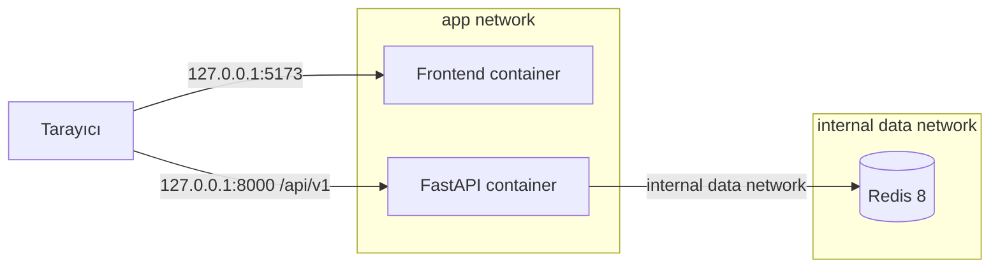

# 16 — Docker ve Local Çalıştırma Ortamı

## 0. Görev kimliği

| Alan | Değer |
|---|---|
| Görev numarası | `16` |
| Dosya | `16-DOCKER-VE-LOCAL-CALISTIRMA-ORTAMI.md` |
| Ön koşullar | `00–15` numaralı görevler |
| Ana kapsam | Tekrarlanabilir Docker imajları, Compose topolojisi ve yerel geliştirme işletimi |
| Kapsam dışı | Production cloud deployment, Kubernetes, gerçek kurumsal servisler ve müşteri verisi |
| Temel ilke | Yeni bir geliştirici temiz makinede tek belgelenmiş akışla aynı çalışan sistemi kurabilmelidir |
| Durma kuralı | Temiz build, healthcheck, dört MVP smoke akışı ve güvenli teardown doğrulanmadan sonraki göreve geçilmez |

---

## 1. Amaç

Bu görevin amacı Merinos Chatbot Demo projesinin frontend, FastAPI, Redis session state ve LangGraph çalışma zamanını tek, güvenli ve tekrarlanabilir bir yerel konteyner ortamında çalıştırmaktır.

Tamamlanan ortam aşağıdaki sorulara açık ve test edilmiş cevap vermelidir:

1. Temiz bir makinede yalnızca Docker Engine/Desktop ve Docker Compose v2 ile sistem nasıl başlatılır?
2. Frontend, API ve Redis hangi ağlarda ve hangi portlarla çalışır?
3. Container başlangıç sırası healthcheck’lere göre nasıl belirlenir?
4. Development hot reload ile production-benzeri local çalışma nasıl ayrılır?
5. Redis verisi ne zaman korunur, nasıl güvenli biçimde sıfırlanır?
6. Secret ve hassas ayarlar image, Git veya Compose çıktısına sızmadan nasıl sağlanır?
7. Windows, WSL2, macOS ve Linux üzerinde aynı komutlar nasıl korunur?
8. API veya Redis hazır değilken sistem nasıl fail-closed davranır?
9. Docker ortamı ile host üzerinde doğrudan çalışma arasında sözleşme farkı oluşması nasıl engellenir?
10. Full-stack smoke ve kalite testleri izole bir Compose projesinde nasıl çalıştırılır?
11. İmajlar root olmayan kullanıcı, minimum dosya ve güvenli runtime ayarlarıyla nasıl üretilir?
12. Geliştirici ortamı kapatıldığında container, network ve geçici veriler nasıl temizlenir?

Bu görev yalnızca bir `docker-compose.yml` ekleme görevi değildir. Hedef; image build politikası, environment sözleşmesi, health/readiness, network ve volume güvenliği, geliştirici komutları, hata ayıklama, test izolasyonu ve dokümante edilmiş yaşam döngüsü bulunan bütünleşik bir local platformdur.

---

## 2. Bağlayıcı ilkeler

Aşağıdaki kurallar istisnasız uygulanmalıdır:

1. **Kökte tek bir kanonik Compose tanımı bulunmalıdır.**
2. **Frontend, API ve Redis aynı Compose projesinin yönetilen servisleri olmalıdır.**
3. **`latest` gibi kayan image etiketi kullanılmamalıdır.**
4. **Base image’lar sabit sürümle ve CI/release aşamasında digest ile pinlenmelidir.**
5. **Runtime container’lar root kullanıcıyla çalışmamalıdır.**
6. **Container içinde Docker socket mount edilmemelidir.**
7. **`privileged`, `network_mode: host` veya gereksiz Linux capability kullanılmamalıdır.**
8. **Redis varsayılan profilde host’a publish edilmemelidir.**
9. **Frontend ve API portları yalnızca `127.0.0.1` üzerinde yayınlanmalıdır.**
10. **Secret değerler Dockerfile, image layer, Git, build arg veya public frontend env içine yazılmamalıdır.**
11. **API modu başarısız olduğunda sessiz local-demo fallback yapılmamalıdır.**
12. **Service hazır olma durumu yalnızca process’in açılmasıyla değil healthcheck ile belirlenmelidir.**
13. **Redis readiness başarısızken Redis modundaki API hazır kabul edilmemelidir.**
14. **Development ve test override’ları production-benzeri temel dosyayı zayıflatmamalıdır.**
15. **Bind mount yalnızca development profilinde kullanılmalıdır.**
16. **Test ortamı geliştirici Redis volume’ünü paylaşmamalıdır.**
17. **Container loglarında kullanıcı mesajı, sipariş numarası, session ID veya koordinat bulunmamalıdır.**
18. **Container saat dilimi UTC olmalı; kullanıcıya gösterilen saat/locale uygulama katmanında yönetilmelidir.**
19. **Build işlemi lockfile’lardan deterministik dependency kurmalıdır.**
20. **Docker olmadan mevcut doğrudan çalışma yolu bozulmamalıdır.**
21. **Tekrarlanabilir komutlar README’ye ve package script’lerine bağlanmalıdır.**
22. **Destructive volume temizliği açık ve ayrı bir komut olmalıdır.**
23. **Compose project adı sabit veya açıkça parametrelenmiş olmalıdır; global container isimleri kullanılmamalıdır.**
24. **Container’lar gereksiz restart döngüleriyle hata gizlememelidir.**
25. **Bir servis healthcheck’i gerçek bağımlılık ve uygulama sözleşmesini doğrulamalıdır.**

---

## 3. Başlamadan önce okunacak dosyalar

Cursor uygulamaya başlamadan önce aşağıdaki kaynakları incelemelidir.

### 3.1. Önceki görev belgeleri

```text
cursor-tasks/00-PROJE-ANAYASASI.md
cursor-tasks/01-REPO-VE-GELISTIRME-TEMELI.md
cursor-tasks/02-MERINOS-DEMO-SITESI-VE-TASARIM-SISTEMI.md
cursor-tasks/03-CHATBOT-WIDGET-VE-KONUSMA-DENEYIMI.md
cursor-tasks/04-URUN-ARAMA-VE-FILTRELEME-AKISI.md
cursor-tasks/05-SIPARIS-DURUMU-SORGULAMA-AKISI.md
cursor-tasks/06-BAYI-BULMA-VE-HARITA-AKISI.md
cursor-tasks/07-SSS-VE-BILGI-BANKASI-AKISI.md
cursor-tasks/08-FRONTEND-ORTAK-STATE-VE-VERI-KATMANI.md
cursor-tasks/09-PYTHON-API-VE-SOZLESME-KATMANI.md
cursor-tasks/10-REDIS-OTURUM-VE-SESSION-STATE-YONETIMI.md
cursor-tasks/11-TOKEN-BUTCESI-VE-CONTEXT-COMPRESSION.md
cursor-tasks/12-LANGGRAPH-SUPERVISOR-WORKER-AKISI.md
cursor-tasks/13-FRONTEND-BACKEND-ENTEGRASYONU.md
cursor-tasks/14-KVKK-GUVENLIK-VE-GOZLEMLENEBILIRLIK.md
cursor-tasks/15-TEST-OTOMASYONU-VE-KALITE-GUVENCE.md
```

### 3.2. Frontend ve build sistemi

```text
package.json
package-lock.json
vite.config.ts
next.config.ts
tsconfig.json
scripts/install-ci.sh
scripts/build-verified.sh
scripts/validate-artifact.sh
README.md
```

### 3.3. Backend ve mevcut Redis çalıştırması

```text
backend/pyproject.toml
backend/.env.example
backend/README.md
backend/docker-compose.yml
backend/src/merinos_agent/config.py
backend/src/merinos_agent/main.py
backend/src/merinos_agent/session_store.py
backend/src/merinos_agent/checkpointing.py
```

### 3.4. API, güvenlik ve test belgeleri

```text
docs/01-SISTEM-MIMARISI.md
docs/04-API-SOZLESMELERI.md
docs/05-TEST-SENARYOLARI.md
docs/06-LANGGRAPH-REDIS-STATE-MIMARISI.md
docs/07-SUPERVISOR-WORKER-MIMARISI.md
```

---

## 4. Mevcut durum ve çözülmesi gereken boşluklar

Mevcut projede yararlı başlangıç noktaları vardır:

- Frontend için lockfile ve build scriptleri bulunur.
- Backend `pyproject.toml` üzerinden Python 3.11+ gerektirir.
- `backend/docker-compose.yml` içinde Redis 8 tabanlı bir servis vardır.
- Redis için basit ping healthcheck’i tanımlıdır.
- Backend README Redis’i Compose ile başlatmayı açıklar.
- Frontend varsayılan olarak `http://localhost:5173` üzerinde çalışır.

Ancak bütünleşik local ortam için aşağıdaki boşluklar kapatılmalıdır:

1. Frontend için Dockerfile yoktur.
2. API için Dockerfile yoktur.
3. Frontend, API ve Redis aynı Compose topolojisinde değildir.
4. Mevcut Redis servisi `6379` portunu tüm host arayüzlerine publish eder.
5. Mevcut Compose dosyası `container_name` kullanarak paralel proje izolasyonunu zorlaştırır.
6. Redis image etiketi digest ile pinli değildir.
7. API ve frontend healthcheck’leri yoktur.
8. Redis dışındaki servislerde startup dependency sırası yoktur.
9. Development hot reload ile production-benzeri local runtime ayrılmamıştır.
10. Test için ayrı, geçici Redis ve network yaşam döngüsü yoktur.
11. Python transitive dependency’leri için deterministic lock dosyası yoktur.
12. Frontend image’ında build ve runtime katmanları ayrılmamıştır.
13. Runtime container kullanıcı ve filesystem güvenliği tanımlı değildir.
14. Compose environment sözleşmesi merkezi değildir.
15. Secret dosyası ve `_FILE` tabanlı okuma yolu tanımlanmamıştır.
16. Local secret üretme komutu yoktur.
17. Redis volume sıfırlama işlemi güvenli ve görünür değildir.
18. Windows/PowerShell uyumlu tek komut akışı eksiktir.
19. Docker ortamı için full-stack smoke komutu yoktur.
20. Image metadata, scan, SBOM ve build provenance kalite kapıları tanımlanmamıştır.
21. Container resource sınırları ve log rotation ayarları yoktur.
22. Host üzerinde doğrudan çalışma ile container environment adları arasında drift riski vardır.
23. API’nin browser tarafından kullanılacak public URL’si ile container-internal URL ayrılmamıştır.
24. `.dockerignore` dosyaları yetersiz veya yoktur.
25. Container shutdown ve async resource cleanup davranışı test edilmemektedir.

---

## 5. Hedef local topoloji

Kanonik local full-stack topoloji aşağıdaki gibi olmalıdır:



### 5.1. Servis sorumlulukları

| Servis | Sorumluluk | Host portu | Kalıcı veri |
|---|---|---:|---|
| `frontend` | Demo site ve chatbot widget | `127.0.0.1:5173` | Yok |
| `api` | FastAPI, LangGraph ve application servisleri | `127.0.0.1:8000` | Yok |
| `redis` | Session, idempotency ve checkpoint verisi | Varsayılan olarak yok | Named volume |

### 5.2. Ağ sınırları

- `frontend`, `app` ağına bağlanır.
- `api`, hem `app` hem `data` ağına bağlanır.
- `redis`, yalnızca `data` ağına bağlanır.
- `data` ağı `internal: true` olmalıdır.
- Redis portu varsayılan Compose dosyasında host’a publish edilmemelidir.
- Debug amacıyla Redis portu açılacaksa ayrı ve açık bir override/profile kullanılmalıdır.
- Publish edilen frontend ve API portları `127.0.0.1` ile sınırlandırılmalıdır.

---

## 6. Hedef dosya yapısı

Aşağıdaki yapı oluşturulmalıdır:

```text
merinos-chatbot-demo/
├── compose.yaml
├── compose.dev.yaml
├── compose.test.yaml
├── .env.docker.example
├── .dockerignore
├── docker/
│   ├── frontend.Dockerfile
│   ├── frontend-entrypoint.sh
│   └── README.md
├── backend/
│   ├── Dockerfile
│   ├── .dockerignore
│   ├── requirements.lock
│   └── ...
├── scripts/
│   ├── docker-doctor.mjs
│   ├── docker-smoke.mjs
│   ├── generate-local-secret.mjs
│   └── ...
├── docs/
│   └── 09-DOCKER-VE-LOCAL-CALISTIRMA.md
└── ...
```

Dosya isimleri mevcut proje standartlarıyla çelişiyorsa eşdeğer tek bir isim seti seçilebilir. Ancak aynı sorumluluk için birden fazla kanonik Compose veya Dockerfile oluşturulmamalıdır.

### 6.1. Mevcut `backend/docker-compose.yml` geçişi

Mevcut Redis-only dosyası için aşağıdaki seçeneklerden biri açıkça uygulanmalıdır:

1. Kaldır ve kökteki `compose.yaml` dosyasına yönlendir.
2. Geriye uyum gerekiyorsa içeriğini çoğaltmadan, backend README’de kök komuta yönlendir.

İki bağımsız Compose topolojisi aynı anda “kanonik” bırakılmamalıdır.

---

## 7. Compose dosyalarının görev ayrımı

### 7.1. `compose.yaml`

Production-benzeri local temel dosyadır:

- Multi-stage image build kullanır.
- Kaynak kod bind mount etmez.
- Root olmayan runtime kullanıcıları kullanır.
- Redis’i host’a açmaz.
- Healthcheck ve dependency koşullarını içerir.
- Named Redis volume kullanır.
- Güvenli network sınırlarını kurar.
- API data source’unu `redis` olarak açıkça seçer.
- Frontend data source’unu `api` olarak açıkça seçer.

### 7.2. `compose.dev.yaml`

Yalnızca geliştirme kolaylığı içindir:

- Frontend ve backend kaynak kodunu bind mount eder.
- Hot reload komutlarını etkinleştirir.
- Dependency klasörlerini host bind mount ile ezmez.
- Gerekirse named cache/node_modules volume kullanır.
- Debug portları açıkça ve yalnızca localhost’a publish eder.
- Development kullanıcı/UID uyumsuzluğunu belgeler.
- Security invariant’larını kaldırmaz.

### 7.3. `compose.test.yaml`

CI ve full-stack test ortamıdır:

- Ayrı Compose project adıyla çalıştırılır.
- Geliştirme Redis volume’ünü paylaşmaz.
- Mümkünse geçici `tmpfs` veya test-scoped volume kullanır.
- Test container’larını ve smoke runner’ı tanımlar.
- Port çakışmasını önlemek için host portlarını publish etmez veya dinamik kullanır.
- Test tamamlanınca `down --volumes --remove-orphans` ile temizlenir.
- Failure durumunda loglar toplanır, hassas içerik taramasından geçirilir.

---

## 8. Frontend image tasarımı

Frontend image en az üç mantıksal aşamaya ayrılmalıdır:

```text
base/deps -> build -> runtime
```

### 8.1. Base image

- Proje anayasasında sabitlenen Node sürümüyle uyumlu olmalıdır.
- Alpine veya slim seçimi native dependency uyumluluğu ölçülerek yapılmalıdır.
- Kayan `node:latest` kullanılmamalıdır.
- CI’da base image digest’i doğrulanmalıdır.

### 8.2. Dependency aşaması

- Önce yalnızca `package.json`, `package-lock.json`, `.npmrc` kopyalanmalıdır.
- Kurulum `npm ci` ile yapılmalıdır.
- Lockfile değiştirilmemelidir.
- Lifecycle script politikası mevcut bağımlılık gereksinimine göre açıkça belirlenmelidir.
- npm token veya registry secret image layer’a yazılmamalıdır.
- BuildKit secret gerekiyorsa yalnızca geçici secret mount kullanılmalıdır.

### 8.3. Build aşaması

- Kaynak kod dependency katmanından sonra kopyalanmalıdır.
- `npm run build` mevcut doğrulanmış build scriptini kullanmalıdır.
- Build sırasında public frontend config dışında secret kullanılmamalıdır.
- Source map politikası KVKK ve hata ayıklama kararına göre açıkça belirlenmelidir.
- Build output path mevcut vinext/Vite çıktısı incelenerek seçilmelidir; tahmin edilmemelidir.

### 8.4. Runtime aşaması

- Yalnızca çalışmak için gereken build output ve runtime dependency’leri içermelidir.
- Build toolchain, test dosyaları, `.git`, local env ve dokümantasyon runtime image’a taşınmamalıdır.
- Root olmayan sabit UID/GID kullanılmalıdır.
- Uygulama `0.0.0.0` üzerinde container içi portu dinlemelidir.
- Runtime command mevcut `npm run start` sözleşmesiyle uyumlu olmalıdır.
- `NODE_ENV=production` açıkça ayarlanmalıdır.
- Yazılabilir alan gerekiyorsa yalnızca belirli `tmpfs` veya sahipliği verilmiş dizin kullanılmalıdır.

### 8.5. Runtime config sınırı

Tarayıcıya açılan değerler ile server-side değerler ayrılmalıdır:

| Tür | Örnek | Secret olabilir mi? |
|---|---|---|
| Public browser config | API public base URL, data-source modu | Hayır |
| Server runtime config | Internal API URL | Duruma göre |
| Secret | HMAC key, auth credential | Evet; browser bundle’a giremez |

Task 13’te seçilen environment alan adları korunmalıdır. Aynı amaçla yeni alias’lar üretilmemelidir.

---

## 9. Backend image tasarımı

Backend image en az şu aşamalara ayrılmalıdır:

```text
builder -> runtime
```

### 9.1. Python sürümü

- `pyproject.toml` içindeki `requires-python` ile uyumlu sabit Python minor sürümü kullanılmalıdır.
- Geliştirici, CI ve image aynı minor sürümü hedeflemelidir.
- `python:latest` kullanılmamalıdır.

### 9.2. Deterministik dependency kurulumu

Mevcut semantic aralıklar tek başına reproducible image için yeterli değildir.

Aşağıdaki kurallar uygulanmalıdır:

1. `pyproject.toml` proje dependency niyetinin kaynağı olarak kalır.
2. Exact transitive sürüm ve hash içeren tek bir `backend/requirements.lock` üretilir.
3. Docker build bu lock dosyasını `--require-hashes` veya eşdeğer doğrulama ile kurar.
4. Lock yenileme komutu backend README’de belgelenir.
5. Lock dosyasını hangi araç üretiyorsa tek canonical araç seçilir.
6. Docker build sırasında internetten “en yeni uygun sürüm” çözülmez.
7. Optional checkpoint dependency ayrı extra/lock varyantı gerektiriyorsa açıkça yönetilir.

### 9.3. Builder aşaması

- Compiler ve build araçları yalnızca builder aşamasında bulunmalıdır.
- Wheel üretimi tercih edilmelidir.
- Kaynak kopyalama cache verimliliğine göre sıralanmalıdır.
- Test dependency’leri runtime image’a taşınmamalıdır.

### 9.4. Runtime aşaması

- Slim ve root olmayan bir Python runtime kullanılmalıdır.
- Uygulama paketi ve gereken wheel’ler kopyalanmalıdır.
- Shell, compiler ve gereksiz OS paketi eklenmemelidir.
- `PYTHONDONTWRITEBYTECODE=1` ve uygun unbuffered output ayarlanmalıdır.
- API process’i graceful shutdown alabilmelidir.
- Uvicorn worker sayısı local ortamda deterministik tutulmalıdır.
- Hot reload yalnızca development override’da etkin olmalıdır.
- Runtime filesystem mümkün olduğunca read-only çalışmalıdır.

### 9.5. CLI davranışının korunması

Docker API image’ı eklenirken mevcut `merinos-chatbot` CLI entrypoint’i bozulmamalıdır.

Aşağıdaki iki çalışma yolu test edilmelidir:

```text
HTTP API mode
CLI demo mode
```

CLI gerekiyorsa aynı image içinde açık bir Compose run komutuyla çalıştırılabilir; API default command’i CLI ile karıştırılmamalıdır.

---

## 10. Redis servis tasarımı

### 10.1. Image ve sürüm

- Redis major/minor mevcut checkpoint gereksinimleriyle uyumlu seçilmelidir.
- Kayan etiket yerine sabit patch ve CI’da digest kullanılmalıdır.
- Image değişikliği gerçek Redis integration testlerinden geçmelidir.

### 10.2. Network

- Varsayılan olarak host port publish edilmez.
- Yalnızca API’nin bağlı olduğu internal `data` network’ünde erişilir.
- Debug profile gerekiyorsa port `127.0.0.1:${MERINOS_REDIS_DEBUG_PORT}` biçiminde açılır.

### 10.3. Persistence

Local default ortamda Redis named volume kullanılmalıdır:

```text
merinos_redis_data
```

Ancak Compose gerçek volume adını project prefix ile üretmelidir. `name:` ile global sabit volume adı verilmemelidir.

### 10.4. Redis command/config

Local demo için en az aşağıdakiler açıkça değerlendirilmelidir:

- AOF gereksinimi
- Maxmemory sınırı
- Eviction politikası
- Protected mode
- Save/AOF davranışı
- Graceful shutdown

Session ve idempotency verisi sessiz eviction ile kaybedilmemelidir. Bellek sınırı uygulanıyorsa eviction politikası görev 10’daki veri güvenliğiyle uyumlu olmalıdır.

### 10.5. Authentication

Localhost-only Compose ağında bile production davranışı taklit etmek amacıyla secret tabanlı Redis credential desteği hazırlanmalıdır. Ancak:

- Secret Git’e yazılmaz.
- URL içinde plaintext secret loglanmaz.
- Healthcheck credential’ı process list veya loglara açıkça saçmamalıdır.
- Production TLS/ACL bu local görevin yerine geçmiş sayılmaz.

---

## 11. Environment sözleşmesi

Tek bir `.env.docker.example` oluşturulmalıdır. Gerçek local dosya Git’e alınmamalıdır.

Örnek alan grupları:

```dotenv
COMPOSE_PROJECT_NAME=merinos-chatbot
MERINOS_ENV=local
MERINOS_FRONTEND_PORT=5173
MERINOS_API_PORT=8000
MERINOS_REDIS_DEBUG_PORT=6379

MERINOS_FRONTEND_DATA_SOURCE=api
MERINOS_PUBLIC_API_BASE_URL=http://localhost:8000
MERINOS_API_CORS_ORIGINS=http://localhost:5173

MERINOS_SESSION_BACKEND=redis
MERINOS_REDIS_URL=redis://redis:6379/0
MERINOS_SESSION_TTL_SECONDS=1800

MERINOS_LOG_LEVEL=INFO
MERINOS_LOG_FORMAT=json
```

Bu örnek bağlayıcı isim listesi değildir; görev 09–14 sırasında uygulanan canonical config adlarıyla birebir hizalanmalıdır.

### 11.1. Environment sınıfları

| Sınıf | Kaynak | Image’a gömülebilir mi? |
|---|---|---|
| Public build config | Açık build arg veya public env | Yalnızca secret değilse |
| Runtime non-secret | Compose environment/env file | Evet, fakat loglanmamalı |
| Runtime secret | Compose secret/file mount | Hayır |
| Test-only | `compose.test.yaml` | Yalnızca sentetikse |

### 11.2. Secret file standardı

Backend config katmanı gerekli secret’larda `_FILE` biçimini desteklemelidir:

```text
MERINOS_SESSION_HMAC_SECRET_FILE=/run/secrets/session_hmac_secret
```

Aşağıdaki davranış zorunludur:

- Aynı secret için hem düz env hem `_FILE` verildiyse uygulama açık politika uygular; belirsiz birleşim yapmaz.
- Secret dosyası okunamıyorsa production-benzeri Redis modu fail closed olur.
- Secret içeriği exception veya log içine yazılmaz.
- Local secret üretme scripti kriptografik olarak güvenli en az 32 byte değer üretir.

---

## 12. `.dockerignore` politikası

Frontend build context’i en az şu içerikleri dışlamalıdır:

```text
.git
.github
node_modules
dist
.next
.wrangler
coverage
playwright-report
test-results
*.log
.env
.env.*
!.env.docker.example
backend/.venv
backend/__pycache__
**/__pycache__
*.pyc
*.zip
```

Backend context’i en az şunları dışlamalıdır:

```text
.venv
__pycache__
.pytest_cache
.coverage
htmlcov
*.pyc
*.log
.env
.env.*
!.env.example
tests/artifacts
```

Görev dosyaları ve gerekli build dokümanları yalnızca build için gerçekten gerekmiyorsa image context’inden çıkarılmalıdır.

`.dockerignore` içine yanlışlıkla gerekli lock veya source dosyası eklenmediği test edilmelidir.

---

## 13. Healthcheck ve readiness modeli

### 13.1. Redis healthcheck

Redis healthcheck yalnızca servis process’ine erişimi doğrulamalıdır:

```text
PING -> PONG
```

Credential kullanılıyorsa hassas değer healthcheck output’una taşınmamalıdır.

### 13.2. API liveness

```text
GET /health/live
```

- Process ve event loop çalışıyorsa başarılıdır.
- Redis kesintisi liveness’i başarısız yapmak zorunda değildir.
- Kişisel veya dependency ayrıntısı döndürmez.

### 13.3. API readiness

```text
GET /health/ready
```

Redis mode’da en az şunları doğrular:

- Config geçerli
- Redis erişilebilir
- Gerekli session/idempotency adapter’ları hazır
- Graph/application bootstrap tamamlanmış

Readiness payload secret, hostname, Redis URL veya stack trace döndürmemelidir.

### 13.4. Frontend healthcheck

Frontend healthcheck aşağıdakileri doğrulamalıdır:

- HTTP server yanıt veriyor
- Ana route `2xx` dönüyor
- Statik/build artifact erişilebilir

Frontend healthcheck API dependency’sini transitif olarak test etmemelidir; API readiness ayrı serviste izlenir.

### 13.5. Startup dependency

- `api`, Redis healthcheck başarılı olmadan başlamaya zorlanabilir veya kendi retry/backoff başlangıcıyla fail-closed olabilir.
- `frontend`, API’nin hazır olmasını beklemek zorunda değildir; ancak API modu UI’da açık unavailable state göstermelidir.
- Compose `depends_on` tek başına uygulama readiness garantisi sayılmamalıdır.

---

## 14. Graceful startup ve shutdown

Aşağıdaki davranışlar test edilmelidir:

1. Container `SIGTERM` aldığında yeni istek kabulü kontrollü biçimde durur.
2. FastAPI lifespan Redis pool ve checkpointer kaynaklarını kapatır.
3. Aktif request sonsuza kadar shutdown’ı engellemez.
4. Frontend server belirlenen grace süresinde kapanır.
5. Redis named volume bozulmadan kapanır.
6. `docker compose down` sonrası orphan container kalmaz.
7. Test stack teardown failure durumunda da çalışır.

Entrypoint script kullanılıyorsa son process `exec` ile başlatılmalıdır; signal’lar shell’de kaybolmamalıdır.

---

## 15. Container güvenlik sertleştirmesi

Production-benzeri local temel dosyada uygun servislerde aşağıdaki ayarlar değerlendirilmelidir:

```yaml
read_only: true
init: true
security_opt:
  - no-new-privileges:true
cap_drop:
  - ALL
tmpfs:
  - /tmp
```

Bu ayarlar körlemesine eklenmemelidir. Uygulamanın gerçekten yazması gereken dizinler belirlenmeli ve yalnızca bu dizinlere kontrollü alan verilmelidir.

### 15.1. Yasak ayarlar

Aşağıdakiler kullanılmamalıdır:

```text
privileged: true
network_mode: host
pid: host
ipc: host
user: root
/var/run/docker.sock mount
host root filesystem mount
unbounded device access
```

### 15.2. Kullanıcı ve dosya sahipliği

- Frontend ve API sabit, root olmayan UID/GID ile çalışmalıdır.
- Build sırasında üretilen dosyalar runtime kullanıcı tarafından okunabilmelidir.
- Development bind mount permission problemi WSL2/macOS/Linux için belgelenmelidir.
- Container açılışında tüm source tree’ye recursive `chown` yapılmamalıdır.

---

## 16. Resource sınırları

Local ortam geliştirici makinesini kontrolsüz tüketmemelidir.

Aşağıdaki sınırlar örnek olarak config ile ayarlanabilir:

| Servis | CPU başlangıç hedefi | Bellek başlangıç hedefi |
|---|---:|---:|
| Frontend | 1.0 CPU | 768 MiB |
| API | 1.0 CPU | 768 MiB |
| Redis | 0.5 CPU | 256 MiB |

Bu değerler katı üretim kapasite planı değildir. Build ve test ölçümlerine göre güncellenmelidir.

### 16.1. Uygulama limitleri

Container resource limitleri aşağıdaki uygulama limitlerinin yerine geçmez:

- API request body limiti
- Chat mesajı uzunluk limiti
- Token context hard limit
- Graph transition limiti
- Redis session payload limiti
- Rate limit
- Timeout

---

## 17. Loglama ve container output

### 17.1. Log hedefi

- Uygulama logları stdout/stderr’e yazılır.
- Container içinde kalıcı log dosyası tutulmaz.
- Log formatı backend’de structured JSON veya görev 14’te seçilen canonical format olmalıdır.
- Frontend build/dev logları secret veya kullanıcı içeriği yazmamalıdır.

### 17.2. Log rotation

Compose local runtime’da Docker log driver için makul rotation sınırı tanımlanmalıdır:

```text
max-size
max-file
```

Kesin değerler dokümante edilmeli ve makine diskini sınırsız büyütmemelidir.

### 17.3. Yasak log alanları

- Kullanıcı mesajı
- Bot/model yanıtı
- Tam sipariş numarası
- Session ID/storage ID
- Redis URL/credential
- Ham koordinat
- HMAC secret
- Authorization/cookie
- System prompt/retrieval içeriği

`docker compose logs` çıktısı görev 15’teki sentetik leak scanner ile test edilmelidir.

---

## 18. Development çalışma modu

Development override şu özellikleri sağlamalıdır:

1. Frontend hot reload
2. Backend reload
3. Kaynak değişikliklerinin hızlı yansıması
4. Dependency klasörlerinin host OS tarafından bozulmaması
5. Healthcheck’lerin korunması
6. Localhost portlarının açık ve değiştirilebilir olması
7. Redis verisinin geliştirici isteğine göre korunması
8. Dev-only debug çıktısının hassas veri kurallarını ihlal etmemesi

### 18.1. Frontend bind mount

Kaynak mount edilirken container içindeki Linux `node_modules` klasörü host klasörüyle ezilmemelidir. Aşağıdaki yaklaşımlardan biri seçilmelidir:

- Ayrı named `node_modules` volume
- Image içinde dependency ve yalnızca source alt dizinlerini mount etme

### 18.2. Backend bind mount

- Kaynak `backend/src` gibi sınırlı bir dizinden mount edilmelidir.
- Host `.venv` container içine mount edilmemelidir.
- Reload izleme dizinleri açıkça sınırlandırılmalıdır.
- Generated cache dosyaları Git çalışma alanını kirletmemelidir.

### 18.3. File watching

Windows/WSL2/macOS file event farkları nedeniyle polling gerekiyorsa:

- Yalnızca dev override’da açılır.
- CPU etkisi belgelenir.
- Varsayılan değer gereksiz polling yapmaz.

---

## 19. Production-benzeri local çalışma modu

Kanonik `compose.yaml` ile çalışan mod aşağıdaki özelliklere sahip olmalıdır:

- Bind mount yok
- Hot reload yok
- Build artifact’tan çalışma
- Root olmayan kullanıcı
- Healthcheck ve readiness
- Redis internal network
- API mode’da frontend
- Gerçek Compose secret/file mount
- Read-only runtime filesystem mümkün olduğunca etkin

Bu mod, production deployment değildir. Ancak release öncesi local doğrulamada development kolaylıklarını taşımamalıdır.

---

## 20. Test Compose ortamı

### 20.1. İzolasyon

Test stack aşağıdaki gibi ayrı project adı kullanmalıdır:

```text
merinos-chatbot-test-<runId>
```

Sabit global container veya volume ismi kullanılmamalıdır.

### 20.2. Test verisi

- Yalnızca sentetik fixture kullanılır.
- Redis DB numarasına güvenerek production/local izolasyonu yapılmaz; ayrı service/volume kullanılır.
- Testler başlamadan Redis temizliği doğrulanır.
- Testler sonunda volume kaldırılır.

### 20.3. Test runner

Test runner container veya host script şu sırayı uygular:

1. Compose config validation
2. Image build
3. Redis/API/frontend startup
4. Health wait
5. Full-stack smoke
6. Gerekliyse browser E2E
7. Log ve artifact toplama
8. Hassas veri leak scan
9. Teardown

### 20.4. Failure davranışı

Herhangi bir adım başarısızsa:

- İlgili servislerin son sınırlı log satırları alınır.
- `docker compose ps` kaydedilir.
- Health status kaydedilir.
- Loglar redaction/leak kontrolünden geçirilir.
- Teardown yine çalıştırılır.
- Secret veya tam env dump artifact’e yazılmaz.

---

## 21. Cross-platform komut standardı

Bash’e özel komutların tek resmi kullanım yolu olması yasaktır.

Kök `package.json` içine platformlar arası çalışan script’ler eklenmelidir:

```text
stack:doctor
stack:config
stack:build
stack:up
stack:up:dev
stack:ps
stack:logs
stack:smoke
stack:down
stack:reset
stack:test
```

Script’ler doğrudan `docker compose` çağırabilir veya Node tabanlı küçük bir orchestration script’i kullanabilir. Aynı davranış için Bash ve PowerShell’de ayrı, drift eden iş mantığı yazılmamalıdır.

### 21.1. Örnek komut amacı

| Komut | Davranış |
|---|---|
| `npm run stack:doctor` | Docker/Compose, port ve env ön koşullarını kontrol eder |
| `npm run stack:config` | Compose merge ve env çözümünü doğrular |
| `npm run stack:build` | Cache kontrollü image build yapar |
| `npm run stack:up` | Production-benzeri local stack’i başlatır |
| `npm run stack:up:dev` | Development override ile başlatır |
| `npm run stack:smoke` | Health ve dört MVP kritik yolunu doğrular |
| `npm run stack:down` | Container ve network’ü kaldırır; volume’ü korur |
| `npm run stack:reset` | Açık onayla local volume’leri de kaldırır |
| `npm run stack:test` | İzole test stack’ini kurar, test eder ve temizler |

### 21.2. Exit code

Tüm script’ler başarısızlıkta sıfır olmayan exit code dönmelidir. Hata yutulmamalıdır.

---

## 22. Docker doctor kontrolü

`stack:doctor` en az aşağıdakileri kontrol etmelidir:

- `docker` komutu bulunuyor mu?
- Docker daemon erişilebilir mi?
- `docker compose` v2 kullanılabilir mi?
- Minimum Compose sürümü sağlanıyor mu?
- Gerekli portlar kullanılabilir mi?
- `.env.docker.local` veya seçilen env dosyası mevcut mu?
- Gerekli local secret dosyaları mevcut ve boş değil mi?
- Secret dosyası izinleri makul mü?
- Docker disk alanı kritik seviyede mi?
- Desteklenen CPU mimarisi mi?
- WSL2 durumunda proje yavaş Windows mount’unda mı?

Doctor secret değerlerini ekrana basmamalıdır.

---

## 23. Port politikası

Varsayılan portlar:

```text
Frontend: 5173
API:      8000
Redis:    publish edilmez
```

### 23.1. Kurallar

- Host bind adresi `127.0.0.1` olmalıdır.
- Portlar `.env.docker.local` üzerinden değiştirilebilir olmalıdır.
- Public frontend API URL’si host API portuyla tutarlı olmalıdır.
- Container internal portu ile host portu karıştırılmamalıdır.
- Port çakışması doctor aşamasında anlaşılır hata vermelidir.
- Test ortamı sabit host portuna bağımlı olmamalıdır.

---

## 24. Public ve internal URL ayrımı

Tarayıcı `api` service DNS adını çözemez. Bu nedenle iki kavram açıkça ayrılmalıdır:

```text
Public browser API URL: http://localhost:<api-port>
Container internal API URL: http://api:<container-port>
```

Frontend uygulaması yalnızca browser-side fetch yapıyorsa public URL kullanmalıdır. Server-side fetch varsa internal URL ayrı config alanı olmalıdır.

Bir config alanının hem browser hem container DNS kullanımını çözmeye çalışması yasaktır.

---

## 25. Build cache ve performans

BuildKit cache kullanılabilir ancak doğruluk pahasına olmamalıdır.

### 25.1. Frontend cache

- Lockfile dependency layer’ı source layer’dan önce gelir.
- npm cache mount kullanılabilir.
- Cache bozulduğunda temiz build komutu bulunmalıdır.

### 25.2. Backend cache

- Python wheel/download cache mount kullanılabilir.
- Lock değişmeden dependency layer tekrar kullanılmalıdır.
- Source değişikliği dependency çözümünü yeniden tetiklememelidir.

### 25.3. Temiz build

CI ve kabul testinde en az bir kez aşağıdaki eşdeğer davranış doğrulanmalıdır:

```text
no stale application build cache
fresh image build
fresh test volume
```

Tüm build’lerde `--no-cache` zorunlu değildir; ancak temiz build kalite kapısı ayrıca bulunmalıdır.

---

## 26. Multi-platform uyumluluk

- Base image’lar en az `linux/amd64` ve `linux/arm64` desteklemelidir.
- Platforma özel indirilen binary varsa checksum ve mimari seçimi yapılmalıdır.
- Dockerfile’da host mimarisini varsayan sabit URL kullanılmamalıdır.
- CI en az config/build metadata seviyesinde iki mimariyi doğrulamalıdır.
- Local görevde multi-platform image publish edilmesi zorunlu değildir.

---

## 27. Dependency ve image güvenliği

Görev 14–15 ile uyumlu olarak aşağıdaki kapılar hazırlanmalıdır:

1. Base image sürüm kontrolü
2. Image vulnerability scan
3. Secret scan
4. OS package minimizasyonu
5. SBOM üretimi
6. Build provenance/metadata
7. High/critical bulgu kabul süreci

Local geliştirici komutunun her çalıştırmada ağır scan yapması gerekmez. Ancak CI/release öncesi canonical komut belgelenmelidir.

### 27.1. Yasak davranış

- Scan geçsin diye vulnerability ignore dosyasına süresiz istisna eklemek
- Base image sürümünü rastgele değiştirmek
- CVE’yi test etmeden dependency major upgrade ile kapatmaya çalışmak
- Secret scan failure’ını artifact’ten silerek gizlemek

---

## 28. Volume yaşam döngüsü

### 28.1. Normal kapatma

```text
stack:down
```

- Container’ları kaldırır.
- Network’leri kaldırır.
- Redis named volume’ünü korur.

### 28.2. Tam sıfırlama

```text
stack:reset
```

- Destructive olduğu açıkça belirtilir.
- Geliştirici onayı veya `--yes` bayrağı ister.
- Yalnızca bu Compose projesine ait volume’leri kaldırır.
- Global veya başka projeye ait volume’leri silmez.

### 28.3. Test temizliği

Test stack her koşulda kendi volume’lerini kaldırmalıdır.

### 28.4. Backup

Bu localhost demo görevi gerçek veri backup sistemi değildir. Ancak Redis volume sıfırlamanın session geçmişini sileceği belgelenmelidir.

---

## 29. Secret üretimi

Local script aşağıdaki özelliklere sahip olmalıdır:

- Kriptografik olarak güvenli random kullanır.
- En az 32 byte entropy üretir.
- Secret’ı varsayılan olarak güvenli local dosyaya yazar.
- Mevcut dosyayı açık onay olmadan ezmez.
- Secret’ı terminal geçmişine veya loga yazmaz.
- Windows, macOS ve Linux üzerinde çalışır.
- Üretilen dosyanın Git ignore kapsamında olduğunu doğrular.

Örnek hedef:

```text
.secrets/session_hmac_secret
```

`.secrets/` Git’e eklenmemelidir.

---

## 30. Configuration validation

Container process başlamadan önce config typed olarak doğrulanmalıdır.

Aşağıdaki hatalar erken ve güvenli biçimde başarısız olmalıdır:

- Redis mode seçilmiş ama Redis URL yok
- Redis mode seçilmiş ama HMAC secret yok
- Production-benzeri mode’da memory session backend seçilmiş
- CORS origin geçersiz
- Public API URL geçersiz
- TTL veya token limitleri negatif
- Secret dosyası boş
- Bilinmeyen environment alanı kritik typo oluşturuyor

Hata mesajları secret değerini içermemelidir.

---

## 31. API ve frontend data-source davranışı

### 31.1. API mode

- Frontend HTTP transport kullanır.
- API kapalıysa kontrollü unavailable state gösterir.
- Local engine arka planda çağrılmaz.
- Retry aynı idempotency kimliğini korur.

### 31.2. Local mode

- Frontend local repository/transport kullanır.
- API ve Redis zorunlu değildir.
- Bu mod Compose full-stack default’u değildir; açıkça seçilir.

### 31.3. Compose default

Full-stack Compose başlangıcında frontend `api` modunda çalışmalıdır. Böylece entegrasyon gerçekten test edilir.

---

## 32. Redis kesintisi senaryoları

Aşağıdaki senaryolar Docker ortamında test edilmelidir:

1. Redis başlamadan API readiness başarısız.
2. Redis daha sonra hazır olduğunda API kontrollü biçimde hazır olur veya belgelenen restart gerekir.
3. Aktif sohbet sırasında Redis durdurulursa API güvenli `503`/dependency hatası döner.
4. Sessiz in-memory fallback oluşmaz.
5. Redis geri geldiğinde yeni request’ler düzene döner.
6. Aynı mesaj retry edildiğinde idempotency davranışı görev 10’a uygun kalır.
7. Loglarda Redis credential veya key bulunmaz.

---

## 33. API kesintisi senaryoları

- Frontend container çalışmaya devam edebilir.
- UI backend unavailable durumunu görünür gösterir.
- Kullanıcı mesajı sonsuz loading’de kalmaz.
- Retry kontrolü sunulur.
- Local fallback yapılmaz.
- API yeniden hazır olduğunda yeni istek çalışır.
- Eski/stale response yeni sohbet state’ini değiştirmez.

---

## 34. Frontend kesintisi senaryoları

- API ve Redis health durumları ayrı izlenebilir.
- Frontend restart Redis session volume’ünü silmez.
- Browser refresh sonrası frontend memory session ID’si kayboluyorsa bu davranış görev 13’e uygun biçimde belgelenir.
- Frontend image build failure API/Redis’i “başarılı sistem” olarak raporlamaz.

---

## 35. Localhost güvenlik sınırı

Bu görev yalnızca local geliştirme içindir.

Aşağıdaki davranışlar yasaktır:

- Portları `0.0.0.0` ile yerel ağa açmak
- Redis’i şifresiz biçimde host’a publish etmek
- Demo endpoint’lerini internetten erişilebilir deploy etmek
- Gerçek müşteri verisini local volume’e taşımak
- Production secret’ını local env dosyasına kopyalamak
- CORS’u `*` yapmak
- Browser frontend içine backend secret koymak

---

## 36. README ve geliştirici dokümantasyonu

Kök README’de kısa başlangıç yolu bulunmalıdır:

```text
1. Ön koşulları kontrol et
2. Env örneğini local dosyaya kopyala
3. Local secret üret
4. Compose config doğrula
5. Stack’i başlat
6. Health/smoke çalıştır
7. Log görüntüle
8. Stack’i kapat
```

Ayrıntılar `docs/09-DOCKER-VE-LOCAL-CALISTIRMA.md` dosyasına taşınmalıdır.

### 36.1. Dokümanda bulunması gerekenler

- Desteklenen OS ve Docker gereksinimleri
- Portlar ve URL’ler
- Production-benzeri local komut
- Development hot reload komutu
- Test stack komutu
- Secret üretimi
- Redis debug profili
- Veri sıfırlama
- Sık karşılaşılan hatalar
- WSL2 performans notları
- Log ve health kontrolü
- Docker’sız doğrudan çalışma
- Güvenlik/KVKK uyarısı

---

## 37. Sık karşılaşılan hata rehberi

En az aşağıdaki sorunlar açıklanmalıdır:

| Sorun | Kontrol |
|---|---|
| Port kullanımda | `stack:doctor`, env portunu değiştir |
| Docker daemon kapalı | Docker Desktop/Engine’i başlat |
| API unhealthy | API logu, Redis health, config validation |
| Redis unhealthy | Volume permission, secret/config, resource sınırı |
| Frontend API’ye erişemiyor | Public API URL ve CORS origin |
| WSL2 hot reload çalışmıyor | Proje konumu ve polling ayarı |
| node_modules uyumsuz | Named container volume’ünü yenile |
| Python dependency build fail | Lock ve platform wheel kontrolü |
| Secret eksik | Local secret generation komutu |
| Eski image kullanılıyor | Build/pull ve cache temizleme prosedürü |

Çözüm komutları secret veya destructive işlem riskini açıkça belirtmelidir.

---

## 38. Docker’sız çalışma yolunun korunması

Aşağıdaki mevcut/gelecek direct-run akışları bozulmamalıdır:

```text
Frontend: npm tabanlı dev/build/start
Backend: Python virtualenv ile API/CLI
Redis: Harici veya local Docker Redis
```

Compose için config alan adları direct-run `.env` alanlarıyla aynı typed config katmanına bağlanmalıdır.

Docker’a özel koşul if’leri domain/application koduna dağılmamalıdır.

---

## 39. Test planı

### 39.1. Statik Compose testleri

- `docker compose config` başarılı
- Tüm environment substitution alanları çözümleniyor
- Duplicate port/container/volume adı yok
- Redis host portu default dosyada yok
- Data network internal
- `container_name` yok
- Kayan image etiketi yok
- Secret değer yok

### 39.2. Dockerfile kalite testleri

- Frontend ve API clean build başarılı
- Runtime user root değil
- Runtime image’da source secret yok
- `.git`, `.env`, test artifact image’da yok
- Healthcheck tool gerçekten mevcut
- Entrypoint signal propagation doğru
- Lockfile dışı dependency çözümü yok

### 39.3. Startup testleri

- Temiz volume ile stack başlıyor
- Redis healthy
- API ready
- Frontend healthy
- Beklenen host URL’leri yanıt veriyor
- Startup belirlenen timeout içinde tamamlanıyor

### 39.4. Smoke testleri

Full-stack API modunda en az:

1. Ürün arama
2. Demo sipariş sorgulama
3. Şehir bazlı bayi arama
4. Yayınlanmış SSS arama
5. Chat endpoint’i üzerinden tek intent
6. Aynı `clientMessageId` retry
7. Session continuation

### 39.5. Failure testleri

- Redis stop
- API stop
- Frontend restart
- Geçersiz env
- Eksik secret
- Port conflict
- Read-only filesystem
- SIGTERM
- Bozuk Redis payload fixture
- İzin reddedilen geolocation browser testi

### 39.6. Teardown testleri

- `down` volume’ü koruyor
- `reset` yalnızca proje volume’ünü siliyor
- Test teardown tüm test volume’lerini siliyor
- Orphan container/network kalmıyor

---

## 40. Zorunlu kabul senaryoları

Aşağıdaki senaryolar otomatik veya açıkça tekrarlanabilir komutla doğrulanmalıdır:

1. Temiz clone benzeri klasörde `stack:doctor` geçer.
2. Env örneğinden local config hazırlanabilir.
3. Secret scripti güvenli dosya üretir ve tekrar çalışınca sessizce ezmez.
4. `stack:config` merged Compose yapısını doğrular.
5. Frontend clean image build başarılıdır.
6. API clean image build başarılıdır.
7. Runtime container’ların UID’si `0` değildir.
8. Redis varsayılan olarak host portu publish etmez.
9. Frontend yalnızca localhost’a publish edilir.
10. API yalnızca localhost’a publish edilir.
11. Redis healthcheck başarılıdır.
12. API readiness Redis hazır olmadan başarılı olmaz.
13. Frontend healthcheck ana route’u doğrular.
14. Full-stack production-benzeri local stack başlar.
15. Ürün arama smoke başarılıdır.
16. Sipariş demo smoke başarılıdır.
17. Bayi arama smoke başarılıdır.
18. SSS smoke başarılıdır.
19. Chat session continuation başarılıdır.
20. Aynı mesaj retry duplicate sonuç üretmez.
21. Redis kesilince sessiz memory fallback oluşmaz.
22. API kesilince frontend kontrollü hata gösterir.
23. Development hot reload iki servis için çalışır.
24. Test stack geliştirici Redis volume’ünü kullanmaz.
25. Test stack başarısızlıkta log toplar ve yine temizlenir.
26. `stack:down` Redis volume’ünü korur.
27. `stack:reset` açık onay ister.
28. `docker compose logs` sentetik hassas fixture içermez.
29. Image içinde `.env`, secret veya `.git` bulunmaz.
30. Graceful shutdown sırasında resource cleanup tamamlanır.
31. Windows PowerShell veya platformlar arası npm komutları Bash gerektirmeden çalışır.
32. Direct-run frontend/backend komutları bozulmaz.
33. Build artifact doğrulama scripti container build’iyle çelişmez.
34. Image scan/SBOM komutu belgelenir ve CI’a bağlanır.
35. Görev raporu çalıştırılan gerçek komut ve sonuçları içerir.

---

## 41. Uygulama aşamaları

### Aşama 1 — Karakterizasyon ve envanter

1. Mevcut frontend build/start davranışını test et.
2. Mevcut backend CLI ve Redis Compose davranışını test et.
3. Task 09–15 sonucunda oluşan API/test komutlarını çıkar.
4. Config alanlarının tek kaynağını belirle.
5. Mevcut port, log ve health davranışını kaydet.

### Aşama 2 — Deterministik build temeli

1. Frontend `.dockerignore` oluştur.
2. Backend `.dockerignore` oluştur.
3. Python exact/hash lock dosyası oluştur.
4. Frontend multi-stage Dockerfile oluştur.
5. Backend multi-stage Dockerfile oluştur.
6. Root olmayan runtime kullanıcılarını doğrula.

### Aşama 3 — Canonical Compose

1. Kök `compose.yaml` oluştur.
2. App ve internal data network’lerini kur.
3. Redis named volume’ünü ekle.
4. Healthcheck ve dependency koşullarını ekle.
5. Portları yalnızca localhost’a publish et.
6. Mevcut backend Compose dosyasını canonical köke geçir.

### Aşama 4 — Environment ve secret

1. `.env.docker.example` oluştur.
2. Typed config adlarını Task 09–14 ile hizala.
3. `_FILE` secret desteğini uygula.
4. Local secret generator ekle.
5. Git ignore ve image exclusion testlerini ekle.

### Aşama 5 — Development ve test override

1. `compose.dev.yaml` oluştur.
2. Hot reload ve bind mount’ları güvenli biçimde ekle.
3. `compose.test.yaml` oluştur.
4. İzole test project/volume davranışını ekle.
5. Failure artifact ve teardown mekanizmasını ekle.

### Aşama 6 — Geliştirici komutları

1. Platformlar arası stack script’lerini ekle.
2. Doctor, config, up, logs, smoke, down ve reset komutlarını ekle.
3. Destructive reset onayını uygula.
4. Exit code ve timeout davranışını test et.

### Aşama 7 — Güvenlik ve gözlemlenebilirlik

1. Read-only/no-new-privileges/capability ayarlarını doğrula.
2. Redis host exposure testini ekle.
3. Log rotation ve leak scan ekle.
4. Image secret scan ve SBOM komutlarını ekle.
5. Resource sınırlarını ve failure davranışını doğrula.

### Aşama 8 — Full-stack doğrulama

1. Clean build yap.
2. Clean stack başlat.
3. Health wait çalıştır.
4. Dört MVP ve chat idempotency smoke’u çalıştır.
5. Redis/API kesinti testlerini çalıştır.
6. Graceful shutdown ve teardown’u doğrula.
7. Docker’sız direct-run regresyonunu çalıştır.

### Aşama 9 — Dokümantasyon ve rapor

1. Kök README quick start güncelle.
2. Ayrıntılı Docker/local çalışma dokümanı ekle.
3. Sorun giderme ve WSL2 notlarını ekle.
4. Değişen dosyaları ve gerçek test sonuçlarını raporla.

---

## 42. Oluşturulması veya güncellenmesi beklenen dosyalar

Kesin dosya listesi implementasyona göre değişebilir; ancak en az aşağıdaki sorumluluklar bulunmalıdır:

```text
compose.yaml
compose.dev.yaml
compose.test.yaml
.env.docker.example
.dockerignore
docker/frontend.Dockerfile
backend/Dockerfile
backend/.dockerignore
backend/requirements.lock
scripts/docker-doctor.*
scripts/docker-smoke.*
scripts/generate-local-secret.*
docs/09-DOCKER-VE-LOCAL-CALISTIRMA.md
README.md
package.json
.gitignore
```

Task 09–15 sırasında oluşan gerçek dosya adları farklıysa bu liste o yapıya adapte edilmelidir.

---

## 43. Yasak değişiklikler

Bu görevde aşağıdakiler yapılmamalıdır:

1. Kubernetes, Helm veya cloud deployment eklemek
2. Production domain/TLS/CDN yapılandırmak
3. Gerçek Merinos katalog, sipariş veya bayi sistemine bağlanmak
4. Gerçek müşteri verisini image veya volume’e koymak
5. Frontend içine secret gömmek
6. Redis’i varsayılan olarak dış ağa açmak
7. CORS’u `*` yapmak
8. API hatasında local engine’e sessiz fallback eklemek
9. `latest` image etiketi kullanmak
10. `container_name` ile global isim kilitlemek
11. `privileged` veya host network kullanmak
12. Docker socket mount etmek
13. Runtime container’ı root çalıştırmak
14. Build geçsin diye lockfile’ı yok saymak
15. Test geçsin diye healthcheck’i yüzeysel hâle getirmek
16. Test Redis’ini local developer volume’üyle paylaşmak
17. Secret’ı build arg ile image layer’a geçirmek
18. Tüm source tree’yi production runtime image’a kopyalamak
19. Production-like ve dev Compose davranışlarını tek belirsiz dosyada karıştırmak
20. Docker kullanımını domain koduna koşullu if bloklarıyla yaymak
21. Docker’sız mevcut çalışma yolunu kaldırmak
22. Görev 10–15 güvenlik, idempotency veya kalite kurallarını zayıflatmak

---

## 44. Kabul ölçütleri

Görev ancak aşağıdaki koşulların tamamı sağlandığında tamamlanmış sayılır.

### 44.1. Mimari

- [ ] Kök `compose.yaml` kanonik topolojidir.
- [ ] Frontend, API ve Redis servisleri tanımlıdır.
- [ ] App ve internal data network ayrımı vardır.
- [ ] Redis default ortamda host’a publish edilmez.
- [ ] `container_name` kullanılmaz.
- [ ] Dev ve test override’ları ayrıdır.

### 44.2. Build

- [ ] Frontend multi-stage image clean build olur.
- [ ] API multi-stage image clean build olur.
- [ ] Frontend dependency kurulumu lockfile tabanlıdır.
- [ ] Backend exact/hash lock tabanlıdır.
- [ ] Runtime image’lar root olmayan kullanıcı kullanır.
- [ ] Runtime image’larda secret, `.env`, `.git` veya gereksiz test artifact’i yoktur.

### 44.3. Runtime

- [ ] Redis healthcheck geçer.
- [ ] API liveness ve readiness ayrıdır.
- [ ] Frontend healthcheck geçer.
- [ ] API Redis kesintisinde fail closed davranır.
- [ ] Graceful shutdown resource’ları kapatır.
- [ ] Frontend ve API yalnızca localhost’a publish edilir.

### 44.4. Config ve secret

- [ ] Tek örnek Docker env dosyası vardır.
- [ ] Config adları task 09–14 ile uyumludur.
- [ ] Secret file desteği vardır.
- [ ] Güvenli local secret generator vardır.
- [ ] Secret’lar Git, image, log ve public bundle’a girmez.

### 44.5. Geliştirici deneyimi

- [ ] Platformlar arası doctor/config/up/logs/smoke/down/reset komutları vardır.
- [ ] Production-benzeri local ve hot-reload dev akışları ayrı belgelenir.
- [ ] Reset destructive onay ister.
- [ ] Windows/WSL2, macOS ve Linux notları vardır.
- [ ] Docker’sız direct-run yolu korunur.

### 44.6. Test ve kalite

- [ ] Compose config testi geçer.
- [ ] Clean image build testi geçer.
- [ ] Full-stack health testi geçer.
- [ ] Dört MVP smoke testi API modunda geçer.
- [ ] Session continuation ve idempotent retry geçer.
- [ ] Redis/API kesinti testleri geçer.
- [ ] Test stack izole ve kendini temizler.
- [ ] Container log leak scan geçer.
- [ ] Runtime user ve host exposure testleri geçer.
- [ ] Build/artifact ve direct-run regresyonu geçer.

### 44.7. Dokümantasyon

- [ ] Kök README quick start günceldir.
- [ ] Ayrıntılı Docker/local dokümanı vardır.
- [ ] Port, volume, secret, reset ve hata çözümü açıklanır.
- [ ] Çalıştırılan gerçek test sonuçları görev raporunda yer alır.

---

## 45. Önerilen doğrulama komutları

Komut adları implementasyonda farklılaşabilir; aynı kalite kapılarını sağlamalıdır.

### 45.1. Ön koşul

```bash
npm run stack:doctor
```

### 45.2. Compose config

```bash
npm run stack:config
```

### 45.3. Clean build

```bash
npm run stack:build
```

### 45.4. Production-benzeri local startup

```bash
npm run stack:up
npm run stack:ps
```

### 45.5. Smoke

```bash
npm run stack:smoke
```

### 45.6. Development

```bash
npm run stack:up:dev
```

### 45.7. İzole test stack

```bash
npm run stack:test
```

### 45.8. Log sızıntı kontrolü

```bash
npm run test:security
```

### 45.9. Normal teardown

```bash
npm run stack:down
```

### 45.10. Açık veri sıfırlama

```bash
npm run stack:reset -- --yes
```

Bir komut çalıştırılamadıysa “geçti” olarak raporlanmamalıdır. Çalıştırılan tam komut, exit code, hata nedeni ve tekrar üretme adımı yazılmalıdır.

---

## 46. Görev sonu raporu

Cursor görev sonunda aşağıdaki yapıda rapor üretmelidir:

```markdown
## 16 görev raporu

### Docker mimarisi
- Canonical Compose:
- Servisler:
- Network’ler:
- Volume’ler:
- Dev/test override’ları:

### Image’lar
- Frontend base/runtime:
- Backend base/runtime:
- Root olmayan kullanıcılar:
- Lock ve pin politikası:
- Image boyutları:

### Config ve secret
- Env dosyaları:
- Secret file’ları:
- Public/internal URL ayrımı:
- Redis exposure:

### Geliştirici komutları
- Doctor:
- Up/dev:
- Smoke:
- Down/reset:
- Test:

### Değiştirilen dosyalar
- ...

### Test sonuçları
- Komut:
- Exit code:
- Sonuç:
- Süre:

### Health sonuçları
- Frontend:
- API live:
- API ready:
- Redis:

### Güvenlik doğrulamaları
- Runtime UID:
- Published portlar:
- Secret/image scan:
- Log leak scan:

### Çalıştırılamayan kontroller
- ...

### Kalan teknik borç
- ...
```

---

## 47. Cursor’a verilecek uygulama komutu

```text
@cursor-tasks/16-DOCKER-VE-LOCAL-CALISTIRMA-ORTAMI.md içindeki görevi uygula.

Önce 00–15 numaralı görev dosyalarını; package.json, package-lock.json,
build/start scriptlerini, backend pyproject/config/API girişini, mevcut
backend/docker-compose.yml dosyasını, Redis session/checkpoint yapısını ve test
pipeline'ını incele. Mevcut Docker'sız frontend, API ve CLI çalışma yollarını
karakterizasyon testleriyle koru.

Kökte frontend, api ve redis servislerini yöneten tek canonical compose.yaml
oluştur. Frontend ile API'yi app network'üne; API ile Redis'i internal data
network'üne bağla. Redis'i varsayılan profilde host'a publish etme. Frontend ve
API host portlarını yalnızca 127.0.0.1 üzerinde ve env ile değiştirilebilir
biçimde yayınla. container_name, privileged, host network ve Docker socket mount
kullanma.

Frontend ve backend için deterministic multi-stage Dockerfile'lar oluştur.
Frontend dependency'lerini npm ci ve lockfile ile kur. Backend için exact
transitive sürüm ve hash taşıyan tek canonical requirements lock üret; runtime
image'ı bu lock'tan kur. Her iki runtime container'ını root olmayan kullanıcıyla,
minimum dosya ve mümkün olan read-only/no-new-privileges ayarlarıyla çalıştır.
Build sırasında secret'ı arg, layer veya public browser bundle'a koyma.

Kanonik production-benzeri local compose dosyasından ayrı compose.dev.yaml ve
compose.test.yaml oluştur. Dev override'da güvenli bind mount ve hot reload
sağla; container node_modules/venv alanlarını host mount ile ezme. Test override'ı
ayrı project/volume kullanmalı, geliştirici Redis verisini paylaşmamalı ve
başarı/başarısızlıkta kendini temizlemelidir.

Task 09–14 sırasında uygulanan canonical config adlarıyla uyumlu tek
.env.docker.example oluştur. Runtime secret'ları Compose secret/file mount ve
_FILE config alanlarıyla sağla. Kriptografik güvenli local secret üretme scripti
ekle; mevcut secret'ı onaysız ezme ve secret değerini terminal/loga yazma.

Redis, API liveness/readiness ve frontend healthcheck'lerini ekle. Redis modunda
API readiness Redis hazır değilken başarılı olmamalıdır. API veya Redis
kesintisinde sessiz memory/local fallback yapma. Graceful SIGTERM, Redis pool,
checkpointer ve test teardown davranışlarını doğrula.

Platformlar arası stack:doctor, stack:config, stack:build, stack:up,
stack:up:dev, stack:ps, stack:logs, stack:smoke, stack:test, stack:down ve
stack:reset komutlarını ekle. Bash'e özel tek resmi akış oluşturma. Reset komutu
destructive onay istemeli ve yalnızca bu Compose projesine ait volume'leri
silmelidir.

Full-stack Compose ortamında frontend'i API modunda çalıştır. Ürün, demo sipariş,
bayi, SSS, chat session continuation ve aynı clientMessageId retry smoke
senaryolarını çalıştır. Redis ve API kesinti senaryolarını; host exposure,
runtime UID, image secret, log leak, clean build, health wait ve orphan cleanup
testlerini ekle.

Kök README quick start'ı ve docs/09-DOCKER-VE-LOCAL-CALISTIRMA.md belgesini
Windows/WSL2, macOS ve Linux komutları; portlar; public/internal URL; secret;
volume; reset; debug; hata çözümü ve Docker'sız çalışma yoluyla güncelle.

Kubernetes, production cloud deployment, gerçek kurumsal servis, gerçek müşteri
verisi veya public internet exposure ekleme. Test geçsin diye Task 10–15 session,
idempotency, KVKK, güvenlik, gözlemlenebilirlik veya kalite kurallarını zayıflatma.
Tüm kabul ölçütleri ve doğrulama komutları gerçek sonuçlarıyla raporlanmadan
sonraki göreve geçme.
```

---

## 48. Durma kuralı

Cursor aşağıdaki koşullardan biri oluşursa sonraki göreve geçmemelidir:

- Frontend veya API image clean build olmuyorsa
- Compose config çözülmüyorsa
- Redis default ortamda host’a publish ediliyorsa
- Frontend/API portları localhost yerine tüm arayüzlere açılıyorsa
- Runtime container root çalışıyorsa
- Secret image, Git, log veya public frontend bundle’a giriyorsa
- Redis mode API readiness Redis olmadan başarılıysa
- API kesintisinde frontend sessiz local fallback yapıyorsa
- Test stack geliştirici Redis volume’ünü kullanıyorsa
- Dev ve production-benzeri local davranış ayrılmamışsa
- Windows/PowerShell için Bash dışı çalışma yolu yoksa
- Destructive reset açık onay istemiyorsa
- Dört MVP smoke akışından biri başarısızsa
- Session continuation veya idempotent retry başarısızsa
- Redis/API kesinti davranışları test edilmemişse
- Log leak scan yapılmamışsa
- Docker’sız mevcut çalışma yolu bozulmuşsa
- Teardown sonrası orphan container, network veya test volume kalıyorsa
- Çalıştırılmayan bir doğrulama “geçti” olarak raporlanmışsa

Bu durumda görev raporunda eksik kapı, gerçek hata, çalıştırılan komut, exit code ve tekrar üretme adımı açıkça yazılmalıdır.
