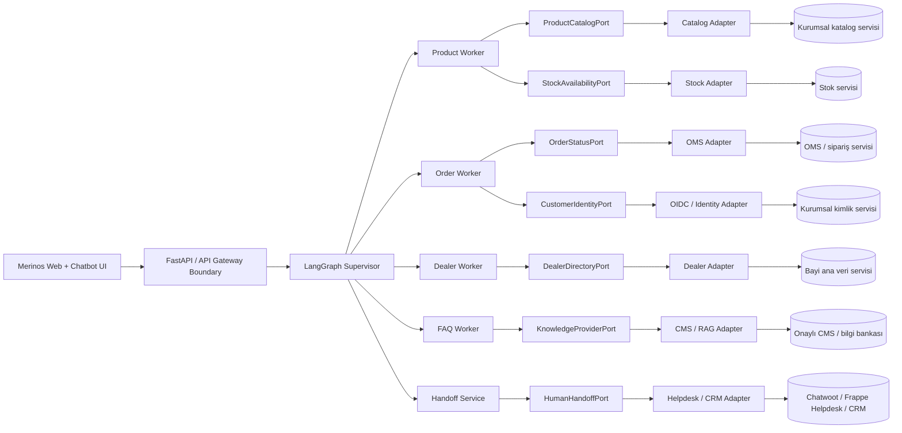

# 17 — Kurumsal Sistem Entegrasyonları

## 0. Görev kimliği

| Alan | Değer |
|---|---|
| Görev numarası | `17` |
| Dosya | `17-KURUMSAL-SISTEM-ENTEGRASYONLARI.md` |
| Ön koşullar | `00–16` numaralı görevler |
| Ana kapsam | Gerçek kurumsal ürün, stok, sipariş, bayi, bilgi bankası, kimlik ve canlı destek servisleri için güvenli entegrasyon omurgası |
| İlk teslim modu | Sözleşme odaklı, salt-okunur, feature flag kontrollü ve geri alınabilir pilot |
| Kapsam dışı | ERP/OMS/CRM veritabanına doğrudan bağlantı, ödeme, sipariş değiştirme, iade başlatma, üretim kimlik bilgilerini repoya koyma, onaysız gerçek müşteri verisi kullanma |
| Temel ilke | Chatbot hiçbir kurumsal sistemin veri modelini doğrudan bilmez; yalnız sürümlü portlar ve anti-corruption adapter’ları üzerinden konuşur |
| Durma kuralı | Kaynak sahipliği, auth, veri sözleşmesi, güvenlik, contract testleri, fail-closed davranış, pilot ve rollback kanıtlanmadan canlı kurumsal trafiğe geçilmez |

---

## 1. Amaç

Bu görevin amacı Merinos Chatbot Demo sistemini, mevcut localhost ve sentetik veri davranışlarını bozmadan, gerçek kurumsal servislerle kontrollü biçimde çalışabilecek bir entegrasyon mimarisine hazırlamaktır.

Görev tamamlandığında sistem aşağıdaki sorulara açık ve test edilmiş cevap vermelidir:

1. Ürün kataloğu ve güncel stok bilgisinin sahibi hangi sistemdir?
2. Sipariş durumuna hangi servis üzerinden ve hangi kullanıcı doğrulamasıyla erişilir?
3. Bayi ana verisi, koordinat ve çalışma saatleri hangi kaynaktan alınır?
4. SSS/politika içeriği hangi CMS veya onaylı bilgi bankasından yayınlanır?
5. Kullanıcı kimliği ve sipariş sahipliği hangi güvenilir kimlik bağlamıyla doğrulanır?
6. İnsan desteğine devir hangi helpdesk/CRM kanalına, hangi minimum veriyle yapılır?
7. Kurumsal servisler yavaş, bozuk veya erişilemez olduğunda chatbot nasıl fail-closed davranır?
8. Bir sağlayıcı değiştiğinde domain ve Worker kodu değiştirilmeden adapter nasıl değiştirilir?
9. Canlı veri ile demo verinin karışması nasıl engellenir?
10. Yeni sözleşme sürümleri geriye uyumluluk ve consumer contract testleriyle nasıl yönetilir?
11. Kişisel veriler hangi sistemler arasında, hangi hukuki ve teknik onayla aktarılır?
12. Pilot, canary, shadow ve rollback aşamaları nasıl kanıtlanır?

Bu görev “birkaç API çağrısı ekleme” görevi değildir. Hedef; kurumsal sistem keşfi, veri sahipliği, port/adapter sınırları, kimlik ve yetki, dayanıklılık, gözlemlenebilirlik, güvenlik, test, pilot ve işletim sorumluluklarını birlikte tanımlayan sürdürülebilir bir entegrasyon katmanıdır.

---

## 2. Bağlayıcı ilkeler

Aşağıdaki kurallar istisnasız uygulanmalıdır:

1. **Kurumsal veritabanına doğrudan bağlanılmaz.**
2. **Frontend hiçbir kurumsal servisi doğrudan çağırmaz.**
3. **Worker’lar HTTP istemcisi, token veya vendor SDK’sı bilmez.**
4. **Kurumsal sistemler yalnız application portlarını uygulayan adapter’lar üzerinden kullanılır.**
5. **Her veri alanı için tek kaynak sahibi ve freshness anlamı belgelenir.**
6. **Demo ve production veri modları aynı request içinde karıştırılmaz.**
7. **API modu başarısız olduğunda sessizce demo veriye düşülmez.**
8. **İlk kurumsal faz yalnız salt-okunur operasyonlarla başlar.**
9. **Sipariş değiştirme, iptal, iade, ödeme veya müşteri kaydı güncelleme ayrı tehdit modeli ve onay olmadan eklenmez.**
10. **Gerçek sipariş ayrıntıları authentication ve server-side ownership doğrulaması olmadan dönmez.**
11. **Kullanıcıdan gelen URL, servis adı, tool adı veya endpoint çalıştırılmaz.**
12. **Outbound hedefler statik allowlist ve typed config ile sınırlandırılır.**
13. **TLS doğrulaması kapatılamaz.**
14. **Üretim secret’ları Git, Docker image, browser bundle, log veya hata mesajında bulunamaz.**
15. **Auth token’ları Worker state, Redis session, checkpoint veya sohbet geçmişine yazılmaz.**
16. **PII ve hassas iş verileri log, metric label, trace baggage veya prompt içine gereksiz taşınmaz.**
17. **Her adapter timeout, retry, circuit breaker, concurrency ve response-size sınırı uygular.**
18. **Retry yalnız idempotent ve retryable salt-okunur çağrılarda yapılır.**
19. **Schema doğrulanmadan hiçbir upstream yanıtı domain modeli sayılmaz.**
20. **Kaynakta bulunmayan fiyat, stok, teslimat, kampanya veya politika bilgisi üretilmez.**
21. **Cache sonucu kaynak zamanı, alınma zamanı ve freshness durumu taşır.**
22. **Stale veri açıkça etiketlenmeden “güncel” olarak gösterilemez.**
23. **Webhook olayları imza, timestamp ve replay koruması olmadan işlenmez.**
24. **Helpdesk devri açık kullanıcı eylemi veya tanımlı güvenli devir politikasıyla yapılır.**
25. **İnsan desteğine minimum gerekli bağlam aktarılır; tam konuşma geçmişi varsayılan değildir.**
26. **Her sağlayıcı için sandbox veya doğrulanmış stub olmadan entegrasyon kodlanmaz.**
27. **Consumer-driven contract testleri geçmeden upstream sürüm yükseltilemez.**
28. **Feature flag olmadan gerçek adapter aktive edilemez.**
29. **Shadow sonuçları kullanıcıya gösterilmez ve kişisel veri içermeyen karşılaştırma metadata’sıyla değerlendirilir.**
30. **Canary ve rollback planı olmayan adapter production’a alınmaz.**
31. **Bir adapter hatası tüm graph’ı sınırsız retry veya sonsuz replanning’e sokamaz.**
32. **Kurumsal entegrasyon telemetrisi düşük kardinaliteli ve içeriksiz olmalıdır.**
33. **Legal/KVKK, sistem sahibi, bilgi güvenliği ve operasyon onayı teknik tamamlanmanın yerine geçmez; ayrıca kayda alınır.**
34. **Çalıştırılmayan test veya kontrol “geçti” olarak raporlanamaz.**

---

## 3. Başlamadan önce okunacak dosyalar

### 3.1. Önceki görev belgeleri

```text
cursor-tasks/00-PROJE-ANAYASASI.md
cursor-tasks/01-REPO-VE-GELISTIRME-TEMELI.md
cursor-tasks/02-MERINOS-DEMO-SITESI-VE-TASARIM-SISTEMI.md
cursor-tasks/03-CHATBOT-WIDGET-VE-KONUSMA-DENEYIMI.md
cursor-tasks/04-URUN-ARAMA-VE-FILTRELEME-AKISI.md
cursor-tasks/05-SIPARIS-DURUMU-SORGULAMA-AKISI.md
cursor-tasks/06-BAYI-BULMA-VE-HARITA-AKISI.md
cursor-tasks/07-SSS-VE-BILGI-BANKASI-AKISI.md
cursor-tasks/08-FRONTEND-ORTAK-STATE-VE-VERI-KATMANI.md
cursor-tasks/09-PYTHON-API-VE-SOZLESME-KATMANI.md
cursor-tasks/10-REDIS-OTURUM-VE-SESSION-STATE-YONETIMI.md
cursor-tasks/11-TOKEN-BUTCESI-VE-CONTEXT-COMPRESSION.md
cursor-tasks/12-LANGGRAPH-SUPERVISOR-WORKER-AKISI.md
cursor-tasks/13-FRONTEND-BACKEND-ENTEGRASYONU.md
cursor-tasks/14-KVKK-GUVENLIK-VE-GOZLEMLENEBILIRLIK.md
cursor-tasks/15-TEST-OTOMASYONU-VE-KALITE-GUVENCE.md
cursor-tasks/16-DOCKER-VE-LOCAL-CALISTIRMA-ORTAMI.md
```

### 3.2. Mevcut frontend ve domain kaynakları

```text
lib/types.ts
lib/demo-data.ts
lib/chatbot/engine.ts
components/Chatbot.tsx
components/DealerMap.tsx
app/page.tsx
```

### 3.3. Backend ve orkestrasyon kaynakları

```text
backend/src/merinos_agent/config.py
backend/src/merinos_agent/main.py
backend/src/merinos_agent/graph.py
backend/src/merinos_agent/workers.py
backend/src/merinos_agent/state.py
backend/src/merinos_agent/context_manager.py
backend/src/merinos_agent/session_store.py
backend/src/merinos_agent/checkpointing.py
backend/tests/
```

### 3.4. Mimari ve işletim belgeleri

```text
docs/01-SISTEM-MIMARISI.md
docs/03-MVP-KAPSAMI.md
docs/04-API-SOZLESMELERI.md
docs/05-TEST-SENARYOLARI.md
docs/06-LANGGRAPH-REDIS-STATE-MIMARISI.md
docs/07-SUPERVISOR-WORKER-MIMARISI.md
docs/08-TASARIM-SISTEMI.md
docs/09-DOCKER-VE-LOCAL-CALISTIRMA.md
README.md
backend/README.md
```

Eksik dosyalar varsa önceki görevin çıktısı uygulanmamış kabul edilmeli; Cursor bu durumu raporlamalı ve hayali mevcut dosya üzerinden ilerlememelidir.

---

## 4. Bu görevden önce yapılacak kurumsal keşif

Kod yazılmadan önce her kurumsal sistem için bir keşif kaydı hazırlanmalıdır.

### 4.1. Zorunlu keşif soruları

Her servis sahibiyle aşağıdaki sorular cevaplanmalıdır:

1. Sistemin iş sahibi ve teknik sahibi kimdir?
2. Ortamlar nelerdir: development, test, staging, production?
3. Resmî entegrasyon yöntemi nedir: REST, GraphQL, SOAP, event, dosya, webhook?
4. Sürümleme politikası nedir?
5. Authentication ve authorization yöntemi nedir?
6. Servis hesabını kim açar ve kim döndürür?
7. IP allowlist, VPN, private network veya mTLS gereksinimi var mı?
8. Rate limit ve burst limit nedir?
9. Timeout ve bakım penceresi nedir?
10. SLA/SLO ve destek eskalasyon kanalı nedir?
11. Veri sahibi hangi alanları paylaşmaya izin verir?
12. Verinin freshness ve eventual-consistency anlamı nedir?
13. Kişisel veri veya özel nitelikli veri bulunuyor mu?
14. Veri Türkiye dışına çıkıyor mu?
15. Audit log ve erişim kaydı gereksinimi nedir?
16. Sandbox gerçek kişisel veri içeriyor mu?
17. Test verisini kim üretir ve kim onaylar?
18. Breaking change nasıl duyurulur?
19. Webhook varsa imza, replay ve teslim garantisi nedir?
20. Servis arızasında önerilen fallback nedir?
21. Cache yapılmasına izin var mı; varsa azami süre nedir?
22. Verinin kullanıcıya gösterilebilecek alanları hangileridir?
23. Hangi alanlar yalnız iç operasyon içindir?
24. Silme veya erişim talebi bu sistemde nasıl uygulanır?
25. Entegrasyonu production’da kapatmak için kill switch var mı?

### 4.2. Sistem envanteri çıktısı

Aşağıdaki dosya oluşturulmalıdır:

```text
docs/integrations/SYSTEM-INVENTORY.yaml
```

Örnek şema:

```yaml
schemaVersion: 1
systems:
  - id: product-catalog
    displayName: Product Catalog
    businessOwner: PENDING
    technicalOwner: PENDING
    dataOwner: PENDING
    integrationType: rest
    environments:
      sandbox: PENDING
      staging: PENDING
      production: PENDING
    authentication: PENDING
    containsPersonalData: false
    allowedOperations:
      - read_product
      - search_product
    prohibitedOperations:
      - write_product
    sourceOfTruthFor:
      - product_identity
      - category
      - color
      - dimensions
    freshnessContract: PENDING
    rateLimit: PENDING
    supportEscalation: PENDING
    status: discovery
```

`PENDING` alanlar production adapter’ının aktif edilmesini engellemelidir.

---

## 5. Hedef kurumsal topoloji



### 5.1. Mimari sınır

- `Supervisor` kurumsal endpoint, credential veya vendor adı bilmez.
- `Worker` yalnız application portunu çağırır.
- Port domain açısından anlamlı typed modeller kullanır.
- Adapter upstream protokolü, auth, mapping ve resilience ayrıntılarını kapsüller.
- API katmanı frontend sözleşmesini korur; upstream schema frontend’e sızmaz.
- Vendor SDK modeli Redis veya graph state içinde saklanmaz.
- Adapter değişimi domain ve UI kodunda değişiklik gerektirmemelidir.

---

## 6. Hedef dosya yapısı

Aşağıdaki yapı oluşturulmalıdır:

```text
backend/src/merinos_agent/
├── application/
│   ├── ports/
│   │   ├── product_catalog.py
│   │   ├── stock_availability.py
│   │   ├── order_status.py
│   │   ├── customer_identity.py
│   │   ├── dealer_directory.py
│   │   ├── knowledge_provider.py
│   │   └── human_handoff.py
│   └── services/
│       ├── product_service.py
│       ├── order_service.py
│       ├── dealer_service.py
│       ├── knowledge_service.py
│       └── handoff_service.py
├── domain/
│   ├── product_models.py
│   ├── inventory_models.py
│   ├── order_models.py
│   ├── dealer_models.py
│   ├── knowledge_models.py
│   ├── identity_models.py
│   └── integration_models.py
├── integrations/
│   ├── __init__.py
│   ├── registry.py
│   ├── settings.py
│   ├── http_client.py
│   ├── auth.py
│   ├── resilience.py
│   ├── redaction.py
│   ├── errors.py
│   ├── catalog/
│   │   ├── adapter.py
│   │   ├── contracts.py
│   │   └── mapper.py
│   ├── stock/
│   │   ├── adapter.py
│   │   ├── contracts.py
│   │   └── mapper.py
│   ├── orders/
│   │   ├── adapter.py
│   │   ├── contracts.py
│   │   └── mapper.py
│   ├── identity/
│   │   ├── adapter.py
│   │   ├── contracts.py
│   │   └── verifier.py
│   ├── dealers/
│   │   ├── adapter.py
│   │   ├── contracts.py
│   │   └── mapper.py
│   ├── knowledge/
│   │   ├── local_adapter.py
│   │   ├── cms_adapter.py
│   │   ├── rag_adapter.py
│   │   └── mapper.py
│   └── handoff/
│       ├── noop_adapter.py
│       ├── helpdesk_adapter.py
│       ├── contracts.py
│       └── mapper.py
├── tests/
│   ├── contracts/
│   ├── integrations/
│   └── fixtures/
└── ...

docs/integrations/
├── README.md
├── SYSTEM-INVENTORY.yaml
├── DATA-OWNERSHIP-MATRIX.md
├── FIELD-MAPPING-CATALOG.md
├── AUTH-AND-NETWORK.md
├── FAILURE-MATRIX.md
├── PILOT-AND-ROLLBACK.md
└── RUNBOOK.md
```

Mevcut proje yapısı farklıysa eşdeğer modüller kullanılabilir; ancak port, domain, adapter, mapper, auth, resilience ve test sorumlulukları aynı dosyada birleştirilmemelidir.

---

## 7. Entegrasyon registry ve provider seçimi

Provider seçimi yalnız typed config ve dependency injection ile yapılmalıdır.

```python
from dataclasses import dataclass
from enum import StrEnum


class IntegrationMode(StrEnum):
    LOCAL = "local"
    SANDBOX = "sandbox"
    SHADOW = "shadow"
    LIVE = "live"


@dataclass(frozen=True)
class IntegrationSelection:
    product_catalog: str
    stock: str
    orders: str
    identity: str
    dealers: str
    knowledge: str
    handoff: str
    mode: IntegrationMode
```

Kurallar:

- Provider adı kullanıcı mesajından alınamaz.
- Provider adı URL parametresinden alınamaz.
- Registry yalnız uygulama başlangıcında doğrulanmış config üzerinden kurulur.
- Bilinmeyen provider fail-fast olmalıdır.
- Production’da `local` provider açıkça yasaklanabilmelidir.
- `shadow` provider kullanıcı cevabını değiştirmemelidir.
- Her provider aktivasyonu ayrı feature flag ile kontrol edilmelidir.

---

## 8. Ortak entegrasyon sonuç modeli

Tüm portlar sağlayıcıdan bağımsız ortak sonuç zarfı kullanmalıdır:

```python
from dataclasses import dataclass
from datetime import datetime
from enum import StrEnum
from typing import Generic, TypeVar

T = TypeVar("T")


class Freshness(StrEnum):
    LIVE = "live"
    RECENT = "recent"
    STALE = "stale"
    UNKNOWN = "unknown"


@dataclass(frozen=True)
class SourceMetadata:
    source_id: str
    source_record_version: str | None
    fetched_at: datetime
    source_updated_at: datetime | None
    freshness: Freshness
    correlation_id: str


@dataclass(frozen=True)
class IntegrationResult(Generic[T]):
    data: T
    source: SourceMetadata
    warnings: tuple[str, ...] = ()
```

### 8.1. Yasaklar

- Raw upstream response döndürülmez.
- Vendor exception UI’a taşınmaz.
- Credential veya token metadata’ya yazılmaz.
- Kullanıcıya iç sistem adı veya topoloji ayrıntısı verilmez.
- `source_record_version` alanına kişisel veya hassas değer koyulmaz.

---

## 9. Ortak hata taksonomisi

```python
from enum import StrEnum


class IntegrationErrorCode(StrEnum):
    INVALID_REQUEST = "invalid_request"
    UNAUTHENTICATED = "unauthenticated"
    FORBIDDEN = "forbidden"
    NOT_FOUND = "not_found"
    RATE_LIMITED = "rate_limited"
    TIMEOUT = "timeout"
    UNAVAILABLE = "unavailable"
    CONTRACT_MISMATCH = "contract_mismatch"
    DATA_QUALITY = "data_quality"
    STALE_DATA = "stale_data"
    CONFLICT = "conflict"
    UPSTREAM_ERROR = "upstream_error"
    CONFIGURATION_ERROR = "configuration_error"
```

Her hata aşağıdaki metadata’yı taşımalıdır:

- güvenli `code`,
- retryable bilgisi,
- upstream’e gönderilen correlation ID,
- kullanıcıya gösterilecek güvenli mesaj anahtarı,
- operasyon ekibine gidecek düşük kardinaliteli provider ID,
- HTTP status veya upstream body içermeyen redakte edilmiş teknik ayrıntı.

### 9.1. Kullanıcı mesajı örnekleri

| Hata | Kullanıcı davranışı |
|---|---|
| Timeout | “Bu bilgiye şu anda ulaşılamıyor. Daha sonra tekrar deneyebilirsiniz.” |
| Contract mismatch | Genel servis hatası; veri tahmin edilmez |
| Unauthorized order | Yeniden güvenli oturum açma veya doğrulama yönlendirmesi |
| Not found | Kaynakta kayıt bulunamadığı açıkça belirtilir |
| Stale stock | Eski veri kullanıcıya “son güncelleme” ile gösterilir veya sonuç kapatılır |
| Rate limited | Otomatik sınırsız retry yapılmaz; kontrollü bekleme mesajı verilir |

---

## 10. Ortak HTTP istemci standardı

Tüm HTTP adapter’ları tek bir güvenli istemci portunu kullanmalıdır.

Zorunlu özellikler:

- connection pooling,
- connect/read/write/pool timeout ayrımı,
- maksimum response byte sınırı,
- yalnız JSON veya açıkça izin verilen content type,
- TLS certificate doğrulaması,
- statik base URL,
- redirect’lerin varsayılan olarak kapalı olması,
- request/response header allowlist’i,
- correlation/request ID propagation,
- kullanıcı mesajı veya PII içermeyen yapılandırılmış telemetry,
- cancellation propagation,
- bounded concurrency,
- graceful shutdown.

### 10.1. Başlangıç timeout bütçeleri

Aşağıdaki değerler sözleşme değil, başlangıç mühendislik bütçesidir; gerçek sandbox ölçümü ve servis sahibi onayıyla config üzerinden güncellenmelidir.

| Adapter | Connect | Read | Toplam deneme bütçesi |
|---|---:|---:|---:|
| Ürün kataloğu | 500 ms | 1.500 ms | 2.500 ms |
| Stok | 500 ms | 1.200 ms | 2.000 ms |
| Sipariş | 700 ms | 2.000 ms | 3.500 ms |
| Bayi | 500 ms | 1.500 ms | 2.500 ms |
| Bilgi bankası | 700 ms | 2.000 ms | 3.500 ms |
| Helpdesk devir | 700 ms | 2.500 ms | 4.000 ms |

Graph toplam timeout’u adapter retry’larının toplamından küçük olmamalı; ancak Worker’ın tüm request bütçesini tek adapter tüketmesine izin verilmemelidir.

---

## 11. Retry, circuit breaker ve bulkhead

### 11.1. Retry koşulları

Retry yalnız aşağıdaki koşullarda yapılabilir:

- çağrı salt-okunur veya idempotency key ile güvenlidir,
- hata `timeout`, geçici `unavailable` veya açık retryable `rate_limited` durumudur,
- request bütçesi bitmemiştir,
- kullanıcı iptal etmemiştir,
- circuit breaker açık değildir.

Retry yapılmaması gereken durumlar:

- authentication/authorization hatası,
- validation hatası,
- contract mismatch,
- veri kalitesi hatası,
- sahiplik doğrulaması başarısızlığı,
- aynı mesaj için idempotency conflict,
- kullanıcı iptali.

### 11.2. Backoff

- Exponential backoff ve bounded jitter kullanılmalıdır.
- `Retry-After` güvenli sınırlar içinde dikkate alınmalıdır.
- Bir salt-okunur çağrı için varsayılan en fazla iki ek deneme yapılmalıdır.
- Her adapter’ın retry bütçesi ayrı olmalıdır.
- Retry sayısı metric label’a değil numeric metric değerine yazılmalıdır.

### 11.3. Circuit breaker

Circuit breaker state’i process içinde veya paylaşımlı altyapıda uygulanabilir; seçim belgelenmelidir.

Zorunlu durumlar:

```text
closed -> open -> half_open -> closed
```

- Open durumunda upstream çağrısı yapılmaz.
- Half-open probe sayısı sınırlıdır.
- Breaker provider ve operasyon bazında ayrılır.
- Bir provider arızası diğer provider’ları kapatmamalıdır.
- Breaker state kullanıcıya iç sistem ayrıntısıyla açıklanmaz.

### 11.4. Bulkhead

Her entegrasyon için ayrı concurrency limiti olmalıdır. Sipariş servisi yavaşladığında ürün veya SSS Worker’ının thread/connection kaynaklarını tüketmemelidir.

---

## 12. Kimlik doğrulama ve servis yetkisi

### 12.1. Service-to-service auth

Tercih sırası kurum standardına göre belgelenmelidir:

1. Private network + mTLS
2. OAuth 2.0 client credentials veya kurumun onaylı eşdeğeri
3. Kısa ömürlü workload identity
4. Zorunluysa döndürülebilir API key

Kurallar:

- Token process memory dışında kalıcı tutulmaz.
- Token refresh tek-flight yapılmalıdır.
- Token hata mesajı veya telemetry’ye yazılmaz.
- Scope en az yetki prensibiyle sınırlandırılır.
- Aynı servis hesabı tüm adapter’larda ortak kullanılmamalıdır.
- Production credential local `.env` dosyasına koyulmaz.
- Secret vault/KMS yolu ops ekibi tarafından tanımlanmalıdır.
- Secret rotation runbook’u test edilmelidir.

### 12.2. End-user identity

Kullanıcı kimliği ile service identity ayrılmalıdır.

```python
@dataclass(frozen=True)
class VerifiedUserContext:
    subject_id: str
    session_assurance: str
    authenticated_at: datetime
    scopes: frozenset[str]
    tenant_id: str | None = None
```

Kurallar:

- `subject_id` chatbot mesajından türetilmez.
- Frontend’in gönderdiği kullanıcı ID’sine güvenilmez.
- Kimlik bağlamı doğrulanmış access token veya güvenilir gateway header’ından gelir.
- Gateway header’ı yalnız trusted proxy sınırında kabul edilir.
- Order Worker sipariş numarası ile kullanıcı kimliğini server-side ownership verifier’a gönderir.
- Session ID authentication yerine geçmez.
- Demo modunda gerçek kimlik taklidi yapılmaz.

---

## 13. Ürün kataloğu entegrasyonu

### 13.1. Port

```python
from typing import Protocol


class ProductCatalogPort(Protocol):
    async def search_products(
        self,
        query: "ProductSearchQuery",
        *,
        request_context: "RequestContext",
    ) -> "IntegrationResult[ProductSearchPage]": ...

    async def get_product(
        self,
        product_id: str,
        *,
        request_context: "RequestContext",
    ) -> "IntegrationResult[Product | None]": ...
```

### 13.2. Kaynak sahipliği

Ürün kataloğu aşağıdaki alanların sahibi olabilir; gerçek sahiplik envanterde doğrulanmalıdır:

- ürün kimliği ve kodu,
- ürün adı,
- kategori ve koleksiyon,
- renk/facet,
- ölçü varyantları,
- görsel referansları,
- yayın/aktiflik durumu,
- ürün açıklaması.

Fiyat, kampanya veya stok aynı sistemin sahibi değilse katalog adapter’ı bu alanları doldurmamalıdır.

### 13.3. Filtre semantiği

Task 04’teki kanonik filtre kuralları korunmalıdır:

- farklı facet grupları `AND`,
- aynı facet içindeki çoklu değerler kontrollü `OR`,
- ölçü normalizasyonu domain katmanında,
- ürün kodu kesin/öncelikli eşleşme,
- deterministik sıralama,
- upstream relevance skoru kullanıcıya gösterilmez.

### 13.4. Pagination ve limit

- Adapter upstream pagination’ı domain pagination modeline çevirmelidir.
- Chatbot Worker en fazla gerekli sayıda sonucu istemelidir.
- Sınırsız katalog çekimi yapılmamalıdır.
- Maksimum sayfa boyutu config ile sınırlandırılmalıdır.
- Upstream toplam sonuç sayısı güvenilir değilse uydurulmamalıdır.

### 13.5. Görsel URL güvenliği

- Yalnız onaylı CDN hostları kullanılmalıdır.
- `javascript:`, `data:` veya bilinmeyen host URL’leri reddedilmelidir.
- Frontend doğrudan kurumsal iç hosta erişmemelidir.
- Gerekirse media proxy veya public CDN dönüşümü uygulanmalıdır.

---

## 14. Stok entegrasyonu

### 14.1. Port

```python
class StockAvailabilityPort(Protocol):
    async def get_availability(
        self,
        request: "AvailabilityRequest",
        *,
        request_context: "RequestContext",
    ) -> "IntegrationResult[AvailabilitySnapshot]": ...
```

### 14.2. Stok durum modeli

Kesin adet gösterilmesine izin verilmediği veya veri güvenilir olmadığı durumda typed durum kullanılmalıdır:

```text
in_stock
low_stock
out_of_stock
preorder
unknown
not_available_for_channel
```

Kurallar:

- `unknown`, `out_of_stock` olarak yorumlanmaz.
- Depo stoku ile mağaza stoku ayrılır.
- “Stokta” ifadesi kanal ve zaman metadata’sı olmadan kullanılmaz.
- Cache sonucu alındıysa `fetchedAt` ve mümkünse `sourceUpdatedAt` korunur.
- Eski stok verisi satış garantisi olarak sunulmaz.
- Bayi/mağaza stoku için bayi kimliği zorunlu olabilir.
- Stok sorguları ürün kodu/varyant kimliği üzerinden yapılmalıdır; serbest ürün adı upstream’e aktarılmamalıdır.

### 14.3. Cache

Cache izni veri sahibi tarafından onaylanmalıdır.

Başlangıç politikası:

- ürün statik metadata’sı daha uzun cache,
- stok çok kısa cache veya cache yok,
- order sonucu cache yok ya da yalnız request-scope,
- cache key PII içermez,
- cache stampede single-flight ile engellenir,
- stale-while-revalidate yalnız kullanıcıya stale etiketi gösterebiliyorsa açılır.

---

## 15. Sipariş ve kargo entegrasyonu

### 15.1. Port

```python
class OrderStatusPort(Protocol):
    async def get_status(
        self,
        request: "VerifiedOrderStatusRequest",
        *,
        request_context: "RequestContext",
    ) -> "IntegrationResult[OrderStatusView | None]": ...
```

`VerifiedOrderStatusRequest` aşağıdaki kanıtları taşımalıdır:

- kanonik sipariş referansı,
- doğrulanmış kullanıcı subject’i,
- sahiplik doğrulama sonucu veya ownership verifier çağrısı için gerekli server-side context,
- request correlation ID,
- amaç/scope.

### 15.2. Yetki kapısı

Order adapter çağrılmadan önce:

1. Kullanıcı authenticated olmalıdır.
2. Oturum assurance seviyesi yeterli olmalıdır.
3. Sipariş numarası kanonik doğrulanmalıdır.
4. Sipariş sahipliği server-side doğrulanmalıdır.
5. İstenen alanlar scope allowlist’inde olmalıdır.
6. Audit olayı içeriksiz ve güvenli biçimde yazılmalıdır.

Bu koşullardan biri yoksa order adapter hassas veri çağrısı yapmamalıdır.

### 15.3. Alan minimizasyonu

Chatbot’a yalnız aşağıdaki türde alanlar taşınmalıdır:

- güvenli sipariş durum etiketi,
- maskelenmiş sipariş referansı,
- durum zaman çizelgesi,
- garanti olmayan tahmini teslimat,
- maskelenmiş takip kodu,
- güvenli kargo yönlendirmesi.

Aşağıdaki alanlar varsayılan olarak taşınmamalıdır:

- açık teslimat adresi,
- ödeme bilgisi,
- fatura kimlik bilgileri,
- telefon ve e-posta,
- tam kargo takip kodu,
- iç operasyon notları,
- fraud/risk işaretleri,
- başka müşteri kayıtları.

### 15.4. Kargo sağlayıcıları

Kargo sağlayıcısına doğrudan istemciden bağlantı verilmemelidir. Link gerekiyorsa:

- statik sağlayıcı allowlist’i,
- HTTPS,
- server-side güvenli URL üretimi,
- takip kodu query loglarında görünmeyecek tasarım,
- `noopener noreferrer`,
- kullanıcıya dış site uyarısı uygulanmalıdır.

---

## 16. Bayi ana veri entegrasyonu

### 16.1. Port

```python
class DealerDirectoryPort(Protocol):
    async def search_dealers(
        self,
        query: "DealerSearchQuery",
        *,
        request_context: "RequestContext",
    ) -> "IntegrationResult[DealerSearchPage]": ...
```

### 16.2. Kaynak alanları

- bayi kimliği,
- yayın/aktiflik durumu,
- şehir ve ilçe,
- kullanıcıya gösterilebilir adres,
- kullanıcıya gösterilebilir telefon,
- çalışma saatleri,
- onaylı koordinat,
- mağaza türü ve hizmetler,
- son güncellenme zamanı.

### 16.3. Veri kalitesi

- Koordinat aralıkları doğrulanmalıdır.
- Türkiye dışı veya beklenmeyen koordinatlar karantinaya alınmalıdır.
- Duplicate bayi kaydı deterministic kuralla çözülmeli; rastgele biri seçilmemelidir.
- Telefon ve adres yalnız `public` işaretli alanlardan alınmalıdır.
- Kapalı/pasif bayi kullanıcıya aktif sonuç olarak gösterilmemelidir.
- Çalışma saatleri yoksa “bilgi yok” denmeli, saat uydurulmamalıdır.
- Mesafe hesabı kullanıcı konumu açık izinle sağlandığında yapılmalıdır.

### 16.4. Harita sağlayıcısı sınırı

- Kurumsal bayi adapter’ı harita SDK’sına bağlı olmamalıdır.
- Harita frontend concern’dür; domain yalnız koordinat ve güvenli link metadata’sı taşır.
- Harita sağlayıcısı değişimi bayi veri adapter’ını değiştirmemelidir.
- Ham kullanıcı koordinatı upstream bayi servisine gönderilmemelidir; arama için şehir/ilçe veya server-side mesafe hesabı tercih edilmelidir.

---

## 17. Bilgi bankası, CMS ve RAG entegrasyonu

### 17.1. Provider zinciri

```text
LocalKnowledgeProvider
CmsKnowledgeProvider
RagKnowledgeProvider
```

Aktif provider config ile seçilmeli; bir request içinde bilinmeyen sağlayıcılar karıştırılmamalıdır.

### 17.2. CMS sözleşmesi

Onaylı bilgi kaydı en az şunları taşımalıdır:

- content ID,
- topic/category,
- title,
- approved answer veya kaynak metin,
- language,
- publication status,
- content version,
- valid from / valid until,
- legal/compliance approval metadata,
- source URL veya internal source reference,
- last reviewed at.

Yalnız `published` ve geçerlilik aralığındaki kayıtlar kullanılmalıdır.

### 17.3. RAG sınırı

RAG adapter’ı aşağıdaki adımları ayrı yapmalıdır:

1. Sorguyu redakte et.
2. Kişisel veri aktarım politikasını uygula.
3. Onaylı collection/tenant allowlist’i seç.
4. Retrieval sonucu için source ID ve version al.
5. Prompt injection sınıflandırması uygula.
6. Sonuçları token ve belge sayısı sınırına indir.
7. Yanıtı kaynaklarla doğrula.
8. Düşük güven durumunda kesin cevap üretme.

RAGFlow, başka bir RAG platformu veya özel vector service seçimi adapter ayrıntısıdır; domain modeli sağlayıcı adını bilmemelidir.

### 17.4. Kaynak zorunluluğu

Politika, iade, teslimat veya bakım gibi kurumsal cevaplar:

- kaynak ID,
- içerik sürümü,
- güncelleme tarihi,
- güven durumu

metadata’sı olmadan “onaylı kurumsal cevap” sayılmamalıdır.

---

## 18. CRM ve canlı destek devri

### 18.1. Port

```python
class HumanHandoffPort(Protocol):
    async def create_handoff(
        self,
        request: "HandoffRequest",
        *,
        request_context: "RequestContext",
    ) -> "IntegrationResult[HandoffReceipt]": ...
```

### 18.2. Destek sağlayıcıları

Chatwoot, Frappe Helpdesk, kurum içi CRM veya başka bir helpdesk adapter olarak uygulanabilir. Bu görev belirli bir sağlayıcıyı zorunlu kılmaz.

### 18.3. Devir tetikleyicileri

Devir aşağıdaki durumlarda önerilebilir:

- kullanıcı açıkça temsilci ister,
- güvenli self-service akışı başarısız olur,
- kurumsal servis sürekli erişilemez,
- kullanıcı yetkili işlem ister,
- belirsiz veya hassas durum otomasyon sınırını aşar,
- politika gereği insan onayı zorunludur.

Devir otomatik açılacaksa açık politika ve rate-limit olmalıdır. Kullanıcı istemeden sessiz ticket üretmek varsayılan davranış olmamalıdır.

### 18.4. Minimum handoff payload

```python
@dataclass(frozen=True)
class HandoffRequest:
    reason_code: str
    locale: str
    verified_user_reference: str | None
    conversation_summary: str
    selected_context: tuple["HandoffContextItem", ...]
    consent_record_id: str | None
    client_message_id: str
```

Kurallar:

- Tam konuşma geçmişi varsayılan olarak aktarılmaz.
- Summary PII redaction’dan geçer.
- Sipariş referansı gerekiyorsa maskelenir veya helpdesk’in güvenli server-side lookup mekanizması kullanılır.
- Kullanıcıya hangi bilgilerin aktarılacağı gösterilir.
- Ticket tekrarında aynı idempotency key kullanılmalıdır.
- Handoff receipt yalnız güvenli ticket reference taşır.
- Helpdesk iç URL’si kullanıcıya verilmez.

### 18.5. Agent handback

İnsan temsilciden chatbot’a geri devir varsa:

- güvenilir webhook veya polling sözleşmesi,
- mesaj origin metadata’sı,
- duplicate/replay koruması,
- kapalı ticket davranışı,
- kullanıcıya açık temsilci kimliği etiketi,
- agent mesajlarının LLM talimatı sayılmaması

tanımlanmalıdır.

---

## 19. Webhook ve event entegrasyonları

Webhook yalnız gerekli kurumsal olaylar için kullanılmalıdır; chatbot request akışını gereksiz event karmaşıklığına taşımayın.

### 19.1. Zorunlu webhook kontrolleri

- HMAC veya asimetrik imza doğrulaması
- Timestamp toleransı
- Event ID replay koruması
- Tenant/source allowlist’i
- Maksimum body boyutu
- Content-type kontrolü
- JSON schema doğrulaması
- Bounded processing
- Hızlı `2xx` ack ve gerekiyorsa güvenli queue
- Dead-letter/runbook
- Hassas payload loglamama

### 19.2. Event idempotency

```text
sourceId + eventId + eventType + canonical payload fingerprint
```

- Aynı event tekrar işlenmemelidir.
- Aynı event ID farklı fingerprint ile gelirse conflict/security olayı oluşturulmalıdır.
- Replay kayıtları TTL ile tutulmalıdır.
- Event payload’ı Redis session state’e kopyalanmamalıdır.

---

## 20. Canonical domain modelleri ve mapping

Her adapter’ın upstream contract modeli ile domain modeli ayrı olmalıdır.

```text
Upstream JSON/XML
    ↓ schema validation
Provider contract model
    ↓ explicit mapper
Canonical domain model
    ↓ application service
Worker result / API response model
```

### 20.1. Mapper kuralları

- Alan eşleme açık ve test edilebilir olmalıdır.
- Bilinmeyen enum değerleri güvenli `unknown` durumuna veya contract mismatch’e dönüşmelidir.
- Tarih/saat UTC ve timezone-aware olmalıdır.
- Para birimi explicit ISO koduyla taşınmalıdır.
- Ondalık sayılar float ile değil uygun decimal modeliyle işlenmelidir.
- Boş string, null ve eksik alan ayrımı belgelenmelidir.
- HTML veya rich text sanitize edilmeden domain’e taşınmamalıdır.
- Upstream internal ID kullanıcıya doğrudan gösterilmemelidir.
- Mapper veri kaybını warning olarak raporlayabilmelidir.

### 20.2. Field mapping kataloğu

```text
docs/integrations/FIELD-MAPPING-CATALOG.md
```

Her alan için:

| Alan | İçerik |
|---|---|
| Domain alanı | `product.product_id` |
| Upstream alanı | Sağlayıcı contract alanı |
| Veri sahibi | İş birimi/sistem |
| Dönüşüm | Normalize/mask/map |
| Null davranışı | Unknown/error/omit |
| PII sınıfı | None/personal/sensitive |
| Cache izni | Evet/Hayır/TTL |
| Kullanıcıya gösterim | Evet/Hayır/Koşullu |
| Test fixture | Fixture kimliği |

bulunmalıdır.

---

## 21. Veri sahipliği matrisi

```text
docs/integrations/DATA-OWNERSHIP-MATRIX.md
```

Başlangıç matrisi:

| Veri | Olası kaynak sahibi | Chatbot rolü | Cache | Hassasiyet |
|---|---|---|---|---|
| Ürün kimliği/kategori/renk/ölçü | Katalog/PIM | Salt okunur | Onaya bağlı | Düşük |
| Fiyat | ERP/e-ticaret pricing | Salt okunur | Çok kısa/onaya bağlı | Ticari |
| Genel stok | Stok/ERP | Salt okunur | Çok kısa | Ticari |
| Mağaza stoku | Mağaza stok servisi | Salt okunur | Çok kısa | Ticari |
| Sipariş durumu | OMS | Doğrulanmış salt okunur | Yok/request-scope | Kişisel |
| Kargo durumu | OMS/kargo entegrasyonu | Doğrulanmış salt okunur | Yok/request-scope | Kişisel |
| Bayi adres/telefon | Bayi MDM | Public salt okunur | Onaya bağlı | Düşük |
| SSS/politika | CMS/bilgi bankası | Onaylı salt okunur | Sürümlü | Kurumsal |
| Kullanıcı kimliği | IAM | Yetki doğrulama | Token cache policy | Kişisel |
| Handoff ticket | Helpdesk/CRM | Kontrollü yazma | İdempotency kaydı | Kişisel |

Bu tablo gerçek kurum sahipleriyle doldurulmadan production flag açılamaz.

---

## 22. Demo, sandbox, shadow ve live modları

### 22.1. `local`

- Yalnız sentetik fixture’lar.
- Network çağrısı yok.
- UI’da demo etiketi görünür.

### 22.2. `sandbox`

- Kurumsal sandbox veya doğrulanmış stub.
- Gerçek müşteri verisi yok.
- Contract ve resilience testleri çalışır.
- Kullanıcı trafiğine kapalı olabilir.

### 22.3. `shadow`

- Kullanıcı yanıtı mevcut güvenilir provider’dan gelir.
- Yeni adapter aynı güvenli girdiyi paralel veya kontrollü olarak değerlendirir.
- Shadow sonucu kullanıcıya gösterilmez.
- Karşılaştırmada ham içerik yerine alan bazlı ve redakte edilmiş fark metadata’sı tutulur.
- Sipariş/PII shadow çağrıları hukuk ve güvenlik onayı olmadan yapılmaz.

### 22.4. `live`

- Production auth, network ve secret kontrolleri zorunlu.
- Production-ready flag ve sahip onayları zorunlu.
- Rollback/kill switch test edilmiş olmalıdır.
- Demo fallback yasaktır.

---

## 23. Feature flag standardı

Aşağıdaki gibi ayrı flag’ler kullanılmalıdır:

```text
INTEGRATION_PRODUCT_ENABLED
INTEGRATION_STOCK_ENABLED
INTEGRATION_ORDER_ENABLED
INTEGRATION_DEALER_ENABLED
INTEGRATION_KNOWLEDGE_ENABLED
INTEGRATION_HANDOFF_ENABLED
INTEGRATION_SHADOW_ENABLED
INTEGRATION_LIVE_ALLOWED
```

Kurallar:

- Flag isimleri kullanıcıya açık değildir.
- Flag provider config’in yerine geçmez.
- Flag değişimi audit edilmelidir; değer loglanabilir ancak secret değildir.
- Güvenlik kapısını kapatan flag varsayılanı `false` olmalıdır.
- Kill switch frontend deploy gerektirmeden uygulanabilmelidir.
- Flag servisi yoksa typed env/config ile fail-safe davranılmalıdır.

---

## 24. API Gateway ve network sınırı

Kurumsal topoloji uygunsa outbound çağrılar API gateway veya egress proxy üzerinden yapılmalıdır.

Zorunlu kontroller:

- statik DNS/host allowlist,
- private network veya VPN,
- mTLS veya kurum standardı,
- outbound firewall,
- DNS rebinding/SSRF önleme,
- response size sınırı,
- TLS certificate ve hostname doğrulaması,
- proxy credential redaction,
- gateway correlation ID,
- rate limit ve quota,
- merkezi erişim revocation.

Kullanıcı girdisi base URL, path template’in güvenli olmayan bölümü, header adı veya HTTP method belirleyemez.

---

## 25. Config sözleşmesi

```python
from pydantic import BaseModel, SecretStr, AnyHttpUrl


class ProviderHttpSettings(BaseModel):
    provider_id: str
    base_url: AnyHttpUrl
    auth_mode: str
    client_id: str | None = None
    client_secret: SecretStr | None = None
    audience: str | None = None
    connect_timeout_ms: int
    read_timeout_ms: int
    max_response_bytes: int
    max_concurrency: int
    retry_attempts: int
    enabled: bool = False
```

Kurallar:

- Production secret alanları `_FILE` veya secret manager’dan okunmalıdır.
- URL HTTPS olmalı; local/sandbox istisnası açık config ve testle sınırlandırılmalıdır.
- Config startup’ta doğrulanmalıdır.
- Eksik production config readiness’i başarısız yapmalıdır.
- Config dump secret’ları maskelemelidir.
- Production endpoint örnekleri repoya yazılmamalıdır.

---

## 26. Kurumsal readiness modeli

Mevcut `/health/live` ve `/health/ready` ayrımı korunmalıdır.

### 26.1. Liveness

- Process event loop çalışıyor mu?
- Zorunlu internal bileşenler deadlock değil mi?
- Upstream’e aktif çağrı yapmamalıdır.

### 26.2. Readiness

Aktif mode’a göre zorunlu adapter config ve dependency durumu değerlendirilmelidir.

- `local`: local adapter hazır.
- `sandbox`: gerekli sandbox config ve kısa dependency probe hazır.
- `live`: active provider, auth bootstrap ve zorunlu dependency’ler hazır.

Readiness probe:

- hassas veri göndermez,
- ağır katalog sorgusu yapmaz,
- upstream’i yüksek frekansta zorlamaz,
- kısa timeout kullanır,
- circuit breaker’ı bozmaz,
- provider bazlı alt durumları iç API/ops görünümünde tutar.

Kullanıcıya yalnız genel servis durumu verilir.

---

## 27. Gözlemlenebilirlik

### 27.1. Metric’ler

Her adapter için düşük kardinaliteli metric’ler:

```text
integration_requests_total{provider,operation,outcome}
integration_latency_seconds{provider,operation}
integration_retries_total{provider,operation}
integration_circuit_state{provider,operation,state}
integration_contract_failures_total{provider,operation}
integration_data_quality_failures_total{provider,operation}
integration_cache_hits_total{provider,operation,freshness}
integration_shadow_mismatches_total{provider,operation,field_group}
handoff_requests_total{provider,outcome,reason_code}
```

Yasak label’lar:

- user ID,
- session ID,
- order number,
- product query,
- city/address,
- ticket ID,
- URL,
- exception message.

### 27.2. Trace

Span örnekleri:

```text
integration.catalog.search
integration.stock.lookup
integration.order.verify_owner
integration.order.status
integration.dealer.search
integration.knowledge.retrieve
integration.handoff.create
```

Span attribute allowlist’i:

- provider ID,
- operation,
- outcome,
- retry count,
- result count bucket,
- freshness,
- contract version,
- request ID’nin güvenli trace bağlamı.

### 27.3. Log

Loglar:

- structured JSON,
- redacted,
- içeriksiz,
- request/correlation ID ile ilişkilendirilmiş,
- token veya upstream body içermeyen

olmalıdır.

---

## 28. Başlangıç SLI/SLO ve alarm yaklaşımı

Kesin SLO’lar servis sahipleriyle onaylanmalıdır. Uygulama başlangıçta aşağıdaki SLI’ları ölçmelidir:

- başarılı çağrı oranı,
- p50/p95/p99 latency,
- timeout oranı,
- rate-limit oranı,
- contract mismatch oranı,
- stale veri oranı,
- ownership verification başarısızlık oranı,
- helpdesk devir başarı oranı,
- circuit open süresi.

Alarm koşulları örneği:

- contract mismatch herhangi bir production çağrıda beklenmedik artarsa,
- sipariş ownership verifier fail-open davranırsa,
- PII leak scanner bulgu üretirse,
- breaker uzun süre açık kalırsa,
- stale stock oranı kabul eşiğini aşarsa,
- handoff duplicate ticket oranı yükselirse.

Alarm mesajı kişisel veri içermemelidir.

---

## 29. Data quality kapıları

Kurumsal yanıt teknik olarak `200` olsa bile veri kalitesi doğrulanmalıdır.

### 29.1. Ürün

- zorunlu ID,
- yayımlanabilir durum,
- geçerli category/facet,
- duplicate ID kontrolü,
- geçerli görsel hostu.

### 29.2. Stok

- tanımlı enum,
- varyant eşleşmesi,
- timestamp,
- channel/dealer kapsamı,
- negatif veya aşırı adet kontrolü gerekiyorsa.

### 29.3. Sipariş

- sahiplik doğrulanmış,
- durum enum’u tanımlı,
- timeline sıralı,
- tarih timezone-aware,
- hassas alan allowlist’i.

### 29.4. Bayi

- aktiflik,
- geçerli şehir/ilçe,
- koordinat aralığı,
- public iletişim alanı,
- duplicate kayıt.

### 29.5. Bilgi bankası

- published,
- geçerli sürüm,
- kaynak,
- onay metadata’sı,
- süresi dolmamış içerik.

Data quality hatasında “başarılı ama bozuk” veri kullanıcıya gösterilmemelidir.

---

## 30. Cache ve invalidation

Cache politikası domain bazında ayrı olmalıdır.

| Veri | Varsayılan yaklaşım |
|---|---|
| Ürün metadata | Sürümlü, kısa/orta TTL; kaynak onayı gerekir |
| Stok | Çok kısa TTL veya cache yok |
| Sipariş | Kalıcı cache yok; request-scope/idempotent response dışında saklama yok |
| Bayi | Sürümlü orta TTL; pasifleşme invalidation’ı gerekir |
| SSS/CMS | Version-aware cache; publish event ile invalidation tercih edilir |
| Identity/token | Provider ve security policy’ye göre kısa ömürlü memory cache |
| Helpdesk receipt | Idempotency/audit için minimum metadata |

Kurallar:

- Cache key’de raw PII bulunmaz.
- Cache namespace environment ve schema version içerir.
- Serialization typed ve versioned olmalıdır.
- Bozuk cache payload’ı karantinaya alınır.
- Cache miss upstream overload üretmemelidir.
- Invalidation başarısızlığı metric ve runbook’a bağlanmalıdır.

---

## 31. KVKK ve veri aktarım kapıları

Task 14’teki kurallar bu görevde zayıflatılamaz.

Production entegrasyonu açılmadan önce aşağıdakiler kayda alınmalıdır:

- veri işleme amacı,
- hukuki dayanak,
- veri kategorisi,
- kaynak ve hedef sistem,
- veri sorumlusu/işleyen rolleri,
- saklama süresi,
- yurt dışı aktarım durumu,
- aydınlatma metni etkisi,
- ilgili kişi talebi akışı,
- silme/anonimleştirme yöntemi,
- security owner onayı,
- hukuk/KVKK onayı.

### 31.1. Veri minimizasyonu

- Ürün ve bayi aramasında kimlik gerekmez.
- Sipariş sorgusunda yalnız gerekli doğrulanmış context kullanılır.
- RAG sorgusundan sipariş numarası, telefon, e-posta, adres ve koordinat redakte edilir.
- Helpdesk’e yalnız devir için gerekli alanlar aktarılır.
- CRM’den gereksiz müşteri profili çekilmez.
- Tam konuşma geçmişi sistemler arasında varsayılan aktarım değildir.

---

## 32. İnsan onayı ve yazma işlemleri

Bu görevin ilk canlı fazı salt-okunurdur. Aşağıdaki işlemler ayrı bir görev ve güvenlik incelemesi gerektirir:

- sepete ekleme,
- sipariş iptali,
- adres değiştirme,
- iade başlatma,
- ödeme alma,
- müşteri profili güncelleme,
- kampanya tanımlama,
- bayi randevusu oluşturma,
- stok rezervasyonu.

Her yazma işlemi için zorunlu ek kontroller:

- explicit user confirmation,
- step-up authentication,
- idempotency,
- transaction/compensation modeli,
- audit trail,
- fraud/abuse kontrolü,
- human approval gereksinimi,
- rollback ve müşteri bildirim planı.

Bu dosyanın uygulanması sırasında bu işlemler eklenmemelidir.

---

## 33. Worker entegrasyon kuralları

### 33.1. Product Worker

- `ProductCatalogPort` ve gerekirse `StockAvailabilityPort` çağırır.
- Katalog sonucu olmadan stok çağrısı yapmaz.
- Stok unknown ise uydurmaz.
- Worker context’inde auth veya sipariş verisi bulunmaz.

### 33.2. Order Worker

- Önce `CustomerIdentityPort`/ownership verifier.
- Sonra `OrderStatusPort`.
- Auth yoksa kurumsal order adapter çağırmaz.
- Sipariş numarasını summary veya kalıcı state’e yazmaz.

### 33.3. Dealer Worker

- `DealerDirectoryPort` kullanır.
- Ham kullanıcı konumu adapter’a aktarılmaz; yalnız izinli ve gerekli türetilmiş kriterler.
- Mesafe hesabı ayrı domain servisi olabilir.

### 33.4. FAQ Worker

- `KnowledgeProviderPort` kullanır.
- Published/versioned source zorunlu.
- Düşük güven veya injection şüphesinde cevap yerine clarification/fallback.

### 33.5. Supervisor

- Provider seçmez.
- Endpoint bilmez.
- Credential taşımaz.
- Worker’ın typed sonucu dışında upstream response görmez.
- Adapter hatasını sınırlı review kararına çevirir.

---

## 34. API response davranışı

Frontend’e dönen contract Task 09 ve 13 ile uyumlu kalmalıdır.

Kurumsal sonuçlarda ek metadata gerekirse sürümlü ve geriye uyumlu alan olarak eklenmelidir:

```json
{
  "meta": {
    "requestId": "req_...",
    "source": {
      "kind": "enterprise",
      "freshness": "live",
      "fetchedAt": "2026-07-27T00:00:00Z"
    }
  },
  "data": {}
}
```

Yasaklar:

- provider base URL,
- internal service adı,
- upstream status body,
- token,
- internal stack trace,
- raw database ID,
- secret rotation bilgisi.

---

## 35. Contract versioning

Her provider contract’ı versioned olmalıdır.

```text
catalog.contract.v1
stock.contract.v1
orders.contract.v1
dealers.contract.v1
knowledge.contract.v1
handoff.contract.v1
```

### 35.1. Değişiklik türleri

| Değişiklik | Davranış |
|---|---|
| Opsiyonel alan ekleme | Parser geriye uyumluysa minor |
| Enum’a yeni değer | Unknown davranışı test edilmeden kabul edilmez |
| Alan kaldırma | Breaking |
| Tip değiştirme | Breaking |
| Semantik değiştirme | Breaking kabul edilir |
| Tarih formatı değiştirme | Breaking |
| Auth/scope değiştirme | Security review zorunlu |

### 35.2. Deprecation

- Upstream deprecation kaydı envantere eklenir.
- Son kullanım tarihi belirlenir.
- Yeni contract shadow’da doğrulanır.
- Consumer contract testleri iki sürümü kapsar.
- Eski adapter rollback penceresi boyunca korunur.

---

## 36. Test stratejisi

### 36.1. Unit testleri

- Mapper alan dönüşümleri
- Unknown enum
- Null/empty ayrımı
- Tarih/para dönüşümü
- Auth scope doğrulaması
- Retry sınıflandırması
- Circuit breaker state geçişleri
- Redaction
- Feature flag
- Data quality validation

### 36.2. Adapter testleri

Mock transport ile:

- başarılı response,
- validation error,
- `401/403`,
- `404`,
- `429 Retry-After`,
- `5xx`,
- timeout,
- bağlantı kesilmesi,
- yanlış content type,
- aşırı response body,
- invalid JSON,
- contract drift,
- yavaş streaming body,
- redirect/SSRF denemesi.

### 36.3. Consumer-driven contract testleri

Her kurumsal servis için:

- canonical request fixture,
- canonical response fixture,
- minimum required fields,
- enum varyantları,
- error contract,
- auth requirement,
- version header,
- backward-compatible fixture set

oluşturulmalıdır.

### 36.4. Sandbox integration

- Gerçek sandbox endpoint’i yalnız CI secret ve kontrollü network ile çağrılır.
- Sandbox testi nightly/manual olabilir.
- Test gerçek müşteri kaydı kullanmaz.
- Test verisi kurumca tahsis edilmiş sentetik kayıt olmalıdır.
- Cleanup gerektiren yazma çağrısı bu görevde yapılmaz.

### 36.5. Resilience testleri

- latency injection,
- transient `5xx`,
- rate limit,
- circuit open/half-open,
- concurrency saturation,
- cache stampede,
- auth token expiry,
- DNS/connect failure,
- provider partial outage,
- cancellation,
- graph timeout.

### 36.6. Security/privacy testleri

- SSRF denemesi,
- TLS disable config,
- secret log leak,
- token Redis/checkpoint leak,
- order ownership bypass,
- PII RAG transfer,
- helpdesk full transcript leak,
- webhook replay,
- forged trusted header,
- prompt ile provider/tool seçme denemesi.

---

## 37. Zorunlu entegrasyon test senaryoları

1. Ürün araması katalog sandbox’dan typed sonuç döndürür.
2. Ürün kodu exact eşleşmesi korunur.
3. Stok servisi `unknown` döndürdüğünde ürün “stokta” gösterilmez.
4. Stok timestamp’i eskimişse freshness davranışı uygulanır.
5. Katalog `200` içinde bozuk contract döndürürse kullanıcıya veri gösterilmez.
6. Sipariş servisi authentication olmadan çağrılmaz.
7. Sahiplik doğrulaması başarısız sipariş ayrıntısı sızdırmaz.
8. Sipariş servisi timeout olduğunda sınırlı retry sonrası güvenli hata verir.
9. Bayi servisi duplicate veya geçersiz koordinatı data-quality hatasına dönüştürür.
10. CMS yalnız published ve geçerli sürümü döndürür.
11. RAG sonucu kaynak/provenance olmadan kesin cevap üretmez.
12. Prompt injection retrieval kaydı tool çalıştıramaz.
13. Helpdesk devri aynı idempotency key ile duplicate ticket oluşturmaz.
14. Kullanıcı devir payload’ını görür ve onaylayabilir.
15. Provider `429` durumunda sınırsız retry oluşmaz.
16. Circuit breaker ürün provider’da açıldığında sipariş provider çalışmaya devam eder.
17. API modu kurumsal servis arızasında local fixture’a düşmez.
18. Shadow sonuç kullanıcı cevabını değiştirmez.
19. Feature flag kapalı provider’a network çağrısı yapılmaz.
20. Production mode’da eksik owner/auth/config readiness’i başarısız yapar.
21. Token, sipariş numarası ve kullanıcı mesajı log/trace/metric’e sızmaz.
22. Webhook replay ikinci kez işlenmez.
23. Contract yeni enum değeri güvenli unknown davranışı üretir.
24. Adapter cancellation graph resetinde upstream çağrıyı iptal eder.
25. Rollback flag’i yeni adapter’ı kapatıp eski doğrulanmış adapter’a kontrollü döner.

---

## 38. Shadow karşılaştırma modeli

Shadow değerlendirme ham payload karşılaştırmamalıdır. Alan grupları üzerinden redakte edilmiş fark modeli kullanılmalıdır:

```python
@dataclass(frozen=True)
class ShadowComparison:
    operation: str
    primary_outcome: str
    shadow_outcome: str
    field_group_differences: tuple[str, ...]
    latency_bucket_primary: str
    latency_bucket_shadow: str
    contract_version_primary: str
    contract_version_shadow: str
```

Yasak alanlar:

- ürün sorgu metni,
- sipariş numarası,
- kullanıcı ID,
- adres/telefon,
- ham response,
- ticket ID.

---

## 39. Pilot ve canlıya geçiş aşamaları

### Aşama 0 — Keşif ve sözleşme

- Sistem envanteri doldurulur.
- Veri sahipleri onaylanır.
- Sandbox erişimi alınır.
- Contract fixture’ları imzalanır.
- Threat model güncellenir.

### Aşama 1 — Local stub

- Port ve adapter iskeleti oluşturulur.
- Sentetik stub ile contract testleri geçer.
- Worker/domain davranışı değişmeden korunur.

### Aşama 2 — Sandbox

- Gerçek sandbox auth ve network bağlanır.
- Sentetik kurumsal test verisi kullanılır.
- Latency, quota ve error davranışı ölçülür.

### Aşama 3 — Shadow

- Uygunsa redakte edilmiş shadow karşılaştırma yapılır.
- Kullanıcı cevabı mevcut güvenilir kaynaktan gelir.
- Data quality ve contract farkları raporlanır.

### Aşama 4 — Internal pilot

- Yalnız yetkili iç kullanıcılar.
- Sınırlı trafik ve açık feature flag.
- On-call ve rollback hazır.

### Aşama 5 — Canary

- Küçük trafik yüzdesi.
- SLO ve error budget izlenir.
- Otomatik veya manuel kill switch test edilmiştir.

### Aşama 6 — Genel kullanım

- Tüm onaylar kaydedilmiştir.
- Runbook ve destek sorumluları aktiftir.
- Eski adapter rollback penceresi boyunca korunur.

---

## 40. Rollback ve kill switch

Her adapter için aşağıdakiler belgelenmelidir:

- kapatma flag’i,
- eski provider’a dönüş koşulu,
- config rollback komutu,
- token/secret revocation,
- cache invalidation,
- circuit state reset politikası,
- kullanıcıya gösterilecek genel mesaj,
- audit kaydı,
- operasyon sahibi,
- maksimum rollback süresi hedefi.

Rollback sırasında:

- gerçek servisten local demo veriye sessiz geçiş yapılmaz,
- order/PII akışı güvenli biçimde kapatılabilir,
- frontend deploy zorunlu olmamalıdır,
- mevcut in-flight request’ler bounded timeout ile tamamlanmalı veya iptal edilmelidir.

---

## 41. Runbook

```text
docs/integrations/RUNBOOK.md
```

Runbook en az şunları içermelidir:

1. Provider health kontrolü
2. Auth/token problemi ayırma
3. Contract mismatch teşhisi
4. Rate-limit ve quota kontrolü
5. Circuit breaker durumu
6. Cache freshness ve invalidation
7. Order ownership verifier problemi
8. Helpdesk duplicate ticket inceleme
9. Webhook replay/dead-letter inceleme
10. PII leak şüphesinde acil kapatma
11. Feature flag kill switch
12. Rollback
13. Sistem sahibi ve eskalasyon sırası
14. Kanıt toplama ve hassas veri redaction
15. Olay sonrası inceleme şablonu

Runbook production secret veya gerçek müşteri örneği içermemelidir.

---

## 42. CI/CD kalite kapıları

Kurumsal adapter değişikliği aşağıdaki kapılardan geçmelidir:

```text
lint/typecheck
unit tests
mapper tests
consumer contract tests
security/privacy tests
integration stub tests
OpenAPI/consumer drift
secret scan
dependency scan
artifact validation
optional sandbox verification
```

Production deploy öncesi ayrıca:

- system owner approval,
- security approval,
- KVKK/legal approval gerekiyorsa,
- sandbox evidence,
- pilot evidence,
- rollback evidence,
- on-call readiness

gereklidir.

---

## 43. Test fixture ve kayıt politikası

- Gerçek upstream payload’ı doğrudan repoya koyulmaz.
- Kayıt/replay aracı kullanılırsa payload önce otomatik ve manuel redaction’dan geçer.
- Fixture’lar sentetik ve deterministik olmalıdır.
- Sipariş numarası açıkça test namespace’inde üretilmelidir.
- Gerçek bayi yetkilisi, çalışan, telefon veya müşteri bilgisi kullanılmaz.
- Binary/large payload fixture limiti uygulanmalıdır.
- Fixture schema version taşır.
- Her fixture’ın hangi contract durumunu temsil ettiği açıklanır.

---

## 44. Dokümantasyon çıktıları

Görev tamamlandığında aşağıdaki belgeler oluşturulmalıdır:

```text
docs/10-KURUMSAL-SISTEM-ENTEGRASYONLARI.md
docs/integrations/README.md
docs/integrations/SYSTEM-INVENTORY.yaml
docs/integrations/DATA-OWNERSHIP-MATRIX.md
docs/integrations/FIELD-MAPPING-CATALOG.md
docs/integrations/AUTH-AND-NETWORK.md
docs/integrations/FAILURE-MATRIX.md
docs/integrations/PILOT-AND-ROLLBACK.md
docs/integrations/RUNBOOK.md
```

`README.md` ve `backend/README.md` şu konularda güncellenmelidir:

- local/sandbox/live provider seçimi,
- hiçbir gerçek credential’ın repoda bulunmadığı,
- production adapter aktivasyon kapıları,
- sandbox test komutu,
- kill switch ve runbook bağlantısı.

---

## 45. Uygulama aşamaları

### Aşama 1 — Karakterizasyon

- Mevcut local adapter ve dört Worker davranışını testlerle sabitle.
- API response sözleşmesini snapshot/consumer testleriyle koru.
- Demo ve API mode fallback davranışını doğrula.

### Aşama 2 — Keşif artefaktları

- Sistem envanteri
- Veri sahipliği
- Field mapping
- Auth/network
- Failure matrix
- Pilot/rollback

`PENDING` alanlar production aktivasyonunu engellemelidir.

### Aşama 3 — Ortak integration kernel

- typed settings,
- registry,
- HTTP client,
- auth port,
- error taxonomy,
- retry/circuit/bulkhead,
- redaction,
- source metadata.

### Aşama 4 — Domain portları

- ProductCatalogPort
- StockAvailabilityPort
- OrderStatusPort
- CustomerIdentityPort
- DealerDirectoryPort
- KnowledgeProviderPort
- HumanHandoffPort

### Aşama 5 — Stub/sandbox adapter’ları

Önce stub contract’ları; erişim sağlandıysa sandbox adapter’ları.

### Aşama 6 — Worker/application wiring

Worker’lar yalnız portları çağırmalı; vendor kodu Worker’a taşınmamalıdır.

### Aşama 7 — Security ve data quality

- auth scope,
- ownership verification,
- field allowlist,
- PII redaction,
- schema/data quality validation,
- SSRF/TLS kontrolleri.

### Aşama 8 — Observability ve operations

- metric,
- trace,
- redacted log,
- readiness,
- runbook,
- alert.

### Aşama 9 — Test ve sandbox

- unit,
- contract,
- integration,
- resilience,
- privacy,
- full-stack smoke.

### Aşama 10 — Pilot hazırlığı

- feature flag,
- shadow/canary,
- rollback,
- on-call,
- owner approvals.

---

## 46. Kabul ölçütleri

### 46.1. Mimari

- [ ] Kurumsal sistemler için typed port/adapter sınırı oluşturuldu.
- [ ] Worker ve Supervisor vendor SDK/URL/token bilmiyor.
- [ ] Upstream contract ile domain model ayrıldı.
- [ ] Registry yalnız typed config üzerinden provider seçiyor.
- [ ] Demo, sandbox, shadow ve live modları açıkça ayrıldı.

### 46.2. Sistem keşfi

- [ ] `SYSTEM-INVENTORY.yaml` oluşturuldu.
- [ ] Her provider için business, technical ve data owner alanları var.
- [ ] Auth, rate limit, freshness, SLA ve support bilgileri kaydedildi.
- [ ] Production için zorunlu `PENDING` alanlar fail-closed davranıyor.

### 46.3. Ürün ve stok

- [ ] Katalog ve stok ayrı kaynak sahipleri olarak destekleniyor.
- [ ] Task 04 filtre semantiği korunuyor.
- [ ] Stok `unknown` durumu uydurma availability üretmiyor.
- [ ] Freshness metadata kullanıcı davranışına bağlandı.
- [ ] Görsel URL host allowlist’i var.

### 46.4. Sipariş ve kimlik

- [ ] Authentication olmadan gerçek order adapter çağrılmıyor.
- [ ] Server-side ownership doğrulaması var.
- [ ] Sipariş response alanları allowlist ile sınırlı.
- [ ] Tam sipariş numarası session/summary/log/trace’e yazılmıyor.
- [ ] Yetki hatası fail-closed.

### 46.5. Bayi

- [ ] Bayi veri kaynağı typed adapter üzerinden kullanılıyor.
- [ ] Pasif/bozuk/duplicate kayıtlar doğrulanıyor.
- [ ] Ham kullanıcı konumu gereksiz upstream’e gönderilmiyor.
- [ ] Harita sağlayıcısı domain adapter’dan ayrıldı.

### 46.6. Bilgi bankası

- [ ] Yalnız published/versioned içerik kullanılıyor.
- [ ] Kaynak ve provenance metadata’sı var.
- [ ] RAG sorgusu PII redaction’dan geçiyor.
- [ ] Düşük güven veya injection durumunda kesin cevap üretilmiyor.

### 46.7. Handoff

- [ ] Helpdesk/CRM devir portu oluşturuldu.
- [ ] Devir açık kullanıcı eylemi/politika ile tetikleniyor.
- [ ] Minimum payload ve consent davranışı var.
- [ ] Aynı idempotency key duplicate ticket üretmiyor.
- [ ] Tam transcript varsayılan olarak aktarılmıyor.

### 46.8. Dayanıklılık

- [ ] Timeout ve toplam request bütçesi var.
- [ ] Retry yalnız güvenli koşullarda sınırlı.
- [ ] Provider/operation bazlı circuit breaker var.
- [ ] Bulkhead/concurrency limiti var.
- [ ] Bir provider arızası diğer akışları tüketmiyor.
- [ ] Cancellation upstream’e taşınıyor.

### 46.9. Güvenlik ve KVKK

- [ ] Static outbound allowlist var.
- [ ] TLS doğrulaması kapatılamıyor.
- [ ] Secret manager veya `_FILE` yolu var.
- [ ] Token’lar Redis/checkpoint/log içinde yok.
- [ ] PII transfer envanteri ve onay kapıları var.
- [ ] Production gerçek veri aktivasyonu hukuk/KVKK ve security onayına bağlı.

### 46.10. Test ve işletim

- [ ] Unit ve mapper testleri geçiyor.
- [ ] Consumer contract testleri geçiyor.
- [ ] Sandbox/stub entegrasyon testleri geçiyor.
- [ ] Resilience ve security/privacy testleri geçiyor.
- [ ] Full-stack smoke dört temel akışı doğruluyor.
- [ ] Readiness aktif provider durumunu doğru gösteriyor.
- [ ] Feature flag ve kill switch test edildi.
- [ ] Rollback kanıtlandı.
- [ ] Runbook oluşturuldu.
- [ ] Çalıştırılamayan kontroller açıkça raporlandı.

---

## 47. Yasak değişiklikler

Bu görev sırasında aşağıdakiler yapılmamalıdır:

1. Kurumsal veritabanına doğrudan SQL bağlantısı eklemek
2. Frontend’den ERP/OMS/CRM endpoint’i çağırmak
3. Worker içine vendor SDK veya credential koymak
4. Kullanıcı mesajından provider, URL, method veya header seçmek
5. Production secret’ı `.env`, Git, Dockerfile veya test fixture’a yazmak
6. TLS doğrulamasını kapatmak
7. API hatasında sessiz local demo fallback yapmak
8. Authentication olmadan sipariş ayrıntısı çekmek
9. Session ID’yi authentication saymak
10. Tam konuşma geçmişini varsayılan helpdesk payload’ına koymak
11. Gerçek müşteri verisini sandbox/testte kullanmak
12. Sipariş, adres, telefon veya token’ı telemetry’ye yazmak
13. Unknown stok durumunu “stokta” olarak göstermek
14. Upstream contract doğrulanmadan raw JSON’u UI’a taşımak
15. Sınırsız retry veya global circuit breaker kullanmak
16. Production provider’ı feature flag ve rollback olmadan açmak
17. Shadow sonucu kullanıcıya göstermek
18. Onaysız RAG/LLM sağlayıcısına kişisel veri göndermek
19. Yazma/ödeme/iade/sipariş değiştirme işlevi eklemek
20. Çalıştırılmayan testi geçti olarak raporlamak

---

## 48. Görev sonu raporu

Cursor uygulama sonunda aşağıdaki biçimde rapor üretmelidir:

```markdown
# Görev 17 Uygulama Raporu

## Değiştirilen dosyalar
- ...

## Sistem envanteri
- Doldurulan provider'lar:
- PENDING kalan alanlar:
- Production'ı engelleyen kapılar:

## Adapter durumu
| Adapter | Mode | Contract | Auth | Tests | Live allowed |
|---|---|---|---|---|---|
| Catalog | ... | ... | ... | ... | ... |

## Güvenlik/KVKK
- Ownership verification:
- Secret yönetimi:
- PII redaction:
- Yurt dışı aktarım değerlendirmesi:

## Test sonuçları
- Komut:
- Exit code:
- Sonuç:
- Süre:

## Sandbox/shadow
- Kullanılan veri:
- Karşılaştırma:
- Veri kalitesi bulguları:

## Readiness ve resilience
- Timeout:
- Retry:
- Circuit breaker:
- Kill switch:

## Çalıştırılamayan kontroller
- ...

## Kalan riskler
- ...

## Rollback kanıtı
- ...
```

---

## 49. Cursor’a verilecek uygulama komutu

```text
@cursor-tasks/17-KURUMSAL-SISTEM-ENTEGRASYONLARI.md içindeki görevi uygula.

Önce 00–16 numaralı görev dosyalarını; mevcut domain/repository portlarını,
FastAPI contract katmanını, Redis session-idempotency yapısını, context
compression, LangGraph Supervisor–Worker akışını, frontend-backend transport
katmanını, KVKK/gözlemlenebilirlik kurallarını, test pipeline'ını ve Docker
ortamını incele. Mevcut local demo ve dört MVP akışını karakterizasyon
testleriyle koru.

Kod yazmadan önce docs/integrations altında sistem envanteri, veri sahipliği,
field mapping, auth/network, failure matrix, pilot/rollback ve runbook
taslaklarını oluştur. Kurumsal servis adı, owner, auth, rate limit, freshness,
SLA veya veri kullanımı bilinmiyorsa tahmin etme; PENDING olarak işaretle ve bu
alanların live adapter aktivasyonunu fail-closed engellemesini sağla.

ProductCatalogPort, StockAvailabilityPort, OrderStatusPort,
CustomerIdentityPort, DealerDirectoryPort, KnowledgeProviderPort ve
HumanHandoffPort typed sözleşmelerini oluştur. Upstream provider contract
modellerini canonical domain modellerinden ayır. Worker ve Supervisor'a vendor
SDK, URL, token veya raw upstream response taşıma.

Typed integration registry, provider settings, ortak güvenli async HTTP client,
auth token provider, error taxonomy, redaction, timeout/retry, circuit breaker,
bulkhead, source/freshness metadata ve data-quality validation katmanlarını
oluştur. Provider seçimini yalnız startup config ve feature flag ile yap;
kullanıcı girdisinden provider, URL, method veya header üretme.

İlk kurumsal fazı salt-okunur tut. Ürün/katalog, stok, sipariş, bayi ve bilgi
bankası için stub ve erişim varsa sandbox adapter'ları oluştur. API hatasında
sessiz local fixture fallback yapma. Demo, sandbox, shadow ve live modlarını
kesin ayır.

Gerçek sipariş adapter'ını yalnız doğrulanmış end-user identity, yeterli assurance
ve server-side ownership verification sonrasında çağır. Session ID'yi auth
sayma. Tam sipariş numarası, token, adres, telefon, ham koordinat ve kullanıcı
mesajını Redis session, checkpoint, summary, log, metric veya trace içine yazma.

CMS/RAG provider'ında yalnız published, versioned ve kaynaklı içeriği kullan.
RAG sorgularına PII redaction ve prompt-injection savunması uygula. Düşük güven
veya provenance eksikliğinde kesin kurumsal yanıt üretme.

Chatwoot, Frappe Helpdesk veya kurum içi CRM'yi yalnız HumanHandoffPort adapter'ı
olarak bağlanabilir tasarla. Devir açık kullanıcı eylemi/politikasıyla yapılmalı;
minimum redakte edilmiş bağlam gönderilmeli; tam transcript varsayılan olmamalı;
clientMessageId/idempotency duplicate ticket'ı engellemelidir.

Consumer contract, mapper, sandbox/stub integration, resilience, data quality,
SSRF/TLS, auth bypass, PII leak, webhook replay, circuit breaker, cancellation,
feature flag, shadow ve rollback testlerini yaz. Kurumsal endpoint veya credential
yoksa gerçek bağlantı varmış gibi raporlama; stub/contract seviyesinde tamamlanan
kısımları ve PENDING engelleri açıkça belirt.

Production provider'ı yalnız sistem sahibi, bilgi güvenliği, operasyon ve gerekli
KVKK/hukuk onayları; sandbox/pilot kanıtı; readiness; kill switch ve rollback
testi tamamlandıysa açılabilir hâle getir. Ödeme, iade, iptal, adres değiştirme,
stok rezervasyonu veya başka yazma işlemi ekleme.

Tüm kabul ölçütleri gerçek komut, exit code ve test sonuçlarıyla raporlanmadan
sonraki göreve geçme.
```

---

## 50. Durma kuralı

Cursor aşağıdaki koşullardan biri oluşursa görevi tamamlandı saymamalı ve sonraki göreve geçmemelidir:

- Kurumsal sistem sahibi veya veri sahibi belirsizken live flag açılıyorsa
- Worker veya Supervisor vendor endpoint/credential biliyorsa
- Frontend kurumsal servisi doğrudan çağırıyorsa
- Upstream contract ile domain model ayrılmamışsa
- API hatasında sessiz local-demo fallback varsa
- Authentication/ownership olmadan order adapter çağrılıyorsa
- Tam sipariş veya kullanıcı bilgisi log, trace, metric, Redis veya checkpoint’e sızıyorsa
- TLS doğrulaması kapatılmışsa
- Outbound host kullanıcı girdisiyle belirlenebiliyorsa
- Timeout/retry/circuit/bulkhead sınırı yoksa
- Contract mismatch kullanıcıya bozuk veri gösteriyorsa
- Stok freshness belirsizken “güncel stok” deniyorsa
- RAG cevabı kaynak/version olmadan kurumsal gerçek olarak sunuluyorsa
- Helpdesk duplicate ticket idempotency’si yoksa
- Helpdesk’e onaysız tam transcript aktarılıyorsa
- Production secret repoda veya image’da bulunuyorsa
- Sandbox/test gerçek müşteri verisi kullanıyorsa
- Feature flag, kill switch veya rollback test edilmemişse
- Consumer contract ve security/privacy testleri başarısızsa
- `PENDING` production kapıları bypass edilebiliyorsa
- Çalıştırılmayan kontrol geçti olarak raporlanıyorsa

Bu durumda uygulama raporunda engel, risk, ilgili owner, tekrar üretme adımı, gerçek test çıktısı ve güvenli sonraki işlem açıkça yazılmalıdır.
