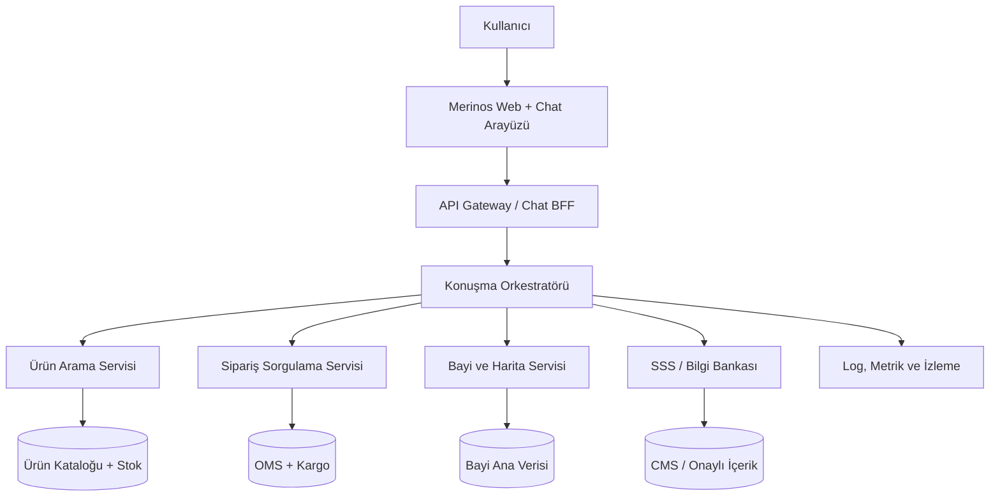

# Merinos Dijital Asistan Sistem Mimarisi

## 1. Amaç ve kapsam

Sistem; Merinos web sitesindeki ziyaretçinin ürün bulma, sipariş durumunu
görme, yakındaki satış noktasını bulma ve sık sorulan sorulara yanıt alma
ihtiyaçlarını tek bir sohbet arayüzünde karşılar.

Bu ZIP içindeki sürüm, gerçek sistemlere bağlanmayan bir localhost
prototipidir. `lib/demo-data.ts` içindeki temsili kayıtlar ve
`lib/chatbot/engine.ts` içindeki kural tabanlı yönlendirme kullanılır.

## 2. Hedef mimari

Chatbot, kurumsal veritabanlarına doğrudan erişmez. Bütün istekler API Gateway
ve entegrasyon servisleri üzerinden geçer.

## 3. Bileşenler

| Bileşen | Sorumluluk | MVP yaklaşımı | Canlı yaklaşım |
| --- | --- | --- | --- |
| Web Chat UI | Mesajlar, işlem kartları, erişilebilirlik | React bileşeni | Merinos web uygulamasına gömülü widget |
| Chat BFF | Web istemcisine uygun tek sözleşme | Yerel motor | Kimlik, oran sınırlama, oturum ve kanal yönetimi |
| Konuşma orkestratörü | Niyet ve akış durumunu yönetme | Kural tabanlı | Kural + güvenlik kontrollü LLM/NLU |
| Ürün arama | Kategori, renk, ölçü ve stok filtresi | Demo dizi | Katalog ve arama indeksi |
| Sipariş sorgulama | Sipariş ve kargo zaman çizgisi | İki örnek kayıt | OMS/kargo servisleri + müşteri doğrulama |
| Bayi servisi | Mesafe sıralama ve harita verisi | Şehir bazlı örnekler | Coğrafi sorgu + harita sağlayıcısı |
| SSS servisi | Onaylı sorular ve yanıtlar | Yerel bilgi listesi | CMS/RAG, kaynak ve içerik sürümü |
| Gözlemlenebilirlik | Hata, gecikme ve başarı oranları | Tarayıcı testi | Merkezi log, metrik, alarm ve iz kaydı |

## 4. İstek yaşam döngüsü

1. Kullanıcı sohbet kutusunda işlem seçer veya serbest metin yazar.
2. Chat BFF; oturum, hız sınırı ve giriş doğrulamasını uygular.
3. Orkestratör niyeti belirler ve gerekli alanları toplar.
4. İlgili servis yalnızca gereken veriyi getirir.
5. Yanıt; metin yerine mümkün olduğunda ürün, sipariş veya bayi kartı olarak
   gösterilir.
6. Kişisel veri içermeyen teknik metrikler izleme sistemine yazılır.

## 5. Güvenlik ve KVKK

- Sipariş verisi, canlı sürümde yalnızca oturum açmış kullanıcıya veya ek
  doğrulama adımından geçmiş kişiye gösterilmelidir.
- Chat mesajlarına ödeme bilgisi, T.C. kimlik numarası veya açık adres
  yazılması istenmemelidir.
- Loglarda ad, telefon, e-posta, açık adres, sipariş numarası ve serbest metin
  maskeleme uygulanmalıdır.
- Konum erişimi varsayılan olarak kapalı olmalı; kullanıcı açık izin verdiğinde
  yalnızca bayi sıralaması için gerekli yaklaşık konum işlenmelidir.
- Servisler arası erişimde kısa ömürlü kimlik belirteçleri, en az yetki ve
  düzenli anahtar döndürme kullanılmalıdır.
- Yanıt üretiminde onaylı bilgi kaynakları öncelikli olmalı; LLM iş emri veya
  sipariş durumunu kendisi uydurmamalıdır.

## 6. Kullanılabilirlik ve 7/24 çalışma

- En az iki uygulama örneği ve sağlık kontrolü
- Gateway seviyesinde zaman aşımı, yeniden deneme ve devre kesici
- Ürün/SSS verileri için kısa süreli önbellek; sipariş verisi için kontrollü,
  düşük süreli önbellek
- Bağımlı servis kesintisinde açık hata mesajı ve alternatif kanal
- Uygulama hatası, p95 yanıt süresi, servis başarı oranı ve boş sonuç oranı için
  alarm
- Dağıtım öncesinde sözleşme, regresyon, erişilebilirlik ve yük testleri

## 7. Ortamlar

| Ortam | Veri | Amaç |
| --- | --- | --- |
| Localhost | Temsili sabit kayıtlar | Arayüz ve akış doğrulama |
| Test | Anonim/sentetik servis verisi | Entegrasyon ve sözleşme testleri |
| Ön üretim | Üretime benzer maskeli veri | Yük, güvenlik ve kabul testleri |
| Üretim | Yetkili gerçek servisler | Son kullanıcı trafiği |
