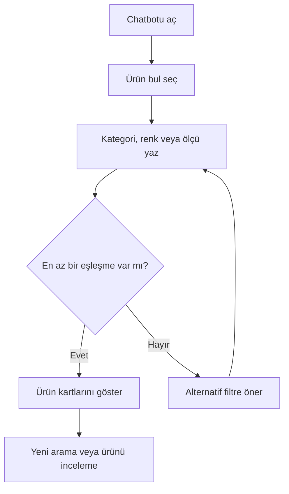
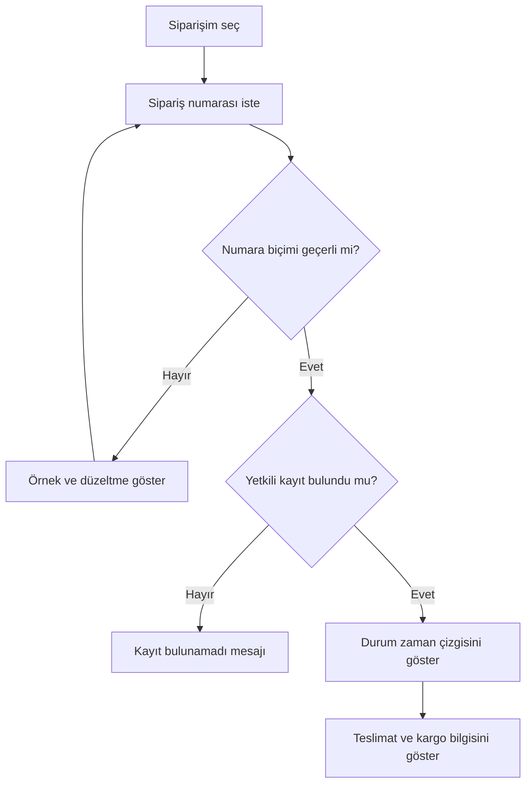
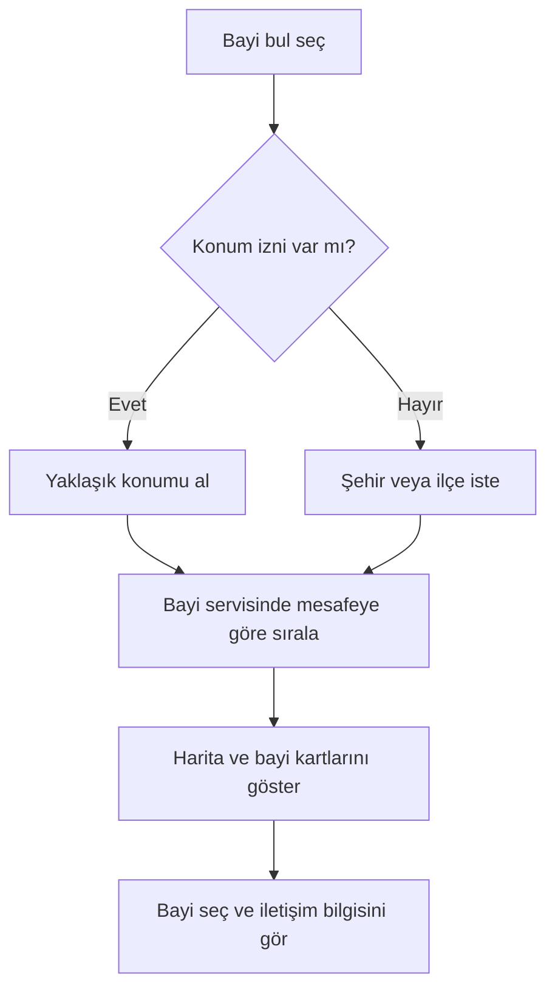
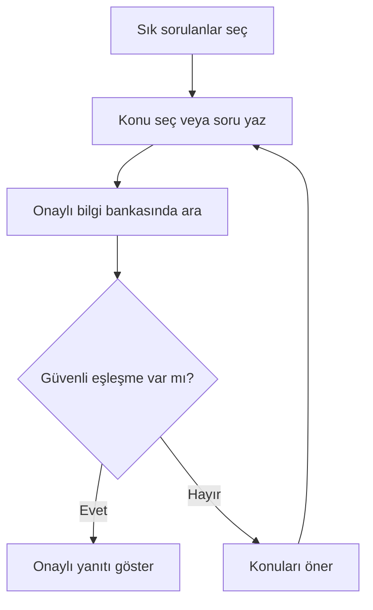

# Kullanıcı Akışları

## 1. Ürün arama

Başarı ölçütü: Kullanıcı kategori, renk ve ölçüyü tek cümlede yazabilmeli;
sonuç kartında ad, renk, ölçü, stok ve fiyat görülebilmelidir.

## 2. Sipariş durumu

Canlı sürümde “yetkili kayıt” kontrolü için kullanıcı oturumu veya ek sipariş
doğrulaması zorunludur. Localhost demosunda yalnızca iki örnek numara vardır.

## 3. En yakın satış noktası

Localhost demosu konum istemez; Gaziantep, İstanbul, Ankara ve Bursa için
temsili kayıtları şehir bazında gösterir.

## 4. Sık sorulan sorular

SSS yanıtları; ölçü seçimi, bakım, iade, teslimat ve mağaza stoku başlıklarında
onaylı içerikten gelmelidir. Canlı sistemde yanıtın içerik sürümü izlenmelidir.

## 5. Hata ve geri dönüş kuralları

- Kullanıcı anlaşılmadığında dört temel işlem tekrar gösterilir.
- Servis zaman aşımında “bilgiye şu anda ulaşılamıyor” denir; tahmin üretilmez.
- Sipariş numarası bulunamadığında başka müşteriye ait veri gösterilmez.
- Boş ürün sonucunda filtreyi genişletmek için somut öneri verilir.
- Kullanıcı istediği anda sohbeti sıfırlayabilir veya kapatabilir.
