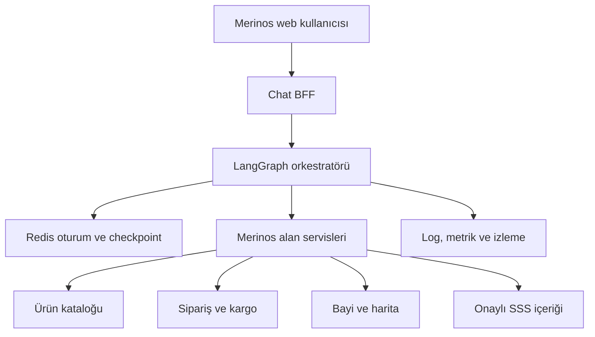
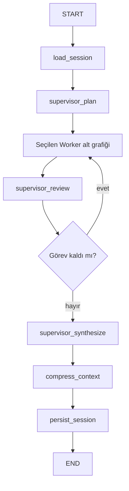
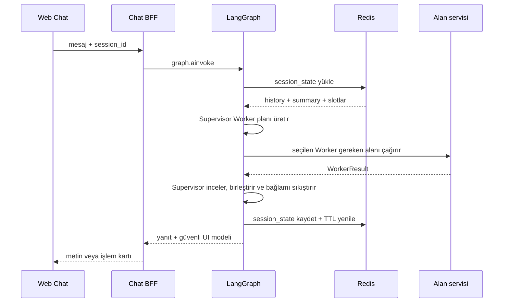
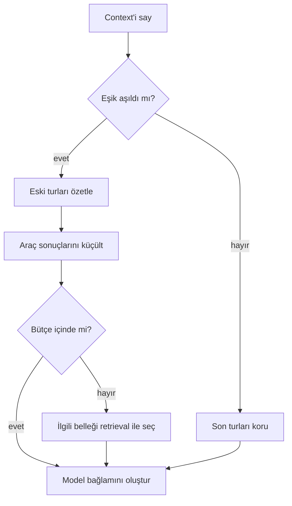

# LangGraph, Redis ve Bağlam Yönetimi Mimari Rehberi

## 1. Karar özeti

Merinos chatbot için önerilen yaklaşım, üç farklı veri ömrünü birbirinden
ayırır:

| Katman | Kapsam | Sorumluluk | MVP kaynağı |
| --- | --- | --- | --- |
| LangGraph `GraphState` | Tek graph çalıştırması | Düğümler arası çalışma verisi, rota, sonuç ve geçiş izi | `GraphState` |
| Redis `SessionState` | Aynı sohbet oturumu | Son konuşmalar, rolling summary, slotlar, token bütçesi ve sürüm | `RedisSessionStore` |
| LangGraph checkpointer/store | İsteğe bağlı üretim katmanı | Checkpoint ile hata sonrası devam; store ile oturumlar arası uzun süreli bellek | `AsyncRedisSaver` / Redis store |

MVP şablonunda Redis `SessionState` oturumun açık kaynak gerçeğidir. Böylece
state'in ne zaman yüklendiği, hangi düğümde değiştiği ve ne zaman kalıcı
olduğu açıkça görülebilir. LangGraph-native Redis checkpointer ayrıca
etkinleştirilebilir; ancak aynı tam konuşma geçmişinin iki yerde sınırsız
tutulmasına izin verilmemelidir.

## 2. Hedef mimari



Temel sınırlar:

- Web istemcisi Redis'e veya kurumsal servislere doğrudan bağlanmaz.
- Chat BFF, kimlik, hız sınırı, istek kimliği ve oturum kimliği üretir.
- LangGraph yalnızca akışı yönetir; ürün, sipariş, bayi ve SSS gerçeklerini
  kendisi üretmez.
- Sipariş düğümü, canlı ortamda kimlik ve sipariş sahipliği doğrulaması
  tamamlanmadan sonuç döndürmez.
- SSS yanıtları onaylı içerik kaynağı ve içerik sürümüyle ilişkilendirilir.

## 3. State machine



Her düğüm, aldığı state'i yerinde değiştirmek yerine yalnızca değiştireceği
alanları döndürür. Bu yaklaşım, düğüm testlerini ve geçiş izlemeyi
kolaylaştırır.

### Düğüm sözleşmeleri

| Düğüm | Okuduğu başlıca alanlar | Yazdığı başlıca alanlar | Yan etki |
| --- | --- | --- | --- |
| `load_session` | `session_id`, `user_message` | history, summary, slotlar, sürüm | Redis `GET` |
| `supervisor_plan` | güncel mesaj, summary, mevcut slotlar | Worker planı, rota, daraltılmış slotlar | Yok |
| Worker alt grafiği | yalnızca allowlist slotları ve kısa özet | standart `WorkerResult` | MVP'de yok; canlıda alan API çağrısı |
| `supervisor_review` | plan, cursor, Worker sonuçları | sonraki Worker veya bitir kararı | Yok |
| `supervisor_synthesize` | Worker sonuçları, history | kullanıcıya yanıt, assistant mesajı | Yok |
| `compress_context` | history, summary, bütçe | sıkıştırılmış history, yeni özet, token metriği | Canlıda özetleyici model olabilir |
| `persist_session` | kalıcı oturum alanları | yeni session sürümü | Redis `SET ... EX` |

### Her etkileşimin sırası



Ayrıntılı Supervisor–Worker tasarımı ve iki ayrı akış diyagramı:
[Supervisor–Worker Mimarisi](./07-SUPERVISOR-WORKER-MIMARISI.md).

## 4. `GraphState` ve `SessionState` ayrımı

### `GraphState`

`GraphState`, tek bir kullanıcı etkileşiminin çalışma alanıdır. Örnek alanlar:

- `session_id`, `user_message`
- `current_intent`, `route`, `slots`
- `chat_history`, `rolling_summary`
- `worker_plan`, `worker_cursor`, `next_worker`, `worker_results`
- `supervisor_decision`, `response`
- `token_budget`, `token_usage`
- `transition_trace`, `session_version`

Geçici API hata ayrıntıları, yeniden deneme sayacı ve güvenli kullanıcı mesajı
gibi alanlar gerektiğinde yalnızca graph state'te tutulabilir.

### `SessionState`

`SessionState`, sonraki HTTP isteğinde yeniden kullanılacak en küçük kalıcı
durumdur:

```json
{
  "session_id": "opaque-session-id",
  "current_intent": "product_search",
  "slots": {
    "category": "salon halısı",
    "color": "krem",
    "size": "160x230"
  },
  "chat_history": [
    {"role": "user", "content": "...", "created_at": "..."},
    {"role": "assistant", "content": "...", "created_at": "..."}
  ],
  "rolling_summary": "Önceki konuşmanın kısa özeti...",
  "token_budget": {
    "context_window_tokens": 8192,
    "max_output_tokens": 800,
    "safety_margin_tokens": 512,
    "compression_trigger_ratio": 0.75,
    "recent_messages_to_keep": 8
  },
  "last_worker_plan": ["product_worker", "dealer_worker"],
  "last_supervisor_decision": "synthesize",
  "last_transition_trace": ["load_session", "...", "persist_session"],
  "version": 3,
  "created_at": "...",
  "updated_at": "..."
}
```

Redis anahtarı:

```text
merinos:session:{opaque_session_id}
```

Oturum kimliği kullanıcı e-postası, telefon numarası veya sipariş numarası
olmamalıdır. Tahmin edilemeyen bir UUID veya BFF tarafından imzalanmış,
sunucu tarafında doğrulanan bir kimlik kullanılmalıdır.

## 5. Redis oturum stratejisi

MVP ayarları:

| Karar | Öneri |
| --- | --- |
| Veri biçimi | Pydantic ile doğrulanan JSON |
| TTL | 30 dakika kayan süre; ürün kararıyla değiştirilebilir |
| Yazma | `SET key payload EX ttl` ile atomik payload + TTL |
| Silme | Çıkış, kullanıcı talebi veya TTL |
| Anahtar alanı | Ortam/tenant öneki eklenebilir |
| Hata davranışı | Sipariş akışında güvenli hata; geçmiş olmadan sessiz devam etme yok |

Her başarılı etkileşimin sonundaki `persist_session` yazımı TTL'i yeniler.
Redis'in geçici olarak erişilemediği durumda:

1. Alan API'sine aynı işlemi kontrolsüz biçimde tekrar göndermeyin.
2. İstek kimliği ve idempotency key kullanın.
3. Kullanıcıya oturumun kaydedilemediğini açık fakat teknik ayrıntısız söyleyin.
4. Salt okunur SSS akışı için ürün kararına göre sınırlı, belleksiz fallback
   uygulanabilir; sipariş verisi için uygulanmamalıdır.

### Eşzamanlı istekler

Kod şablonu anlaşılır olması için son-yazma-kazanır yaklaşımını kullanır.
Canlı sistemde aynı oturuma paralel iki mesaj gelebilir. Üretim seçenekleri:

- session bazlı kısa süreli dağıtık kilit ve tek yazar;
- `WATCH` / `MULTI` / `EXEC` ile `version` karşılaştırmalı yazma;
- mesajları session kimliğine göre sıralayan bir kuyruk.

Tercih edilen ilk adım, BFF'de aynı oturumun aktif isteğini seri hale getirmek
ve Redis `version` alanıyla çakışmayı ölçmektir.

### LangGraph-native Redis checkpointer

Graph snapshot'larından devam etme, interrupt/human-in-the-loop ve hata sonrası
resume gerekiyorsa `langgraph-checkpoint-redis` eklenir:

```python
from langgraph.checkpoint.redis.aio import AsyncRedisSaver

async with AsyncRedisSaver.from_conn_string(redis_url) as checkpointer:
    await checkpointer.asetup()  # ilk kullanım / şema hazırlığı
    graph = builder.compile(checkpointer=checkpointer)
    result = await graph.ainvoke(
        {"messages": [{"role": "user", "content": "Merhaba"}]},
        config={"configurable": {"thread_id": session_id}},
    )
```

Redis checkpointer arama/JSON özellikleri kullanır. Yerel örnek bu nedenle
Redis 8 imajını kullanır; daha eski Redis sürümlerinde gereken modüller ayrıca
sağlanmalıdır.

Checkpointer ile özel `SessionState` birlikte kullanıldığında sahiplik net
olmalıdır:

- Checkpointer: graph yürütme snapshot'ları ve kısa süreli resume.
- `SessionState`: kanal bağımsız iş oturumu, seçili slotlar ve bağlam zarfı.
- Uzun süreli kullanıcı tercihi: ayrı store ve ayrı açık izin/retention
  politikası.

## 6. Chat history'nin düğümlerle ilişkisi

Konuşma geçmişi bütün düğümlere gelişigüzel gönderilmemelidir.

| Düğüm tipi | Görmesi gereken bağlam |
| --- | --- |
| Niyet sınıflandırıcı | Güncel mesaj, son birkaç tur, aktif niyet |
| Slot çıkarıcı | Güncel mesaj + mevcut doğrulanmış slotlar |
| Ürün arama | Kategori/renk/ölçü slotları; geçmişin tamamı gerekmez |
| Sipariş sorgulama | Doğrulanmış sipariş referansı ve yetki sonucu |
| Bayi arama | Açık izinli konum veya şehir |
| SSS/RAG | Güncel soru, kısa özet ve getirilen onaylı belgeler |
| Yanıt oluşturucu | Yapılandırılmış araç sonucu, gerekli son turlar |
| Sıkıştırıcı | Eski turlar, mevcut özet, token bütçesi |
| Kalıcılık | Sıkıştırılmış history, özet, slotlar, sürüm |

Bu ayrım, token maliyetini düşürür ve sipariş/konum gibi hassas alanların
gereksiz düğümlere yayılmasını önler.

## 7. Token yönetimi

Bir model çağrısından önce kullanılabilir giriş bütçesi hesaplanır:

```text
input_limit =
  context_window
  - reserved_output_tokens
  - safety_margin_tokens
```

Şablon varsayılanıyla:

```text
8192 - 800 - 512 = 6880 giriş tokenı
compression trigger = 6880 × 0.75 = 5160 token
```

Üretim `ContextEnvelope` öncelik sırası:

1. Sistem ve güvenlik talimatları
2. Güncel kullanıcı mesajı
3. Doğrulanmış slotlar ve alan servisi sonucu
4. Son konuşma turları
5. Rolling summary
6. RAG ile getirilen, kaynaklı onaylı içerik

Token sayımı yalnızca chat history'yi değil sistem prompt'unu, araç
şemalarını, getirilen belgeleri ve ayrılan yanıt bütçesini de kapsamalıdır.
Şablondaki yaklaşık sayaç `len(text) / 4` yaklaşımını gösterir. Canlıda modelin
gerçek tokenizer'ı veya sağlayıcının token sayacı kullanılmalıdır.

İzlenecek metrikler:

- `context_tokens_before`, `context_tokens_after`
- `compression_triggered`
- `summary_tokens`, `recent_history_tokens`, `retrieval_tokens`
- `output_tokens`, `total_tokens`, tahmini maliyet
- `context_overflow_prevented`, `truncated_tool_result`

## 8. Büyük bağlam pencereleri için compression

Büyük context window, tüm geçmişi her çağrıya eklemek için gerekçe değildir.
Önerilen katmanlı strateji:

| Yöntem | Ne zaman | Korunan bilgi | Risk / kontrol |
| --- | --- | --- | --- |
| Son-N mesaj penceresi | Her çağrı | En güncel diyalog | Eski kararlar kaybolabilir |
| Rolling summary | Eşik aşılınca | Eski konuşmanın anlamı | Özet sürüklenmesi; kaynak mesaj arşivi |
| Yapılandırılmış slot çıkarımı | Her alan değişiminde | Renk, ölçü, şehir, aktif işlem | Slot doğrulama ve kaynak turu |
| Araç sonucu küçültme | Büyük katalog/harita sonucu | Kimlik, başlık, gereken alanlar | Tam payload gözlemlenebilir depoda |
| Retrieval tabanlı bellek | Eski bilgi gerektiğinde | Yalnızca ilgili geçmiş | Yetkilendirme ve tenant filtresi |
| Checkpoint pruning | Retention işi | Gerekli son snapshot'lar | Resume ihtiyacına göre süre |



Rolling summary içinde özellikle şu alanlar korunmalıdır:

- Kullanıcının açık talebi ve aktif görev
- Onaylanmış filtreler/slotlar
- Daha önce verilen kritik yanıt veya hata
- Beklenen sonraki adım
- Kaynak kimliği/sürümü; hassas ham veri değil

Özetleyici LLM kullanılıyorsa özet bir talimat değil veri olarak işaretlenmeli,
prompt injection etkisine karşı filtrelenmeli ve orijinal güvenilir kaynakların
önüne geçmemelidir.

## 9. Hata, güvenlik ve KVKK kontrolleri

- Redis üretimde TLS, ACL, gizli değer yönetimi ve ağ izolasyonu ile
  kullanılmalıdır.
- Oturum payload'ına ödeme kartı, T.C. kimlik numarası veya gereksiz açık
  adres yazılmamalıdır.
- Sipariş numarası, telefon, e-posta, konum ve serbest metin loglarda
  maskelenmelidir.
- Konum yalnızca açık izinle ve bayi bulma amacı için işlenmelidir.
- Session TTL, checkpoint retention ve log retention birbirinden ayrı
  tanımlanmalıdır.
- Düğüm giriş/çıkış şemaları doğrulanmalı; alan servisinden gelen veri güvenilir
  prompt talimatı kabul edilmemelidir.
- Ürün ve bayi sonuçlarında kaynak servis zamanı/sürümü tutulmalı; model stok
  veya sipariş durumu uydurmamalıdır.
- Her istek `request_id`, `session_id_hash`, `graph_version`, `node_name`,
  `latency_ms` ve güvenli hata koduyla izlenmelidir.

## 10. Teknik yapılacaklar stratejisi

### Faz 0 — Sözleşme ve veri sınırları

- [ ] Dört niyet için giriş, slot, sonuç ve hata şemalarını onayla.
- [ ] Session, checkpoint ve uzun süreli belleğin sahiplerini belirle.
- [ ] KVKK veri envanteri, TTL ve silme akışını onayla.
- [ ] Sipariş görüntüleme için kimlik/sahiplik kontrolünü tanımla.

**Bitti ölçütü:** API sözleşmeleri ve state şeması sürümlenmiş; hassas alan
listesi güvenlik ekibince onaylanmış.

### Faz 1 — Redis session altyapısı

- [ ] Redis ortamlarını ve bağlantı havuzunu kur.
- [ ] `SessionState` Pydantic şemasını ve key namespace'ini uygula.
- [ ] TTL, silme, bağlantı kesintisi ve veri bozulması testlerini yaz.
- [ ] Paralel istek stratejisini seç; version conflict metriği ekle.

**Bitti ölçütü:** Aynı session kimliğiyle farklı uygulama örneklerinde konuşma
devam ediyor; süresi dolan oturum otomatik siliniyor.

### Faz 2 — LangGraph state machine

- [x] `load_session`, Supervisor plan/review/sentez, dört Worker alt grafiği,
  compressor ve persist düğümlerini uygula.
- [x] Tek ve çoklu Worker geçişleriyle fallback davranışını test et.
- [x] Worker context'ini ilgili slot allowlist'iyle sınırla.
- [ ] Her düğüm için timeout, retry ve güvenli hata geçişi tanımla.
- [ ] Graph sürümünü ve geçiş izini loglara ekle.

**Bitti ölçütü:** Dört ana akış ve çoklu görev planı deterministik, bağlamı
izole edilmiş ve yeniden çalıştırılabilir.

### Faz 3 — Token ve context compression

- [ ] Kullanılan model için gerçek tokenizer adaptörünü ekle.
- [ ] Context zarfı ve bileşen bazlı token limitlerini uygula.
- [ ] Son-N + rolling summary + structured slot yaklaşımını etkinleştir.
- [ ] Büyük araç sonucu ve RAG belge limitlerini uygula.
- [ ] Özet doğruluğu ve bilgi kaybı için altın konuşma seti oluştur.

**Bitti ölçütü:** Uzun konuşma testlerinde context overflow yok; kritik slot
koruma testleri geçiyor ve sıkıştırma metriği izlenebiliyor.

### Faz 4 — Merinos servis adaptörleri

- [ ] Ürün kataloğu için kategori/renk/ölçü sözleşmesini bağla.
- [ ] Sipariş/kargo adaptörüne yetki kontrolü ve idempotency ekle.
- [ ] Bayi servisine şehir ve izinli konum sorgusunu bağla.
- [ ] SSS/RAG kaynağına içerik sürümü ve kaynak gösterimini ekle.

**Bitti ölçütü:** Model/orkestratör iş verisi uydurmuyor; her kart doğrulanmış
alan servisi cevabından oluşuyor.

### Faz 5 — Checkpoint ve dayanıklılık

- [ ] Resume veya human-in-the-loop gereksinimini doğrula.
- [ ] Gerekiyorsa `AsyncRedisSaver` ve `thread_id=session_id` bağını ekle.
- [ ] İlk kurulum `asetup()`, retention ve checkpoint pruning işini tanımla.
- [ ] Redis kesintisi, graph yarıda kalma ve yeniden başlatma senaryolarını test
  et.

**Bitti ölçütü:** Yarıda kalan uygun iş akışı tekrar yan etki üretmeden devam
ediyor; checkpoint büyümesi retention ile sınırlı.

### Faz 6 — Güvenlik, gözlemlenebilirlik ve yayın

- [ ] PII maskeleme, oran sınırlama, abuse kontrolleri ve audit event'leri ekle.
- [ ] Node gecikmesi, hata, rota, token ve compression panellerini kur.
- [ ] Sözleşme, regresyon, yük, erişilebilirlik ve güvenlik testlerini tamamla.
- [ ] Önce küçük trafik yüzdesi; ölçümlü kademeli yayın ve geri dönüş planı uygula.

**Bitti ölçütü:** SLO alarmları ve geri dönüş prosedürü hazır; kabul testleri
ürün, güvenlik ve operasyon ekiplerince onaylanmış.

## 11. Test matrisi

| Test | Beklenti |
| --- | --- |
| İlk mesaj | Yeni session v1 oluşur, kullanıcı ve asistan mesajı kaydolur |
| İkinci mesaj | Önceki history/slotlar yüklenir, sürüm v2 olur |
| Niyet değişimi | Üründen bayiye geçiş doğru Worker planını kullanır |
| Çoklu görev | Ürün + bayi mesajı iki Worker'la, Supervisor kontrolünde yürür |
| Bilinmeyen niyet | Güvenli `faq_worker` fallback'ine gider |
| Sipariş güvenliği | `order_worker`, doğrulama olmadan sonuç göstermez |
| Token eşiği | Eski turlar özete taşınır, son N mesaj korunur |
| Redis TTL | Her başarılı yazmada süre yenilenir; süresi dolan anahtar silinir |
| Redis kesintisi | Hassas akışta yanlış/uydurma sonuç dönmez |
| Paralel mesaj | Çakışma ölçülür; seçilen seri/CAS stratejisi veri kaybını önler |
| Sipariş yetkisi | Başkasının siparişi veya doğrulanmamış oturum sonuç göstermez |
| Konum izni | İzin yoksa şehir sorulur; hassas konum kalıcı geçmişe yazılmaz |

## 12. Kod şablonu

Uygulanabilir örnek `backend/` klasöründedir:

```text
backend/
├── docker-compose.yml
├── pyproject.toml
├── src/merinos_agent/
│   ├── checkpointing.py
│   ├── config.py
│   ├── context_manager.py
│   ├── graph.py
│   ├── main.py
│   ├── session_store.py
│   ├── state.py
│   └── workers.py
└── tests/
    ├── test_context_manager.py
    └── test_graph.py
```

Şablon bir LLM veya gerçek Merinos servisi çağırmaz. Amacı state değişimini,
koşullu geçişi, bağlam sıkıştırmasını ve Redis kalıcılığını denetlenebilir
biçimde göstermektir.

## 13. Resmî kaynaklar

- [LangGraph persistence](https://docs.langchain.com/oss/python/langgraph/persistence)
- [LangGraph memory ve context yönetimi](https://docs.langchain.com/oss/python/langgraph/add-memory)
- [LangGraph Graph API](https://docs.langchain.com/oss/python/langgraph/graph-api)
- [Redis LangGraph checkpointer/store](https://github.com/redis-developer/langgraph-redis)
- [redis-py async kullanım](https://redis.io/docs/latest/develop/clients/redis-py/async/)
- [Redis EXPIRE](https://redis.io/docs/latest/commands/expire/)
