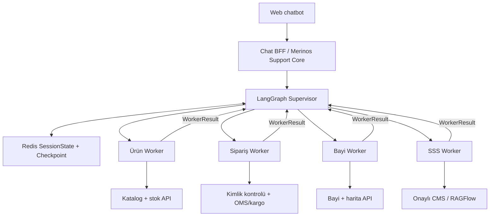
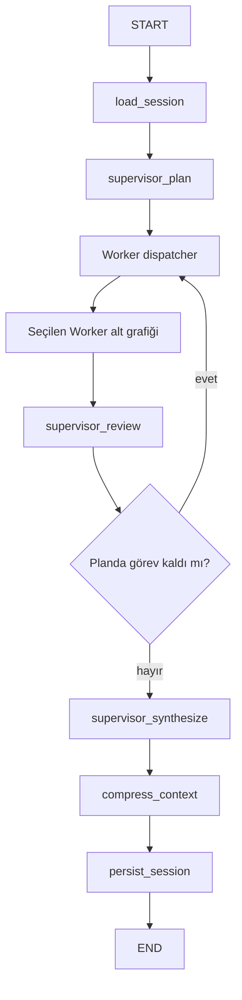

# Merinos LangGraph Supervisor–Worker Mimarisi

## 1. Mevcut durum ve alınan karar

Önceki Python şablonu bir `classify_intent` düğümünden dört alan düğümüne
koşullu geçiş yapan **stateful router** yapısıydı. Bu, tek görevli mesajlar için
uygundu; fakat bir Supervisor aynı turda birden fazla uzman görevi planlamıyor,
Worker sonuçlarını yeniden değerlendirmiyor ve yanıtı merkezi olarak
birleştirmiyordu.

Yeni sürüm gerçek bir Supervisor–Worker iş bölümü uygular:

| Önceki sürüm | Yeni sürüm |
| --- | --- |
| Tek seferlik niyet sınıflandırma | Oturum bağlamını kullanan Supervisor planı |
| Bir mesaj → bir alan düğümü | Bir mesaj → bir veya birden fazla Worker |
| Alan düğümü doğrudan yanıt hazırlıyor | Worker yalnızca `WorkerResult` döndürüyor |
| Ortak graph state bütün düğümlere açık | Worker'a allowlist ile daraltılmış bağlam veriliyor |
| Tek geçişten sonra yanıt | Planla → çalıştır → incele → gerekirse tekrar çalıştır |
| Tek alan sonucu | Supervisor tarafından merkezi yanıt sentezi |

Bu tasarım doğrudan `langgraph` içindeki `StateGraph` ile kurulmuştur. Ek bir
`langgraph-supervisor` paketi zorunlu değildir. Dış graph Supervisor döngüsünü,
`workers.py` ise dört bağımsız Worker alt grafiğini tanımlar.

## 2. Merinos'a uygun Supervisor–Worker topolojisi



Merinos Support Core; kimlik, OTP, yetki, audit, idempotency ve oran
sınırlamasının tek giriş noktası olmaya devam eder. Supervisor bu kontrolleri
atlayarak Worker veya kurumsal servise doğrudan erişim vermez.

## 3. Çalışma döngüsü



Örnek:

```text
Kullanıcı:
"Krem 160x230 halı arıyorum ve İstanbul bayilerini göster"

Supervisor planı:
["product_worker", "dealer_worker"]

Çalışma:
product_worker -> supervisor_review
dealer_worker  -> supervisor_review
supervisor_synthesize -> tek birleşik yanıt
```

## 4. Supervisor sorumlulukları

Supervisor:

1. Redis'ten yüklenen oturum state'i ve güncel mesajı inceler.
2. Slotları çıkarır: kategori, renk, ölçü, sipariş referansı, şehir, SSS konusu.
3. Bir veya daha fazla izinli Worker'dan oluşan sıralı plan üretir.
4. Worker'a yalnızca gereken alanları içeren dar bir bağlam zarfı verir.
5. Her `WorkerResult` sonrasında planın tamamlanıp tamamlanmadığını kontrol eder.
6. Sonuçları tek kullanıcı yanıtına dönüştürür.
7. Bağlam sıkıştırmasını çalıştırır ve güncel session state'i Redis'e yazar.

MVP Supervisor planlayıcısı kurallı ve deterministiktir. Bu, sipariş ve konum
gibi kontrollü işlemlerde denetlenebilirlik sağlar. İleride structured-output
destekli bir LLM planlayıcı eklenirse çıktı şu allowlist dışına çıkamaz:

```text
product_worker
order_worker
dealer_worker
faq_worker
```

Modelin doğrudan URL, SQL, Redis anahtarı veya serbest araç adı üretmesine izin
verilmez.

## 5. Worker alt grafikleri

| Worker | Alt düğümler | Gördüğü slotlar | Çıktı |
| --- | --- | --- | --- |
| `product_worker` | `prepare_filters` → `search_catalog` | kategori, renk, ölçü | Katalog arama zarfı |
| `order_worker` | `validate_reference` → `query_order` | sipariş referansı | Yetki gerektiren sipariş sorgu zarfı |
| `dealer_worker` | `resolve_location` → `search_dealers` | şehir | Bayi/harita sorgu zarfı |
| `faq_worker` | `select_topic` → `retrieve_answer` | SSS konusu | Kaynaklı içerik zarfı |

Worker'lar kullanıcıyla doğrudan konuşmaz. Standart çıktı:

```json
{
  "worker": "product_worker",
  "status": "ok",
  "message": "Supervisor'ın birleştireceği güvenli sonuç metni",
  "data": {
    "service": "catalog_search",
    "filters": {
      "color": "krem",
      "size": "160x230"
    }
  }
}
```

İzinli durumlar:

- `ok`
- `needs_input`
- `requires_verification`
- `error`

Sipariş Worker'ı, referans alınsa bile demo içinde sipariş durumunu göstermez;
`requires_verification` döndürür. Canlı OMS/kargo çağrısı Merinos Support Core
kimlik ve sahiplik kontrolünden sonra yapılır.

## 6. State ve context sınırları

### Supervisor `GraphState`

```text
session_id
user_message
chat_history
rolling_summary
slots
worker_plan
worker_cursor
next_worker
worker_results
supervisor_decision
token_budget
transition_trace
```

### İzole `WorkerState`

```text
worker
user_message
relevant_slots
context_summary
prepared
result
trace
```

Worker tam `chat_history`, Redis nesnesi veya diğer Worker sonuçlarına doğrudan
erişmez. Dış graph şu bağlamı üretir:

```python
worker_state = {
    "worker": worker,
    "user_message": state["user_message"],
    "relevant_slots": allowlisted_slots,
    "context_summary": state.get("rolling_summary", ""),
    "trace": [],
}
```

Bu ayrım token tüketimini ve hassas verinin gereksiz alana yayılmasını azaltır.

## 7. Redis ile ilişki

Redis `SessionState` içinde aşağıdaki Supervisor alanları da tutulur:

- `last_worker_plan`
- `last_supervisor_decision`
- `last_transition_trace`
- mevcut slotlar
- sıkıştırılmış konuşma geçmişi ve rolling summary
- token bütçesi ve session sürümü

Worker'lar Redis'e doğrudan yazmaz. Tek yazma noktası `persist_session`
düğümüdür. Böylece yarım kalan bir Worker'ın session state'i tutarsız biçimde
kalıcılaştırması önlenir.

Native `AsyncRedisSaver` etkinse `thread_id = session_id` bağı korunur.
Checkpointer graph yürütme snapshot'larını; özel `SessionState` ise iş
oturumunun kontrollü görünümünü saklar.

## 8. Çoklu görev, sıralama ve paralellik

MVP Worker'ları sırayla çalıştırır. Bunun nedenleri:

- Slot ve policy kararları tek bir Supervisor state'inde tutarlı kalır.
- Sipariş gibi yan etkili/hassas görevler kontrolsüz paralel çalışmaz.
- Geçiş sırası ve hata kaynağı kolay izlenir.
- Demo davranışı deterministiktir.

İleride yalnızca salt okunur ve birbirinden bağımsız görevler, örneğin ürün
arama ile SSS retrieval, LangGraph `Send` yaklaşımıyla paralelleştirilebilir.
Sipariş ve kullanıcı onayı gerektiren işlemler sıralı kalmalıdır.

## 9. Hata ve geri dönüş politikası

| Durum | Supervisor kararı |
| --- | --- |
| Worker gerekli slotu bulamadı | `needs_input`; birleşik yanıtta eksik alanı sor |
| Sipariş sahipliği doğrulanmadı | `requires_verification`; OMS çağrısını engelle |
| Worker timeout | Bir kez güvenli retry veya alan bazlı hata mesajı |
| Redis yazımı başarısız | Hassas sonucu kalıcı kabul etme; güvenli hata dön |
| Bilinmeyen mesaj | `faq_worker` fallback |
| Geçersiz Worker adı | Allowlist doğrulamasında planı reddet |
| Birden fazla Worker'dan kısmi hata | Başarılı sonuçları belirt; hatalı alanı uydurma |

## 10. Geçiş izi örnekleri

Tek Worker:

```text
load_session
-> supervisor_plan
-> product_worker.prepare_filters
-> product_worker.search_catalog
-> supervisor_review
-> supervisor_synthesize
-> compress_context
-> persist_session
```

İki Worker:

```text
load_session
-> supervisor_plan
-> product_worker.prepare_filters
-> product_worker.search_catalog
-> supervisor_review
-> dealer_worker.resolve_location
-> dealer_worker.search_dealers
-> supervisor_review
-> supervisor_synthesize
-> compress_context
-> persist_session
```

## 11. Kod yerleşimi

```text
backend/src/merinos_agent/
├── graph.py            # Supervisor dış graph ve dispatch/review döngüsü
├── workers.py          # Dört uzman Worker alt grafiği
├── state.py            # GraphState, WorkerState, WorkerResult, SessionState
├── session_store.py    # Redis ve test store
├── context_manager.py  # Token ve context compression
├── checkpointing.py    # İsteğe bağlı AsyncRedisSaver
└── main.py             # CLI örneği
```

## 12. Kabul testleri

- Tek alan mesajı doğru Worker'a gider.
- Tek mesajda ürün + bayi görevi iki Worker'la sırayla yürür.
- Worker sonucu doğrudan kullanıcıya değil Supervisor'a döner.
- Sipariş Worker'ı doğrulama olmadan iş verisi göstermez.
- Worker yalnızca allowlist slotlarını görür.
- Her Worker sonrası `supervisor_review` çalışır.
- Son yanıt yalnızca `supervisor_synthesize` tarafından history'ye eklenir.
- Worker planı ve karar Redis session state'e yazılır.
- Bilinmeyen mesaj güvenli `faq_worker` fallback'ine gider.
- Uzun konuşmada compression ve session version davranışı korunur.

## 13. Resmî kaynaklar

- [LangGraph workflows ve orchestrator-worker](https://docs.langchain.com/oss/python/langgraph/workflows-agents)
- [LangChain supervisor/subagents yaklaşımı](https://docs.langchain.com/oss/python/langchain/multi-agent/subagents)
- [Supervisor ile router farkı](https://docs.langchain.com/oss/python/langchain/multi-agent/router)
- [LangGraph persistence](https://docs.langchain.com/oss/python/langgraph/persistence)

